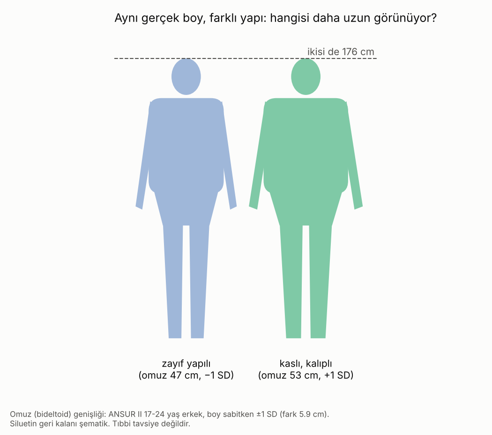
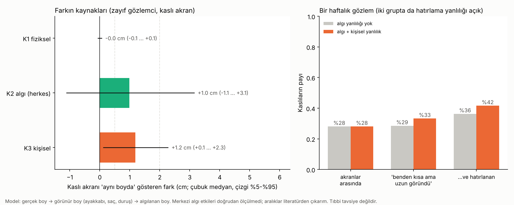

# Algılanan Boy ve Vücut Yapısı · Sürüm 1: Literatür ve Algı Simülasyonu

> **Sürüm:** 1 · **Tarih:** 2026-10-08 · **Durum:** güncel
>
> **Acelen varsa:** en alttaki [En basit özet](#en-basit-özet) bölümüne atla.
>
> Bu doküman **tıbbi tavsiye değildir.** Beden algısıyla ilgili sıkıntı günlük hayatı etkiliyorsa (sürekli kıyaslama, takviye ya da steroid düşünmek, saatlerce ayna) bir uzmanla konuşmak gerçekten işe yarar.

**Kanıt seviyeleri:**

| Etiket | Anlamı |
|---|---|
| **A** | Meta-analiz ya da birden çok randomize kontrollü çalışma |
| **B** | Tek RCT ya da büyük, iyi tasarlanmış kohort |
| **C** | Gözlemsel çalışma, küçük deney, derleme |
| **V** | Bu depodaki gerçek veri analizi (ANSUR II) |
| **D** | Model çıktısı, simülasyon ya da varsayım |



---

## Soru ve kapsam

**Gözlem:** "Ben zayıf yapılıyım. Benimle aynı boyda, hatta benden kısa ama kaslı, kalıplı çocuklar benden çok daha uzun duruyor. Bu yalnızca benim psikolojim mi, kendimi eksik hissettiğim için mi, yoksa herkes böyle mi görüyor?"

Bu soru üç ayrı açıklamaya ayrılır:
1. **Fiziksel:** Görünür boy gerçekten farklı mı? (ayakkabı tabanı, saç, duruş)
2. **Herkesin algısı:** İnsan gözü güçlü görüneni daha büyük, geniş olanı daha kısa mı görüyor?
3. **Gözlemciye özgü:** Kendini eksik hisseden biri karşısındakini daha büyük mü görüyor ve kaslı örnekleri daha çok mu hatırlıyor?

**Kapsam dışı:** Boy uzatma, kas kazanma programı, klinik tanı.

**Benzetme:** Bir terazi düşün. Kefelerde iki kişinin gerçek boyu var. Teraziyi üç el itiyor: gerçek eller (ayakkabı, saç, duruş), herkesin gözündeki eller (güçlü görüneni büyütmek, geniş olanı kısaltmak) ve yalnızca bakanın eli (kendini eksik hissetmek). Bu araştırma her elin kaç santimetre ittiğini ayırmaya çalışıyor.

## Yöntem

**1. Literatür.** PubMed (NCBI E-utilities ile özet ve tam metin), Europe PMC, resmi veri dosyaları. Her kaynak açılıp okundu; açılamayanlar `[doğrulanmadı]` diye işaretlendi ve sonuçlarda kullanılmadı.

**2. Gerçek veri.** Vücut yapısı dağılımı için ANSUR II erkek veri seti kullanıldı (ABD Ordusu 2012 antropometri araştırması, kamuya açık). 17-24 yaş arası n = 1358 kişi; SHA-256 doğrulandı. Yapı indeksi, omuz (bideltoid) genişliği ile kilonun **boya göre artıklarından** kuruldu: "boyuna göre ne kadar geniş ve iri". Boy dağılımı Türk referansına ölçeklendi (ortalama 175.8, SD 6.3 cm; NCD-RisC 2020 ve Günöz 2014).

**3. Algı simülasyonu** ([PLAN.md](simulasyon/PLAN.md), kod ve sonuçlardan önce commit edildi):

```
gerçek boy → görünür boy (+ ayakkabı + saç − eğik duruş) → algılanan boy (+ güç etkisi + genişlik yanılgısı + gözlemcinin durumu + gürültü)
```

- **Doğrudan ölçülmemiş her etki bir aralık olarak girdi.** 4000 Monte Carlo tekrarının her birinde bu aralıklardan çekildi. Sonuçlar tek sayı değil, belirsizlik aralığı.
- **Gözlemci genel bir kişi:** ortalama boylu, zayıf yapılı (yapı −1 SD). Gerçek kişi verisi kullanılmadı.
- **Çıktılar:**
  - eşit boylu kaslı ve zayıf iki kişi yan yana durduğunda "kaslı daha uzun" yargısının olasılığı;
  - **öznel eşitlik noktası (PSE):** kaslı akran kaç cm kısa olunca "aynı boyda" görünür;
  - bir haftalık gözlem (100 karşılaşma) ve hatırlama yanlılığı.
- **Komut:** `cd simulasyon && python calistir.py` (~2 dk).

## Bulgular

### 1. Literatür: ne biliniyor, ne bilinmiyor?

**Önce en önemli boşluk:** Aynı gerçek boydaki kaslı ve ince iki vücudu gösterip "hangisi daha uzun?" diye soran bir çalışma **bulunamadı.** Var olan kanıtlar dolaylı ve **iki zıt yöne** çekiyor.

| Etki | Bulgu | Yön | Kanıt |
|---|---|---|---|
| Güç = büyüklük | Silah tutan elin sahibi +1.3 ile +3.6 cm daha uzun tahmin ediliyor (N = 424-628). Bu çalışmalarda vücut görünmüyor; ölçülen şey zihinde canlandırılan boy. | Kaslıyı **uzatır** (çıkarım) | C |
| Statü duruşu | Yüksek statü duruşu +2.3 cm daha uzun algılanıyor; görüntüde %60 daha geniş olduğu halde. | Geniş, açık duruş **uzatır** | C |
| Geometri | Aynı boyda %19 daha geniş vücut, yargıların %71'inde daha **kısa** bulunuyor (yanılgı boyun %7'sinden küçük). | Genişlik **kısaltır** | C |
| Gözlemcinin hali | Fiziksel olarak kısıtlanan erkek, karşısındakini +2.4 cm uzun, kendini −8.8 cm kısa tahmin ediyor. Güçlü hissettirilen gözlemci karşıdakini ~4 cm kısa görüyor. | Kendini zayıf hisseden, karşısındakini **büyütür** | C |
| Dikkat ve bellek | Bedeninden memnun olmayan erkekler kaslı bedenlere daha uzun ve sık bakıyor (göz izleme), kaslılıkla ilgili bilgiyi daha iyi hatırlıyor. Yukarı doğru kıyaslama ile memnuniyetsizlik birbirini besliyor; yüz yüze kıyaslamada etki sosyal medyadakinden güçlü. | Gözlemi **seçici** yapar | C |
| Doğruluk | Fotoğraftan boy tahmininde ortalama hata 6.3 cm. Resimde iki kişi arasındaki 1-3 cm farkı ayırt etmek şansa yakın; 4 cm'de %70'in üstünde. | Küçük farklar zaten **görülemiyor** | C |
| Fiziksel | Gevşek duruştan dik duruşa geçiş erkekte +1.3 cm. Kaslıların daha dik durduğuna ya da daha kalın taban giydiğine dair veri yok. | Duruş **gerçek** bir fark | C |

### 2. Gerçek veri: kalıplı ve zayıf arasındaki fark ne kadar? (V)

ANSUR II, 17-24 yaş erkek (n = 1358):
- Aynı boydaki iki kişi arasında omuz genişliği ±1 SD ≈ **47 cm'ye karşı 53 cm** (fark 5.9 cm). Kilo ±1 SD ≈ ±12 kg.
- Yapı indeksi boyla **ilişkisiz** (r = 0.00, tanım gereği): kalıplı olmak, uzun olmak demek değil.
- Gözle görülen "çok daha kalıplı" farkı aslında birkaç santimetrelik bir omuz farkı ve kilodan geliyor. Göz bunu boy gibi büyük bir farka dönüştürebiliyor; bu da sorunun özü.

### 3. Simülasyon

**Eşit boy testi** (gerçek boyları aynı, biri kaslı +1 SD, biri zayıf −1 SD; yan yana; [esit_boy_olasiliklari.csv](simulasyon/ciktilar/esit_boy_olasiliklari.csv)):

| Katmanlar | "Kaslı daha uzun" olasılığı (medyan; %5-%95) |
|---|---|
| Yalnız görme gürültüsü | %50 |
| + fiziksel (ayakkabı, saç, duruş) | %50 |
| + herkesin algısı (güç etkisi, genişlik yanılgısı) | **%61** (%37 … %83) |
| + gözlemcinin kendisi (zayıf olan bakıyorsa) | **%73** (%47 … %92) |

**Farkın kaynakları: kaslı akranı "aynı boyda" gösteren fark (PSE)** ([pse_katkilari.csv](simulasyon/ciktilar/pse_katkilari.csv)):



| Katman | Katkı (medyan; %5-%95) | Sınıf |
|---|---|---|
| Fiziksel | 0.0 cm (−0.1 … +0.1) | İhmal edilebilir. Kaslıların daha dik durduğu varsayılırsa +0.2 cm |
| Herkesin algısı | **+1.0 cm** (−1.1 … +3.1) | Küçük, ama **yönü belirsiz**: aralık sıfırı içeriyor |
| Gözlemcinin kendisi | **+1.2 cm** (+0.1 … +2.3) | Küçük ama yan yana fark edilebilir |
| **Toplam** | **+2.2 cm** (−0.3 … +4.7) | Belirgin |

Yani modelin merkezi tahminine göre zayıf bir gözlemci için, kendisinden **yaklaşık 2 cm kısa** kaslı bir akran "aynı boyda" görünüyor. Fark yarı yarıya "herkesin gözü" ve "bakanın kendisi" arasında bölünüyor.

**Dikkat, kişisel katman bir bulgu değil, bir girdi:** Bu katmanın büyüklüğü (0 ile 2.4 cm arası), laboratuvar çalışmalarındaki "güçsüz hisseden gözlemci" etkilerinden alındı. Model bunu yalnızca diğer katmanlarla karşılaştırılabilir hale getiriyor; doğruluğunu kanıtlamıyor.

**Bir haftalık gözlem** (100 karşılaşma, %50 yan yana, %50 ayrı zamanlarda görme; [haftalik_gozlem.csv](simulasyon/ciktilar/haftalik_gozlem.csv)):

| | Algı yanlılığı yok | Algı + kişisel yanlılık |
|---|---|---|
| Haftada "benden kısa ya da eşit ama daha uzun göründü" olayı | **10** (6 … 16) | 15 (8 … 23) |
| Akranlar arasında kaslıların payı | %28 | %28 |
| Bu olaylarda kaslıların payı | %29 | %33 |
| **Hatırlanan** olaylarda kaslıların payı | %36 | **%42** |

- **Bu deneyim herkesin başına geliyor.** Algı yanlılığı tamamen sıfır olan bir gözlemci bile, sırf göz 1-3 cm'lik farkları ayırt edemediği için, haftada ~10 kez "benden kısa biri daha uzun göründü" yaşıyor.
- **Seçici hatırlama tabloyu kaydırıyor.** Akranların %28'i kaslıyken, hatırlanan "uzun göründü" olaylarının %42'si kaslılara ait. Yani "hep kaslılar uzun görünüyor" izlenimi, gerçek orandan daha güçlü bir tablo çiziyor.

### 4. Testler ve duyarlılık

[ciktilar/testler.csv](simulasyon/ciktilar/testler.csv). Ön kayıtlı 5 testin 5'i geçti.

| Test | Ne sınıyor | Sonuç | |
|---|---|---|---|
| A1 | Veri: SHA-256, n = 1358, r(boy, omuz) = 0.508 | eşleşti; 1358; 0.5082 | ✅ |
| A2 | Bütün etkiler sıfırken olasılık %50, PSE 0 | %49.9; en çok 0.04 cm | ✅ |
| A3 | Güç etkisi arttıkça olasılık artar, genişlik yanılgısı arttıkça azalır | kesin monoton | ✅ |
| A4 | Katman katkılarının toplamı = toplam PSE | fark < 10⁻¹⁵ cm | ✅ |
| A5 | Monte Carlo hatası | SE 0.002 | ✅ |

**Duyarlılık** ([duyarlilik.csv](simulasyon/ciktilar/duyarlilik.csv)):
- **Kişisel katman sağlam:** bütün varyantlarda 0.5-2 cm sınıfında kaldı.
- **"Herkesin algısı" katmanı varsayıma bağlı:**
  - güç etkisi zayıf seçilirse 0 cm;
  - güçlü seçilirse +3.0 cm;
  - genişlik yanılgısı güçlü seçilirse −1.0 cm (kaslı daha **kısa** görünür).
- Bu katman, **sorunun cevabının bilinmeyen kısmı.**

**Karar kuralları (önceden sabit):**
- K3, "herkes görür mü?": **bilinmiyor, deney gerekli.** Medyan +1 cm ama aralık sıfırı içeriyor.
- K4, "kişisel mi?": **ikisi karışık.** Herkesin algısı ile kişisel katmanın aralıkları örtüşüyor.

### 5. Bunu kesin çözecek deney

Model bu soruyu tek başına çözemez; çünkü merkezi etki (kaslı vücut, aynı boyda daha uzun görünüyor mu) hiç ölçülmemiş. Çözüm basit bir deney:

1. Boyları ölçülmüş (sabah, duvarda, ayakkabısız) 10-20 erkeğin aynı mesafeden, aynı duruşla ve aynı kıyafet tipiyle boydan fotoğrafı çekilir.
2. Fotoğraflar ikili gösterilir; kişiyi tanımayan 20-30 değerlendirici "hangisi daha uzun?" diye sorulur.
3. Gerçek boy farkı sabitlenince yapı farkının yargıyı ne kadar kaydırdığı (cm cinsinden PSE) hesaplanır.
4. Değerlendiricilerin kendi beden memnuniyeti kısa bir ölçekle alınırsa "kişisel" katman da ayrıca ölçülür.

Bunun yazılımı, sonraki bir sürümde tarayıcıda çalışan bir deney sayfası olarak hazırlanabilir.

## Sonuçlar

1. **Kalıplı olmak uzun olmak demek değil.** Gerçek veride vücut yapısı boydan bağımsız; aynı boyda iki kişi arasındaki ±1 SD omuz farkı yalnızca ~6 cm. (V)
2. **"Benden kısa biri daha uzun göründü" deneyimi herkesin başına sık geliyor,** çünkü göz 1-3 cm'lik farkları güvenilir ayırt edemiyor. Yanlılığı olmayan bir gözlemci bile haftada ~10 kez yaşıyor. (C + D)
3. **Kaslı vücudun herkese daha uzun göründüğü doğrudan test edilmedi.** "Güçlü olan büyük görünür" etkisi (+1 ile +4 cm) bu yönde, "geniş olan kısa görünür" yanılgısı ters yönde çekiyor. Modelin merkezi tahmini +1 cm, ama yönü belirsiz. (C + D)
4. **Bakan kişinin hali gerçekten fark yaratıyor.** Kendini güçsüz ya da eksik hisseden biri karşısındakini daha büyük görüyor, kaslı bedenlere daha çok bakıyor ve onları daha çok hatırlıyor. Modelde bu yaklaşık 1 cm ekliyor ve "hep kaslılar uzun görünüyor" izlenimini gerçek orandan güçlü hale getiriyor (hatırlananlarda %42'ye karşı akranlarda %28). (C + D)
5. **Toplamda gözlem ne tamamen hayal ne tamamen gerçek.** Merkezi tahmin: zayıf bir gözlemciye ~2 cm kısa kaslı biri "aynı boyda" görünür; bunun kabaca yarısı herkesin algısından, yarısı bakanın kendisinden. Kesin oran ancak bir deneyle ölçülebilir. (D)
6. **Görünür boyu gerçekten değiştiren tek ölçülmüş fiziksel şey duruş** (gevşekten dike +1.3 cm). (C)

## Sınırlamalar

- **Merkezi etki doğrudan ölçülmedi.** Güç ve genişlik etkileri başka bağlamlardaki çalışmalardan (silah, statü pozu, dikdörtgen ve siluet yanılgıları) çıkarıldı.
- **Kişisel katman bir girdi.** Laboratuvar çalışmalarındaki etki büyüklüklerinden alındı. Bu araştırmadaki gözlemciye özgü bir ölçüm değil.
- **ANSUR II ABD askerlerinden;** Türk gençlerinde vücut yapısı dağılımı farklı olabilir. Yapı indeksi kası yağdan ayıramıyor.
- **Görme gürültüsü ve haftalık karşılaşma düzeni varsayım.** Duyarlılık analizinde değiştirildi; sonucun yönü değişmedi, büyüklüğü değişti.
- **Algı çalışmalarının çoğu yetişkinlerle;** bir kısmı yalnız kadınlarla, bir kısmı yalnız erkeklerle yapıldı. Ergenlerde boy algısı deneyi bulunamadı.
- Saç ve ayakkabının kişiler arası farkı için ölçüm yok; varsayım.

## Kaynaklar

**Algı**
- [Fessler DMT, Holbrook C, Snyder JK. PLoS ONE 2012;7:e32751](https://pubmed.ncbi.nlm.nih.gov/22509247/): silah ve tahmin edilen boy
- [Fessler DMT, Holbrook C. PLoS ONE 2013;8:e71306](https://pubmed.ncbi.nlm.nih.gov/23951126/): kısıtlanma, rakip ve kendi boy tahmini
- [Fessler DMT, Holbrook C. Psychol Sci 2013;24:797](https://pubmed.ncbi.nlm.nih.gov/23538909/): arkadaşlar hasmı küçültür
- [Marsh AA ve ark. PLoS ONE 2009;4:e5707](https://pubmed.ncbi.nlm.nih.gov/19479082/): statü duruşu ve algılanan boy
- [Duguid MM, Goncalo JA. Psychol Sci 2012;23:36](https://pubmed.ncbi.nlm.nih.gov/22173738/): güç ve boy algısı
- [Beck DM, Emanuele B, Savazzi S. Psychon Bull Rev 2013;20:1154](https://doi.org/10.3758/s13423-013-0454-8): genişlik-boy yanılgısı
- [Re DE ve ark. PLoS ONE 2013;8:e80957](https://pubmed.ncbi.nlm.nih.gov/24324651/): yüz ipuçları ve algılanan boy
- [Sell A ve ark. Proc R Soc B 2009;276:575](https://pubmed.ncbi.nlm.nih.gov/18945661/): vücuttan güç tahmini
- [Martynov K, Garimella K, West R. 2020, arXiv:2009.07828](https://arxiv.org/abs/2009.07828): fotoğraftan boy tahmini doğruluğu
- [Coury ve ark., AHFE 2022](https://openaccess-api.cms-conferences.org/articles/download/978-1-4951-2106-7_47): siluet çiftlerinde boy farkı ayırt etme

**Öz-algı ve kıyaslama**
- [Freeman D ve ark. Psychiatry Res 2014;218:348](https://pubmed.ncbi.nlm.nih.gov/24924485/): sanal gerçeklikte boy azaltma ve sosyal karşılaştırma
- [Cho A, Lee JH. Body Image 2013;10:95](https://pubmed.ncbi.nlm.nih.gov/23122552/) · [Porras-Garcia B ve ark. J Clin Med 2020;9:1736](https://pubmed.ncbi.nlm.nih.gov/32512745/): kaslı bedenlere dikkat yanlılığı
- [Unterhalter G ve ark. Eat Behav 2007;8:382](https://pubmed.ncbi.nlm.nih.gov/17606236/): kaslılık bilgisinde seçici bellek
- [Ooi WL ve ark. Body Image 2025;55:101992](https://pubmed.ncbi.nlm.nih.gov/41192242/): gündelik yukarı kıyaslama ve memnuniyetsizlik
- [Pope HG ve ark. Am J Psychiatry 2000;157:1297](https://pubmed.ncbi.nlm.nih.gov/10910794/): erkeklerde ideal ve gerçek beden farkı
- [Mitchison D ve ark. Psychol Med 2022;52:3142](https://pubmed.ncbi.nlm.nih.gov/33722325/): ergenlerde kas dismorfisi sıklığı
- [Collins H ve ark. Sports Med Open 2019;5:29](https://pubmed.ncbi.nlm.nih.gov/31270635/): gençlerde direnç antrenmanı ve öz-değer
- [de Valle MK ve ark. Body Image 2021](https://pubmed.ncbi.nlm.nih.gov/34695681/): sosyal medya ve beden imajı meta-analizleri

**Veri**
- [ANSUR II erkek veri seti](https://www.openlab.psu.edu/ansur2/) (SHA-256 `0547aea0…ac64`)
- [NCD-RisC 2020, Türkiye çocuk ve ergen boy verisi](https://www.ncdrisc.org/downloads/bmi-height-2020/height/by_country/NCD_RisC_Lancet_2020_height_child_adolescent_Turkey.csv)
- [Günöz H ve ark. JCRPE 2014;6:28](https://jcrpe.org/pdf/cf9d60d6-523c-458a-a2e6-78728d3ffbb0/articles/Jcrpe.1260/JCRPE-6-28-En.pdf): Türk boy referansı
- [Prushansky T ve ark. Physiother Theory Pract 2013;29:249](https://pubmed.ncbi.nlm.nih.gov/22924426/): duruş ve boy

## En basit özet

- **Kalıplı olmak uzun olmak demek değil.** Aynı boydaki kalıplı ve zayıf iki kişinin omuz farkı yalnızca ~6 cm; ama göz bunu bazen boy farkı gibi okuyor.
- **"Benden kısa ama uzun göründü" herkesin başına geliyor.** Göz 1-3 cm'yi ayırt edemiyor; yanlılığı hiç olmayan biri bile haftada ~10 kez yaşıyor.
- **Gözlemin yarısı muhtemelen herkesin gözü, yarısı senin bakışın.** Kendini eksik hisseden biri kaslılara daha çok bakıyor ve onları daha çok hatırlıyor; bu, tabloyu gerçekte olduğundan daha "hep kaslılar uzun" gösteriyor.
- **Kesin cevap için bir deney gerekiyor;** nasıl yapılacağı raporda yazılı.
- **Gerçekten işe yarayan:** dik durmak (+1.3 cm, ölçülmüş), sosyal medyada kıyaslamayı azaltmak, istersen güvenli bir direnç antrenmanı. Antrenmanın gençlerde öz-değeri artırdığı gösterilmiş; boyu değil, bakışını değiştiriyor.
