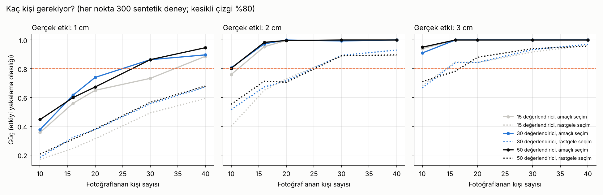

> **Güncel sürüm:** [3-vucut-oranlari-ve-spor](../3-vucut-oranlari-ve-spor/). Bu sürüm dondurulmuştur.

# Algılanan Boy ve Vücut Yapısı · Sürüm 2: Deney Protokolü

> **Sürüm:** 2 · **Tarih:** 2026-10-08 · **Durum:** güncel
>
> **Acelen varsa:** en alttaki [En basit özet](#en-basit-özet) bölümüne atla.
>
> Bu doküman **tıbbi tavsiye değildir** ve hukuki görüş değildir. Deney insanlarla yapılır: onam, 18 yaş altı için veli onamı ve kişisel verilerin korunması protokolün zorunlu parçasıdır.

**Kanıt seviyeleri:**

| Etiket | Anlamı |
|---|---|
| **A** | Meta-analiz ya da birden çok randomize kontrollü çalışma |
| **B** | Tek RCT ya da büyük, iyi tasarlanmış kohort |
| **C** | Gözlemsel çalışma, küçük deney, derleme |
| **V** | Bu depodaki gerçek veri analizi (ANSUR II) |
| **D** | Model çıktısı, simülasyon ya da varsayım |

**Deney paketi:**
- **PDF protokol** (12 sayfa): [deney_protokolu.pdf](protokol/ciktilar/deney_protokolu.pdf). Adım adım uygulama, etik, ölçüm, çekim, değerlendirme yönergesi, analiz, güç tablosu, kontrol listesi, onam ve kayıt formları.
- **Video** (~3 dk, altyazılı): [deney_protokolu.mp4](video/ciktilar/deney_protokolu.mp4) · [.srt](video/ciktilar/deney_protokolu.srt)
- **Analiz aracı:** [simulasyon/analiz_et.py](simulasyon/analiz_et.py). Gösterim listesi üretir ve gerçek veriyi analiz eder.
- **Şablonlar:** [sablonlar/](sablonlar/) (CSV), uydurma bir örnek veri seti dahil.

---

## Soru ve kapsam

Sürüm 1, "aynı boyda kaslı biri daha uzun mu görünür?" sorusunu cevaplayamadı. Merkezi etki hiç ölçülmemişti. Modelin tahmini +1 cm'di ama yönü belirsizdi. Bu sürüm, soruyu **doğrudan ölçecek bir deneyi** tasarlar, ön kayda alır ve uygulayıcılar için hazır hale getirir. Deneyi biz de yapabiliriz, başkaları da tekrar edebilir.

**Kapsam dışı:** Deneyin kendisi henüz yapılmadı; bu sürümde gerçek deney verisi yok.

**Benzetme:** Bir terazi. Kefelerde iki kişinin gerçek boyu var ve biz bunları santimetresine kadar biliyoruz. Kişileri tanımayan değerlendiricilere "hangisi ağır basıyor?" diye soruyoruz. Gerçek fark sabitken cevaplar kalıplının tarafına kayıyorsa, terazinin bir de "göz" eli var demektir.

## Önceki sürümden değişenler

| Konu | Sürüm 1 | Sürüm 2 |
|---|---|---|
| Merkezi etki | Literatürden çıkarılan aralık; yönü belirsiz | Doğrudan ölçecek deney tasarlandı ve ön kayda alındı |
| Yeni | – | PDF protokol, video, analiz aracı, şablonlar, güç analizi |
| Analiz | – | İki aşamalı (kişi düzeyinde) analiz; simülasyonla doğrulandı |
| Bulgular | Değişmedi | – |

## Yöntem

**Deney tasarımı** (ön kayıt: [simulasyon/PLAN.md](simulasyon/PLAN.md)):
- **Katılımcılar:**
  - Boyları ölçülmüş 16-25 yaş erkekler fotoğraflanır. Yarısı belirgin zayıf, yarısı belirgin kalıplı; boyları birbirine yakın.
  - Onları tanımayan değerlendiriciler, standart fotoğrafları ikişer ikişer görüp "hangisi daha uzun?" diye seçer.
- **Standart:**
  - Kamera 3 m uzakta ve 100 cm yükseklikte.
  - Düz arka plan, aynı giysi, ayakkabısız.
  - Yüzler bulanıklaştırılır.
  - Bütün görseller aynı piksel/cm ölçeğinde, ayaklar aynı zemin çizgisinde.
- **Analiz iki aşamalı:**
  1. Bütün cevaplardan her kişinin "algılanan boy" puanı çıkarılır (Thurstone probit ölçeklemesi).
  2. Bu puan kişi düzeyinde gerçek boy ve yapı indeksiyle regresyona sokulur.
  - **PSE₂ = 2c/b**: yapı farkı 2 SD olan iki kişiden kalıplının "aynı boyda" görünmek için kaç cm kısa olabileceği.
  - %95 aralık, kişiler üzerinden bootstrap ile.

**Neden iki aşama:** Tekrar birimi fotoğraflanan kişidir. Değerlendiriciler binlerce cevap verir ama hepsi aynı 20-30 kişiye bakar. Cevapları bağımsız saymak sahte "anlamlı" sonuç üretir (bkz. D5).

**Simülasyon** ([simulasyon/calistir.py](simulasyon/calistir.py)):
- **Sentetik veri:** Fotoğraflanacak kişilerin vücut ölçüleri ANSUR II'den (gerçek omuz ve kilo dağılımı, 17-24 yaş), boyları Türk referansından alındı.
- **Cevap modeli:** Yapı etkisi, değerlendiriciye özgü sapma, kişiye özgü görünüş farkı (saç, duruş) ve göz gürültüsü.
- **Güç ızgarası:** Kişi sayısı (10-40), değerlendirici sayısı (15-50), seçim yöntemi (amaçlı / rastgele) ve gerçek etki (0-3 cm). Her hücrede 300 sentetik deney; toplam 36 000.
- **Analiz kodu, sentetik veri üretecinden bağımsız.** Gerçek deneyde aynen kullanılır.

**Komutlar:**
- `cd simulasyon && python calistir.py`: güç analizi ve testler (~5 dk, 4 çekirdek).
- `python kesifsel_tau.py`: sağlamlık kontrolü.
- `cd protokol && python uret.py`: PDF.
- `cd video && python calistir.py`: video.

## Bulgular

### Testler

[ciktilar/testler.csv](simulasyon/ciktilar/testler.csv). Ön kayıtlı 5 testin 5'i geçti.

| Test | Ne sınıyor | Sonuç | |
|---|---|---|---|
| D1 | Yansızlık: gerçek PSE₂ = 2 cm (40 kişi, 200 değerlendirici) | ortalama tahmin 2.02 cm | ✅ |
| D2 | Yanlış alarm: gerçek etki yokken "var" deme | %7.2 (ölçüt %2.5-8) | ✅ |
| D3 | %95 aralığın gerçeği içerme oranı | %92.4 | ✅ |
| D4 | Tasarım dengesi: her kişi eşit sayıda gösteriliyor, sol-sağ rastgele | oran 1.00; solda %50.2 | ✅ |
| D5 | Gösterim: cevapları bağımsız sayan yanlış analiz | etki yokken **%59** "var" diyor (doğru analizde %7) | ✅ |

**Dürüst not:** Yanlış alarm oranı ızgarada çoğunlukla %5-9, bir hücrede %12. Az sayıda kişiyle yapılan yüzdelik bootstrap biraz cömert davranıyor. Gerçek analizde %95 aralığın sınırına yakın sonuçlar temkinli yorumlanmalı.

### Kaç kişi gerekiyor?

Amaçlı seçimle, 30 değerlendiricide ([guc.csv](simulasyon/ciktilar/guc.csv)):

| Fotoğraflanan kişi | Etki 1 cm | Etki 2 cm | Etki 3 cm | Görünüş farkı büyükse (τ = 2 cm), etki 2 cm |
|---|---|---|---|---|
| 10 (asgari, ön kayıtlı kural) | %38 | %81 | %91 | %35 |
| 20 | %74 | %100 | %100 | %73 |
| **30 (önerilen)** | **%86** | **%99** | **%100** | **%89** |
| 40 | %90 | %100 | %100 | %95 |

- **Önceden yazılan kural** (2 cm etki için güç ≥ %80 olan en küçük tasarım) **10 kişi, 30 değerlendirici** verdi.
- Ama kişilerin yapıyla ilgisiz görünüş farkları (saç, duruş) varsayılandan büyükse bu tasarımın gücü **%35'e** düşüyor. Ayrıca 10 kişiyle yalnızca 45 farklı çift oluşuyor; değerlendirici başına 60 çift gösterilemiyor.
- Bu yüzden, açıkça keşifsel bir sağlamlık kontrolüyle, **pratik öneri 30 kişi ve 30 değerlendirici** ([kesifsel_tau.csv](simulasyon/ciktilar/kesifsel_tau.csv); [plandan sapma 2](simulasyon/PLAN.md)).
- **Gücü asıl belirleyen fotoğraflanan kişi sayısı.** Değerlendirici sayısını 15'ten 50'ye çıkarmak az kazandırıyor.
- **Amaçlı seçim** (yarı zayıf, yarı kalıplı; boylar yakın) rastgele seçimden belirgin güçlü.

**Örnek analiz:** [Uydurma örnek veri seti](sablonlar/) (10 kişi, gerçek etki 2 cm) analiz aracıyla analiz edildiğinde: PSE₂ = +2.1 cm, ama %95 aralık −2.6 ile +5.4 cm. Yani gerçek etki var, ama 10 kişi onu göstermeye yetmiyor. Önerinin neden 30 kişi olduğunun somut örneği.

## Sonuçlar

1. **Soruyu çözecek deney hazır:** standart fotoğraflar, kişileri tanımayan değerlendiriciler, iki seçenekli "hangisi daha uzun?" sorusu ve kişi düzeyinde analiz. Hipotezler ve karar kuralları önceden kayda alındı. (D)
2. **Önerilen tasarım: 30 fotoğraflanan kişi** (yarı zayıf, yarı kalıplı, boyları yakın) **ve 30 değerlendirici.** Bu tasarım 2 cm'lik bir etkiyi %99, 1 cm'lik etkiyi %86 olasılıkla yakalar; kişiler arası görünüş farkları büyük olsa da 2 cm için %89. (D)
3. **Doğru analiz kritik:** Cevapları bağımsız saymak, etki yokken %59 oranında sahte sonuç üretiyor. Hazır iki aşamalı analiz bu oranı %7'de tutuyor. (D)
4. **Deney insanlarla yapılıyor:** yazılı onam, 18 yaş altında veli onamı, yüz bulanıklaştırma, kod kullanımı, fotoğrafların yayımlanmaması ve analiz sonrası silinmesi protokolün zorunlu parçası. (C)

## Sınırlamalar

- **Deney henüz yapılmadı.** Bu sürüm bir tasarım ve araç seti; bulgu içermiyor.
- **Güç hesabı varsayımlara bağlı:** kişiye özgü görünüş farkı (τ), göz gürültüsü, değerlendirici sapması. Gerçek değerler deneyde ortaya çıkacak; daha büyükse daha çok kişi gerekir.
- **Yüzdelik bootstrap az kişiyle biraz cömert** (yanlış alarm %5 yerine ~%7-9).
- **Fotoğraf, gerçek hayattaki üç boyutlu görme değil.** Hareket, uzaklık ve bakış açısı farklıdır. Deney, en temiz koşulda "göz etkisi" var mı sorusunu cevaplar.
- **Yapı indeksi kası yağdan ayıramaz** (omuz genişliği ve kilo). Kaslılığı ayrıca puanlamak keşifsel bir eklenti olabilir.
- **Hukuki çerçeve** genel bilgi düzeyinde verildi; kurum içinde yapılacaksa kurumun etik ve veri koruma kurallarına uyulmalı.

## Kaynaklar

- [Sürüm 1: literatür ve algı simülasyonu](../1-literatur-ve-algi-simulasyonu/README.md)
- [Thurstone LL. A law of comparative judgment. Psychol Rev 1927;34:273](https://doi.org/10.1037/h0070288): çift karşılaştırma ölçeklemesi
- [Beck DM, Emanuele B, Savazzi S. Psychon Bull Rev 2013;20:1154](https://doi.org/10.3758/s13423-013-0454-8): genişlik-boy yanılgısı
- [Fessler DMT, Holbrook C, Snyder JK. PLoS ONE 2012;7:e32751](https://pubmed.ncbi.nlm.nih.gov/22509247/): güç ve algılanan boy
- [Marsh AA ve ark. PLoS ONE 2009;4:e5707](https://pubmed.ncbi.nlm.nih.gov/19479082/): statü duruşu ve algılanan boy
- [Re DE ve ark. PLoS ONE 2013;8:e80957](https://pubmed.ncbi.nlm.nih.gov/24324651/): yüz ipuçları ve algılanan boy (yüz bulanıklaştırmanın gerekçesi)
- [ANSUR II erkek veri seti](https://www.openlab.psu.edu/ansur2/) (SHA-256 `0547aea0…ac64`)
- [6698 sayılı Kişisel Verilerin Korunması Kanunu (mevzuat.gov.tr)](https://www.mevzuat.gov.tr/mevzuatmetin/1.5.6698.pdf)

## En basit özet

- **"Kaslı biri aynı boyda daha uzun mu görünüyor?" sorusunu kesin cevaplayacak bir deney hazırladık:** PDF rehber, video, formlar ve hazır analiz kodu.
- **Nasıl yapılıyor:** 30 kişinin (yarısı zayıf, yarısı kalıplı) boyu ölçülüyor, standart fotoğrafı çekiliyor. Onları tanımayan 30 kişi fotoğrafları ikişer görüp "hangisi daha uzun?" diye seçiyor.
- **Neden 30 kişi:** 10 kişi kâğıt üzerinde yeterli görünüyor, ama kişiler arası küçük farklar sonucu kolayca boğabiliyor; 30 kişi sağlam.
- **Önce izin:** herkesten yazılı onay, 18 yaş altında veli onayı. Yüzler bulanık, fotoğraflar paylaşılmaz, sonra silinir.
- **Sonuç ne çıkarsa çıksın yayımlanacak.** Fark çıksa da çıkmasa da bir şey öğrenmiş olacağız.
