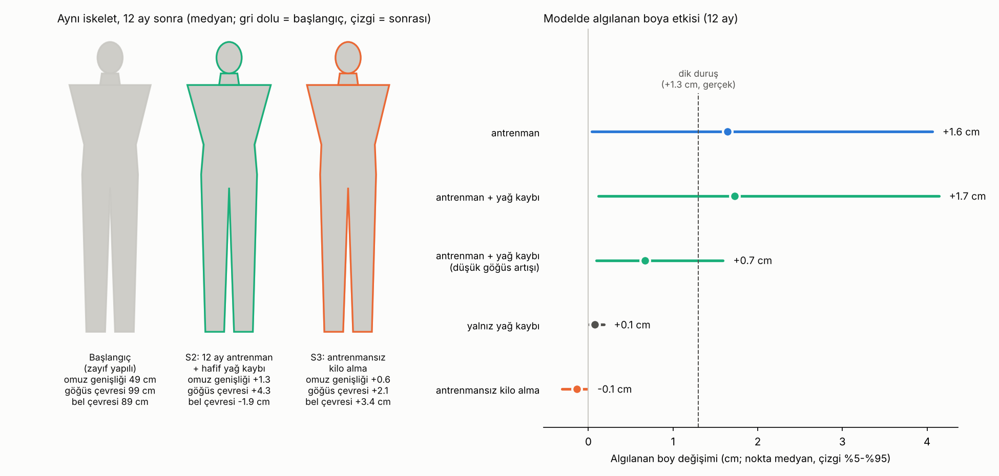
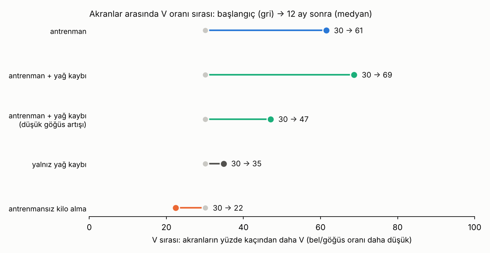

# Algılanan Boy ve Vücut Yapısı · Sürüm 3: Vücut Oranları ve Spor

> **Sürüm:** 3 · **Tarih:** 2026-10-09 · **Durum:** güncel
>
> **Acelen varsa:** en alttaki [En basit özet](#en-basit-özet) bölümüne atla.
>
> Bu doküman **tıbbi tavsiye değildir.** Antrenman programı değildir. Ergenlikte ağırlık antrenmanına uzman gözetiminde ve doğru teknikle başlanması önerilir.

**Kanıt seviyeleri:**

| Etiket | Anlamı |
|---|---|
| **A** | Meta-analiz ya da birden çok randomize kontrollü çalışma |
| **B** | Tek RCT ya da büyük, iyi tasarlanmış kohort |
| **C** | Gözlemsel çalışma, deneysel algı çalışması, mekanizma |
| **V** | Bu çalışmanın kendi gerçek veri analizi (ANSUR II) |
| **D** | Model çıktısı ya da varsayım |

---

## Soru ve kapsam

Sürüm 1, kaslı ve kalıplı birinin aynı boyda daha uzun görünüp görünmediğini tek bir genel "yapı" ölçüsüyle inceledi. Bu sürüm vücudu parçalarına ayırıyor ve sporun rolünü soruyor:

1. **Omuz genişliğinin ne kadarı kemik, ne kadarı kas ve yağ?** Kemik sporla değişmez, kas değişir.
2. **Orantı:** Göğüs ve omzun bele oranı (V şekli) akranlar arasında nasıl dağılıyor? Aynı kemik yapısındaki insanlar arasında ne kadar fark var?
3. **Spor bu oranları 12 ayda gerçekçi olarak ne kadar değiştirir?** Yağ kaybı ve kilo almayla karşılaştırma.
4. **Algıya etkisi:** Bu değişim çekicilik ve güç izlenimini, algılanan boyu ne kadar değiştirir?
5. **Omuz kemiği hâlâ genişliyor mu?** 17-24 yaş arasında omuz iskeletinin genişliği yaşla değişiyor mu?

**Kapsam dışı:** Antrenman programı, takviye, klinik değerlendirme.

**Benzetme:** Vücudu bir çadır gibi düşün. Direkler (kemik) sabit; branda (kas ve yağ) değişebilir. Çadırın uzaktan nasıl göründüğü hem direklerin aralığına hem brandanın nereye gerildiğine bağlı. Spor brandayı omza ve göğse doğru gerer; fazla yemek ise beline doğru şişirir.

## Önceki sürümden değişenler

| Konu | Sürüm 1-2 | Sürüm 3 |
|---|---|---|
| Vücut ölçüsü | Tek "yapı" indeksi: omuz genişliği ve kilo birlikte | Ayrı **kas** ve **yağ** indeksleri; ayrıca kemik (biakromiyal) payı |
| Algılanan boy modeli | Güç etkisi kiloyu da içeriyordu | Güç ipucu **yalnız kas**; yağ yalnız genişliği artırıyor. Aralıklar aynı: güç etkisi 0-2 cm/SD, genişlik yanılgısı −1-0 cm/SD |
| Spor | Ele alınmadı | 12 aylık 4 senaryo: antrenman, antrenman + yağ kaybı, yalnız yağ kaybı, antrenmansız kilo alma |
| Orantı ve çekicilik | Ele alınmadı | Bel/göğüs oranı (V şekli) ve çekicilik literatürü |
| Sürüm 1-2'nin sonuçları | – | Değişmedi. Sürüm 2'deki deney önerisi hâlâ geçerli |

## Yöntem

**1. Literatür.** PubMed özetleri ve açık erişimli tam metinler doğrudan okundu. Bulunamayan konular "bulunamadı" diye belirtildi.

**2. Gerçek veri (V).** ANSUR II erkek veri seti, 17-24 yaş, n = 1358; sürüm 1 ile aynı dosya, SHA-256 doğrulandı. Ölçüler:

| Ölçü | ANSUR adı | Ne gösterir |
|---|---|---|
| Biakromiyal genişlik | omuz kemiklerinin uçları arası | **iskelet** |
| Bideltoid genişlik | omzun en geniş yeri | iskelet + omuz kası + yağ |
| Göğüs, omuz, pazı, ön kol çevresi | | kas (ve yağ) |
| Bel çevresi | | yağ |

- **Yağ indeksi:** bel çevresinin, boy ve iskelet genişliğine göre beklenen değerden farkı.
- **Kas indeksi:** göğüs, omuz, pazı ve ön kol çevrelerinin; boy, iskelet ve bel çevresine göre beklenen değerden farklarının ortalaması.

Yani aynı boy, aynı iskelet ve aynı göbekteki iki kişiden hangisinin kolu, göğsü ve omzu daha kalın?

**3. Senaryolar (D).** 12 ay, başlangıç profili genel bir "zayıf yapılı genç":
- ANSUR'un medyan boyu ve iskelet genişliği,
- kas indeksi −1 SD,
- yağ indeksi ortalama.

Gerçek bir kişinin ölçüsü kullanılmadı.

| Senaryo | Girdi |
|---|---|
| Antrenman | Göğüs çevresi +3 ile +8 cm. Gerekçe: 8 haftalık antrenmanla +3.4 ve +6.0 cm ölçülmüş (Arazi 2021). Yağ −1 ile +1 kg |
| Antrenman + yağ kaybı | Aynı göğüs artışı; yağ −1 ile −3 kg |
| Yalnız yağ kaybı | Yağ −1 ile −3 kg |
| Antrenmansız kilo alma | Yağ +2 ile +5 kg |

- Göğüs artışı, verideki kas ekseni boyunca diğer ölçülere çevrildi: omuz, pazı ve kilo, gerçek insanlarda göğüsle birlikte nasıl değişiyorsa öyle.
- Algılanan boy, sürüm 1 modeliyle hesaplandı: `Δalgılanan boy = güç etkisi × Δkas + genişlik yanılgısı × Δönden genişlik`.
- Her etki bir aralıktan çekildi. 16 000 Monte Carlo tekrarı yapıldı ve medyan ile %5-%95 aralığı raporlandı.

**Ön kayıt:** [simulasyon/PLAN.md](simulasyon/PLAN.md) kod yazılmadan commit edildi. Kod, çalıştırılmadan önce ayrıca commit edildi. Komut: `cd simulasyon && python calistir.py` (birkaç saniye).

## Bulgular

### 1. Literatür: orantılı bir vücut nasıl algılanıyor?

| Konu | Bulgu | Kanıt |
|---|---|---|
| Güç = çekicilik | Erkek vücut fotoğraflarında, gözle tahmin edilen güç çekicilik puanlarının **%70'inden fazlasını** belirliyor. Boy ve yağsızlık eklenince %80. Bu çalışmada en güçlü görünen en çekici bulundu; "aşırısı itici" etkisi görülmedi. | C |
| Orta kaslılık | Başka bir dizi çalışmada kaslı erkekler daha çekici ve baskın bulundu; ama en çekici bulunan **orta** düzey kaslılık oldu. İki çalışma bu noktada çelişiyor. | C |
| V şekli | Gerçek erkek görüntülerinde **bel/göğüs oranı** (dar bel, geniş göğüs) çekiciliğin birincil belirleyicisi; kilo (BMI) ikincil. Britanya, Yunanistan ve kentsel Malezya'da aynı sonuç; kırsal Malezya'da kilo daha önemli. | C |
| Neden | Düşük bel/göğüs oranlı erkekler daha baskın, daha formda ve sevdiklerini "koruyabilir" algılanıyor; bu algılar çekiciliğe aracılık ediyor. | C |
| 3B tarama | Bir çalışmada hacim-boy indeksi tek başına çekicilik puanlarının ~%73'ünü açıkladı ve bir optimumu vardı: çok zayıf da çok iri de daha az çekici. Diğer oranların etkisi küçüktü. Başka bir 3B çalışmada bel/göğüs oranı ve hacim-boy indeksi birlikte önemli belirleyicilerdi. | C |
| Dikkat | Göz izleme çalışmasında (130 kadın) kısa dönemli ilişkiye yönelik kadınlar düşük bel/göğüs oranlı erkekleri daha çekici buldu, ama bakışları bu yönelime göre değişmedi. Kendini çekici bulan kadınlar baş ve bel bölgesine daha çok baktı. | C |
| Hangi kaslar | 1742 kişiye 14 kas grubu soruldu. Erkekler büyük üst vücut kaslarını tercih ediyor; kadınların tercihi yalnız kısmen aynı. | C |
| **Yanılgı** | **Erkekler, kadınların beğendiği kaslılığı abartıyor.** Erkek dergilerindeki ideal, kadın dergilerindekinden daha kaslı. 3B modellerle tekrar gösterildi. | C |
| Genişlik ve boy | Aynı boyda daha geniş vücut daha kısa algılanıyor; insan vücudunda bu etki dikdörtgenden daha güçlü. | C |
| Antrenman | 8 hafta direnç antrenmanında göğüs çevresi +3.4 cm (haftada 2 gün) ve +6.0 cm (haftada 4 gün); kontrol grubu +0.5 cm. 12 haftada üst vücut kas kalınlığı +%12-21, alt vücut +%7-9; üst vücut daha hızlı. Meta-analiz: 111 çalışmada ortalama kas kütlesi artışı +1.5 kg. | B + A |
| Köprücük kemiği | İç uçtaki büyüme plağı erkekte ortalama **20.6** yaşında kaynaşmaya başlıyor, **21.9** yaşında tamamlanıyor (210 erkeğin BT taraması). | C |

**Bulunamayan:** Antrenmanın omuz genişliğini santimetre olarak nasıl değiştirdiğini ölçen bir çalışma; V şeklinin **algılanan boya** etkisini doğrudan ölçen bir çalışma.

### 2. Gerçek veri: kemik, kas, yağ (V)

ANSUR II, 17-24 yaş erkek, n = 1358:

| Bulgu | Değer |
|---|---|
| Omuz genişliğinin (bideltoid) kemik ve boyla açıklanan payı | **%47** (R² = 0.466) → K3: "karışık" |
| Kemik + kas + yağ birlikte | %89 |
| Kemik genişliği ile en geniş omuz arasındaki ortalama fark (kas + yağ) | 8.6 cm (41.4'e karşı 50.0 cm) |
| Bel/göğüs oranı, akranlar: %5 / medyan / %95 | 0.79 / 0.86 / 0.96 |
| **Aynı boy (±2 cm) ve aynı kemik genişliği (±1 cm), n = 168:** en geniş omuz %5-%95 | **46.0 ile 54.3 cm** |
| Aynı grupta göğüs çevresi %5-%95 | **90.6 ile 113.4 cm** |
| Aynı grupta bel/göğüs oranı %5-%95 | 0.79 ile 0.95; neredeyse bütün akranlardaki aralık kadar |
| Kas ekseninde: göğüs +1 cm olunca en geniş omuz | +0.31 cm |
| 1 kg yağ, bel çevresinde | **≈ 1 cm** (0.97) |

**Anlamı:** Kemik yapısı tamamen aynı olan iki genç arasında omuzda 8 cm, göğüste 23 cm fark olabiliyor. "V görünümü"nün akranlar arasındaki farkının çoğu kemikten değil, **kas ve yağdan** geliyor. Çadır benzetmesiyle: direkler aynı, branda çok farklı.

**Omuz kemiği hâlâ genişliyor mu?** (V, kesitsel)
- Kemik genişliği 17-24 yaş arasında yılda **+0.15 cm** artıyor (%95: +0.09 … +0.21) → K4: "kesitsel veride büyüme görülüyor".
- 17-18 yaş ortalaması 40.5 cm (n = 50), 23-24 yaş ortalaması 41.6 cm (n = 437); fark ~1 cm.
- Köprücük kemiği büyüme plağının ortalama 21-22 yaşında kapanmasıyla uyumlu.

**Dikkat:** Bu, aynı kişileri yıllarca izleyen bir çalışma değil, farklı yaştaki farklı kişiler; asker seçimi gibi farklar sonucu etkileyebilir. 17 yaşında birinin omuz kemiğinin 21-22 yaşına kadar ~0.5-1 cm daha genişlemesi akla yatkın, ama kesin değil.

### 3. Senaryolar: 12 ayda ne değişir? (D)

Başlangıç profili:
- göğüs 99 cm, bel 89 cm, en geniş omuz 49 cm,
- bel/göğüs oranı 0.89; akranlarının %30'undan daha "V",
- kas indeksinde %15'lik dilimde.

| | Antrenman | Antrenman + yağ kaybı | Antrenman + yağ kaybı, **düşük artış** (D5) | Yalnız yağ kaybı | Antrenmansız kilo alma |
|---|---|---|---|---|---|
| Göğüs çevresi | +5.5 cm | +4.3 cm | +0.8 cm (yağ kaybı göğsü de küçültüyor) | −1.2 cm | +2.1 cm |
| En geniş omuz | +1.7 cm | +1.3 cm | +0.3 cm | −0.4 cm | +0.6 cm |
| Bel çevresi | 0 | −1.9 cm | −1.9 cm | −1.9 cm | +3.4 cm |
| Kas ekseninin ima ettiği kilo (toplam kilo değişimi) | +6.6 kg (+6.7) | +6.6 kg (+4.7) | +2.4 kg (+0.4) | 0 (−2.0) | 0 (+3.5) |
| **V sırası** (akranların yüzde kaçından daha V) | 30 → **61** | 30 → **69** | 30 → **47** | 30 → 35 | 30 → **22** |
| **Algılanan boy** (model) | +1.6 cm (0.0 … +4.1) | **+1.7 cm** (+0.1 … +4.1) | **+0.7 cm** (+0.1 … +1.6) | +0.1 cm | −0.1 cm |

**Senaryonun ne kadar gerçekçi olduğuna dair önemli bir not:**
- Ana antrenman senaryosu (göğüs +3 ile +8 cm), kas ekseni boyunca yılda **~6.6 kg** (3.9 … 9.4) kilo artışı ima ediyor.
- Literatürdeki ortalama kas kazancı birkaç aylık programlarda **~1.5 kg**. İlk yılda bunun birkaç katına çıkmak mümkün, ama 6-7 kg iyimser.
- Düşük artış senaryosu (D5, göğüs +1 ile +3 cm) ise ~2.4 kg ima ediyor.
- **Bu yüzden gerçekçi beklenti iki senaryonun arasında:** V sırası 30'dan **47 ile 69 arasına**, algılanan boy **+0.7 ile +1.7 cm** (medyanlar). Ana senaryo iyimser olduğu için aralığın alt kısmı daha olası.

Bu karşılaştırma ilk çalıştırmadan sonra eklendi ve [PLAN.md](simulasyon/PLAN.md) "Plandan sapmalar" bölümünde'de sapma olarak kayıtlı. Senaryo aralıkları değiştirilmedi.

### 4. Testler ve duyarlılık

[testler.csv](simulasyon/ciktilar/testler.csv). Son çalıştırmada ön kayıtlı 6 testin **6'sı geçti.** İlk çalıştırmada (R = 4000) B6 **kaldı**; bootstrap hatası 0.031 cm çıktı, ölçüt 0.02 cm'nin altıydı. Ölçüt değiştirilmedi; tekrar sayısı 16 000'e çıkarıldı ve hata 0.014 cm'ye indi. Sapma kayıtlı. İki çalıştırmanın ana sonuçları birbirine yakın: algılanan boy medyanı 1.70'e karşı 1.72 cm.

| Test | Ne sınıyor | Sonuç | |
|---|---|---|---|
| B1 | SHA-256, n = 1358 | eşleşti; 1358 | ✅ |
| B2 | Kas ve yağ indeksleri ilişkisiz, standart | r = 0.0000 | ✅ |
| B3 | Göğüs artışı eşlemesi geri hesaplanınca aynı | fark 9 × 10⁻¹⁶ cm | ✅ |
| B4 | Hiçbir şey yapılmazsa hiçbir şey değişmez | 0 | ✅ |
| B5 | Yağ arttıkça V oranı kötüleşir, algılanan boy azalır | kesin monoton | ✅ |
| B6 | Monte Carlo hatası (R = 16 000) | 0.014 cm | ✅ (ilk çalıştırmada kaldı) |

**Duyarlılık** (antrenman + yağ kaybı; [duyarlilik.csv](simulasyon/ciktilar/duyarlilik.csv)):

| Varyant | Algılanan boy | V sırası artışı |
|---|---|---|
| Ana | +1.7 cm (+0.1 … +4.1) | +39 puan |
| Güç etkisi güçlü (1-3 cm/SD) | **+3.5 cm** (+1.7 … +6.6) | +39 |
| Genişlik yanılgısı güçlü (−2 … −1 cm/SD) | +1.6 cm (**0.0** … +3.9) | +39 |
| Antrenman omzu daha az genişletir | +1.8 cm | +39 |
| Başlangıçta ortalama yapılı | +1.7 cm | +36 (46 → 82) |
| Düşük göğüs artışı (+1 … +3 cm) | +0.7 cm (+0.1 … +1.6) | +17 |

- **V oranı sonucu sağlam:** Varsayımlardan bağımsız olarak antrenman, akranlar arasındaki sırayı belirgin biçimde değiştiriyor.
- **Algılanan boy sonucu varsayıma bağlı:** Pozitif çıkması büyük ölçüde "güç etkisi negatif olamaz" varsayımından geliyor. Güç etkisinin büyüklüğü 0 ile 3 cm/SD arasında değişince sonuç 0 ile 6 cm arasında değişiyor. Bunu ancak sürüm 2'deki deney çözer.

**Karar kuralları (önceden sabit):**
- **K1, "Spor V oranını belirgin değiştirir mi?":** **Belirgin.** Medyan +39 puan; düşük artış senaryosunda bile +17 puan ("belirgin" eşiği 15).
- **K2, "Algılanan boyu değiştirir mi?":** "Biraz daha uzun gösterir; orta" (+1.7 cm; %5'lik sınır +0.1). Pozitifliği büyük ölçüde varsayımdan geliyor; düşük artışta medyan +0.7 cm, yani "küçük".
- **K3, "Omuz genişliğinin çoğu kemik mi?":** **Karışık** (%47).
- **K4, "Omuz kemiği 17-24 arasında büyüyor mu?":** Kesitsel veride **evet**, yılda ~0.15 cm.

## Sonuçlar

1. **"Kalıplı görünüm"ün çoğu kemikten değil, kas ve yağdan geliyor.** En geniş omuz ölçüsünün yalnız %47'si kemik ve boyla açıklanıyor. Kemik yapısı aynı olan gençler arasında omuzda 8 cm, göğüste 23 cm fark var. (V)
2. **Orantı (V şekli), çekiciliğin ve güç izleniminin en güçlü vücut ipucu.** Gözle tahmin edilen güç, vücut çekiciliğinin %70'inden fazlasını açıklıyor. Bel/göğüs oranı çekicilikte kilodan daha önemli. Bu oran baskınlık, formda olma ve "koruyabilirlik" izlenimi veriyor. (C)
3. **Spor bu oranı gerçekten değiştirebiliyor.** Modelde 12 aylık antrenman + hafif yağ kaybı, akranlar arasındaki V sırasını 30'dan 47 (düşük artış) ile 69 (ana senaryo) arasına taşıyor. Ana senaryo iyimser olduğundan alt kısım daha olası. Antrenmansız kilo almak sırayı düşürüyor (30 → 22). Yalnız yağ vermenin etkisi küçük (30 → 35). (V + D)
4. **Algılanan boya etkisi küçük ile orta arası, yönü varsayıma bağlı.** Model +0.7 ile +1.7 cm veriyor; bu, dik durmanın ölçülmüş etkisi (+1.3 cm) ile aynı büyüklükte. Ama doğrudan ölçülmedi. (D)
5. **Erkekler, kadınların beğendiği kaslılığı abartıyor.** "Orantılı" hedef, dergilerdeki ideal değil. Bir çalışmada en çekici bulunan orta kaslılıktı; bir başkasında en güçlü görünen en çekiciydi. İki çalışma da yağ oranının düşük olmasını olumlu buluyor. (C)
6. **17 yaşında omuz kemiği muhtemelen hâlâ biraz genişliyor.** Köprücük kemiği büyüme plağı ortalama 21-22 yaşında kapanıyor. Kesitsel veride 17'den 24'e ~1 cm genişleme görülüyor. Bu sporla değişmez, ama "omzum dar kalacak" kaygısı için bilinmesi iyi. (C + V)

## Sınırlamalar

- **Kesitsel veriyle zaman içindeki değişim tahmin edildi.** Antrenmanın vücudu, ANSUR'daki kaslı ile zayıf kişiler arasındaki farkın yönünde değiştirdiği varsayıldı (D). Gerçekte antrenman göğüs ve omuzu kollardan farklı oranda büyütebilir; D3 bunun bir kısmını test ediyor.
- **Göğüs artışının yıllık değeri doğrudan ölçülmedi.** 8 haftalık bir çalışmadan uyarlandı. Ana senaryo literatüre göre iyimser; düşük senaryo yanında verildi.
- **ANSUR II, ABD askerlerinden.** Türk gençlerinden daha ağır (medyan ~80 kg). "Akranlar arasındaki sıra" bu kitleye göre. Başlangıç profili genel bir profil, belirli bir kişi değil.
- **Çevre ölçüleri kası yağdan tam ayıramıyor.** Kas indeksi, bel çevresi sabit tutularak kuruldu. Bu yaklaşık bir ayrım.
- **Algılanan boy modeli sürüm 1'in varsayımlarına dayanıyor.** Merkezi etki (kaslı vücut aynı boyda daha uzun mu görünüyor) hâlâ doğrudan ölçülmedi.
- **Çekicilik çalışmaları çoğunlukla kadın değerlendiricilerle ve yetişkinlerle yapıldı.** Erkeklerin birbirini nasıl algıladığı ("güçlü görünüyor mu") daha az çalışılmış.
- **Omuz kemiğinin yaşla genişlemesi kesitsel**; aynı kişileri izleyen veri değil.

## Kaynaklar

**Çekicilik, güç ve orantı**
- [Sell A, Lukazsweski AW, Townsley M. Proc R Soc B 2017;284:20171819](https://pubmed.ncbi.nlm.nih.gov/29237852/): güç ipuçları vücut çekiciliğinin >%70'i
- [Frederick DA, Haselton MG. Pers Soc Psychol Bull 2007;33:1167](https://pubmed.ncbi.nlm.nih.gov/17578932/): kaslılık ve orta düzeyin çekiciliği
- [Swami V, Tovée MJ. Body Image 2005;2:383](https://pubmed.ncbi.nlm.nih.gov/18089203/): Britanya ve Malezya, bel/göğüs oranı
- [Swami V ve ark. J Soc Psychol 2007;147:15](https://pubmed.ncbi.nlm.nih.gov/17345919/): Britanya ve Yunanistan, bel/göğüs oranı
- [Fan J ve ark. Proc R Soc B 2005;272:219](https://pubmed.ncbi.nlm.nih.gov/15705545/): 3B tarama, hacim-boy indeksi
- [Price ME ve ark. PLoS ONE 2013;8:e52532](https://pubmed.ncbi.nlm.nih.gov/23300976/): 3B tarama, bel/göğüs oranı ve hacim-boy indeksi
- [Coy AE, Green JD, Price ME. Body Image 2014;11:282](https://pubmed.ncbi.nlm.nih.gov/24958664/): bel/göğüs oranı, baskınlık, formda olma, koruma
- [Garza R, Byrd-Craven J. Arch Sex Behav 2021;50:543](https://pubmed.ncbi.nlm.nih.gov/33057831/): göz izleme ve bel/göğüs oranı
- [Durkee PK ve ark. Evol Psychol 2019;17:1474704919852918](https://pubmed.ncbi.nlm.nih.gov/31167552/): 14 kas grubu tercihleri
- [Frederick DA, Fessler DMT, Haselton MG. Body Image 2005;2:81](https://pubmed.ncbi.nlm.nih.gov/18089177/): erkeklerin kaslılığı abartması, dergiler
- [Lei X, Perrett DI. Br J Psychol 2021;112:247](https://pubmed.ncbi.nlm.nih.gov/32449533/): karşı cinsin tercihlerini yanlış algılama
- [Beck DM, Emanuele B, Savazzi S. Psychon Bull Rev 2013;20:1154](https://pubmed.ncbi.nlm.nih.gov/23716018/): genişlik-boy yanılgısı

**Antrenman ve iskelet**
- [Arazi H ve ark. PeerJ 2021;9:e10537](https://pmc.ncbi.nlm.nih.gov/articles/PMC8067909/): 8 haftada göğüs, kol ve uyluk çevresi
- [Abe T ve ark. Eur J Appl Physiol 2000;81:174](https://pubmed.ncbi.nlm.nih.gov/10638374/): üst ve alt vücut kas kalınlığının zaman seyri
- [Benito PJ ve ark. Int J Environ Res Public Health 2020;17:1285](https://pubmed.ncbi.nlm.nih.gov/32079265/): kas kütlesi artışı meta-analizi
- [Franklin D, Flavel A. Int J Legal Med 2015;129:583](https://pubmed.ncbi.nlm.nih.gov/25398635/): köprücük kemiği büyüme plağının kapanma yaşı

**Veri ve önceki sürümler**
- [ANSUR II erkek veri seti](https://www.openlab.psu.edu/ansur2/) (SHA-256 `0547aea0…ac64`)
- [Sürüm 1: literatür ve algı simülasyonu](../1-literatur-ve-algi-simulasyonu/README.md)
- [Sürüm 2: deney protokolü](../2-deney-protokolu/README.md)

## En basit özet

- **Kalıplı görünümün çoğu kemikten değil, kas ve yağdan geliyor.** Kemik yapısı tamamen aynı iki genç arasında omuzda 8 cm, göğüste 23 cm fark olabiliyor. Yani bu, büyük ölçüde değiştirilebilir bir şey.
- **Görünüşte en çok işe yarayan şey orantı:** geniş omuz ve göğüs, dar bel. Araştırmalarda vücut çekiciliğini en çok bu ve "güçlü görünmek" açıklıyor; kilo daha az önemli.
- **Spor bu orantıyı gerçekten değiştiriyor.** Modelde bir yıllık düzenli antrenmanla akranlar arasında "V" sıralaması 30'dan 47 ile 69 arasına çıkıyor; gerçekçi olan muhtemelen alt kısmı. Antrenman yapmadan kilo almak ise sıralamayı düşürüyor.
- **Boy algısına etkisi küçük:** yaklaşık +0.7 ile +1.7 cm, yani dik durmakla aynı büyüklükte. Bu bir model tahmini; kesin cevap için hâlâ deney gerekiyor.
- **Dergilerdeki aşırı kaslı ideal gerçek tercih değil.** Erkekler, kadınların beğendiği kaslılığı abartıyor. Hedef "orantılı ve yağı düşük", "olabildiğince iri" değil.
- **Omuz kemiğin muhtemelen 21-22 yaşına kadar biraz daha genişleyecek** (~0.5-1 cm). Ama farkın asıl kaynağı kemik değil, kas.
- **Benzetme:** Çadırın direkleri (kemik) neredeyse sabit; branda (kas ve yağ) senin elinde. Spor brandayı omuza ve göğse doğru gerer, fazla yemek beline doğru şişirir. Uzaktan bakan da önce brandanın şeklini görür.
