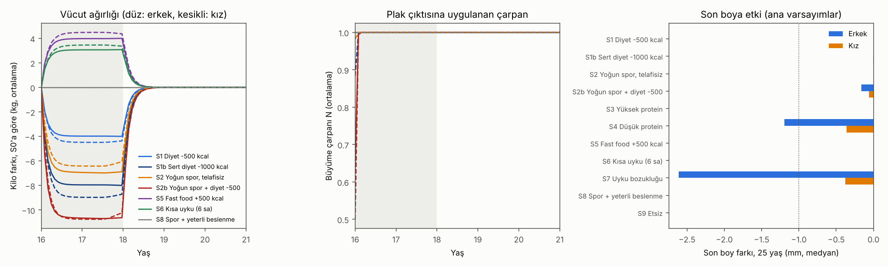

# Beslenme, İştah, Vücut Yağı, Uyku ve Boy · Sürüm 1: Fizyoloji Simülasyonu

> **Sürüm:** 1 · **Tarih:** 2026-10-07 · **Durum:** güncel
>
> **Acelen varsa:** en alttaki [En basit özet](#en-basit-özet) bölümüne atla.
>
> Bu doküman **tıbbi tavsiye değildir.** Yeme bozukluğu şüphesi, hızlı kilo kaybı, adet düzensizliği, horlama ya da uykuda nefes durması varsa hekime gidilmeli. Takviye ve ilaçlar yalnızca **hekim kararıyla** kullanılır.

**Kanıt seviyeleri:**

| Etiket | Anlamı |
|---|---|
| **A** | Meta-analiz ya da birden çok randomize kontrollü çalışma |
| **B** | Tek RCT ya da büyük, iyi tasarlanmış kohort |
| **C** | Gözlemsel çalışma, mekanizma, uzlaşı/referans değeri |
| **V** | Bu çalışmanın kendi gerçek veri analizi (burada: USDA besin veritabanından hesaplanan besin profilleri) |
| **D** | Model çıktısı ya da varsayım. Yön ve büyüklük sırası gösterir, kesin sayı vermez |

---

## Soru ve kapsam

**Soru:** Plakları henüz kapanmamış 16 yaşındaki bir genç için şunlar son boyu ne kadar değiştirir?
- **ne** yediği (yiyeceğin gerçek besin değerleri),
- **ne kadar** yediği (enerji),
- iştahı,
- vücut yağı,
- uykusu.

Kullanıcının istediği gibi yiyecekler "et", "ekmek" diye değil, **besin vektörü** olarak temsil edildi. Örneğin tavuk göğsü = 100 g'da 165 kcal, 31 g protein, 3.6 g yağ, 1 mg çinko… (USDA FoodData Central'dan 29 yiyecek).

**"Gerçek bir anatomi simülasyonu" hakkında dürüst not:** Organ organ bir vücut simülasyonu bu soru için bilgi eklemez, kanıtsız ayrıntı ekler. Bunun yerine sorunun geçtiği **dört fizyoloji katmanı** kuruldu ve her biri yayınlanmış ölçümlere bağlandı:
1. Besin
2. Enerji harcaması
3. Vücut bileşimi ve iştah
4. Büyüme plağı

"Mantık dışına çıkmayacak yere kadar" ilkesinin sınırı tam olarak katman 4'ün girişi. Beslenmenin plağa etkisini 16+ yaşta ölçen insan verisi yok. O halka varsayım (D) olarak kaldı ve geniş bir duyarlılık analiziyle sınandı.

**Kapsam dışı:**
- ilaç ve hormon;
- 16 yaşından önceki beslenme;
- ergenliğin zamanlaması;
- yağ dokusunun östrojen üretiminin plak kapanmasına etkisi (sayısal kaynak yok).

**Bağlantılı araştırmalar:**
- Büyüme plağı modeli: [boy-uzamasi-16-18-yas, sürüm 3](../../boy-uzamasi-16-18-yas/3-mekanistik-simulasyon-ve-on-kayit/).
- Sanal kohort ve egzersizin mekanik etkisi: [spor-egzersiz-ve-boy, sürüm 1](../../spor-egzersiz-ve-boy/1-fizik-tabanli-simulasyon/).

**Benzetme:** Büyüme plağı bir fabrika, yemek hammadde, iştah depo yöneticisi, vücut yağı depo, uyku gece vardiyası. 16 yaşında erkeklerde fabrikanın kapanmasına ~3.6 cm'lik iş kaldı, kızlarda ~0.5 cm. Soru şu: hammadde zaten yetiyorsa fazlası üretimi artırır mı, yetmezse ne kadar düşürür?

## Yöntem

Tam plan, denklemler ve parametre sınıfları ön kayıtta: [simulasyon/PLAN.md](simulasyon/PLAN.md). Plan, kod yazılmadan ve sonuç görülmeden önce commit edildi. Kod da çalıştırılmadan önce ayrıca commit edildi.

**Katmanlar:**

| Katman | Ne yapıyor | Dayanağı |
|---|---|---|
| 1. Besin | 29 yiyeceğin USDA besin vektörleri (enerji, protein, yağ, doymuş yağ, karbonhidrat, lif, Ca, Fe, Zn, D vitamini). 5 diyet sepeti, enerji alımına orantılı ölçeklenir | USDA SR Legacy, SHA-256 ile doğrulanmış indirme |
| 2. Harcama | Bazal metabolizma (Schofield, ağırlık + boy) × 1.55 + spor (METy) | FAO/WHO/UNU 1985; Youth Compendium 2017, 16-18 yaş METy (futbol maçı 8.7) |
| 3. Vücut bileşimi | Enerji dengesi, kilo değişimini yağ ve yağsız kütleye Forbes eğrisiyle böler. Yağ 9441, yağsız doku 1816 kcal/kg | Hall 2007/2008 |
| 3b. İştah | Kaybedilen her kg için alım ~100 kcal/gün artar | Polidori 2016 (yetişkin) |
| 3c. Uyku | Kısa uyku alımı +385 kcal/gün artırır, harcamayı değiştirmez | Al Khatib 2017 meta-analizi |
| 4. Büyüme | Plak çıktısı N(t) çarpanıyla yavaşlar: N = min(N_E, N_P) × N_uyku. N_E enerji uygunluğuna (EA = (alım − spor harcaması) / yağsız kütle) bağlı, 30'un altında düşer. N_P, protein bireysel ihtiyacın altına inerse düşer | Eşikler: Loucks & Thuma 2003, Ihle & Loucks 2004 (C). Biçim ve büyüklük **varsayım (D)** |

- **Tavan ilkesi (yapısal varsayım):** N en fazla 1. Yani yeterli olanın fazlası büyümeyi hızlandırmaz. Bu bir bulgu değil, modelin varsayımı.
- **Kohort:** Cinsiyet başına 2000 sanal genç; sürüm 3 büyüme modeli, Türk uyarlaması.
  - 16 yaşta BMI medyanı 21 (varsayım).
  - Yağ oranı Deurenberg 1991 formülüyle.
  - Kohort medyanı: erkek 173.3 cm, 63.0 kg, %18.4 yağ; kız 162.2 cm, 55.6 kg, %22.1 yağ.
- **Senaryolar:** 16.0-18.0 yaş arası uygulanır; 18'de herkes referansa döner. Boy 18 ve 25 yaşta ölçülür. Her kişi kendi referansıyla (S0) karşılaştırılır.
- **Duyarlılık:** 18 varyant, her seferinde bir varsayım değiştirilerek (iştah gücü, EA eşik biçimi, N tabanı, protein eğimi, PAL, BMI, uyku çarpanları). Ayrıca bir "en kötümser kombinasyon".
- **Çalıştırma:** `cd simulasyon && python calistir.py` (~9 dk). Sabit tohum 20261007. Bütün sayılar `simulasyon/ciktilar/` altında.

## Bulgular

### 1. Ön kayıtlı testler

Kaynak: [`testler.csv`](simulasyon/ciktilar/testler.csv).

| Test | Ne sınıyor | Sonuç | Ölçüt | |
|---|---|---|---|---|
| F1 | Enerji korunumu (bütün senaryo ve kişiler) | göreli hata 2.4·10⁻¹² | < 10⁻³ | ✅ |
| F2 | 16 yaş medyan erkek: model harcaması ve IOM tahmini | 2713 / 2791 kcal (−%2.8) | ±%10 | ✅ |
| F3a | Hall 2011: +100 kJ/gün → sonunda kaç kg? | 1.00 kg | 0.8-1.25 | ✅ |
| F3b | Hall 2011: yarılanma süresi | 0.58 yıl | 0.4-1.2 | ✅ |
| F4a-c | Sayısal yakınsama (Δt yarıya, ikinci iterasyon) | 0.007 kg; 0.004 cm; 0.006 cm | < 0.05 kg; < 0.01 cm | ✅ |
| F5 | Referansta model, sürüm 3 ile birebir aynı mı | fark 0 | < 10⁻⁹ cm | ✅ |

**Ne anlama geliyor:** Enerji ve vücut bileşimi katmanı, yayınlanmış iki bağımsız sonuçla aynı büyüklükte (IOM enerji ihtiyacı, Hall'un kilo dinamiği). F2 ve F3 için plan yazılırken kâğıt-kalem tahmini yapılmıştı (şeffaflık notu, PLAN bölüm 4). Bu yüzden bu testler "denklemler doğru kodlanmış" anlamına gelir, "büyüme bağlantısı doğru" anlamına gelmez.

### 2. Ana senaryolar (16-18 yaş müdahale)

Kaynak: [`senaryolar_ana.csv`](simulasyon/ciktilar/senaryolar_ana.csv).
- Boy farkı 25 yaşta, referansa göre, mm.
- "En etkilenen %5": kohortun en kötü %5'lik dilimi.
- Kilo ve yağ değerleri 18 yaşta.

**Erkek** (16 yaştan sonra kalan büyüme medyanı 3.56 cm):

| Senaryo | Boy farkı medyan (mm) | En etkilenen %5 (mm) | Kilo farkı (kg) | Yağ % (S0: 19.7) | En düşük EA (medyan) | Protein (g/kg) |
|---|---|---|---|---|---|---|
| S1 Diyet −500 kcal | 0.0 | 0.0 | −4.0 | 17.5 | 43.9 | 1.94 |
| S1b Sert diyet −1000 kcal | 0.0 | 0.0 | −8.0 | 15.4 | 34.0 | 2.00 |
| S2 Yoğun spor (futbol 12 sa/hafta), yemeği artırmıyor | 0.0 | 0.0 | −6.8 | 16.0 | 32.4 | 2.64 |
| S2b Yoğun spor + diyet −500 | **−0.16** | −0.31 | **−10.6** | 14.0 | **22.6** | 2.72 |
| S3 Yüksek protein (aynı enerji) | 0.0 | 0.0 | 0.0 | 19.7 | 51.6 | 2.75 |
| S4 Düşük protein (hayvansal ve baklagil yok) | **−1.2** | **−9.2** | 0.0 | 19.7 | 51.6 | **0.68** |
| S5 Fast food + 500 kcal fazla | 0.0 | 0.0 | **+4.0** | **21.9** | 51.8 | 1.36 |
| S6 Kısa uyku (6 sa, +385 kcal) | 0.0 | 0.0 | **+3.1** | 21.4 | 51.7 | 1.86 |
| S7 Tedavi edilmemiş uyku bozukluğu (N = 0.9, varsayım) | **−2.6** | −8.3 | 0.0 | 19.7 | 51.6 | 1.89 |
| S8 Yoğun spor + yeterli beslenme | 0.0 | 0.0 | 0.0 | 19.7 | 48.3 | 2.52 |
| S9 Etsiz (baklagil + süt ürünü + yumurta) | 0.0 | 0.0 | 0.0 | 19.7 | 51.6 | 1.72 |

**Kız** (16 yaştan sonra kalan büyüme medyanı 0.49 cm):

| Senaryo | Boy farkı medyan (mm) | En etkilenen %5 (mm) | Kilo farkı (kg) | Yağ % (S0: 22.2) | En düşük EA (medyan) | Protein (g/kg) |
|---|---|---|---|---|---|---|
| S1 Diyet −500 | 0.0 | 0.0 | −4.4 | 19.7 | 39.2 | 1.84 |
| S1b Sert diyet −1000 | 0.0 | 0.0 | −8.7 | 17.2 | 27.6 | 1.97 |
| S2 Yoğun spor, telafisiz | 0.0 | 0.0 | −6.0 | 18.8 | 30.5 | 2.52 |
| S2b Yoğun spor + diyet −500 | −0.06 | −0.19 | −10.2 | 16.4 | **18.9** | 2.70 |
| S4 Düşük protein | −0.36 | −2.1 | 0.0 | 22.2 | 49.1 | **0.63** |
| S5 Fast food + 500 | 0.0 | 0.0 | +4.4 | 24.7 | 48.5 | 1.20 |
| S6 Kısa uyku | 0.0 | 0.0 | +3.4 | 24.2 | 48.6 | 1.66 |
| S7 Uyku bozukluğu (varsayım) | −0.38 | −1.2 | 0.0 | 22.2 | 49.1 | 1.73 |
| S3, S8, S9 | 0.0 | 0.0 | 0.0 | 22.2 | ≥ 45.9 | ≥ 1.57 |

**Grafiği okuma:**
- **Sol:** Kilo, müdahaleden sonraki birkaç ayda yeni bir dengeye oturuyor ve 18'de geri dönüyor.
- **Orta:** Büyüme çarpanı yalnızca **ilk birkaç haftada** düşüyor. Kilo kaybı başlayınca iştah alımı artırıyor, yağsız kütle küçülüyor ve EA yeniden 30'un üstüne çıkıyor.
- **Sağ:** Son boya etki. Kesikli çizgi 1 mm'yi gösteriyor.

**Mekanizma (en önemli bulgu):** Ana modelde vücut, enerji açığını **büyümeden değil, kilodan** ödüyor. Örnek, S2b erkek:
1. Başlangıçta EA 22.6. Bu eşiğin altında, çarpan ~0.63.
2. İştah ve kilo kaybı açığı yaklaşık iki haftada kapatıyor.
3. Sonuç: −10.6 kg kilo, ama yalnızca −0.16 mm boy.

**Yakalama:** 18'deki açığın 25'e kadar kapanan kısmı %0-1. Bu sürüm 3'ün bilinen zaafı (yakalama testi Ö5b kalmıştı), bu yüzden kayıplar **üst sınır** sayılmalı (karar kuralı K3).

### 3. Diyet sepetlerinin besin profili

Kaynak: [`sepet_profilleri.csv`](simulasyon/ciktilar/sepet_profilleri.csv). Değerler 16 yaş medyan erkeğin referans enerjisinde (2713 kcal) hesaplandı. Kız değerleri ve 100 g başına yiyecek değerleri ([`yiyecekler_100g.csv`](simulasyon/ciktilar/yiyecekler_100g.csv)) aynı klasörde.

| Sepet | Protein (g/kg) | Enerjinin yağdan % | Doymuş yağ % | Lif (g) | Kalsiyum (% RDA) | Demir (% RDA) | Çinko (% RDA) | D vitamini (% RDA) |
|---|---|---|---|---|---|---|---|---|
| B1 Dengeli Türk mutfağı | 1.9 | 30 | 8.3 | 54 | 105 | 230 | 130 | **32** |
| B2 Fast food ağırlıklı | 1.4 | 32 | 9.0 | 18 | **54** | 161 | 104 | 12 |
| B3 Düşük protein | **0.7** | 26 | 3.7 | 32 | **35** | 131 | **56** | 0 |
| B4 Yüksek protein | 2.8 | 31 | 10.1 | 49 | 120 | 216 | 149 | 53 |
| B5 Etsiz | 1.7 | 30 | 8.2 | 63 | 105 | 262 | 140 | 37 |

- Kızlarda aynı dengeli sepet kalsiyumda %85, demirde %136 kalıyor. Kızların demir ihtiyacı daha yüksek (15 mg).
- **D vitamini:** Dengeli sepette bile ihtiyacın yalnızca ~%32'si. Üstelik bu, ABD'nin D katkılı sütüyle hesaplandı; Türkiye'de süt genellikle katkısız, gerçek değer daha düşük. D vitamini esas olarak güneşten gelir. Takviye **hekim kararıyla.**
- Hamsi kaydında USDA'da D vitamini değeri yok, 0 sayıldı (PLAN sapma d). Hamsi sepetlerde kullanılmadı.
- Türkiye'de yaygın bir diyet (ekmek, bulgur, baklagil, yoğurt) proteini zaten fazlasıyla karşılıyor: ihtiyaç (EAR) 0.73 g/kg, dengeli sepet 1.9 g/kg. Bu genç için protein tozu yalnızca fazla protein ekler.

### 4. Duyarlılık ve karar kuralları

Kaynaklar: [`karar_K1_K2.csv`](simulasyon/ciktilar/karar_K1_K2.csv), [`duyarlilik.csv`](simulasyon/ciktilar/duyarlilik.csv).

**K1:** Son boy farkının medyanına göre sınıf.

| Sınıf | Medyan fark |
|---|---|
| fark edilir | ≥ 0.5 cm |
| ölçülemeyecek kadar küçük | 0.1-0.5 cm |
| yok | < 0.1 cm |

**K2:** Sonuç bütün varyantlarda aynı sınıfta kalıyorsa "sağlam".

| Senaryo | Ana sonuç | En kötü varyant | K2 |
|---|---|---|---|
| S3 yüksek protein, S8 spor + yeterli beslenme, S9 etsiz | yok | yok (0.0) | **sağlam (her iki cinsiyet)** |
| S1 diyet −500, S5 fast food | yok | yok (≤ 0.02 mm) | **sağlam** |
| S1b, S2, S2b (erkek) | yok | 1.0-2.3 mm (en kötümser kombinasyon) | varsayıma bağlı. Yalnızca en kötümser kombinasyonda "küçük" sınıfına geçiyor, o kombinasyonda da 18 yaşta erkeklerin %95-100'ünün BMI'si 16'nın altında (tıbben acil durum) |
| S4 düşük protein (erkek) | küçük (1.2 mm) | 3.3 mm (PAL 1.40) | varsayıma bağlı (bazı varyantlarda "yok") |
| S6 kısa uyku (erkek) | yok | 1.3 mm (uyku çarpanı 0.95 varsayılırsa) | varsayıma bağlı |
| S7 uyku bozukluğu (erkek) | küçük (2.6 mm) | **5.2 mm** (N_uyku 0.8) | varsayıma bağlı (fark edilir sınırına ulaşıyor) |
| Kızlarda bütün senaryolar | yok | en fazla 0.8 mm | **sağlam**. İştah kapalı iki varyantta S1, S1b, S2 ve S2b "sürdürülemez" (doku tükeniyor), sınıflamaya girmedi |

**Hiçbir varyantta** beslenme senaryolarının medyan son boy farkı 0.5 cm'ye ulaşmadı. Ulaşan tek senaryo, büyüklüğü tamamen varsayım olan uyku bozukluğu (N_uyku 0.8).

### 5. "İştah olmasaydı" ve iki model zaafı (sapma 2-4)

**Sabit alım (iştah kapalı, Hall tarzı):** İki yıl −500 kcal/gün açık, erkeklerde 18 yaş BMI medyanını **14.8**'e, kızlarda sert diyet ve spor senaryolarında **sıfır dokuya** götürdü. Kod durdu: "sürdürülemez".
- Fizik doğru: 500 kcal/gün açık, uyum olmadan sonunda ~20 kg kayıp demek.
- Gerçek hayatta böyle bir genç, boyundan çok önce hayati tehlikeyle karşılaşır.
- Bu varyantta 18 yaşta BMI < 16 olan erkeklerin oranı: S1'de %66, S1b'de %99.

**Keşifsel "zayıf iştah" (k = 25, kısıtlamayı kısmen sürdüren genç; sonradan eklendi, K2'ye girmez):** [`kesifsel_zayif_istah.csv`](simulasyon/ciktilar/kesifsel_zayif_istah.csv).

| | Erkek kilo farkı | Erkek BMI < 16 | Kız kilo farkı | Kız BMI < 16 | Boy farkı (medyan) |
|---|---|---|---|---|---|
| S1 diyet −500 | −9.9 kg | %26 | −12.9 kg | %47 | 0 |
| S2b spor + diyet | −24.2 kg | %86 | −27.7 kg | %98 | −0.4 / −0.15 mm |
| S5 fast food +500 | +9.9 kg | – | +12.9 kg | – | 0 |
| S6 kısa uyku | +7.6 kg | – | +9.9 kg | – | 0 |

**Zaaf 1, şaşırtıcı sonuç incelendi:** Vücut eridikçe boy kaybının neden küçük kaldığına bakıldı. Kod hatası değil, modelin tanımından geliyor. EA, alımın **yağsız kütleye** bölünmesi. Yağsız kütle küçüldükçe aynı alım "yeterli" görünüyor ve büyüme çarpanı 1'e dönüyor. Gerçek açlıkta hormonlar (leptin, T3, IGF-1, üreme ekseni) kilo ve yağ depoları düştükçe baskılanır. **Bu model ağır kilo kaybında büyüme zararını olduğundan küçük gösterir.** Doğru okuma: ağır kısıtlamada "boy etkisi küçük" değil, **"model bu bölgede güvenilmez; kişi zaten tıbbi tehlikede."**

**Zaaf 2:** Doğrusal EA varyantı (45'in altını da cezalandıran), normal yiyen kızların %0.45'ini de "kısıtlı" sayıyor. Bu yüzden o varyantta fast food bazı kızlarda (%0.25) boyu 0.25 mm'ye kadar *uzattı* (en kötümser kombinasyonda 1.1 mm'ye kadar) (sapma 3, [`K4_S0_kisitli_varyantlar.csv`](simulasyon/ciktilar/K4_S0_kisitli_varyantlar.csv)). Bu, o varsayımın normal yiyen genci "aç" saymasından kaynaklanıyor; gerçekçi bulunmadı.

### 6. Plandan sapmalar (özet)

Ayrıntı: PLAN, bölüm 7.

| # | Ne | Sonuç görülmeden önce mi? |
|---|---|---|
| Düzeltme 1 | S2/S2b'de spor harcamasının çift sayılması düzeltildi | Evet |
| Uygulama ayrıntıları (a-h) | – | Evet |
| Kod hatası 1 | 25 yaş kaydı alınmıyordu | Evet (program çöktü, çıktı yoktu) |
| Sapma 2 | K4 toleransı 1e-9 → 1e-4 cm. Görülen en büyük pozitif fark 9.3·10⁻⁶ cm: plak kapısının doğrusal olmamasından | Hayır |
| Sapma 3 | K4 yalnızca referans tavandayken assert edilir | Hayır |
| Sapma 4 | Sabit alımda "sürdürülemez" etiketi, BMI < 16 raporu, keşifsel k = 25 | Hayır |

Hiçbir F testi ölçütü ve hiçbir K1-K3 eşiği değiştirilmedi.

## Sonuçlar

1. **16 yaşından sonra, yeterli beslenen bir gençte daha fazla protein, et, kalori ya da takviye boyu uzatmaz.** Dengeli bir Türk sofrası proteini ihtiyacın 2.5 katı karşılıyor (1.9 g/kg, ihtiyaç 0.73). Modelde "fazlası işe yaramaz" bir varsayım. Ama bu varsayım protein ihtiyacının referans değerleriyle (EAR) tutarlı, ve ters yönde bir kanıt bulunamadı. (C + D)
2. **Normal bir diyet (−500 kcal) ya da yemek yemeyi artırmadan yoğun spor, iştah devredeyken son boyu değiştirmiyor.** Diyette bütün varyantlarda medyan < 0.1 mm. Sporda yalnızca en kötümser kombinasyonda 1.2 mm, ki orada erkeklerin %95'i BMI < 16'ya inmiş durumda. Vücut açığı kilodan ödüyor: iki yılda −4 ile −7 kg. (D)
3. **En riskli beslenme durumu, yoğun spor ile kilo verme diyetinin birleşmesi (S2b).** Enerji uygunluğu (EA), hormonların bozulduğu bilinen 30 eşiğinin altına iniyor: medyan 22.6 (erkek), 18.9 (kız). Kilo −10 kg. Modelin boy kaybı küçük (0.2 mm), ama model bu bölgede zararı olduğundan küçük gösteriyor (Bulgular 5). Gerçek risk hormon ve kemik sağlığı: Loucks çalışmalarında kemik yapımı ve IGF-I 30'un altında düşüyor. (C + D)
4. **Ciddi protein eksikliği tek beslenme senaryosu ki boya ölçülebilir zarar verebiliyor.** Hayvansal ürün ve baklagil içermeyen diyet (0.68 g/kg): erkeklerde medyan −1.2 mm, en etkilenen %5'te −9 mm. Büyüklük varsayıma bağlı (en kötü varyantta 3.3 mm medyan). Etsiz ama baklagil, süt ve yumurta içeren diyet (1.7 g/kg) sıfır etki verdi. (D)
5. **Fast food (+500 kcal) ve kısa uyku (6 saat) boyu değiştirmiyor, vücut yağını artırıyor.** Kısa uyku alımı günde ~385 kcal artırıyor. İki yılda +3 ile +4 kg ve yağ oranında +1.6 ile +2.5 puan. İştah fazlaya karşı zayıf direnirse +8 ile +13 kg. (A + D)
6. **Tedavi edilmemiş uyku bozukluğu (horlama, uykuda nefes durması) modelde en büyük etkiyi verdi** (erkek medyan −2.6 mm, varsayıma göre −5.2 mm'ye kadar). Ancak büyüklük tamamen varsayım. Yalnızca yön kanıtlı: çocuklarda bademcik/geniz eti ameliyatı sonrası boy SMD 0.34, IGF-1 SMD 0.53 artıyor. (C + D)
7. **Kızlarda 16 yaşından sonra hiçbir beslenme ya da uyku senaryosu 1 mm'yi geçmedi**, çünkü modelde kalan büyüme ~0.5 cm. (D)
8. **Besin kalitesi boydan çok kemik ve sağlık için önemli:** USDA verisinden hesaplanan profillerde fast food sepeti kalsiyumun %54'ünü, düşük protein sepeti %35'ini karşılıyor. Dengeli sepet bile D vitamininin yalnızca ~%32'sini veriyor (ABD katkılı süt varsayımıyla; Türkiye'de daha düşük). Kızlarda demir ihtiyacı (15 mg) dengeli sepetle karşılanıyor. (V)
9. **Enerji katmanı yayınlanmış sonuçlarla uyumlu.** IOM enerji ihtiyacından farkı −%2.8; Hall'un kilo dinamiğiyle uyumlu (1.00 kg, yarılanma 0.58 yıl). Büyüme bağlantısı ise insan verisiyle doğrulanmadı. (D)

## Sınırlamalar

- **Büyüme bağlantısı varsayım.** 16+ yaşta beslenme ile boy arasındaki ilişkiyi ölçen müdahale çalışması bulunamadı. EA eşikleri genç yetişkin kadınlarda ölçüldü, iştah katsayısı ilaçla kilo veren yetişkinlerde, uyku-alım etkisi çoğunlukla yetişkinlerde.
- **Açlıkta model iyimser.** EA yağsız kütleye bölündüğü için ağır kilo kaybında büyüme sinyali "normale dönüyor". Leptin ve tiroid gibi kilo/yağ deposuna bağlı hormon baskılanması modelde yok.
- **Yakalama büyümesi zayıf.** Sürüm 3 modeli yakalamayı olduğundan zayıf gösteriyor. Kalıcı kayıplar üst sınır.
- **İştah simetrisi bilinmiyor.** Ana modelde kilo alırken iştahın aynı güçle azaldığı varsayıldı. Fast food ve kısa uyku kilo artışları bu yüzden alt sınır olabilir.
- **Kohort BMI dağılımı varsayım.** Türk ergen BMI referansı bu sürümde indirilmedi. Deurenberg yağ formülü ≤ 15 yaş için türetildi, 16'ya bir yıl dışa uzatıldı.
- **Mikro besinler büyüme çarpanına bağlanmadı.** Sayıya çevirecek kaynak yok. Çinko RDA değeri (11/9 mg) bu sürümde kaynaktan yeniden açılamadı: [doğrulanmadı].
- **USDA verisi ABD gıdalarını yansıtıyor.** Türk ekmeği, peyniri ve sütü farklı olabilir (özellikle D vitamini katkısı).
- **Obezitenin plak kapanmasına etkisi modellenmedi.** Yağ dokusundaki aromataz östrojen üretir ve plak kapanmasını hızlandırabilir; 16+ yaş için sayısal kaynak bulunamadı.
- **BMI < 16 eşiği** DSÖ'nün "ağır zayıflık" sınıfı olarak yaygın kullanılıyor. DSÖ raporunda (TRS 854) sınıflamanın varlığı görüldü, sayısal eşik tablosu bu sürümde açılamadı: [doğrulanmadı]. Yalnızca betimleyici kullanıldı.

## Kaynaklar

**Veri:**
- [USDA FoodData Central, SR Legacy (2018-04), toplu CSV](https://fdc.nal.usda.gov/fdc-datasets/FoodData_Central_sr_legacy_food_csv_2018-04.zip). SHA-256 `b80817294b8850530aaedf2e515c02593b1824f763a0ff356e5c2081643e6fd0`.
- [Butte ve ark. 2018, A Youth Compendium of Physical Activities (PMC5768467)](https://pmc.ncbi.nlm.nih.gov/articles/PMC5768467/). METy değerleri ek dosya 4'ten. METy'nin Schofield BMR'ye bölünerek tanımlandığı makale metninde doğrulandı.

**Enerji ve vücut bileşimi:**
- [FAO/WHO/UNU 1985, Annex 1: Schofield denklemleri](https://www.fao.org/4/AA040E/AA040E15.htm)
- [Hall 2008, What is the required energy deficit per unit weight loss? (PMC2376744)](https://pmc.ncbi.nlm.nih.gov/articles/PMC2376744/): ρF 39.5 ve ρL 7.6 MJ/kg, Forbes katsayısı 10.4
- [Hall ve ark. 2011, Quantification of the effect of energy imbalance on bodyweight, Lancet](https://pubmed.ncbi.nlm.nih.gov/21872751/)
- [Polidori ve ark. 2016, How strongly does appetite counter weight loss? (PMC5108589)](https://pmc.ncbi.nlm.nih.gov/articles/PMC5108589/): ~100 kcal/gün/kg
- [Deurenberg ve ark. 1991, Body mass index as a measure of body fatness, Br J Nutr](https://doi.org/10.1079/bjn19910073)

**Referans değerler:**
- [Institute of Medicine 2011, DRI özet tabloları (EAR ve RDA; protein EAR 0.73/0.71 g/kg, Ca 1300 mg, Fe 11/15 mg, D vitamini 15 µg)](https://nap.nationalacademies.org/read/13050/chapter/24)
- [Institute of Medicine, Dietary Reference Intakes: Energy, Macronutrients (EER denklemleri)](https://nap.nationalacademies.org/catalog/10490)

**Enerji uygunluğu ve uyku:**
- [Loucks & Thuma 2003, LH pulsatility is disrupted at a threshold of energy availability, JCEM](https://pubmed.ncbi.nlm.nih.gov/12519869/)
- [Ihle & Loucks 2004, Dose-response relationships between energy availability and bone turnover, JBMR](https://pubmed.ncbi.nlm.nih.gov/15231009/)
- [Al Khatib ve ark. 2017, The effects of partial sleep deprivation on energy balance, Eur J Clin Nutr](https://doi.org/10.1038/ejcn.2016.201)
- [Bonuck ve ark. 2009, Growth and growth biomarker changes after adenotonsillectomy: systematic review and meta-analysis, Arch Dis Child](https://pubmed.ncbi.nlm.nih.gov/18684748/)

**Doğrulanamayanlar:**
- [WHO 1995, Physical status: the use and interpretation of anthropometry (TRS 854)](https://iris.who.int/handle/10665/37003). "Thinness" derecelendirmesinin varlığı görüldü, BMI < 16 eşiği metinden okunamadı: [doğrulanmadı]

**Bu çalışmanın bağlı olduğu modeller:**
- [Boy uzaması, sürüm 3: büyüme plağı dijital ikizi](../../boy-uzamasi-16-18-yas/3-mekanistik-simulasyon-ve-on-kayit/README.md)
- [Spor ve boy, sürüm 1: sanal kohort ve mekanik etki](../../spor-egzersiz-ve-boy/1-fizik-tabanli-simulasyon/README.md)

## En basit özet

- **16 yaşından sonra fazla yemek, fazla protein, protein tozu ya da et boy uzatmaz.** Normal bir Türk sofrası proteini zaten ihtiyacın 2-2.5 katı veriyor. Benzetme: depo doluyken fabrikaya daha çok malzeme taşımak üretimi artırmaz.
- **Normal diyet ya da yoğun spor boyunu kısaltmaz.** Vücut açığı kilodan öder: iki yılda 4-7 kg. İştah buna karşı koyar; kilo verdikçe daha çok acıkırsın.
- **En tehlikeli ikili: çok spor + kilo vermek için az yemek.** Bunu **yapma.** Modelde boy kaybı küçük çıktı, ama model bu durumda zararı küçük gösteriyor. Gerçek risk hormonlar, kemikler ve kızlarda adet düzeni.
- **Proteini çok düşük beslenme (et, süt, yumurta, mercimek/nohut yok) boya biraz zarar verebilir.** Ortalama ~1 mm, kötü durumda ~1 cm. Et yemek şart değil: baklagil, süt ve yumurta yeterli.
- **Fast food ve az uyumak boyunu değiştirmez ama yağlandırır.** Az uyuyan genç günde ~385 kcal fazla yiyor; iki yılda +3 ile +4 kg, iştah fazlaya direnmezse +10 kg civarı.
- **Horlama ya da uykuda nefes durması varsa hekime git.** Modelde en büyük etki buradan geldi (~3-5 mm), ama bu sayı tahmin. Tedavinin çocuklarda büyümeyi artırdığı biliniyor.
- **Kızlarda 16 yaşından sonra beslenmenin boya etkisi 1 mm'nin altında.** Büyümenin neredeyse tamamı bitmiş oluyor.
- **Besin kalitesi boydan çok sağlık için önemli.** Fast food kalsiyumun yarısını karşılıyor. D vitamini yiyecekle zor alınıyor, güneş gerekli; takviye hekim kararıyla.
- **Toplam:** 16 yaşından sonra yapılacak şey, "boy için fazladan bir şey yemek" değil, **eksik bırakmamak:**
  - yeterli enerji;
  - normal protein;
  - süt ürünü veya kalsiyum;
  - güneş;
  - düzenli ve yeterli uyku.

  Bu bir tavan değil, taban. Taban sağlanınca boy genetiğe kalıyor.
