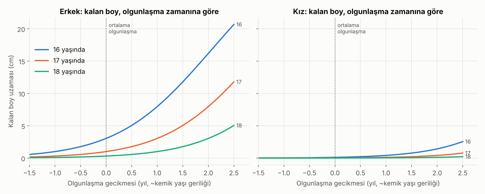
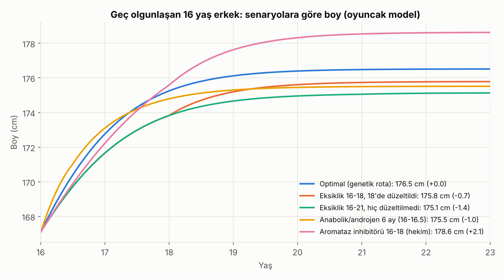
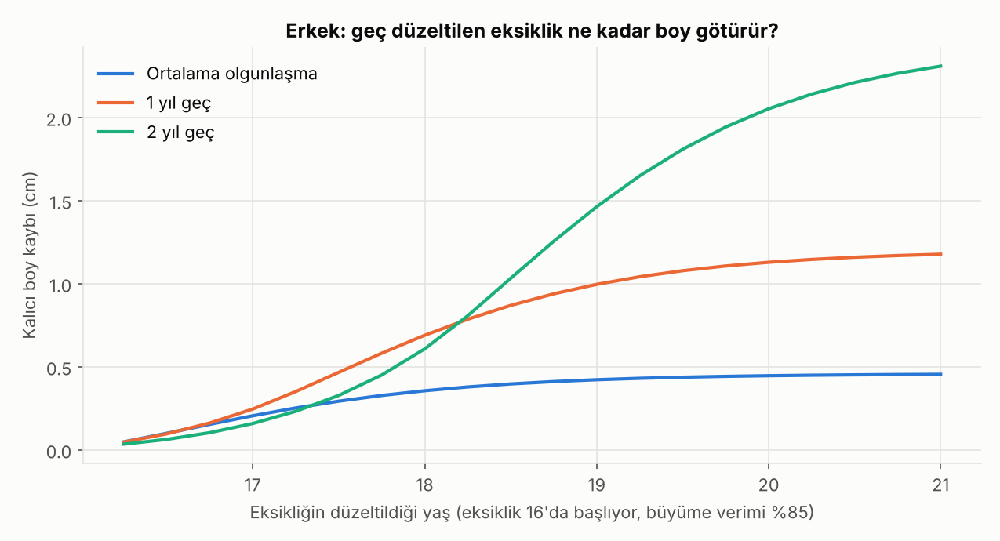

> **⚠ Bu eski bir sürüm (1).** Güncel sürüm: [2-gercek-veriyle-dogrulama](../2-gercek-veriyle-dogrulama/). Bu sürümdeki bazı hatalar orada düzeltildi (bkz. "Önceki sürümden değişenler"). İçerik, kayıt olarak değiştirilmeden bırakıldı.

# Boy Uzaması: 16-18 Yaş, Büyüme Plakları Açıkken Genetik Potansiyele Ulaşmak

> **Durum:** v1 · **Tarih:** 2026-10-07 · **Kapsam:** Büyüme plakları (epifiz) henüz kapanmamış 16, 17, 18 yaşındaki gençler. Amaç genetik tavanı *aşmak* değil, o tavana *eksiksiz ulaşmak*.
>
> Bu doküman tıbbi tavsiye değildir. Tıbbi seçenekler bölümündeki her şey yalnızca çocuk endokrinoloğu kararıyla ve takibiyle anlamlıdır.

---

## 0. Kısa versiyon: acı ama faydalı gerçekler

1. **Genetik tavan aşılmaz.** Beslenme, uyku, spor tavanı yükseltmez. Yaptıkları tek şey seni o tavandan *aşağıda tutan* frenleri kaldırmak. Boy varyansının yaklaşık %80'i genetik.
2. **"Plak açık" ile "çok boy kaldı" aynı şey değil.** Röntgende açık görünen bir plak yılda 0.2 cm de büyüyor olabilir, 6 cm de. Belirleyici olan iki şey var: **kemik yaşı** (biyolojik saat) ve **son 6-12 aydaki büyüme hızı**.
3. **Ortalama sayılar** (simülasyonumuz, plağı fonksiyonel olarak açık olanlarda, medyan):
   - Erkek 16 yaş: **~3 cm** kalan (%10'luk dilim ≥9 cm)
   - Erkek 17 yaş: **~1.4 cm**
   - Erkek 18 yaş: **~0.8 cm** (ve erkeklerin ancak ~%40'ının plağı hâlâ anlamlı büyüyor)
   - Kız 16 yaş: **~0.7 cm**. Kızların çoğunda büyüme 15-16 civarı biter, 16'da yalnızca ~%15'i hâlâ anlamlı büyüyor.
4. **Asıl değişken olgunlaşma zamanı.** Kemik yaşı 2 yıl geride olan 16 yaşındaki bir erkeğin önünde ~16 cm olabilir; ortalamada olanın önünde ~3 cm. Herkese tek bir cevap yok, bu yüzden önce **ölçmek** gerekiyor.
5. **En büyük kaldıraçlar** sırayla: (1) doğru ölçüm ve büyüme hızı takibi, (2) gizli bir freni yakalamak (çölyak, tiroid, kronik kalori açığı vb.), (3) zarar veren şeylerden uzak durmak (anabolik steroid, ciddi diyet), (4) yalnızca geç olgunlaşanlarda ve hekimle tıbbi seçenekler.

---

## 1. Analoji: Fabrika ve vardiya zili

Büyüme plağını bir **kemik üreten fabrika** gibi düşün:

| Gerçek | Fabrika karşılığı |
|---|---|
| Genetik | Fabrikanın makine sayısı ve **toplam üretim kotası** |
| Büyüme plağı (kondrositler) | Üretim bandı |
| GH / IGF-1, tiroid hormonu | Elektrik ve bandın hızı |
| Kalori, protein, mineraller | Hammadde |
| Uyku | Gece vardiyası (GH'nin büyük kısmı derin uykuda salınır) |
| **Östrojen** | **Vardiya bitiş zili.** Bandı önce hızlandırır, sonra kalıcı olarak kapatır |
| Kemik yaşı | Fabrikanın saati |

Bu analojiden çıkan üç sonuç:

- **Hammadde fazlası kotayı artırmaz.** Eksikse üretim düşer, fazlası depoda bekler. Protein tozunu ikiye katlamak boy eklemez, ama eksik proteinin tamamlanması ekler.
- **Zil saati kotadan daha önemli.** Erkeklerde de plakları kapatan testosteronun kendisi değil, testosterondan *aromataz* enzimiyle üretilen östrojendir. Östrojen reseptörü ya da aromataz geni bozuk erkekler 20'li yaşlarında bile uzamaya devam eder (Smith 1994; Morishima 1995). Yani **testosteron/anabolik kullanmak zili erken çaldırır.**
- **Fabrika durursa ve sebep hızlıca giderilirse telafi mümkün** (catch-up büyümesi). Ama zil çaldıktan sonra telafi imkânsız. Bu yüzden 16-18 yaşta zaman en kıt kaynak.

Bunun biyolojik karşılığı **büyüme plağı senesansı** hipotezi (Nilsson & Baron): plağın belli bir toplam bölünme kapasitesi var. Zamanla değil, *kullanıldıkça* tükeniyor, östrojen de tükenmeyi hızlandırıyor.

---

## 2. Ne kadar boy kaldı? (Simülasyon 1)

Preece-Baines büyüme modeliyle 200.000 sanal erkek ve 200.000 sanal kız oluşturduk. Erişkin boy, olgunlaşma zamanı ve eğri şekli kişiden kişiye değişiyor. Parametreler Türk/Avrupa referanslarına göre ayarlandı: erişkin boy erkek ~176.5 cm, kız ~163 cm, zirve büyüme hızı yaşı erkek ~13.9, kız ~11.6. "Plak fonksiyonel olarak açık" tanımı: o yaşta büyüme hızı ≥ 0.5 cm/yıl.

| Cinsiyet | Yaş | Plağı hâlâ anlamlı büyüyen | Açık olanlarda kalan boy (medyan) | %80 aralık | P(>2 cm) | P(>5 cm) |
|---|---|---|---|---|---|---|
| Erkek | 16 | %97 | 3.2 cm | 1.0 - 9.2 | %69 | %31 |
| Erkek | 17 | %79 | 1.4 cm | 0.6 - 4.1 | %33 | %7 |
| Erkek | 18 | %40 | 0.8 cm | 0.5 - 2.1 | %11 | %1 |
| Kız | 16 | %15 | 0.7 cm | 0.4 - 1.5 | %5 | ~0 |
| Kız | 17 | %2 | 0.6 cm | 0.4 - 1.1 | %1 | 0 |
| Kız | 18 | ~0 | - | - | - | - |



**Ortalama erkekte kalan boy, olgunlaşma gecikmesine göre:**

| Kemik yaşı geriliği | 16 yaşında | 17 yaşında | 18 yaşında |
|---|---|---|---|
| 0 (ortalama) | ~3 cm | ~1 cm | ~0.3 cm |
| 1 yıl geç | ~8 cm | ~3 cm | ~1 cm |
| 2 yıl geç | ~16 cm | ~8 cm | ~3 cm |

**Yorum:** "16 yaşındayım, plaklarım açık, ne yapmalıyım?" sorusunun cevabı büyük ölçüde senin olgunlaşma zamanına bağlı. Ortalamada olan bir erkek için oyun alanı birkaç cm; geç olgunlaşan için 10+ cm. Kızlarda 16 yaşında gerçekçi alan ~1 cm civarı. Menarştan (ilk adet) sonra ortalama ~7-8 cm büyüme var, büyük kısmı ilk 2 yılda oluyor.

---

## 3. Bilinen şeyler, kanıt düzeyiyle

"Bilinen şey" listeleri genelde hepsini aynı ağırlıkta sunuyor. Burada her birinin **ne kadar kanıtlı** olduğunu ve **kime fayda sağladığını** ayırdık.

| Konu | Mekanizma | Kanıt | Gerçekçi etki | Ne yapılmalı |
|---|---|---|---|---|
| **Enerji yeterliliği** (kronik kalori açığı olmaması) | Enerji açığında IGF-1 düşer, GH direnci gelişir, büyüme yavaşlar | Güçlü (anoreksiya, RED-S, sıklet sporları) | Açık varsa **en büyük düzeltilebilir fren** | 16-18'de "cut" diyeti yapma. Sıklet sporlarında kilo düşürmeye dikkat. Kilo/BMI düşüyorsa uyarı işareti |
| **Protein** | IGF-1 üretimi ve kemik matrisi için gerekli | Eksiklikte güçlü, yeterli alanda ek fayda yok | Eksiksen anlamlı, yeterliysen sıfır | ~1.0-1.5 g/kg/gün (aktif gençte). Daha fazlası boy için işe yaramaz |
| **Süt/süt ürünleri** | IGF-1 artışı, kalsiyum, protein | Gözlemsel ilişki var, RCT'ler çoğunlukla az beslenen çocuklarda | Yeterli beslenende küçük ya da belirsiz | Günde 2-3 porsiyon makul. Mucize değil |
| **Uyku** | GH'nin büyük pulsu ilk derin uyku evresinde | Mekanizma güçlü, nihai boya doğrudan etkisi zayıf (gözlemsel) | Kronik uykusuzluk zararlı, 10 saat yerine 12 saat uyumak ek fayda sağlamaz | 8-10 saat, düzenli saatler. Ekran/kafein geç saate kalmasın |
| **D vitamini / kalsiyum** | Kemik mineralizasyonu | Eksiklikte düzeltme gerekli. **Takviye boy uzatmaz** (Moğolistan RCT, 8.851 çocuk, 3 yıl: boya etkisi yok) | Eksiklik düzeltilirse kemik sağlığı, boy için ek etki yok | 25-OH-D ölç, düşükse düzelt |
| **Çinko, demir** | Büyüme ve hücre bölünmesi | Eksik toplumlarda çinko takviyesi büyümeyi az artırıyor | Sadece eksikse | Ferritin ve hemogram baktır |
| **Egzersiz** | Kemik yoğunluğu, GH artışı | Boy uzattığına dair kanıt yok. Basketbolcuların uzun olması seçilim etkisi | Boy: ~0. Genel sağlık: yüksek | Spor yap, ama boy için değil |
| **Ağırlık antrenmanı** | - | "Boy kısaltır" iddiası **mit**. Denetimli antrenman güvenli | 0 | Doğru teknik, makul yük, aşırı enerji açığı yok |
| **Duruş** | Omurga eğrisi, disk yüksekliği | Kemik değil, *ölçülen* boy | Kifozu düzeltmekle **1-2 cm görünür** boy | Sırt/core çalışması. Bu gerçek bir kazanç ama kemik uzaması değil |
| **Sigara, alkol, madde** | Genel büyüme ve hormon bozulması | Boy üzerine doğrudan etki kanıtı karışık, genel zararı net | Belirsiz | Uzak dur. Zaten zararlı |

**Ölçüm tuzağı:** Omurga diskleri gün içinde sıkışır, akşam boyun sabaha göre **1-2 cm kısa** ölçülür. "Bu ay 1.5 cm uzadım" ya da "kısaldım" demenin çoğu zaman sebebi ölçüm saatidir. Her zaman **sabah, aynı cihaz (stadiometre), çorapsız, 3 ölçümün ortalaması**.

---

## 4. Gizli frenler: taratılması gerekenler

16-18 yaşta *gerçekten* boy kazandıran senaryoların çoğu burada: fark edilmemiş bir sorun bulunur, düzeltilir ve plak hâlâ açıkken catch-up büyümesi olur.

| Durum | Neden önemli | Basit test |
|---|---|---|
| **Çölyak hastalığı** | Sık görülür (~%1), çoğu zaman sessiz seyreder, kısa boy tek bulgu olabilir | Doku transglutaminaz IgA + total IgA |
| **Hipotiroidi** | Büyümeyi ve kemik yaşını yavaşlatır | TSH, serbest T4 |
| **GH eksikliği / IGF-1 düşüklüğü** | Klasik ama nadir | IGF-1, IGFBP-3 (yoruma hekim) |
| **Demir eksikliği, kronik hastalık** | Genel büyüme freni | Hemogram, ferritin, biyokimya |
| **İnflamatuvar bağırsak hastalığı** | Kilo kaybı ve büyüme geriliği yapabilir | Belirtilere göre |
| **Turner sendromu (kızlarda)** | Kısa boylu her kızda düşünülmeli | Karyotip |
| **İlaçlar** | İnhale kortikosteroid (astım) erişkin boyda ~1 cm kayıpla ilişkili (Kelly 2012, NEJM). Uzun süreli DEHB uyarıcılarıyla birkaç cm fark bildiren çalışmalar var, konu tartışmalı | İlacı **kendi başına bırakma**, hekimle konuş |
| **Gecikmiş ergenlik** | Erkekte 14 yaşında testis büyümesi yoksa, kızda 13 yaşında meme gelişimi yoksa | Hekim muayenesi |

**Ne zaman çocuk endokrinoloğuna gidilmeli:** boy hedef boyun belirgin altındaysa (~2 SD), büyüme hızı yaşına göre düşükse, ergenlik gecikmişse, vücut oranları orantısızsa ya da kronik bağırsak şikâyeti varsa. Türkiye'de 18 yaşa kadar pediatrik endokrinolojiye başvurulabiliyor. **Bu yüzden 16-17 yaş, değerlendirme için son uygun pencere.**

---

## 5. Tıbbi seçenekler (yalnızca hekim kararıyla)

| Seçenek | Ne yapar | Kanıt | 16-18 yaşta gerçekçilik |
|---|---|---|---|
| **Büyüme hormonu (GH)** | Büyüme hızını artırır | İdiyopatik kısa boyda yıllarca tedaviyle erişkin boyda **ortalama ~4 cm** (Deodati & Cianfarani 2011, BMJ meta-analizi) | Düşük. Kazanç tedavi süresiyle orantılı ve 16-18'de kalan süre kısa. Pahalı, endikasyon dar (GH eksikliği, Turner vb.) |
| **Aromataz inhibitörleri** (letrozol, anastrozol) | Östrojen üretimini azaltır, "vardiya zilini" geciktirir | Gecikmiş ergenlikte testosteronla birlikte kullanıldığında erişkine yakın boy 175.8 cm, kontrolde 169.1 cm (Wickman 2001, Lancet; n=17). İdiyopatik kısa boyda monoterapi: 1. yıldaki tahmini kazanç 2-3. yılda **kaybolmuş** (2024). Bir çalışmada omur deformitesi sinyali görüldü, uzun takipte büyük ölçüde düzeldi | **Off-label.** Yalnızca erkekte ve kemik yaşı belirgin geride olanlarda tartışılabilir. Simülasyonumuz bu kazancın neden bu kadar kırılgan olduğunu gösteriyor (bkz. bölüm 8) |
| **Testosteron** (gecikmiş ergenlikte) | Ergenliği başlatır, büyümeyi *hızlandırır* | Nihai boyu artırmaz, sadece zamanı öne çeker | Psikososyal fayda için kullanılır, boy kazancı için değil |
| **GnRH analoğu** | Ergenliği durdurur | Bu yaşta boy için anlamlı değil | Yok |
| **Bacak uzatma cerrahisi** | Kemiği kesip yavaşça uzatır | Gerçekten çalışıyor (5-8 cm) | Plaklar kapandıktan sonra, ağır, aylar süren, komplikasyon riski yüksek bir operasyon. Bu araştırmanın kapsamı dışında, sadece "var" diye not ediyoruz |

---

## 6. Yeni ve araştırma aşamasındaki şeyler

| Gelişme | Durum (2026 itibarıyla) | Bize ne ifade ediyor |
|---|---|---|
| **Vosoritid** (CNP analoğu, büyüme plağındaki frenleyici FGFR3 sinyalini dengeler) | Akondroplazide onaylı. Hipokondroplazide faz 2: büyüme hızına **+1.8 cm/yıl**. İdiyopatik kısa boyda faz 2 devam ediyor (NCT06382155) | Normal varyant boyda henüz kanıt yok. İlk kez "genetik hastalığı olmayan kısa boy" için CNP yolu deneniyor, sonuçları izlenmeli |
| **İnfigratinib** (oral FGFR3 inhibitörü) | Akondroplazide faz 3 (PROPEL 3) pozitif: **+1.74 cm/yıl**, NEJM 2026 | Ağızdan alınan bir büyüme plağı ilacı. Şimdilik sadece akondroplazide |
| **Genetik tanı (ekzom)** | Kısa boylu seçilmiş hastalarda tek gen nedenleri azımsanmayacak oranda bulunuyor: ACAN, SHOX, NPR2, IHH vb. | Özellikle **ACAN** mutasyonu kemik yaşını ilerletir ve plakları erken kapatır. Ailede "hep kısayız ve erken bitiyor" öyküsü varsa genetik test anlamlı |
| **Poligenik skor** | 12.111 varyant, Avrupa kökenlilerde boy varyansının %40'ını, diğer kökenlerde **%10-20'sini** açıklıyor (Yengo 2022, Nature) | Türk popülasyonunda bireysel karar aracı olarak **henüz yetersiz**. Anne-baba boyu hâlâ daha iyi bir tahminci |
| **Yapay zekâ ile kemik yaşı** (BoneXpert vb.) | Klinikte kullanımda | İnsan okuyucuya göre daha tekrarlanabilir. Bölüm 2'deki "ne kadar kaldı" sorusunu daha keskin cevaplar |
| **Plak senesansı biyolojisi** | Temel bilim | Gelecekte "zili" ertelemek yerine "kotayı" korumaya yönelik tedaviler gelebilir. Henüz klinikte yok |

---

## 7. Mitler ve zararlılar

| İddia | Gerçek |
|---|---|
| Asılmak/germe boy uzatır | Kemik uzamaz. Diskler geçici olarak açılır, birkaç saat içinde geri döner |
| "Boy uzatma hapları", bitkisel takviyeler | Kontrollü kanıt yok. Çoğu vitamin karışımı ya da pazarlama |
| **MK-677 (ibutamoren), GH salgılatıcı peptitler, karaborsa GH** | Onaysız. IGF-1'i yükseltir ama ergende boy kanıtı yok. İnsülin direnci, ödem gibi riskleri var, ürün içeriği belirsiz. **Yapma** |
| **Anabolik steroid, SARM, yüksek doz testosteron** | **Boyu kısaltır.** Aromatize olup östrojene dönüşür ve plakları erken kapatır. 16-18'de en somut kalıcı boy kaybı sebebi |
| Arginin, ornitin gibi amino asitler | GH'yi geçici artırır. Boy etkisi gösterilmemiş |
| Basketbol/voleybol oynamak boy uzatır | Seçilim yanılgısı: uzunlar bu sporlara seçiliyor |

---

## 8. Simülasyon: bizim katkımız

Kod: [`simulasyon/`](simulasyon/). Çalıştırmak için:

```bash
cd simulasyon
pip install -r requirements.txt
python calistir.py          # tüm grafik ve tabloları ciktilar/ altına üretir
python kisisel_tahmin.py --cinsiyet erkek --yas 16.5 --boy 171 --anne 162 --baba 178 \
       --onceki-yas 15.5 --onceki-boy 168
```

### Model

Preece-Baines Model 1 kişinin **genetik rotasını** (optimal koşullardaki eğrisini) verir. Üstüne bir dinamik katman ekledik ve çevreyi iki ayrı düğmeye böldük:

- **r: biyolojik saatin hızı** (kemik yaşı ne hızla ilerliyor, zil ne zaman çalacak)
- **m: büyüme verimi** (biyolojik saatin birimi başına ne kadar büyüme oluyor)
- **Catch-up:** sorun giderilince kişinin kendi rotasındaki açığı, plak açıklığıyla orantılı bir hızla kapatma

Bu ayrımın sebebi şu: bir müdahalenin nihai boya etkisi "büyümeyi mi yavaşlatıyor, saati mi yavaşlatıyor, yoksa ikisini birden mi" sorusuna bağlı. Literatürdeki karmaşık görünen sonuçların çoğu bu çerçeveyle açıklanabiliyor.

### Bulgu 1: Kalan boy, olgunlaşma zamanına üstel bağlı
Bölüm 2. "Ne yapmalıyım" sorusundan önce gelen soru: "saatim nerede?"

### Bulgu 2: Yaşam tarzı eksikliğinin bedeli küçük ama gerçek, ve zamana bağlı



Geç olgunlaşan 16 yaşında bir erkek (16 yaşında 167 cm, 7.5 cm/yıl hızla uzuyor, rotası 176.5 cm):

| Senaryo | Nihai boy | Fark |
|---|---|---|
| Optimal | 176.5 | 0 |
| %15 büyüme eksikliği 16-18, 18'de düzeltildi | 175.8 | **-0.7** |
| Aynı eksiklik hiç düzeltilmedi | 175.1 | **-1.4** |
| 6 ay anabolik/androjen (16-16.5) | 175.5 | **-1.0** |
| Aromataz inhibitörü 16-18 (hekim, varsayımsal parametre) | 178.6 | **+2.1** |



**Ders:** Ortalama olgunlaşan bir erkekte kronik eksikliğin bedeli ~0.5 cm ile sınırlı, çünkü zaten az boy kalmış. **Geç olgunlaşanlarda hem risk hem fırsat daha büyük:** 2 yıl geç olgunlaşan biri eksikliği 21 yaşına kadar düzeltmezse ~2.3 cm kaybediyor, 17'de düzeltirse ~0.2 cm. Erken düzeltmek, catch-up için plak açıkken zaman kazandırıyor.

Duyarlılık analizi (`ciktilar/4_duyarlilik.csv`): bilmediğimiz parametreleri (eksikliğin kemik yaşını ne kadar yavaşlattığı ve catch-up hızı) geniş aralıkta değiştirdik. "18'de düzeltildi" senaryosunda kayıp **0.4 ile 1.1 cm** arasında oynuyor, "hiç düzeltilmedi" senaryosunda ~1.4 cm'de sabit kalıyor. Sonuç yön olarak sağlam, büyüklük olarak belirsiz.

### Bulgu 3: Aromataz inhibitörünün kazancı neden bu kadar kırılgan?

`ciktilar/5_aromataz_duyarlilik.csv`: AI kemik yaşının ilerleyişini yavaşlatıyor (r). Ama östrojen ergenlikteki GH artışına da katkı verdiği için büyüme hızını da düşürebiliyor (q = takvim yaşına göre büyüme hızının normale oranı).

- **Net kazanç ancak q > r ise var:** büyüme hızı, kemik yaşından *daha az* yavaşlamalı.
- Geç olgunlaşan erkekte sonuç **-1.2 cm ile +4.5 cm** arasında, ortalamada olanda **-0.7 ile +1.6 cm** arasında değişiyor.
- Bu, gerçek çalışmalardaki tabloyla örtüşüyor: bazı çalışmalarda ~5-7 cm kazanç, bazılarında (monoterapi, idiyopatik kısa boy) 1. yıldaki kazancın kaybolması. Bu ilacın etkisi kişiye ve ana bağlı, ve 16-18 yaşta ortalama bir genç için beklenen değer küçük.

### Kişisel tahmin aracı

`kisisel_tahmin.py` 400.000 sanal genç üretiyor ve senin ölçümlerine (boy, anne-baba boyu, kemik yaşı, önceki ölçüm) en çok uyanları ağırlıklandırarak kalan boy dağılımını veriyor. Örnek (erkek, 16.5 yaş, 171 cm, anne 162, baba 178):

| Ek bilgi | Kalan boy (medyan, %80 aralık) |
|---|---|
| Sadece boy ve yaş | 2.0 cm (0.5 - 5.9) |
| + aile + son 1 yılda 6 cm uzamış | 4.1 cm (2.9 - 6.0) |
| + aile + son 1 yılda 0.8 cm uzamış | 0.5 cm (0.2 - 1.0) |

**Aynı genç, aynı boy:** son bir yıldaki hız tahmini 8 kat değiştiriyor. Bu yüzden 6-12 aylık düzenli ölçüm, herhangi bir takviyeden daha değerli.

### Sınırlamalar (açıkça)

- Preece-Baines parametreleri bireysel veriye fit edilmedi, yayımlanmış özet istatistiklere elle ayarlandı. Model büyümenin kuyruğunu (18 sonrası) biraz eksik tahmin ediyor olabilir. Gerçek hayatta birçok erkek 18'den sonra ~1 cm daha uzuyor. Kızlarda geç büyüme de muhtemelen ~1 cm kadar eksik tahmin ediliyor.
- Dinamik katmanın sayısal parametreleri (eksikliğin büyümeye ve kemik yaşına etkisi, catch-up hızı, AI'nin r ve q değerleri) **ölçülmüş değil, varsayım**. Model mekanizmayı ve büyüklük sırasını gösteriyor, kesin cm vaat etmiyor.
- Hastalıklar, sendromlar ve tek gen bozuklukları modelde yok.
- Popülasyon dağılımları normal dağılım varsayıyor. Uçlarda (çok geç, çok kısa) güvenilirlik düşüyor. Araç bu durumda "etkin örnek sayısı düşük" uyarısı veriyor.

---

## 9. Pratik yol haritası (16-18 yaş)

1. **Ölç:** Sabah, stadiometrede, 3 ölçümün ortalaması. Tarihle bir yere yaz. 6 ay sonra tekrarla.
2. **Hızı hesapla:** (yeni boy - eski boy) / geçen süre (yıl).
   - **< 1 cm/yıl:** büyük ölçüde bitmiş. Kazanç ancak duruşla (görünür boy) mümkün.
   - **1-3 cm/yıl:** son evre. Birkaç cm kalmış olabilir.
   - **> 3 cm/yıl (16+ yaş):** geç olgunlaşma ihtimali yüksek. **Önünde gerçek bir pencere var**, bu pencereyi korumak öncelik.
3. **Hedef boyunu hesapla:** erkek (anne + baba + 13) / 2, kız (anne + baba - 13) / 2, aralık ±8.5 cm. Belirgin altındaysan ya da hız yaşına göre düşükse → çocuk endokrinoloğu (18 yaşından önce).
4. **Kan tahlili** (hekim istemiyle): hemogram, ferritin, TSH/sT4, çölyak (tTG-IgA + total IgA), 25-OH-D, IGF-1, biyokimya.
5. **Temeller:** kalori açığı yok, protein yeterli, 8-10 saat düzenli uyku, eksik vitamin/mineral varsa düzeltme.
6. **Kaçın:** anabolik steroid, SARM, MK-677 ve benzerleri, sert diyet, ilaçları hekimsiz bırakmak.
7. **Duruş çalışması:** gerçek ve ölçülebilir 1-2 cm, bedava.
8. **Aracı kullan:** `python simulasyon/kisisel_tahmin.py ...` ile beklentini sayıya dök. Mucize bekleme, ama fırsatı da kaçırma.

---

## 10. Kaynaklar

Bağlantısı olanlar bu araştırma sırasında kontrol edildi. Bağlantısız klasik kaynaklar alanda yerleşik çalışmalar, künyeleri kontrol edilmeli.

**Büyüme modeli ve referanslar**
- Preece MA, Baines MJ. A new family of mathematical models describing the human growth curve. *Ann Hum Biol* 1978.
- Neyzi O ve ark. Türk çocukları için boy/kilo referansları (2015) · [Z-Score Reference Values for Height in Turkish Children 6-18](https://www.ncbi.nlm.nih.gov/pmc/articles/PMC3986736/)
- [Timing of menarche and pubertal growth patterns using the QEPS growth model (2024)](https://www.ncbi.nlm.nih.gov/pmc/articles/PMC11357948/) · [Post-menarche height growth (Iran J Pediatr)](https://brieflands.com/articles/ijp-153696)
- Hermanussen M, Cole TJ. The calculation of target height reconsidered. *Horm Res* 2003.

**Genetik**
- Yengo L ve ark. A saturated map of common genetic variants associated with human height. *Nature* 2022 · [PDF](https://handls.nih.gov/pubs/2022-Yengo-Nature-epub.pdf)

**Östrojen ve plak kapanması**
- Smith EP ve ark. Estrogen resistance caused by a mutation in the estrogen-receptor gene in a man. *NEJM* 1994.
- Morishima A ve ark. Aromatase deficiency in male and female siblings. *JCEM* 1995.
- Nilsson O, Baron J. Growth plate senescence (derleme serisi).

**Tıbbi tedaviler**
- Deodati A, Cianfarani S. Impact of growth hormone therapy on adult height of children with idiopathic short stature: systematic review. *BMJ* 2011 · [özet](https://art.torvergata.it/handle/2108/79199)
- Wickman S ve ark. A specific aromatase inhibitor and potential increase in adult height in boys with delayed puberty. *Lancet* 2001.
- [Letrozole Monotherapy in Pre- and Early-Pubertal Boys Does Not Increase Adult Height (Front Endocrinol 2019)](https://www.ncbi.nlm.nih.gov/pmc/articles/PMC6460933/)
- [Aromatase Inhibitor Monotherapy to Augment Height in Boys: Does It Work and Is It Safe? (2024)](https://www.ncbi.nlm.nih.gov/pmc/articles/PMC11574611/)

**Yeni tedaviler**
- [Vosoritide - idiyopatik kısa boy faz 2 (NCT06382155)](https://clinicaltrials.gov/study/NCT06382155) · [Hipokondroplazi faz 2 sonucu](https://innovationdistrict.childrensnational.org/?p=15289)
- [İnfigratinib PROPEL 3 faz 3 (BridgeBio)](https://www.barchart.com/story/news/179850/bridgebio-reports-positive-phase-3-topline-results-for-oral-infigratinib-with-the-first-statistically-significant-improvements-in-body-proportionality-in-achondroplasia) · [NEJM yayını duyurusu](https://www.barchart.com/story/news/3024738/bridgebio-announces-publication-in-the-new-england-journal-of-medicine-of-phase-3-propel-3-trial-of-oral-infigratinib-in-children-living-with-achondroplasia)

**Beslenme ve yaşam tarzı**
- [Vitamin D supplementation does not influence growth in children (Moğolistan RCT, JAMA Pediatrics)](https://www.healthday.com/healthpro-news/child-health/vitamin-d-supplementation-does-not-influence-growth-in-children-2658771710.html) · [Cochrane CD012875](https://cochranelibrary.com/cdsr/doi/10.1002/14651858.CD012875.pub2)
- de Beer H. Dairy products and physical stature: a systematic review and meta-analysis of controlled trials. *Econ Hum Biol* 2012.
- Kelly HW ve ark. Effect of inhaled glucocorticoids in childhood on adult height. *NEJM* 2012.
- Swanson JM ve ark. Young adult outcomes in the follow-up of the MTA: height. *J Child Psychol Psychiatry* 2017.
- [Anabolik steroidler ve ergenlik (AAP özeti)](https://www.ojp.gov/ncjrs/virtual-library/abstracts/adolescents-and-anabolic-steroids-subject-review-re9720)
