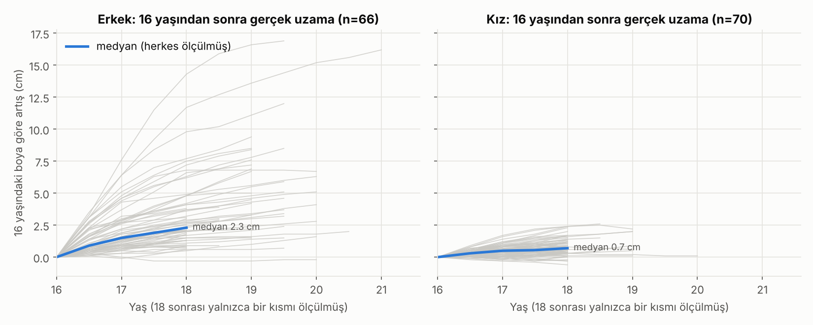
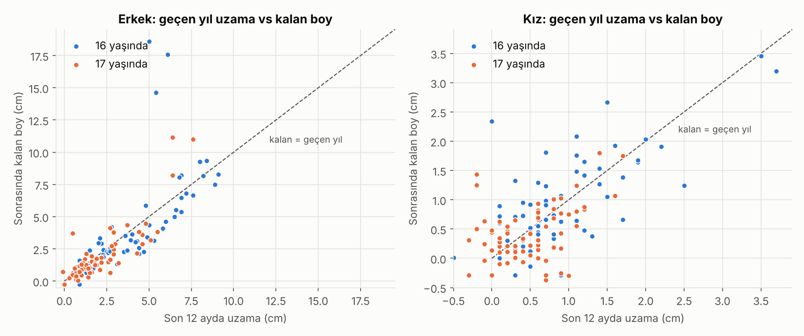
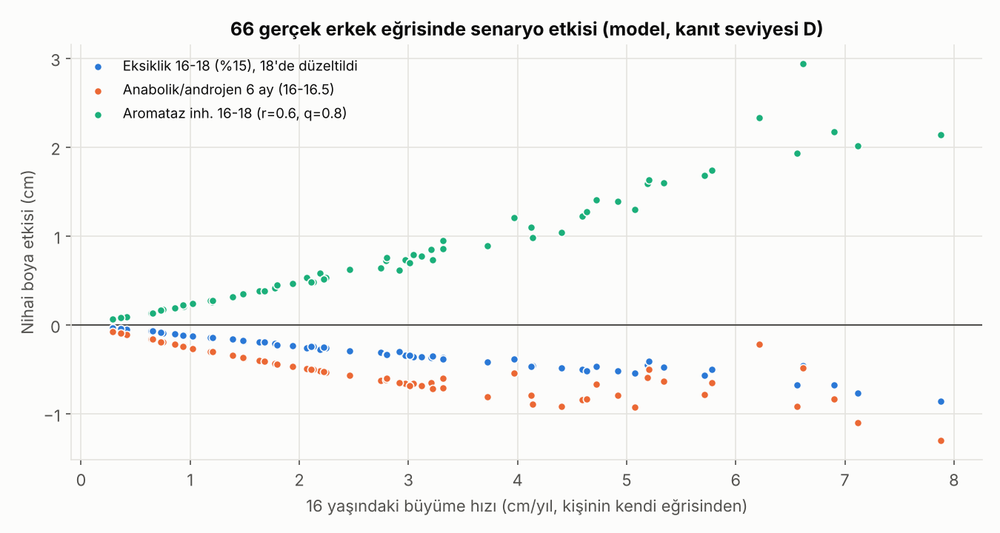

# Boy Uzaması 16-18 Yaş · Sürüm 2: Gerçek Veriyle Doğrulama

> **Sürüm:** 2 · **Tarih:** 2026-10-07 · **Önceki sürüm:** [1-ilk-tarama](../1-ilk-tarama/) · **Durum:** güncel
>
> **Acelen varsa:** en alttaki [En basit özet](#en-basit-özet) bölümüne atla.
>
> Bu doküman tıbbi tavsiye değildir. Bot korumalı sitelerin bağlantıları (BMJ, Cochrane, Karger vb.) otomatik kontrolde 403 verebilir; bunlar arama motoru üzerinden doğrulandı. İlaç ve tedavi geçen her satır yalnızca çocuk endokrinoloğu kararıyla anlamlıdır.

**Kanıt seviyeleri** (her iddianın yanında):

| Etiket | Anlamı |
|---|---|
| **A** | Meta-analiz ya da birden çok randomize kontrollü çalışma (RCT) |
| **B** | Tek RCT ya da büyük, iyi tasarlanmış kohort |
| **C** | Gözlemsel çalışma, vaka serisi, vaka raporu, mekanizma |
| **V** | Bu çalışmanın kendi gerçek veri analizi (Berkeley, n=136, tek tarihsel kohort) |
| **D** | Model çıktısı ya da varsayım. Yön gösterir, kesin sayı vermez |

---

## Soru ve kapsam

**Soru:** Büyüme plakları henüz kapanmamış 16, 17, 18 yaşındaki bir genç, genetik boy potansiyeline eksiksiz ulaşmak için ne yapabilir? Önünde gerçekte ne kadar boy var ve bunu nasıl öğrenebilir?

**Kapsam:** Sağlıklı gençler. Genetik tavanı aşmak kapsam dışı (mümkün de değil). Bacak uzatma cerrahisi kapsam dışı.

**Sürüm 2'nin amacı:** v1'deki tahminleri **gerçek ölçüm verisiyle** sınamak, v1'in elle ayarlanmış modelini veriye dayalı hale getirmek, v1'deki kaynak hatalarını düzeltmek ve pratik, test edilmiş bir kural çıkarmak.

---

## Önceki sürümden değişenler

| # | v1'de | v2'de | Neden |
|---|---|---|---|
| 1 | Model parametreleri yayımlanmış özet istatistiklere **elle** ayarlanmıştı | 136 gerçek bireyin büyüme eğrisine **tek tek fit** edildi | Elle ayar yanlılığa açık |
| 2 | Hiçbir sonuç gerçek veriyle sınanmamıştı | Kalan boy, hız kuralı ve tahmin aracı gerçek veride doğrulandı | v1'in ana sonucu tutuyor mu, görmek gerekiyordu |
| 3 | Kızlar için "16 yaşında yalnızca ~%15'i hâlâ büyüyor" | Gerçek veride kızların büyük çoğunluğu 16→18 arası **biraz** daha uzuyor (medyan 0.7 cm) | v1 modeli kızlarda büyümenin kuyruğunu fazla keskin kesiyordu (v1 sınırlamalarında da belirtilmişti) |
| 4 | "175.8'e karşı 169.1 cm (Wickman 2001, n=17)" | Bu sonuç **Hero 2006**'ya ait. Wickman 2001: 23 erkek, tahmini erişkin boyda +5.1 cm | Kaynak karışıklığı, düzeltildi |
| 5 | DEHB uyarıcıları için "birkaç cm" | MTA çalışması: düzenli kullananlar düzensiz kullananlardan **2.36 cm** kısa (gözlemsel) | Belirsiz ifade, kesin sayıyla değiştirildi |
| 6 | D vitamini RCT'si genel ifadeyle anılmıştı | Çalışmanın **6-13 yaş** çocuklarda yapıldığı belirtildi | Yaş grubu farklı, genelleme sınırlı |
| 7 | Bazı kaynaklar "kontrol edilmeli" notuyla kalmıştı | Hepsi açılıp kontrol edildi. Doğrulanamayan tek sayı (süt meta-analizi) metinden çıkarıldı | Yeni kaynak kuralı |
| 8 | Senaryolar tek bir sanal kişide gösterilmişti | 64 gerçek erkek eğrisinde dağılım olarak gösterildi | Tek örnek yanıltıcı olabilir |
| 9 | Ölçüm hatası sadece metinde geçiyordu | Sayısal analiz: hangi ölçüm aralığı ne kadar yanılttığı | Pratikte en sık hata kaynağı |

**v1'in ana sonucu tuttu:** v1 "ortalama 16 yaş erkekte ~3 cm kaldı" demişti. Gerçek veride 16→18 arası medyan 2.3 cm, artı 18 sonrası ~0.8 cm, yani ~3 cm.

---

## Yöntem

### Veri

**Berkeley Child Guidance Study:** 66 erkek, 70 kız. 1928-29 doğumlu, Kaliforniya'da yaşayan, kuzey Avrupa kökenli çocuklar. Doğumdan itibaren, 8-18 yaş arası **6 ayda bir** ölçülmüşler. 18 yaşına kadar herkes ölçülmüş, 41 erkek ve 11 kız 18 yaşından sonra da ölçülmüş. Kaynak: Tuddenham & Snyder (1954). Veri, CRAN'daki `sitar` paketinden indiriliyor (SHA-256 doğrulamalı, ham veri repoya konmadı).

**Bu verinin zayıf yanları:**
- Yaklaşık 100 yıl önce doğmuş bir kohort.
- Türk değil.
- Ortalama erişkin boyları bugünkü Türk ortalamasından yüksek: erkek 179.8, kız 166.4 cm. Türkiye referansı ~177 / 163 cm.

**Bu verinin güçlü yanları:**
- Bugün halka açık ve 16-21 yaşı **sık aralıkla** kapsayan çok az uzunlamasına veri var. Bu onlardan biri.
- Olgunlaşma zamanlaması bugünle benzer. Zirve büyüme hızı yaşı erkekte 13.4 ± 1.4, kızda 11.3 ± 0.9. Bugünkü İstanbul kızlarında menarş medyanı 12.0 yaş.
- En önemlisi: aşağıdaki **hız kuralı zamanlamadan bağımsız** çalışıyor, bu yüzden kohort farkından az etkileniyor.

### Analizler

| Kod | Ne yapıldı | Kanıt seviyesi |
|---|---|---|
| A | Preece-Baines (PB1) büyüme modeli her bireye ayrı ayrı fit edildi | V |
| B | 16, 17, 18 yaşından sonra gerçekte ne kadar uzandığı, **modelsiz** doğrudan ölçümden | V |
| C | "Son 12 ayda uzama → kalan boy" kuralı test edildi, bir kısmı tamamen modelsiz | V |
| D | Ölçüm hatasının hız hesabını ne kadar bozduğu (analitik + 133 gerçek eğri üzerinde simülasyon) | V + D |
| E | Kişisel tahmin aracı, birini-dışarıda-bırak (LOO) yöntemiyle: her kişi, diğerlerinden öğrenen modelle tahmin edildi | V |
| F | Eksiklik, anabolik ve aromataz senaryoları 64 gerçek erkek eğrisi üzerinde | **D** (varsayım parametreleri) |

**Uyum kalitesi (A):** PB1 gerçek ölçümlere ortalama 0.4-0.6 cm hatayla oturuyor (medyan RMSE erkek 0.59, kız 0.43 cm). Bu, ölçüm hatası düzeyine yakın. 3 bireyin fiti güvenilmez bulundu (zirve büyüme yaşı veri penceresi dışında ya da RMSE > 1.1) ve önselden çıkarıldı. Kalan 64 erkek ve 69 kız kullanıldı.

---

## Bulgular

### 4.1 Gerçek insanlar 16 yaşından sonra ne kadar uzadı? (V)



| Cinsiyet | Aralık | n | Medyan | %10 - %90 | En fazla | 2 cm'den fazla uzayan |
|---|---|---|---|---|---|---|
| Erkek | 16 → 18 | 66 | **2.3 cm** | 0.85 - 6.7 | 14.3 | %58 |
| Erkek | 16.5 → 18 | 66 | 1.6 cm | 0.5 - 4.25 | 11.0 | %29 |
| Erkek | 17 → 18 | 66 | **0.85 cm** | 0.25 - 2.15 | 6.7 | %12 |
| Erkek | 17.5 → 18 | 66 | 0.4 cm | 0.0 - 1.0 | 2.8 | %3 |
| Erkek | 18 → ~19.3 (son ölçüm) | 41 | **0.8 cm** | 0.1 - 2.1 | 4.5 | %12 |
| Kız | 16 → 18 | 70 | **0.7 cm** | 0.1 - 1.7 | 2.4 | %6 |
| Kız | 17 → 18 | 70 | 0.3 cm | -0.1 - 0.8 | 1.4 | 0 |
| Kız | 18 → ~19 (son ölçüm) | 11 | 0.2 cm | -0.2 - 0.3 | 0.4 | 0 |

**Okuma:**
- Erkeklerde ortalama bir genç için 16 yaşından sonra **~3 cm** kalıyor (2.3 + ~0.8). Ama dağılım çok geniş: her 10 kişiden biri 16-18 arası 6.7 cm'den fazla uzamış, biri 14 cm uzamış.
- Kızlarda 16 yaşından sonra kalan neredeyse her zaman **2 cm'nin altında**. Kızların 17-18 arası ölçümlerinde negatif değerler görülüyor; bu ölçüm hatasının gerçek büyümeden büyük olduğunu gösteriyor (bkz. 4.4).
- 18 sonrası ölçülen erkekler seçilmiş bir alt grup: geç bitenler takipte kalmış olabilir. Bu yüzden 0.8 cm biraz iyimser olabilir.

### 4.2 Model 18 sonrasını yarı yarıya eksik tahmin ediyor (V)

18 sonrası ölçülen 41 erkekte, aynı zaman penceresinde gerçek uzama medyanı **0.80 cm**, PB1 modelinin tahmini **0.43 cm**. Yani klasik büyüme modeli büyümenin son kuyruğunu küçümsüyor.

**Sonuç:** Model tabanlı tüm tahminler (v1 dahil) erkeklerde kalan boyu ~0.5 cm kadar eksik tahmin ediyor olabilir. Bu yüzden bu sürümde **modelsiz kural** öne çıkarıldı.

### 4.3 Hız kuralı: "Geçen yıl ne kadar uzadıysan, önünde aşağı yukarı o kadar var" (V)



Her kişi için son 12 aydaki uzama ile sonrasında kalan toplam boy karşılaştırıldı. Kalan boy = 18'e kadar ölçülen + 18 sonrası tahmini. Katsayı, regresyonun (sıfırdan geçen doğru) eğimi.

| Cinsiyet | Yaş | Katsayı (kalan ÷ geçen yıl) | Korelasyon | Kural hatası (ort.) | "Herkese ortalama" hatası |
|---|---|---|---|---|---|
| Erkek | 16 | **1.04** | 0.69 | 1.4 cm | 2.3 cm |
| Erkek | 17 | **0.99** | 0.85 | 0.8 cm | 1.2 cm |
| Kız | 16 | **0.91** | 0.70 | 0.4 cm | 0.6 cm |
| Kız | 17 | 0.66 | 0.41 | 0.3 cm | 0.4 cm |

**Tamamen modelsiz kontrol:** 19.5 yaşından sonra da ölçülmüş 21 erkekte, kalan boy doğrudan son ölçümden hesaplandığında katsayı **16 yaşında 1.21, 17 yaşında 1.00** (r = 0.58 ve 0.87). 19 yaşından sonra ölçülmüş 35 erkekte 1.07 ve 0.93. Bu, kuralın model artefaktı olmadığını gösteriyor. Model 4.2'deki gibi kuyruğu küçümsediği için gerçek katsayı 1'in biraz üstünde olabilir.

**Kural:**
- **Erkek:** kalan boy ≈ son 12 ayda uzadığın kadar (×1.0). Tipik sapma 16 yaşında yaklaşık -1.9 ile +1.0 cm, 17 yaşında -1.2 ile +0.8 cm arası (%10-%90).
- **Kız:** kalan boy ≈ son 12 aydaki uzamanın ~0.9 katı (16 yaşında). 17 yaşında kural zayıflıyor, çünkü büyüme ölçüm hatasının içinde kayboluyor.

**Neden önemli:** Kemik yaşı röntgeni, hormon tahlili ya da model gerektirmiyor. Sadece **doğru ölçülmüş iki boy** ve bir yıl gerekiyor. Ve olgunlaşma zamanından bağımsız: erken ya da geç olgunlaşan herkes için aynı kural çalışıyor.

### 4.4 Ölçüm hatası: en sık yapılan hata (V + D)

**Tek ölçüm hatası büyüme hızına nasıl yansıyor** (hız hatası = ölçüm hatası × √2 ÷ aralık):

| Ölçüm koşulu | Tek ölçüm hatası (SD) | 3 ay arayla hız hatası | 6 ay | 12 ay |
|---|---|---|---|---|
| Dikkatli: sabah, stadiometre, 3 ölçüm ortalaması | 0.3 cm | ±1.7 cm/yıl | ±0.85 | **±0.42** |
| Tek ölçüm, stadiometre | 0.5 cm | ±2.8 | ±1.4 | ±0.7 |
| Günün herhangi saati, duvara işaret | 0.65 cm | ±3.7 | ±1.8 | ±0.9 |

**Gerçek eğrilerde karar hatası** (17 yaşında "hâlâ yılda 1 cm'den fazla uzuyor muyum?" sorusuna yanlış cevap verme oranı):

| Ölçüm koşulu | 6 ay arayla | 12 ay arayla |
|---|---|---|
| Dikkatli | erkek %21 · kız %20 | erkek **%10** · kız **%8** |
| Tek ölçüm | erkek %27 · kız %30 | erkek %16 · kız %17 |
| Saat kontrolsüz | erkek %31 · kız %34 | erkek %19 · kız %23 |

**Gerçek veriden kanıt:** Berkeley'de profesyonel ölçümlerde bile 16.5-18 yaş arası 6 aylık artışların kızlarda **%14'ü negatif** (erkeklerde %2). İnsanlar kısalmıyor; ölçüm hatası, o yaştaki büyümeden büyük.

**Ek veri:** Gün içinde omurga diskleri sıkışıyor. Sabahtan akşama boy ortalama **~1.4 cm** kısalıyor (C, BJSM). Kemik yaşı okumada okuyucular arası fark SD ~0.4 yıl (C).

**Kural:** Boyunu **sabah, aynı stadiometrede, 3 ölçümün ortalaması** olarak al ve hızı **en az 12 ay arayla** hesapla. 3 aylık ölçümlerle "uzadım/uzamadım" demek yazı turadan biraz iyi.

### 4.5 Kişisel tahmin aracı gerçek veride ne kadar iyi? (V)

`analiz/kisisel_tahmin.py`, v1'deki aracın gerçek veri önselli hali. LOO doğrulamasında her kişi, **onu görmemiş** bir modelle tahmin edildi. Hedef 18 yaşındaki gerçek boy.

| Kim / ne zaman | "Büyüme bitti" varsay | Sadece şimdiki boy | Basit kural (geçen yıl × k) | Araç (boy + geçen yıl) |
|---|---|---|---|---|
| Erkek, 16 | 3.2 cm hata | 1.8 | **1.0** | 1.1 |
| Erkek, 17 | 1.1 | 0.7 | 0.5 | **0.4** |
| Kız, 16 | 0.8 | 0.55 | **0.4** | 0.5 |
| Kız, 17 | 0.4 | 0.3 | **0.3** | 0.3 |

(Ortalama mutlak hata, cm.)

- **Geçen yılın uzaması, şimdiki boydan çok daha bilgilendirici.** 16 yaşındaki erkekte hata 1.8 cm'den 1.0-1.1 cm'ye iniyor.
- **Basit kural, karmaşık araç kadar iyi.** Kafadan hesaplanabilen bir kural, olasılıksal modelle aynı doğrulukta.
- Aracın **%80 güven aralıkları** gerçek değeri %86-97 oranında kapsıyor. Yani araç biraz temkinli: aralıklar olması gerekenden geniş ama yanıltmıyor.
- *Şeffaflık notu:* Bu doğrulamanın ilk çalıştırmasında kapsama oranı %1.5 çıktı. Sebep bir veri tipi hatasıydı, düzeltildi. Tutarsız görünen sonucu sorgulama kuralı bu hatayı yakaladı.

### 4.6 Senaryolar 64 gerçek erkek eğrisinde (D, model)



Model katmanı v1 ile aynı (bkz. `analiz/model.py`). Fark şu: senaryolar artık tek sanal kişide değil, 64 gerçek büyüme eğrisinin her birinde çalıştırıldı.

| Senaryo (16 yaşında başlıyor) | Medyan etki | %10 - %90 | En uç |
|---|---|---|---|
| 2 yıl %15 büyüme eksikliği (kalori/protein/uyku/hastalık), 18'de düzeltildi | **-0.3 cm** | -0.5 ile -0.1 | -0.9 |
| 6 ay anabolik steroid / yüksek doz androjen | **-0.5 cm** | -0.8 ile -0.2 | -1.3 |
| Aromataz inhibitörü 2 yıl (r=0.6, q=0.8, varsayım) | **+0.6 cm** | +0.2 ile +1.7 | +2.9 |

**Grafikteki asıl ders:** Etkinin büyüklüğü **16 yaşındaki büyüme hızıyla doğru orantılı.** Yılda 1 cm uzayan biri için her şey (iyi de kötü de) ±0.3 cm. Yılda 6-8 cm uzayan biri için ±1-3 cm. Yani:
- Hâlâ hızlı uzayan biri için kaybedecek de kazanılacak da **gerçek** bir şey var.
- Neredeyse durmuş biri için hiçbir müdahalenin anlamlı etkisi yok.

**Varsayım duyarlılığı:**
- Eksiklik senaryosunun bilinmeyen parametreleri geniş aralıkta değiştirildiğinde medyan kayıp -0.21 ile -0.34 cm arasında kalıyor. Yön sağlam.
- Aromataz inhibitöründe sonuç, ilacın büyüme hızını ne kadar düşürdüğüne aşırı duyarlı. Kemik yaşı %60 hızla ilerlerken büyüme hızı da %60'a düşerse kazanç **sıfır**. Hızlı büyüyenlerde en iyimser varsayımla medyan +2.8 cm. Bu, literatürdeki karışık tabloyu açıklıyor (bkz. 5.3).

---

## Literatür: ne işe yarar, ne yaramaz

Bu bölümdeki her kaynak bu sürüm için açılıp kontrol edildi (bağlantılar [Kaynaklar](#kaynaklar) bölümünde).

### 5.1 Mekanizma: plakları ne kapatıyor? (C)

- **Östrojen.** Erkeklerde de öyle. Östrojen reseptörü bozuk bir erkek 28 yaşında 204 cm'ydi ve plakları açıktı; erişkinlikte uzamaya devam ediyordu (Smith 1994, NEJM). Aromataz (testosteronu östrojene çeviren enzim) eksikliği olan kardeşlerden erkek olan +3 SD'nin üzerinde uzundu, kemik yaşı gecikmişti (Morishima 1995).
- **Plak senesansı** (Nilsson & Baron): Plaktaki öncü hücrelerin bölünme kapasitesi sınırlı ve kullanıldıkça tükeniyor. Östrojen bu tükenmeyi hızlandırıyor. Hayvan deneyinde kısa süreli östrojen bile plakta geri dönmeyen ilerleme yaptı.
- **Pratik anlamı:** Testosteron ya da anabolik steroid alan bir genç östrojeni de artırır ve plaklarını erken kapatır.

### 5.2 Gizli frenler ve geç düzeltmenin bedeli

| Durum | Kanıt | Bulgu | Seviye |
|---|---|---|---|
| **Edinsel hipotiroidi** | Rivkees 1988, NEJM | Uzun süren hipotiroidi **kalıcı** boy kaybı bırakıyor. Kayıp hastalık süresiyle orantılı. Tedavi ergenlikte başlarsa yakalama büyümesi eksik kalıyor | C |
| **Anoreksiya / ağır enerji açığı** | Modan-Moses ve ark. | Kilo geri kazanılınca büyüme hızlanıyor ama yakalama **tam değil**. Ne kadar ağır yetersiz beslenme, o kadar az yakalama | C |
| **Çölyak** | Gecikmiş tanılı çölyak serileri | Glutensiz diyette büyüme hızlanıyor ama herkeste değil. Tanıda kemik yaşı daha gecikmiş olanlarda yakalama daha iyi | C |
| **Sporda enerji eksikliği (REDs)** | IOC 2023 konsensüsü | Düşük enerji alımı hem kadın hem erkek sporcuda hormon ve kemik sağlığını bozuyor. Sıklet ve estetik sporlarda risk yüksek | B-C |
| **İnhale steroid (astım)** | Kelly 2012, NEJM (CAMP, n=1.041) | Çocuklukta 4-5 yıl budesonid kullanan grupta erişkin boy **1.2 cm** daha kısa. Doza bağlı | B |
| **DEHB uyarıcıları** | Swanson 2017 (MTA) | Düzenli kullananlar düzensiz kullananlardan **2.36 cm** kısa | C (gözlemsel) |

**Ortak ders (C + V + D):** Yakalama büyümesi gerçek ama **eksik** kalıyor ve plak açıkken zaman kısıtlı. Model (4.6) ve klinik veri aynı yöne işaret ediyor: sorunu **erken** bulmak, geç bulmaktan iyidir. **Uyarı:** İlaç kesmek doğru cevap değil. Astım ve DEHB tedavisinin faydası boy etkisinden büyüktür; karar hekimle verilir.

### 5.3 Tıbbi seçenekler

| Seçenek | Kanıt | Bulgu | Seviye | 16-18 yaş için gerçekçilik |
|---|---|---|---|---|
| **Büyüme hormonu (idiyopatik kısa boy)** | Deodati & Cianfarani 2011, BMJ meta-analizi | Erişkin boy kontrollerden **0.65 SD (~4 cm)** fazla | A | Kazanç yıllar içinde birikiyor. 16-18'de kalan süre kısa, beklenen kazanç düşük |
| **Letrozol + testosteron (gecikmiş ergenlik)** | Wickman 2001, Lancet | 23 erkek, başlangıç yaşı **15.2**, kemik yaşı **13.1**. Letrozol grubunda tahmini erişkin boy **+5.1 cm** | B | Tam bu yaş grubu. Ama tahmini boy, gerçek boy değil |
| Aynı kohortun takibi | Hero 2006, Clin Endocrinol | Erişkine yakın boy **175.8 cm**, kontrol grubunda 169.1 cm (n=9 / 8) | B (küçük) | Az sayıda kişi |
| **Letrozol tek başına, ergenlik öncesi / erken ergenlik** | Front Endocrinol 2019 | Erişkin boy plaseboyla **aynı** | B | Fayda yok |
| **Aromataz inhibitörü tek başına, ergenlikte idiyopatik kısa boy** | 2024 çalışması (n=79) | 1. yıldaki tahmini boy artışı 2-3. yılda **kayboldu** | B | Fayda gösterilemedi |
| Aromataz inhibitörü güvenliği | Hero, JBMR | İlk takipte omur deformitesi %45'e karşı %0. Uzun takipte farkın büyük ölçüde kaybolduğu bildirildi | C | Off-label. Takip şart |

**Bizim modelin (4.6) katkısı:** Aromataz inhibitörü ancak kemik yaşını **büyüme hızından daha çok** yavaşlatırsa işe yarar. Bu oran kişiden kişiye değişiyor. Bu da "bazı çalışmalarda +5 cm, bazılarında 0" tablosunu açıklıyor.

### 5.4 Beslenme ve yaşam tarzı

| Konu | Kanıt | Bulgu | Seviye | Kime fayda |
|---|---|---|---|---|
| **D vitamini takviyesi** | Ganmaa 2023, JAMA Pediatrics (8.851 çocuk, **6-13 yaş**, 3 yıl) | D vitamini düzeyi yükseldi, **boy, vücut kompozisyonu ve ergenliğe etkisi yok** | B (büyük RCT) | Sadece eksikliği düzeltmek için |
| **D vitamini (5 yaş altı)** | Cochrane | Doğrusal büyümeye az ya da hiç etki yok | A | Aynı |
| **Çinko** | Meta-analiz, gelişmekte olan ülkeler, 5 yaş altı | 24 haftada **+0.37 cm** | A (farklı popülasyon) | Sadece çinko eksikliği olan, yetersiz beslenen çocuk. İyi beslenen gence genellenemez |
| **Süt / süt ürünleri** | de Beer 2012 meta-analizi | Varlığı doğrulandı ama **sayısal sonucu doğrulanamadı**, bu yüzden sayı vermiyoruz | - | Makul miktar tüketim, mucize beklentisi yok |
| **Uyku** | Van Cauter 2000, JAMA | GH salınımı ağırlıkla derin uykuda. Derin uyku <25 yaşta gecenin ~%20'si. Çalışma 16-83 yaş erkeklerde | C (mekanizma) | Kronik uykusuzluk mantıklı olarak zararlı. Uykunun nihai boya doğrudan etkisini gösteren çalışma yok |
| **Enerji yeterliliği** | REDs 2023, anoreksiya serileri | Açık, en güçlü düzeltilebilir fren | B-C | Diyet yapan, sıklet sporu yapan |
| **MK-677 (ibutamoren)** | FDA brifing dokümanı | Onaysız. **Kan şekeri yükselmesi, insülin duyarlılığında düşüş** | C | Kimseye. Kullanma |
| **Anabolik steroid** | AAP | Plakları erken kapatır, erişkin boyu düşürür | C (mekanizma + klinik) | Kimseye. Kullanma |
| **Duruş** | - | 1-2 cm **görünür** boy, kemik uzaması değil | C | Herkes |

### 5.5 Yeni ve araştırma aşamasındakiler (durum: Ekim 2026)

| Gelişme | Bulgu | Seviye | Bize ne ifade ediyor |
|---|---|---|---|
| **Vosoritid** (CNP analoğu) | Hipokondroplazide büyüme hızı **+1.8 cm/yıl**. İdiyopatik kısa boyda faz 2 sürüyor (NCT06382155) | B | Normal varyant kısa boyda henüz sonuç yok |
| **İnfigratinib** (ağızdan alınan FGFR3 inhibitörü) | Akondroplazide faz 3 (PROPEL 3): **+1.74 cm/yıl**, NEJM | B | Sadece akondroplazi |
| **Genetik tanı (ekzom/panel)** | İzole orantılı kısa boyda ~%17, idiyopatik kısa boyda ~%30-41 oranında tanı. Sendromik bulgularda ~%70 | C | Ailede "kısa ve erken biten" öykü varsa anlamlı |
| **ACAN geni** | Kemik yaşı ileri, plaklar erken kapanıyor. GH ve aromataz inhibitörü deneniyor, erişkin boy verisi sınırlı | C | Genetik testin pratik karşılığı |
| **Poligenik skor** | 12.111 varyant. Avrupa kökenlilerde boy varyansının %40'ını, diğer kökenlerde %10-20'sini açıklıyor (Yengo 2022) | B | Türk gencinde bireysel karar için yetersiz. Hız kuralı çok daha bilgilendirici |
| **Kemik yaşı ile boy tahmini** | Türk Pediatri Dergisi: Bayley-Pinneau yöntemi kemik yaşı normal ya da ilerideyse erişkin boyu **fazla**, gecikmişse **az** tahmin ediyor (hesaplamalı karşılaştırma) | C | Röntgen yorumu bile kesin değil. Hız ölçümüyle birlikte okunmalı |

---

## Sonuçlar

1. **Ortalama 16 yaşındaki erkeğin önünde ~3 cm, 17 yaşındakinin ~1.5 cm var. Kızlarda 16 yaşında ~1 cm'nin altında.** Dağılım geniş: geç olgunlaşan erkeklerde 10+ cm de olabilir. (V)
2. **Kalan boyun en iyi ve en ucuz tahmincisi geçen 12 aydaki uzama.** Erkekte kalan ≈ 1 × geçen yıl, kızda ≈ 0.9 ×. Gerçek veride modelsiz de doğrulandı. Karmaşık tahmin aracı kadar iyi. (V)
3. **Ölçüm hatası en büyük pratik tuzak.** 6 aydan kısa aralıkla ya da günün farklı saatlerinde ölçmek, "uzuyor muyum" sorusuna her 3-4 kişiden birinde yanlış cevap veriyor. 12 ay, sabah, stadiometre şart. (V + D)
4. **Yaşam tarzı tavanı yükseltmez, sadece kaybı önler.** Ortalama bir gençte 2 yıllık %15'lik eksikliğin bedeli ~0.3 cm, hızlı büyüyende ~1 cm. Klinik veri, ağır eksikliklerde (hipotiroidi, anoreksiya) yakalamanın **eksik** kaldığını gösteriyor. (C + D)
5. **Kanıtlanmış bir "boy uzatan takviye" yok.** D vitamini, çinko ve süt yalnızca eksiklik varsa ve büyük ölçüde küçük çocuklarda gösterilmiş. (A-B)
6. **Somut zarar verenler:** anabolik steroid/androjen ve onaysız GH salgılatıcıları (MK-677). Modelde 6 ay anabolik kullanımı ortalama -0.5 cm, hızlı büyüyende -1.3 cm'ye kadar. (C + D)
7. **Tıbbi seçeneklerin pencereleri dar.** Büyüme hormonunun kazancı yıllar içinde birikir, 16-18 yaşta gecikmiş olunur. Aromataz inhibitörü ancak kemik yaşı belirgin geride olan erkeklerde, hekim takibinde tartışılabilir. Sonucu kişiye göre 0 ile +5 cm arasında değişir. (A-B + D)
8. **Her şeyin etkisi kişinin hâlâ ne kadar hızlı büyüdüğüyle orantılı.** Yılda 1 cm uzayan biri için hiçbir müdahale anlamlı fark yaratmaz. Yılda 5+ cm uzayan biri için koruma da tedavi de gerçek fark yaratır. (V + D)

---

## Sınırlamalar

- **Tek tarihsel kohort:** Berkeley 1928-29 doğumluları, kuzey Avrupa kökenli. Türk gençleri için mutlak sayılar (cm) farklı olabilir. Hız kuralı zamanlamadan bağımsız olduğu için daha taşınabilir, ama Türk verisiyle test edilmedi.
- **18 sonrası az veri:** 18 sonrası yalnızca 41 erkek ve 11 kız ölçülmüş, bu alt grup seçilmiş olabilir. 21 yaşına kadar takip edilen çok az kişi var.
- **Model kuyruğu küçümsüyor:** PB1, 18 sonrası büyümeyi yaklaşık yarı yarıya eksik tahmin ediyor (4.2). Model tabanlı sayılar erkeklerde ~0.5 cm temkinli.
- **Senaryolar (4.6) seviye D:** Eksiklik, yakalama ve aromataz parametreleri ölçülmüş değil. Duyarlılık analizi yönün sağlam olduğunu gösteriyor, büyüklük belirsiz.
- **Hastalıklar yok:** Veri ve model sağlıklı çocuklar için. Kronik hastalık, sendrom ve tek gen bozukluklarında bu sonuçlar geçersiz.
- **Hedef boy düzeltmesi:** Anne-baba boyundan hesaplanan hedefe uygulanan regresyon katsayısı (0.72) bir varsayım. Hermanussen & Cole bu düzeltmenin gerekli olduğunu gösteriyor ama katsayıyı Türk verisiyle kalibre etmedik.

---

## Nasıl çalıştırılır

```bash
cd analiz
pip install -r requirements.txt
python calistir.py      # Berkeley verisini indirir (SHA-256 kontrollü), tüm tablo ve grafikleri ciktilar/ altına üretir (~30 sn)
python kisisel_tahmin.py --cinsiyet erkek --yas 16.5 --boy 171 \
       --onceki-yas 15.5 --onceki-boy 167 --anne 162 --baba 178
```

`kisisel_tahmin.py` veri indirmez; `ciktilar/A_pb1_parametreleri.csv` dosyasını kullanır.

| Dosya | İçerik |
|---|---|
| `analiz/veri.py` | Veri indirme ve doğrulama |
| `analiz/model.py` | PB1, ampirik önsel, dinamik katman |
| `analiz/calistir.py` | A-F analizleri |
| `analiz/kisisel_tahmin.py` | Kişisel tahmin aracı |
| `analiz/ciktilar/*.csv` | Bu rapordaki tüm sayıların kaynağı |
| `analiz/ciktilar/ozet.json` | Özet sayılar (makine okunur) |

---

## Kaynaklar

Hepsi bu sürüm için açılıp kontrol edildi. Kontrol edilemeyen kaynak **[doğrulanmadı]** etiketiyle işaretli ve hiçbir sonuç ona dayanmıyor.

**Veri**
- Tuddenham RD, Snyder MM. Physical growth of California boys and girls from birth to eighteen years. *Univ Calif Publ Child Dev* 1954. Veri: [sitar R paketi (CRAN), `berkeley`](https://cran.r-project.org/web/packages/sitar/index.html)
- [Türk çocukları boy Z-skor referansları (JCRPE)](https://www.ncbi.nlm.nih.gov/pmc/articles/PMC3986736/): 2009 verisinde 18 yaş ortalaması erkek 177, kız 163 cm
- [İstanbul kız çocuklarında ergenlik ve menarş (JCRPE 2023)](https://jcrpe.org/pdf/cf9d60d6-523c-458a-a2e6-78728d3ffbb0/articles/jcrpe.galenos.2023.2022-11-16/JCRPE-15-154-En.pdf): menarş medyanı 12.04 yaş

**Mekanizma**
- [Smith EP ve ark. Estrogen resistance caused by a mutation in the estrogen-receptor gene in a man. NEJM 1994](https://pubmed.ncbi.nlm.nih.gov/8090165/)
- [Morishima A ve ark. Aromatase deficiency in male and female siblings. JCEM 1995](https://www.osti.gov/biblio/391044)
- [Nilsson O, Baron J ve ark. Growth plate senescence (PMC)](https://pmc.ncbi.nlm.nih.gov/articles/PMC4098010) · [NICHD Baron laboratuvarı özeti](https://annualreport.nichd.nih.gov/2014/baron.html)

**Gizli frenler ve yakalama büyümesi**
- [Rivkees SA ve ark. Long-term growth in juvenile acquired hypothyroidism. NEJM 1988 (sistematik derleme içinde)](https://www.ncbi.nlm.nih.gov/pmc/articles/PMC11674360/)
- [Anoreksiya nervozada nihai boy (Modan-Moses ve ark. özeti)](https://edr.iaedpfoundation.com/the-effects-of-anorexia-nervosa-on-final-height/)
- [Çölyakta gecikmiş tanı sonrası büyüme ve nihai boy](https://pubmed.ncbi.nlm.nih.gov/2246713/)
- [IOC 2023 REDs konsensüsü (PubMed)](https://pubmed.ncbi.nlm.nih.gov/37752011/)
- [Kelly HW ve ark. İnhale glukokortikoidlerin erişkin boya etkisi, NEJM 2012 (özet)](https://www.sciencedaily.com/releases/2012/09/120903123606.htm)
- [Swanson JM ve ark. MTA genç erişkin sonuçları: boy (2017)](https://fpg.unc.edu/publications/young-adult-outcomes-follow-multimodal-treatment-study-attention-deficithyperactivity)

**Tıbbi tedaviler**
- [Deodati A, Cianfarani S. Impact of growth hormone therapy on adult height of children with idiopathic short stature. BMJ 2011;342:c7157](https://doi.org/10.1136/bmj.c7157)
- [Wickman 2001 ve aromataz inhibitörü çalışmalarının derlemesi (JPEM 2022)](https://www.degruyterbrill.com/document/doi/10.1515/jpem-2022-0177/html)
- Hero M, Wickman S, Dunkel L. Treatment with the aromatase inhibitor letrozole during adolescence increases near-final height in boys with constitutional delay of puberty. *Clin Endocrinol* 2006. Sonuçları 2024 derlemesinde özetleniyor (aşağıda)
- [Letrozole monotherapy in pre- and early-pubertal boys does not increase adult height (Front Endocrinol 2019)](https://www.ncbi.nlm.nih.gov/pmc/articles/PMC6460933/)
- [Aromatase inhibitor monotherapy to augment height in boys: does it work and is it safe? (2024)](https://www.ncbi.nlm.nih.gov/pmc/articles/PMC11574611/)

**Beslenme ve yaşam tarzı**
- [Ganmaa D ve ark. D vitamini ve büyüme, JAMA Pediatrics 2023 (PubMed)](https://pubmed.ncbi.nlm.nih.gov/36441522/)
- [Cochrane CD012875: 5 yaş altı D vitamini ve doğrusal büyüme](https://cochranelibrary.com/cdsr/doi/10.1002/14651858.CD012875.pub2)
- [Çinko takviyesi ve doğrusal büyüme meta-analizi (BMC Public Health 2011)](https://www.ncbi.nlm.nih.gov/pmc/articles/PMC3231896/)
- [de Beer H. Dairy products and physical stature, Econ Hum Biol 2012](https://ideas.repec.org/a/eee/ehbiol/v10y2012i3p299-309.html) **[doğrulanmadı: sayısal sonuç; sadece varlığı doğrulandı]**
- [Van Cauter E ve ark. Uyku, yaş ve GH, JAMA 2000 (üniversite özeti)](https://www.uchicagomedicine.org/forefront/news/2000/august/aging-alters-sleep-and-hormone-levels-sooner-than-expected)
- [MK-677 (ibutamoren): doping bilgi bankası](https://dopinglinkki.fi/en/info-bank/doping-substances/ibutamoren/)
- [Ergenler ve anabolik steroidler (AAP)](https://www.ojp.gov/ncjrs/virtual-library/abstracts/adolescents-and-anabolic-steroids-subject-review-re9720)

**Ölçüm**
- [Gün içi boy değişimi (BJSM)](https://bjsm.bmj.com/content/20/3/119)
- [Greulich-Pyle okuyucular arası uyum (BMC Pediatrics 2020)](https://bmcpediatr.biomedcentral.com/articles/10.1186/s12887-020-02383-4/tables/5)
- [Height predictions by Bayley-Pinneau method may misguide pediatric endocrinologists (Turk J Pediatr)](https://turkjpediatr.org/article/view/1539)
- [Hermanussen M, Cole TJ. The calculation of target height reconsidered. Horm Res 2003](https://karger.com/hrp/issue/59/4)

**Yeni tedaviler ve genetik**
- [Vosoritid, idiyopatik kısa boy faz 2 (NCT06382155)](https://clinicaltrials.gov/study/NCT06382155) · [Hipokondroplazi faz 2 sonucu](https://innovationdistrict.childrensnational.org/?p=15289)
- [İnfigratinib PROPEL 3 (BridgeBio)](https://www.barchart.com/story/news/179850/bridgebio-reports-positive-phase-3-topline-results-for-oral-infigratinib-with-the-first-statistically-significant-improvements-in-body-proportionality-in-achondroplasia) · [NEJM yayını](https://www.barchart.com/story/news/3024738/bridgebio-announces-publication-in-the-new-england-journal-of-medicine-of-phase-3-propel-3-trial-of-oral-infigratinib-in-children-living-with-achondroplasia)
- [Kronik endokrin hastalıklı çocuklarda ekzom (TRANSLATE-NAMSE)](https://www.ncbi.nlm.nih.gov/pmc/articles/PMC11246252/) · [İdiyopatik kısa boyda büyük prospektif ekzom kohortu](https://pmc.ncbi.nlm.nih.gov/articles/PMC12545690)
- [ACAN eksikliğinde GH tedavisi (NCT03288103)](https://cdn.clinicaltrials.gov/large-docs/03/NCT03288103/Prot_SAP_000.pdf)
- [Yengo L ve ark. A saturated map of common genetic variants associated with human height. Nature 2022](https://handls.nih.gov/pubs/2022-Yengo-Nature-epub.pdf)

---

## En basit özet

**Önce benzetme:** Kemiklerin uçlarında küçük birer "kemik fabrikası" var. Fabrikanın ne kadar üretebileceği genlerinde yazılı. Yemek ve uyku fabrikanın hammaddesi ve elektriği. Bir de **kapanış zili** var: ergenlik hormonları. Zil çalınca fabrika kalıcı olarak kapanıyor.

**Gerçekler:**

- **Boyunu genlerinin izin verdiğinden fazla uzatamazsın.** Hiçbir yemek, hap ya da egzersiz bunu yapamaz. Yapabileceğin tek şey, olabileceğinden **kısa kalmamak**.
- **16 yaşından sonra çoğu erkeğin önünde 2-4 cm, çoğu kızın önünde 1 cm'den az var.** Bazı geç gelişen erkekler 10 cm'den fazla uzayabiliyor. Herkes farklı.
- **Önünde ne kadar kaldığını öğrenmenin en kolay yolu:** bu sabah boyunu ölç, bir yıl sonra yine sabah ölç. **Geçen yıl kaç cm uzadıysan, önünde aşağı yukarı o kadar var** (kızlarda biraz daha az). 136 gerçek insanın verisiyle test ettik, pahalı yöntemler kadar iyi çalışıyor.
- **Ölçümü doğru yap, yoksa kendini kandırırsın.** Akşam boyun sabaha göre 1-1.5 cm kısadır. Hep **sabah**, aynı yerde, 3 kere ölçüp ortalamasını al. 3 ayda bir ölçüp "uzadım/uzamadım" deme; **yılda bir** karşılaştır.
- **Geçen yıl hiç uzamadıysan (1 cm'den az),** büyük ihtimalle büyümen bitmek üzere. Artık uzatabileceğin bir şey yok, ama dik durarak 1-2 cm **daha uzun görünebilirsin**.
- **Geçen yıl çok uzadıysan (3-4 cm'den fazla),** önünde gerçek bir fırsat var. Şimdi yapacakların gerçekten fark yaratır:
  - **Aç kalma.** Kilo vermek için sert diyet yapma. Sporcuysan yediğin, harcadığından az olmasın.
  - **Yeterince protein ye.** Et, yumurta, süt, baklagil. Fazlası işe yaramaz, eksiği zarar verir.
  - **Gece 8-10 saat uyu.** Büyüme hormonu en çok derin uykuda salınır.
- **Kesinlikle yapma:**
  - **Steroid, testosteron, "boy uzatan" iğne ya da hap, MK-677 gibi şeyler.** Bunlar zili erken çaldırır ve **seni kısa bırakır.** Bu, bu yaşta boy kaybetmenin en kesin yolu.
  - Doktorun verdiği astım ya da DEHB ilacını kendi kafana göre bırakma. Önce doktorla konuş.
- **Doktora git, eğer:** boyun ailene göre belirgin kısaysa, yaşıtlarından çok geride kaldıysan, ergenliğin geç başladıysa ya da sık karın ağrısı, ishal, halsizlik varsa. Çölyak ve tiroid gibi sinsi sorunlar boyu çalar. Erken bulunursa kaybın bir kısmı geri gelir. **18 yaşından önce gitmek önemli**, çünkü çocuk endokrinolojisi genelde 18 yaşına kadar hasta kabul ediyor ve plaklar açıkken yapılabilecek daha çok şey var.
- **Vitamin hapları boy uzatmaz.** D vitamini, çinko ve kalsiyum sadece **eksiksen** işe yarar. Eksik olup olmadığını kan tahlili söyler.
- **İlaç tedavileri (büyüme hormonu ve benzerleri)** sadece doktor kararıyla ve özel durumlarda var. 16-18 yaşta faydaları genellikle küçük. İnternetten ilaç alınmaz.
- **Tek cümleyle:** Ölç, bekle, tekrar ölç. Aç kalma, uyu, steroide dokunma. Hızlı uzuyorsan bu yılları koru. Durduysan, olduğun boyu dik taşı.
