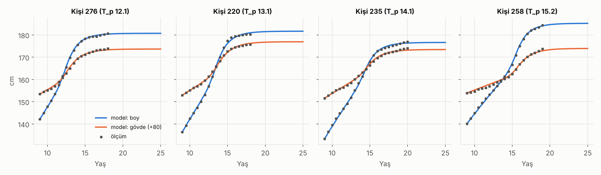
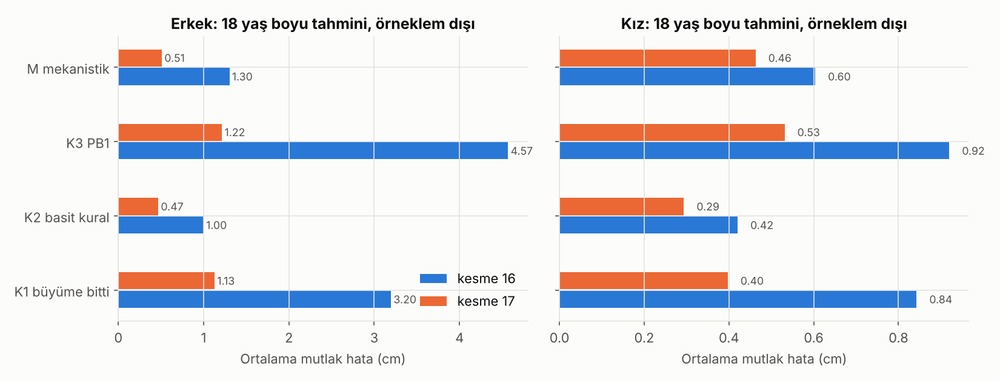
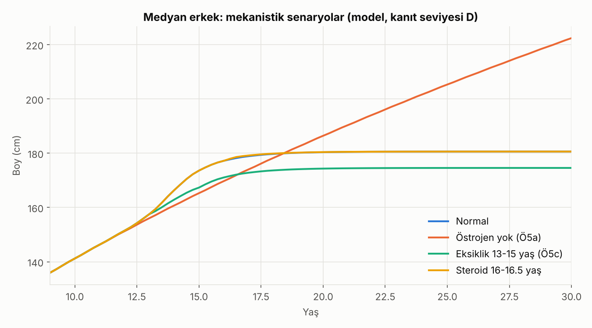
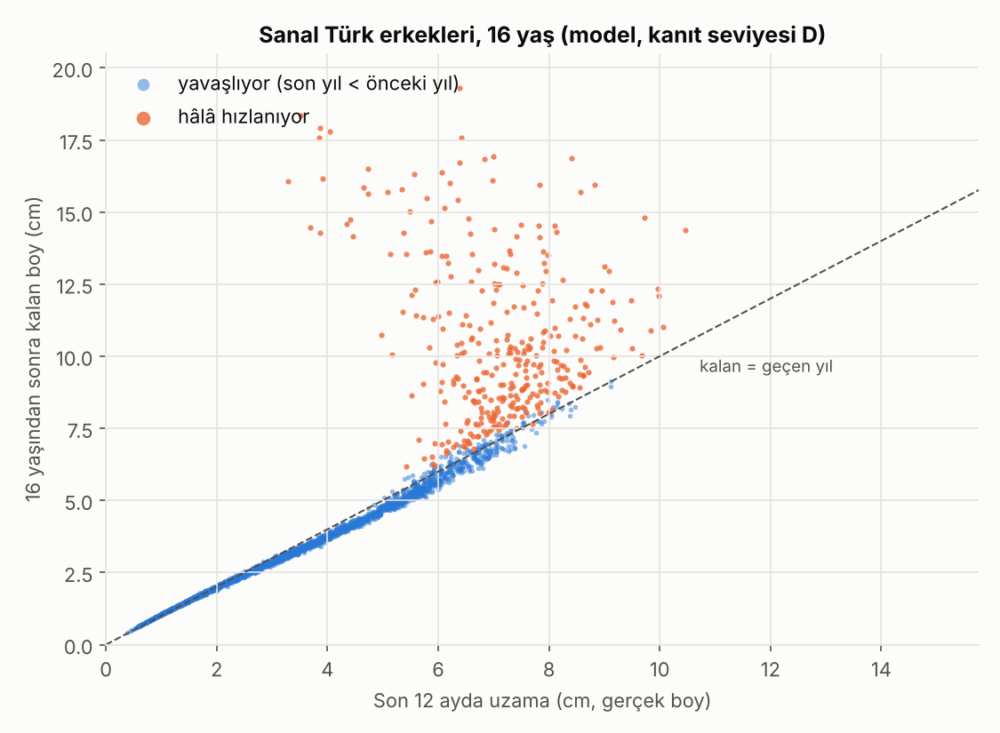
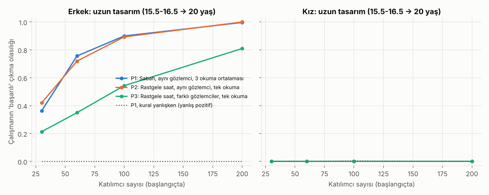

# Boy Uzaması 16-18 Yaş · Sürüm 3: Mekanistik Simülasyon ve Ön Kayıt

> **Sürüm:** 3 · **Tarih:** 2026-10-07 · **Önceki sürüm:** [2-gercek-veriyle-dogrulama](../2-gercek-veriyle-dogrulama/) · **Durum:** güncel
>
> **Acelen varsa:** en alttaki [En basit özet](#en-basit-özet) bölümüne atla.
>
> Bu doküman tıbbi tavsiye değildir. Bot korumalı sitelerin bağlantıları otomatik kontrolde 403 verebilir; bunlar arama motoru üzerinden doğrulandı.

**Kanıt seviyeleri:**

| Etiket | Anlamı |
|---|---|
| **A** | Meta-analiz ya da birden çok randomize kontrollü çalışma |
| **B** | Tek RCT ya da büyük, iyi tasarlanmış kohort |
| **C** | Gözlemsel çalışma, vaka serisi, mekanizma |
| **V** | Bu çalışmanın kendi gerçek veri analizi (Berkeley, n=136; Galton, n=934; Türk referansı) |
| **D** | Model çıktısı ya da varsayım. Yön gösterir, kesin sayı vermez |

**Bu sürümün dosyaları:**

| Dosya | İçerik |
|---|---|
| [veri-setleri.md](veri-setleri.md) | 19 veri kaynağının envanteri ve erişim yolları |
| [simulasyon/PLAN.md](simulasyon/PLAN.md) | Simülasyon kuralları, denklemler, **önceden kayıtlı testler** (testlerden önce commit edildi) |
| [on-kayit.md](on-kayit.md) | Kuralı ileride **gerçek veriyle** test etmek için ön kayıt (H1-H4) |
| `simulasyon/` | Kod, çıktılar, `kural.py` hesaplayıcısı |

---

## Soru ve kapsam

Sürüm 2'den üç soru kaldı:

1. **"Kalan boy ≈ son 12 aydaki uzama" kuralı kanıtlı mı?** Yoksa Berkeley verisine özgü bir rastlantı mı?
2. **Bunu kanıtlamanın yolu ne?** Hangi veriyle, kaç kişiyle, nasıl bir ölçümle?
3. **Kural kimde çöküyor?** v2 sonrası bulgu: hâlâ hızlananlarda.

**Yaklaşım:**
- Erişilebilir veri setlerini taradık.
- Büyüme plağı biyolojisini taklit eden, kurallara bağlı bir **dijital ikiz** kurduk. Testlerini **önceden kaydettik** ve sonucu ne çıkarsa çıksın yayınladık.
- Simülasyonu, kuralı test edecek gerçek bir çalışmayı **tasarlamak** için kullandık.

**Kapsam dışı:** Simülasyon tek bir kişi için tıbbi karar aracı değil. Gerçek çalışmanın yerini de tutmuyor; onu doğru tasarlamaya yarıyor.

---

## Önceki sürümden değişenler

| # | v2'de | v3'te | Neden |
|---|---|---|---|
| 1 | Kural koşulsuzdu: "kalan ≈ son 12 ay" | **Yalnızca büyüme hızı yavaşlıyorsa geçerli.** Bunu anlamak için ~1 yıl arayla 3 ölçüm gerekiyor | Hâlâ hızlananlarda kural 13.6 cm'ye kadar yanılıyor (V) |
| 2 | Boy tek parça olarak modellendi | **Bacak ve gövde (omurga) ayrı.** 16 sonrası büyümenin çoğu gövdeden | Berkeley oturma boyu verisi (V) |
| 3 | PB1 eğrisi 18 sonrasını yarı yarıya eksik tahmin ediyordu | Mekanistik model kuyruğu örneklem dışında doğru tahmin ediyor (0.72'ye karşı gözlenen 0.80 cm) | Ön kayıtlı test Ö3 |
| 4 | Simülasyon kuralları yoktu | Plan zorunluluğu, ön kayıt, sayısal yakınsama kontrolü, taslak sürüm kuralı. Hepsi `kontrol.py` ile denetleniyor | Kontrolü kaybetmemek |
| 5 | Hedef boy belirsizliği (SD) iki cinsiyette 5.0 cm | Galton verisi: erkek **5.8**, kız **5.1** cm. Regresyon katsayısı 0.72 doğrulandı (erkek 0.75, kız 0.69) | v2 aracı dondurulmuş sürümde olduğu için düzeltme burada not edildi (V) |
| 6 | Türk verisi yoktu | Günöz 2014 Türk referansı: 16→18 ortalama artış erkek 2.6, kız 0.7 cm. v2 bulgusuyla (2.3 / 0.7) uyumlu | Kesitsel ama Türk (V) |
| 7 | Ölçüm önerisi: "sabah, 12 ay arayla" | Ek bulgu: **ölçüm aletinin tekrarlanabilirliği** en kritik etken (bkz. 4.6) | Duyarlılık analizi (D) |

**Bu sürümde kendi yaptığımız ve yakalanan hatalar** (kural gereği yazıyoruz):
- **Sayısal hata:** ilk çalıştırmada model Euler yöntemiyle çözülüyordu. Fiziksel tutarlılık kontrolü (S3), zaman adımı yarıya inince sonucun 0.118 cm değiştiğini yakaladı ve programı durdurdu. RK2 yöntemine geçildi (değişim 0.0003 cm). Hiçbir test bu hatalı haliyle çalışmadı. Plana "sapma" olarak kaydedildi.
- **Yanlış teşhis:** Türk uyarlaması erkeklerde kaldığında önce "optimizasyon hatası" diye düşündüm. Izgara taramasıyla kontrol ettim: değildi. En iyi nokta bile 1.03 cm hatada kalıyor, yani sorun eğrinin şeklinde (bkz. 4.4).

---

## Yöntem

### Veri

- **Berkeley:** 136 kişi, 9-21 yaş, boy + oturma boyu (gövde). Bacak = boy − oturma boyu.
- **Günöz 2014 Türk referansı:** 6-18 yaş, yarım yıllık ortalama ve SD. PDF'ten otomatik ayrıştırıldı. Bilinen dizgi hatası (kız 16 yaş ortalaması 152.4 yazılmış, doğrusu 162.4) tutarlılık kontrolüyle otomatik düzeltildi.
- **Galton aileleri:** 934 çocuk, anne-baba ve çocuk erişkin boyu.

Üçü de kaynağından indiriliyor ve SHA-256 ile doğrulanıyor.

### Model: büyüme plağı dijital ikizi

Ayrıntılı denklemler ve her parametrenin kaynağı [PLAN.md](simulasyon/PLAN.md) bölüm 3'te. Benzetmeyle:
- Her plağın sınırlı bir **öncü hücre stoku** var.
- Büyüdükçe stok harcanıyor (**kullanıma bağlı tükenme**). Östrojen bu tükenmeyi ayrıca hızlandırıyor (**östrojen senesansı**). Stok azaldıkça plak yavaşlıyor.
- Ergenlikte östrojen hem GH'yi artırıp büyümeyi hızlandırıyor, hem stoku daha hızlı bitiriyor. Atak da bitiş de aynı mekanizmadan çıkıyor.
- **İki ayrı stok:** bacak plakları ve omurga plakları.

| Katman | İçerik |
|---|---|
| 1. Hormon | Östrojen etkisi (lojistik), GH ekseni = 1 + A_p · östrojen |
| 2. Plak | İki bölme, stok tükenmesi, kaynaşma kapısı |
| 3. Ölçüm fiziği | Gün içi omurga sıkışması (ölçülmüş 1.44 cm), okuma hatası, gözlemci farkı, 0.1 cm yuvarlama |
| 4. Çalışma | Kim, ne zaman, kaç kez ölçülüyor; kayıp; analiz |

**Kalibrasyon:**
- Kişi başına 4 parametre: çocukluk büyüme ölçeği (bacak, gövde), ergenlik zamanı, GH yükseltmesi.
- Cinsiyete özgü 4 hormon parametresi.
- **İki cinsiyete ortak** 4 hücre parametresi. Prototipte kızlarda kullanıma bağlı tükenme sıfıra gidiyordu; ortak tutulmasının gerekçesi PLAN 3.3'te.
- Sayısal çözüm: RK2, Δt = 0.02 yıl.
- Fiziksel kontroller her çalıştırmada: stok hiç artmıyor, hız negatif değil, boy = bacak + gövde, zaman adımı yakınsaması.

### Testler

13 doğrulama testi (Ö1-Ö7) ve 2 kalibrasyon kabul ölçütü, sayısal eşikleriyle **kod çalışmadan önce** commit edildi. Kayıt zamanları (UTC):

| Ne | Saat |
|---|---|
| Ön kayıt (plan) | 10:02 |
| Uygulama ayrıntıları | 10:03 |
| Kod | 10:09 |
| RK2 düzeltmesi | 10:11 |
| Kalibrasyon | 10:15 |
| Sonuçlar | 10:39-10:43 |

---

## Bulgular

### 4.1 Model gerçek ölçümlere oturuyor (V)



| | Erkek | Kız |
|---|---|---|
| Boy uyum hatası (RMSE, 9-21 yaş) | 0.37 cm | 0.41 cm |
| Kişi başı medyan RMSE: mekanistik (4 parametre) | **0.33** | **0.33** |
| Kişi başı medyan RMSE: PB1 (5 parametre) | 0.44 | 0.37 |
| Zaman adımı yarıya inince değişim | 0.0004 cm | 0.0003 cm |

**Not:** PB1 3-21 yaşa fit edildiği için daha uzun bir aralığı karşılamak zorunda. Karşılaştırma bire bir değil.

**Kalibre edilen hücre parametreleri dikkat çekici:**
- Kullanıma bağlı tükenme çok küçük çıktı: κ_bacak 0.032, κ_gövde 0.014.
- Kaynaşma eşiği alt sınırda (S_f = 0.0005), yani 21 yaşa kadarki veri belirgin bir "kapanma anı" görmüyor. Büyüme yavaş yavaş sönüyor.
- Bunun sonuçları 4.3'te.

### 4.2 Örneklem dışı tahmin: basit kural kazanıyor (V)



5 katlı çapraz doğrulama: her kişi, kendisini hiç görmemiş bir modelle, yalnızca kesme yaşına kadarki verisiyle tahmin edildi. Hedef 18 yaşındaki boy. Değerler ortalama mutlak hata (cm).

| Tahmin yöntemi | Erkek, 16'dan | Erkek, 17'den | Kız, 16'dan | Kız, 17'den |
|---|---|---|---|---|
| K1 "Büyüme bitti" | 3.20 | 1.13 | 0.84 | 0.40 |
| **K2 Basit kural** | **1.00** | **0.47** | **0.42** | **0.29** |
| K3 PB1 eğrisi | 4.57 | 1.22 | 0.92 | 0.53 |
| M Mekanistik model | 1.30 | 0.51 | 0.60 | 0.46 |

**Ön kayıtlı testler:**

| Test | Ölçüt | Sonuç |
|---|---|---|
| **Ö1** (16'dan tahmin) | M ≤ K2 + 0.10 | ❌ KALDI |
| **Ö2** (17'den tahmin) | Aynı | ❌ KALDI. Erkekte geçerdi (0.51 ≤ 0.57), kızda kaldı |
| **Ö3** (18 sonrası kuyruk, 41 erkek) | Fark ≤ 0.30 cm | ✅ GEÇTİ. Gözlenen 0.80, mekanistik 0.72, PB1 0.45 cm |
| **Ö4** (gövde payı, erkek 16→18) | Fark ≤ 0.15 | ✅ GEÇTİ. Gözlenen 0.79, tahmin 0.77 |

**Yorum:**
- Mekanistik model **büyümenin yapısını** doğru yakalıyor: hangi kemikte, ne zaman, 18'den sonra ne kadar.
- Ama tek bir kişinin önümüzdeki 1-2 yılını tahmin etmede **basit kural daha iyi.** Karmaşık model kişiye 4 parametre fit etmek zorunda ve kesme yaşında atağı bitmemiş birinin zamanlamasını kestirmekte zorlanıyor. Kural ise bu bilgiyi doğrudan son yılın hızından alıyor.
- Klasik PB1 eğrisi 16 yaşından tahminde en kötüsü: erkekte 4.57 cm hata, "büyüme bitti" demekten bile kötü.

### 4.3 Literatür olguları: normal büyüme iyi, bozulmalar zayıf (D)



| Test | Olgu | Ölçüt | Sonuç |
|---|---|---|---|
| **Ö5a** | Östrojen yokluğu (Smith 1994: 28 yaşında 204 cm, hâlâ uzuyor) | 25 yaşta hız ≥ 0.5 cm/yıl ve boy ≥ ort + 2SD | ✅ GEÇTİ. Hız 3.6 cm/yıl, 28 yaşta 216 cm. **Yön doğru, büyüklük abartılı** |
| **Ö5b** | Çocuklukta eksiklik sonrası yakalama (Baron 1994) | Kaybın ≥ %75'i geri gelmeli | ❌ KALDI. Yalnızca %16'sı geri geliyor (4.07 → 3.41 cm) |
| **Ö5c** | Ergenlikte eksiklik daha kalıcı (Rivkees 1988) | Çocukluğa göre ≥ 2 kat kayıp | ❌ KALDI. 1.8 kat; yön doğru, eşiğin altında |
| **Ö5d** | Aromataz inhibitörü, geç gelişen erkek (Wickman 2001) | Kazanç +0.5 ile +8 cm arası | ✅ GEÇTİ. +1.8 cm |
| **Ö5e** | Ergenlik öncesi aromataz inhibitörü faydasız (2019) | \|kazanç\| < 0.5 cm | ✅ GEÇTİ. +0.02 cm |
| **Ö5f** | Dış steroid boyu kısaltır (AAP) | ≥ %95'inde nihai boy düşmeli | ❌ KALDI. %60'ında düşüyor, medyan etki −0.01 cm |

**Teşhis:** Üç başarısızlığın ortak kökü aynı.
- Berkeley verisinde kimse ciddi bir büyüme bozukluğu yaşamadığı için veri "kullanıma bağlı tükenmeyi" ayırt edemiyor; model bunu çok küçük öğrendi (κ ≈ 0.01-0.03). Bu küçük olunca hem yakalama büyümesi hem steroidin plağı erken bitirmesi zayıf kalıyor.
- Kaynaşma eşiği alt sınırda olduğu için model ani bir kapanma üretemiyor.

**Pratik sonuç:**
- Bu modelin "eksiklik / steroid / ilaç" senaryo sayıları **güvenilmez.**
- Sürüm 1-2'deki bu tür senaryo sayıları da (−0.3 cm, −0.5 cm gibi) oyuncak modelden geliyordu. Bu sonuç onların da ihtiyatla okunması gerektiğini gösteriyor.
- Literatürdeki klinik kanıt (bkz. v2 bölüm 5.2) bu konuda modelden daha güvenilir.

### 4.4 Türk uyarlaması ve sanal kohort (D)

| Kalibrasyon kabulü | Ölçüt | Sonuç |
|---|---|---|
| Kız | RMSE ≤ 0.7 cm | ✅ 0.56 cm (zamanlama −0.20 yıl, ölçek 0.983) |
| Erkek | RMSE ≤ 0.7 cm | ❌ 1.12 cm. Izgara taramasında en iyi nokta bile 1.03 cm |

**Erkekte neden kaldı:** Türk erkek ortalama eğrisinin büyüme atağı Berkeley'e göre daha erken ve daha dik. Model yalnızca kaydırma ve ölçekleme yapabildiği için bu şekil farkını kapatamıyor: 9 yaşta +1.7, 14.5 yaşta −1.4 cm sapıyor.

**Sonuç:** Sanal Türk erkekleri 16→18 arası ortalama 3.3 cm uzuyor; Türk referansında bu 2.6 cm. Yani sanal kohortta geç büyüme biraz fazla. Aşağıdaki erkek güç hesapları biraz iyimser olabilir.

### 4.5 Kural mekanizmadan kendiliğinden çıkıyor, çöküş de (D)



20.000 sanal Türk erkeği ve 20.000 sanal Türk kızında, gerçek (ölçüm hatasız) boylarla:

| | Yavaşlayan n | Hızlanan n | Katsayı (yavaşlayanlar) | Korelasyon | Hızlananlarda kural hatası |
|---|---|---|---|---|---|
| Erkek 16 | 17.187 | **2.813 (%14)** | **0.96** | 0.99 | **+2.35 cm** |
| Erkek 17 | 19.519 | 481 (%2.4) | **0.97** | 1.00 | +1.49 cm |
| Kız 16 | 20.000 | 0 | **0.86** | 1.00 | - |
| Kız 17 | 20.000 | 0 | **0.87** | 1.00 | - |

| Test | Ölçüt | Sonuç |
|---|---|---|
| **Ö6a** | Yavaşlayanlarda katsayı her hücrede [0.7, 1.3] | ✅ GEÇTİ |
| **Ö6b** | Hızlananlarda hata medyanı > +0.5 cm | ✅ GEÇTİ |

**Ne anlama geliyor:**
- Model kuralı **öğretilmeden** üretiyor.
- Katsayılar Berkeley'deki gerçek değerlerle uyumlu: erkek ~0.85-1.0, kız ~0.9.
- **Neden?** Öncü hücre stoku tükendikçe hız her yıl kabaca sabit bir oranda düşüyor; Berkeley'de bu oran ~0.45-0.5. Geçen yıl g kadar uzadıysan, sonraki yıllar yaklaşık g/2 + g/4 + g/8 + … = g eder.
- Kural bu yüzden rastlantı değil, plak biyolojisinin matematiksel sonucu. Ama bu bir **model** sonucu (D); gerçek veriyle teyidi (V) Berkeley'den geliyor, bağımsız veri hâlâ yok.
- Katsayı, zamanlama varsayımına duyarsız: kayma −0.25 yıl olunca 0.963 yerine 0.961. Kaynaşma kapısı genişliğine de duyarsız: 0.963.
- **Çöküş durumu gerçek ve yaygın:** 16 yaşındaki sanal erkeklerin %14'ü hâlâ hızlanıyor ve onlar için kural ortalama 2.4 cm, uçlarda 10 cm'den fazla eksik söylüyor.

### 4.6 Kuralı kanıtlamak için çalışma tasarımı (D)



Sanal bir çalışma 300 kez tekrarlandı. "Başarılı" = katsayının %95 güven aralığı [0.7, 1.3] içinde ve ortalama hata < 1 cm.

**Erkek, uzun tasarım** (15.5-16.5 yaşında başla, 6 ayda bir ölç, 20 yaşa kadar izle; gerçek katsayı 0.90):

| Katılımcı | P1: sabah, 3 okuma | P2: rastgele saat, tek okuma | P3: rastgele saat, farklı gözlemciler | Kural yanlışken "başarılı" çıkma |
|---|---|---|---|---|
| 30 | %36 | %42 | %21 | %0 |
| 60 | %76 | %72 | %35 | %0 |
| **100** | **%90** | **%89** | %54 | %0 |
| 200 | %100 | %100 | %81 | %0 |

**Önemli dersler:**

1. **~100 erkek yeterli** (%90 güç), yanlış pozitif riski pratikte sıfır. Kural yanlış olsaydı (gerçek katsayı 0.5 ya da 1.6), bu tasarım onu "doğru" diye göstermezdi.
2. **Takip 20 yaşa kadar sürmeli.** 19'da biten "kısa tasarım"da görünen katsayı 0.67'ye düşüyor; çünkü 19 sonrası büyüme ölçülmüyor. Bu tasarımla kural, doğru olsa bile hiçbir örneklem büyüklüğünde doğrulanamaz.
3. **Kızlarda kural bu yaşlarda test edilemez.** Hiçbir n ve protokolde başarı %0. Kalan büyüme (0.2-0.5 cm) ölçüm gürültüsünden küçük. Gürültü katsayıyı sıfıra doğru çekiyor (gerçek 0.78, ölçülen ~0.06). Bu "regresyon seyrelmesi" denen istatistiksel etki. Kızlar için kural pratikte de önemsiz: önlerinde zaten 1 cm'den az var.
4. **Ölçüm kalitesi örneklem büyüklüğü kadar önemli** (duyarlılık analizi, n = 100 erkek):

| Değişen varsayım | P1 gücü | P2 gücü |
|---|---|---|
| Varsayılan (okuma hatası 0.3 cm) | %90 | %89 |
| Okuma hatası 0.2 cm | %93 | %100 |
| **Okuma hatası 0.6 cm** | **%53** | **%3** |
| Gün içi sıkışma 2.0 cm | %52 | %81 |
| Sıkışma zaman sabiti 4 saat | %100 | %67 |

Sabah ölçüm her koşulda tek başına kurtarıcı değil. Asıl kritik olan **aletin ve ölçen kişinin tekrarlanabilirliği.** Gerçek bir çalışmada önce bir pilot yapıp okuma hatasını ölçmek gerekir. Hedef ≤ 0.3 cm.

### 4.7 Ölçüm katmanının gerçekçiliği (V + D)

| Test | Ölçüt | Sonuç |
|---|---|---|
| **Ö7** | Sanal kızlarda 16.5-18 yaş 6 aylık negatif artış oranı (Berkeley %14) en az bir protokolde %7-%25 | ❌ KALDI. P1 %37, P2 %37, P3 %40 |

**Teşhis (ek kontrol):**
- Duyarlılık analizinde ölçüm parametreleri ne yapılırsa yapılsın oran %32-%43 arasında kalıyor, hiçbir zaman %14'e inmiyor. Yani sebep ölçüm varsayımları değil.
- Sebep: modeldeki kızlar 16→18 arası ortalama **0.48 cm** uzuyor. Türk referansı ve Berkeley ise **0.70 cm.** Model kızlarda geç büyümeyi ~%30 eksik tahmin ediyor. Daha az büyüme, ölçüm gürültüsünün daha sık "kısalma" göstermesi demek.
- Ö1 ve Ö2'deki kız başarısızlıklarıyla aynı kök.

### 4.8 Galton ile hedef boy kontrolü (V)

| | n | Çocuk boyunun Tanner hedef boyuna eğimi | Artık SD | Korelasyon |
|---|---|---|---|---|
| Erkek | 481 | 0.75 | 5.8 cm | 0.49 |
| Kız | 453 | 0.69 | 5.1 cm | 0.52 |

v2 aracındaki 0.72 doğrulandı. Belirsizlik ise erkekte 5.0 değil 5.8 cm olmalı.

### Test özeti

| | Geçti | Kaldı |
|---|---|---|
| Doğrulama testleri (13) | Ö3, Ö4, Ö5a, Ö5d, Ö5e, Ö6a, Ö6b (**7**) | Ö1, Ö2, Ö5b, Ö5c, Ö5f, Ö7 (**6**) |
| Kalibrasyon kabulü (2) | Türk kız | Türk erkek |

---

## Sonuçlar

1. **"Geçen yıl kuralı" büyüme plağı biyolojisinin matematiksel sonucu olarak kendiliğinden ortaya çıkıyor.** Yavaşlayan gençlerde katsayı erkekte ~0.96, kızda ~0.86. Berkeley'deki gerçek değerlerle uyumlu. (D + V)
2. **Kural yalnızca büyüme hızı yavaşlıyorsa geçerli.** Hâlâ hızlananlarda kalan boyu ciddi eksik söylüyor: gerçek veride 13.6 cm'ye kadar, sanal kohortta medyan +2.4 cm. 16 yaşındaki erkeklerin ~%14'ü bu durumda. Kuralı kullanmak için ~1 yıl arayla 3 ölçüm gerekiyor. (V + D)
3. **16 yaşından sonraki büyümenin çoğu omurgadan geliyor.** Erkeklerde 16→18 arası büyümenin %79'u gövde. 18 sonrası kuyruk ~0.7-0.8 cm. (V)
4. **Tek bir kişinin kalan boyunu tahmin etmede basit kural, mekanistik modelden ve klasik büyüme eğrisinden daha isabetli.** Karmaşık model büyümenin yapısını açıklıyor ama kişisel tahmini iyileştirmiyor. (V)
5. **Mevcut veri, büyüme bozukluklarının etkisini (yakalama, steroid, ilaç) güvenilir şekilde öğretemiyor.** Bu tür simülasyon sayıları (bu ve önceki sürümlerdekiler) kesin değer olarak okunmamalı; klinik literatür daha güvenilir. (V + D)
6. **Kural kanıtlanabilir, ama erkeklerde.** ~100 erkek, 15.5-16.5 yaşında başlayıp 6 ayda bir, 20 yaşa kadar iyi protokolle ölçülürse kuralı doğrulama olasılığı ~%90, yanlış pozitif ~%0. 19 yaşta biten takip yanıltıcı. Kızlarda gerçekçi bir çalışmayla test edilemiyor. (D)
7. **Ölçüm aletinin tekrarlanabilirliği, katılımcı sayısı kadar belirleyici.** Okuma hatası 0.3 cm'den 0.6 cm'ye çıkarsa doğrulama olasılığı %89'dan %3'e düşebiliyor. (D)
8. **Anne-baba boyundan hedef boy hesabındaki varsayım doğrulandı** (erkek 0.75, kız 0.69). Belirsizlik erkekte ±5.8 cm. (V)

---

## Sınırlamalar

- **Tek kalibrasyon kohortu:** Berkeley, 1928 doğumlu, Kaliforniya. Türk uyarlaması kızda kabul edildi, **erkekte kabul ölçütünü geçmedi** (şekil farkı). Erkek sanal kohortunun geç büyümesi Türk ortalamasından fazla (3.3'e karşı 2.6 cm); güç hesapları biraz iyimser olabilir.
- **Model kızlarda geç büyümeyi ~%30 eksik tahmin ediyor** (Ö1, Ö2, Ö7). Kızlarla ilgili simülasyon sayıları bu yönde yanlı.
- **Kullanıma bağlı tükenme ve kaynaşma eşiği veriden öğrenilemedi.** Bozulma senaryoları (Ö5b, c, f) bu yüzden kaldı. Düzeltmek için yakalama büyümesini ölçen deneysel ya da klinik veriyle (hayvan çalışmaları, hipotiroidi serileri) bilgilendirilmiş bir önsel gerekiyor. Sürüm 4 adayı.
- **Kör olmayan testler:** Plan öncesi prototipte Ö3, Ö4 ve kızların Ö1'i örneklem içinde görülmüştü (PLAN'da yazılı). Ö3 ve Ö4 örneklem dışında geçti; kız Ö1 beklendiği gibi kaldı.
- **Ölçüm varsayımları ölçülmüş değil:** okuma hatası ve sıkışma zaman sabiti varsayım. Güç hesabını en çok bunlar etkiliyor; gerçek çalışmadan önce pilot ölçüm şart.
- **İki bölme yaklaşımı:** gerçekte onlarca plak var. Hormon ortamı tek bir östrojen indeksiyle basitleştirildi.
- **İkinci bağımsız veri yok:** kural hâlâ yalnızca Berkeley'de gerçek veriyle görüldü. Ön kayıt (`on-kayit.md`) yeni veri geldiğinde ne yapılacağını sabitliyor.

---

## Nasıl çalıştırılır

```bash
cd simulasyon
pip install -r requirements.txt
python calistir.py        # tüm adımlar (~30 dk; kalibrasyonlar .onbellek/ altında saklanır)
python ek_kontroller.py   # testlerden sonra yapılan keşifsel kontroller
python kural.py --cinsiyet erkek --olcumler 15.0:168.0 16.0:171.5 17.0:173.0
```

Tüm sayılar `simulasyon/ciktilar/` altında. Test sonuçları: `on_kayitli_testler.csv`.

---

## Kaynaklar

**Veri**
- [sitar (CRAN), Berkeley verisi](https://cran.r-project.org/web/packages/sitar/index.html) · [HistData (CRAN), Galton aileleri](https://cran.r-project.org/web/packages/HistData/index.html)
- [Günöz H ve ark. Türk çocuklarında boy Z-skor referansları, JCRPE 2014](https://jcrpe.org/pdf/cf9d60d6-523c-458a-a2e6-78728d3ffbb0/articles/Jcrpe.1260/JCRPE-6-28-En.pdf)
- Erişim için aday veri setlerinin tam listesi: [veri-setleri.md](veri-setleri.md)

**Mekanizma**
- [Weise M ve ark. Effects of estrogen on growth plate senescence and epiphyseal fusion. PNAS 2001](https://pmc.ncbi.nlm.nih.gov/articles/PMC34445)
- [Catch-up growth is associated with delayed senescence of the growth plate in rabbits. Pediatric Research 2001](https://www.nature.com/articles/pr2001230)
- Baron J ve ark. Catch-up growth after glucocorticoid excess: a mechanism intrinsic to the growth plate. *Endocrinology* 1994 (arama özetinden)
- [Almeida M ve ark. Estrogens and androgens in skeletal physiology and pathophysiology. Physiol Rev 2017](https://pmc.ncbi.nlm.nih.gov/articles/PMC5539371)
- [Aromatize östrojen GH salınımını artırır, JCEM 2018](https://pmc.ncbi.nlm.nih.gov/articles/PMC6212797)
- [Pubertal timing predicts leg length and childhood BMI predicts sitting height in young adult men (2011)](https://pubmed.ncbi.nlm.nih.gov/20961561)
- Wilsman NJ ve ark. Differential growth by growth plates as a function of multiple parameters of chondrocytic kinetics. *J Orthop Res* 1996 **[doğrulanmadı: bağlantıya erişilemedi; sonuçlar buna dayanmıyor]**

**Literatür olguları (Ö5)**
- [Smith EP ve ark. NEJM 1994](https://pubmed.ncbi.nlm.nih.gov/8090165/) · [Morishima A ve ark. JCEM 1995](https://www.osti.gov/biblio/391044)
- [Edinsel hipotiroidide büyüme ve nihai boy, sistematik derleme (Rivkees 1988 dahil)](https://www.ncbi.nlm.nih.gov/pmc/articles/PMC11674360/)
- [Wickman 2001 ve aromataz inhibitörü çalışmaları derlemesi](https://www.degruyterbrill.com/document/doi/10.1515/jpem-2022-0177/html) · [Letrozol monoterapi 2019](https://www.ncbi.nlm.nih.gov/pmc/articles/PMC6460933/)
- [Ergenler ve anabolik steroidler (AAP)](https://www.ojp.gov/ncjrs/virtual-library/abstracts/adolescents-and-anabolic-steroids-subject-review-re9720)

**Ölçüm**
- [Gün içi boy değişimi, ort. 14.4 mm (BJSM)](https://bjsm.bmj.com/content/20/3/119)

**Gelecekteki test için veri**
- [Zhongshan kohortu (veri erişim beyanı)](https://www.ncbi.nlm.nih.gov/pmc/articles/PMC9354934/) · [Add Health, ICPSR 21600](https://www.icpsr.umich.edu/web/ICPSR/studies/21600/versions/V26/summary) · [ALSPAC klinik oturumları](https://www.bristol.ac.uk/media-library/sites/alspac/documents/researchers/clinics/focusclinicsessions.pdf)

---

## En basit özet

**Önce benzetme:** Her kemik ucunda bir "hücre kumbarası" var. Büyüdükçe kumbaradan harcıyorsun, ergenlik hormonları harcamayı hızlandırıyor. Kumbara azaldıkça büyüme yavaşlıyor; bitince duruyor.

**Bu sürümde ne yaptık:**
- Bu kumbarayı bilgisayarda taklit eden bir **"sanal genç" modeli** kurduk ve 40.000 sanal Türk genci ürettik.
- Modelden ne beklediğimizi **önceden yazıp kilitledik**, sonra test ettik. Sonucu beğenmesek de değiştiremeyelim diye.
- 13 testten **7'si geçti, 6'sı kaldı.** Hepsini yazdık.

**Öğrendiklerimiz:**

- **"Geçen yıl ne kadar uzadıysan, önünde aşağı yukarı o kadar var" kuralı tesadüf değil.** Kumbara mantığından kendiliğinden çıkıyor: her yıl bir öncekinin yaklaşık yarısı kadar uzarsın, ½ + ¼ + ⅛... toplamı da geçen yıl kadar eder.
- **AMA kural sadece büyümen yavaşlıyorsa işe yarar.** Bunu anlamak için **3 ölçüm** lazım: 2 yıl önce, 1 yıl önce, şimdi.
  - Bu yıl geçen yıldan **az** uzadıysan: kural geçerli.
  - Bu yıl geçen yıldan **çok** uzadıysan: büyüme atağın daha bitmemiş. Önünde kuralın söylediğinden **çok daha fazla** boy olabilir. 16 yaşındaki erkeklerin yaklaşık 7'de 1'i böyle. Ergenliğin geç kaldıysa 18'den önce doktora git.
- **16 yaşından sonra uzayan kısım çoğunlukla bacak değil, omurga.** Bacaklar daha erken durur.
- **Karmaşık bilgisayar modeli kişisel tahminde basit kuraldan iyi değil.** Kafandan hesaplayabileceğin kural yeterli.
- **"Diyet yaparsam kaç cm kaybederim, steroid kaç cm götürür" gibi sorulara model güvenilir sayı veremiyor.** Mevcut veri bunu öğretmeye yetmiyor. Bu konuda doktorların gözlemleri daha güvenilir: ciddi eksiklik ve steroid **kalıcı boy kaybı** yapar.
- **Kızlarda 16'dan sonra kalan boy o kadar az ki** (genelde 1 cm'den az), ölçüm hatasının içinde kayboluyor. Kızlar için asıl soru "ne kadar kaldı" değil, "zaten büyük ölçüde bitti".
- **Ölçüm yaparken:** sabah, aynı aletle, 3 kez ölçüp ortalamasını al. Kötü ölçüm, iyi kuralı bile bozar.
- **Kuralın gerçekten kanıtlanması için:** yaklaşık 100 erkeği 16 yaşından 20 yaşına kadar 6 ayda bir doğru ölçmek gerekiyor. Ya da başka bir ülkenin verisine erişmek; en ucuz yol Çin'deki bir çalışmanın yazarlarına e-posta atmak. Neyi nasıl test edeceğimizi şimdiden yazıp kilitledik.
- **Tek cümleyle:** Yılda bir, sabah ölç. Yavaşlıyorsan önünde aşağı yukarı geçen yılki kadar var. Hızlanıyorsan durum farklı, doktora git.
