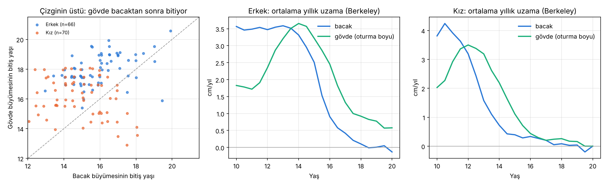

# Büyüme Plaklarının Kapanma Sırası · Sürüm 1: Literatür ve Berkeley Analizi

> **Sürüm:** 1 · **Tarih:** 2026-10-07 · **Durum:** güncel
>
> **Acelen varsa:** en alttaki [En basit özet](#en-basit-özet) bölümüne atla.
>
> Bu doküman **tıbbi tavsiye değildir.** Plak durumu yalnızca hekimin istediği görüntülemeyle (röntgen, MR) değerlendirilebilir. Bu raporda anılan ilaç tedavileri yalnızca **hekim kararıyla** uygulanır; doz yazılmaz. Kendi başına hormon ya da ilaç kullanma.

**Kanıt seviyeleri:**

| Etiket | Anlamı |
|---|---|
| **A** | Meta-analiz ya da birden çok randomize kontrollü çalışma |
| **B** | Tek RCT ya da büyük, iyi tasarlanmış kohort |
| **C** | Gözlemsel çalışma, görüntüleme çalışması, derleme |
| **V** | Bu çalışmanın kendi gerçek veri analizi (Berkeley: 66 erkek, 70 kız) |
| **D** | Model çıktısı ya da varsayım |

---

## Soru ve kapsam

**Soru:** Vücuttaki büyüme plakları aynı anda kapanmaz. Bazıları (ör. el, bilek ya da diz) kapanmışken diğerleri açıksa, boy uzaması durur mu?

Alt sorular:
1. Hangi plaklar boya katkı yapar, hangileri yapmaz?
2. El röntgenindeki "kemik yaşı" diz plaklarının durumunu doğru söyler mi?
3. **Bacak büyümesi bittikten sonra gövde (omurga ve leğen) ne kadar daha uzar?** Bu, gerçek veriyle ölçülen ana soru.

**Kapsam dışı:** Plakları açık tutmak ya da büyümeyi uzatmak için tedavi. Bu raporda tedavi önerisi yoktur.

**Benzetme:** Boy, üst üste konmuş iki kattan oluşan bir bina: alt kat bacaklar, üst kat gövde. Her katın kendi inşaat ekibi var. El ve ayaktaki plaklar ise binanın bahçesindeki işçiler; işleri bitince bina yükselmeyi bırakmaz. Bina, hem alt hem üst kat ekibi işi bitirince yükselmeyi bırakır. Bu araştırma, üst kat ekibinin alt kattan ne kadar sonra bitirdiğini ölçüyor.

## Yöntem

1. **Literatür:** Europe PMC'de açık erişimli çalışmalar tarandı. Kullanılan her sayı tam metinden kontrol edildi.
2. **Gerçek veri analizi (V):** Berkeley Child Guidance Study'de boy ve oturma boyu yarım yıllık aralıklarla ölçülmüş.
   - Gövde = oturma boyu (leğen + omurga + baş); bacak = boy − oturma boyu.
   - Dahil etme: 13 yaşından önce ve 18 yaşında ya da sonrasında ölçümü olanlar (66 erkek, 70 kız).
   - **Bitiş yaşı:** Son ölçüme kadar o bölmede kalan büyümenin ilk kez ≤ 0.5 cm olduğu yaş. Duyarlılık için 0.3 ve 1.0 cm de denendi.
   - Ön kayıt: [on-kayit.md](on-kayit.md). Hipotezler, kod yazılmadan önce commit edildi; kod da çalıştırılmadan önce ayrıca commit edildi.
3. **Model karşılaştırması (D):** Boy araştırması sürüm 3'ün büyüme modeli. Cinsiyet başına 5000 sanal kişi, aynı tanımlar.
   - 30 yaşa kadar (sansürsüz) ve 19 yaşta kesilerek (Berkeley'e benzer) hesaplandı.

`cd analiz && python calistir.py` (~1 dk). Veri kaynağından indirilir ve SHA-256 ile doğrulanır. Çıktılar `analiz/ciktilar/` altında.

## Bulgular

### 1. Literatür: plakların sırası ve boya katkısı

| Bulgu | Kaynak | Kanıt |
|---|---|---|
| Bilek plaklarının kapanması tipik olarak kemik yaşı ~18'de tamamlanır. **Diz plaklarının kaynaşması ise 15.9-21.7 yaşa kadar sürebilir.** Bacaklar ergenlikteki boy artışının **yarısından fazlasını** sağlar | Zhang ve ark. 2026, giriş bölümü (başka çalışmalara atıfla) | C |
| **Türk örneklemi, diz MR'ı** (3 Tesla): Tam kaynaşmanın %50 olasılıkla görüldüğü yaş kızlarda kaval kemiği üst ucu için 15.23, erkeklerde uyluk kemiği alt ucu için 17.43. Tam kaynaşmanın görüldüğü en erken yaş erkeklerde 16.07-16.16, kızlarda 14.67 | Türk diz MR çalışması 2026 | C |
| El-bilek röntgenine göre **kemik yaşı 15-18 olan ama diz plakları açık** 139 erkek tanımlanmış (Çin, geriye dönük, kontrol grubu yok, ilaç tedavisi çalışması) | Zhang ve ark. 2026 | C |
| Ön çapraz bağ cerrahisi derlemesi: Sistemik olgunluk ölçütleri (büyüme atağı) ile **diz plaklarının yerel durumu uyuşmayabilir.** El-bilek bulgusu ile diz arasında uyumsuzluk varsa diz MR'ı önerilir | Ön çapraz bağ derlemesi 2025 | C |

**Ne anlama geliyor:**
- **El, bilek ve ayak plakları boya katkı yapmaz.** Ama olgunluğun **göstergesidir**. Kemik yaşı el röntgeninden okunur, çünkü el bütün iskeletin "saati" gibi kullanılır.
- Saat her zaman diz ile aynı anda çalışmaz. Kemik yaşı ileri görünen bazı gençlerde diz plakları hâlâ açık olabilir.
- Diz plaklarının kapanmasının kendisi de geniş bir yaş aralığına yayılıyor (Türk örnekleminde erkeklerde ~16-18+).

### 2. Berkeley: bacak ve gövde büyümesinin bitiş sırası (V)

Kaynak: [`ozet.json`](analiz/ciktilar/ozet.json), [`hipotezler.csv`](analiz/ciktilar/hipotezler.csv), [`berkeley_kisiler.csv`](analiz/ciktilar/berkeley_kisiler.csv).

| Ölçüt (eşik 0.5 cm) | Erkek (n=66) | Kız (n=70) |
|---|---|---|
| Bacak büyümesinin bitiş yaşı, medyan (%25-75) | **16.0** (15.0-16.5) | **14.75** (13.5-16.0) |
| Gövde büyümesinin bitiş yaşı, medyan (%25-75) | **≥ 18.0** (17.5-19.0) | **≥ 16.0** (15.0-17.0) |
| Gövde bacaktan **sonra** bitenlerin oranı | **%92** | %73 |
| Bacak bittikten sonra gövdenin uzaması, medyan (%25-75) | **≥ 3.4 cm** (2.0-4.6) | ≥ 1.8 cm (0.5-3.4) |
| Aynı ölçüt, en çok uzayan %10 | ≥ 5.8 cm | ≥ 5.2 cm |
| Son ölçümde gövdesi hâlâ büyüyenler (sansürlü) | %58 | %23 |
| 16 yaştan sonra toplam boy artışı, medyan | 2.45 cm | 0.70 cm |
| Bunun gövdeden gelen payı, medyan (birleşik) | **%90** (%82) | %79 (%63) |

"≥" işaretli değerler **alt sınırdır**. Berkeley ölçümleri erkeklerde medyan 18.5 yaşında bitiyor ve erkeklerin %58'inde gövde son ölçümde hâlâ büyüyordu. Gerçek değerler daha büyük olabilir.

**Grafiği okuma:**
- **Sol:** Her nokta bir kişi. Çizginin üstündeki noktalarda gövde bacaktan sonra bitiyor. Erkeklerin neredeyse hepsi çizginin üstünde.
- **Orta (erkek):** Bacak uzaması (mavi) 16 yaştan sonra hızla düşüyor ve 18'de ~0'a iniyor. Gövde uzaması (yeşil) 18-20 yaşta hâlâ yılda ~0.6-0.8 cm.
- **Sağ (kız):** Aynı sıra var, ama her şey ~2 yıl erken ve geç dönemdeki büyüme küçük.

**Ön kayıtlı hipotezler:**

| # | Hipotez | Sonuç |
|---|---|---|
| H1 | Gövde bacaktan sonra biter (kişilerin ≥ %60'ında) | ✅ **Destekleniyor.** Erkek %92, kız %73. Eşik 0.3 cm'de %86 / %67, 1.0 cm'de %95 / %80 |
| H2 | Bacak bittikten sonra erkeklerde gövde ≥ 0.5 cm uzar (medyan) | ✅ **Destekleniyor.** 3.35 cm. Eşik 0.3 cm'de 2.95, 1.0 cm'de 4.30 |
| H3 | Erkeklerde 16 yaştan sonraki artışın çoğu (> %50) gövdeden | ✅ **Destekleniyor.** %90 (n = 65). H3 tamamen kör değildi, ön kayıttaki şeffaflık notuna bakınız |

**Kızlarda dikkat:** Kızlarda geç dönemdeki büyüme küçük olduğu için ölçüm hatası (~0.3-0.5 cm) sonucu daha çok etkiliyor. Grafikte gövdesi bacaktan "önce" biten bazı kızlar büyük olasılıkla bu gürültüden kaynaklanıyor.

### 3. Sürüm 3 modeliyle karşılaştırma (D)

| Ölçüt (erkek) | Berkeley (V) | Model, 19'da kesilmiş | Model, 30'a kadar |
|---|---|---|---|
| Bacak bitiş yaşı, medyan | 16.0 | 16.0 | 16.0 |
| Gövde bitiş yaşı, medyan | ≥ 18.0 | 18.0 | **19.0** |
| Bacak bittikten sonra gövde uzaması, medyan | ≥ 3.35 cm | 2.42 cm | 2.88 cm |
| 16 yaştan sonraki artışta gövde payı, medyan | %90 | %86 | %88 |

- Model, verideki sırayı ve payları yakalıyor.
- Bacak bittikten sonraki gövde uzamasını veriden biraz az buluyor: 19'da kesildiğinde 2.4 cm, veride en az 3.35 cm.
- Sansürsüz modele göre erkeklerde gövde büyümesi medyan ~19 yaşında bitiyor. Bu, Berkeley'in göremediği dönem için bir model tahmini (D).

## Sonuçlar

1. **El, bilek ve ayak plaklarının kapanması tek başına boyu durdurmaz.** Boy, bacaklardaki (özellikle diz çevresi) ve gövdedeki (omurga, leğen) büyümeden gelir. El ve bilek, olgunluğun göstergesi olarak kullanılır. (C)
2. **El röntgenindeki kemik yaşı, diz plaklarının durumunu her zaman doğru söylemez.** Kemik yaşı 15-18 olup dizi açık erkekler tanımlanmış. Bilek kemik yaşı ~18'de olgunlaşırken diz kaynaşması 15.9-21.7 yaşa yayılabiliyor. (C)
3. **Türk örnekleminde diz plaklarının tamamen kaynaşması** erkeklerde en erken ~16 yaşında görülüyor. Uyluk kemiği alt ucu için %50 olasılık yaşı 17.4. (C)
4. **Bacak büyümesi gövdeden önce biter.** Berkeley'de erkeklerde bacak medyan 16.0, gövde en az 18.0 yaşında bitiyor. Erkeklerin %92'sinde gövde bacaktan sonra bitiyor; kızlarda %73. (V)
5. **Bacak büyümesi durduktan sonra gövde hâlâ uzar:** erkeklerde medyan **en az 3.4 cm** (en çok uzayan %10'da en az 5.8 cm), kızlarda en az 1.8 cm. Diz plakları kapanınca boy uzaması **tamamen durmaz, yavaşlar.** (V)
6. **16 yaştan sonraki boy artışının ~%90'ı gövdeden gelir** (erkek). Sürüm 3 modeli de aynı sonucu veriyor (%88). (V + D)
7. **"Boy durdu mu?" sorusunu tek bir plak cevaplamaz.** Pratikte en iyi gösterge, aynı koşullarda (sabah, çıplak ayak) 6-12 ay arayla yapılan boy ölçümüdür. Plak durumunun görüntülemeyle değerlendirilmesi hekimin kararıdır. (C + D)

## Sınırlamalar

- **Sansür.** Berkeley ölçümleri 18-21 yaşta bitiyor; erkeklerin %58'inde gövde son ölçümde hâlâ büyüyordu. Gövde bitiş yaşı ve kalan gövde büyümesi alt sınırdır.
- **Oturma boyu yalnızca omurga değildir.** Omurganın yanında leğen ve kafa tabanını da içerir; "omurga büyümesi" tam ayrıştırılamaz.
- **Ölçüm hatası.** Oturma boyu ölçümü duruşa duyarlıdır. Her ölçümde ~0.3-0.5 cm hata, küçük geç dönem farklarını (özellikle kızlarda) gürültülü yapar. Bu yüzden 0.3, 0.5 ve 1.0 cm eşikleriyle duyarlılık yapıldı; hipotezlerin hepsi her eşikte destekleniyor.
- **Diz plakları doğrudan görülmedi.** "Bacak büyümesi bitti" ölçümle tanımlandı, röntgenle değil.
- **Berkeley 1930'lar ABD kohortu.** Türk gençlerinde zamanlama farklı olabilir. Türk MR çalışması diz kaynaşmasını daha erken buluyor, ama MR sekansı da sonucu etkiliyor (çalışmanın kendi notu).
- **Zhang ve ark. 2026 bir ilaç tedavisi çalışması.** Burada yalnızca "el ve diz uyumsuz olabilir" kanıtı olarak kullanıldı. Kontrol grubu olmadığı için tedavinin etkisi hakkında bir sonuç çıkarılmadı. Tedavi önerilmez.

## Kaynaklar

- [Zhang ve ark. 2026, Combined Letrozole and Growth Hormone Therapy in Late-Pubertal Males with Advanced Bone Age and Open Knee Physes, Children (PMC13510540)](https://pmc.ncbi.nlm.nih.gov/articles/PMC13510540/)
- [Forensic Age Estimation of the Knee with 3D MEDIC MRI, 2026, Türk örneklemi (PMC13512491)](https://pmc.ncbi.nlm.nih.gov/articles/PMC13512491/)
- [Skeletal Maturity Assessment in Pediatric ACL-Reconstruction, 2025 (PMC12468475)](https://pmc.ncbi.nlm.nih.gov/articles/PMC12468475/)
- [sitar (CRAN), Berkeley Child Guidance Study verisi](https://cran.r-project.org/web/packages/sitar/index.html)
- [Boy uzaması sürüm 3: büyüme plağı modeli (bacak/gövde bölmeleri)](../../boy-uzamasi-16-18-yas/3-mekanistik-simulasyon-ve-on-kayit/README.md)
- [Spor ve boy sürüm 1: duruş ve gün içi boy değişimi (gövde ölçümünü etkileyen faktörler)](../../spor-egzersiz-ve-boy/1-fizik-tabanli-simulasyon/README.md)

## En basit özet

- **Elin ya da ayağın plakları kapandı diye boyun durmaz.** Onlar boyu uzatmıyor, sadece "saat" gibi olgunluğu gösteriyorlar.
- **Boy iki yerden uzar: bacaklar ve gövde (omurga).** Önce bacaklar biter: erkeklerde ~16, kızlarda ~14.5-15 yaş.
- **Bacaklar bitince gövde uzamaya devam eder.** Erkeklerde ortalama en az ~3.4 cm daha, kızlarda en az ~1.8 cm daha; genellikle 18-19 yaşına kadar.
- **16 yaşından sonraki uzamanın ~%90'ı gövdeden.** Yani 16'dan sonra "uzuyorum" diyen bir erkek, büyük ihtimalle sırtından uzuyor.
- **El röntgeni ile diz her zaman aynı şeyi söylemez.** El "bitmiş" görünürken diz açık olabilir. Kesin durum için hekim gerekirse dizi de değerlendirir.
- **Boy durdu mu, anlamanın en kolay yolu:** sabah, çıplak ayak, aynı yerde, 6-12 ay arayla ölç.
- **Benzetme:** İki katlı bina. Alt kat (bacak) önce biter, üst kat (gövde) birkaç yıl daha yükselir. Bahçedeki işçilerin (el, ayak) işi bitti diye bina durmaz.
