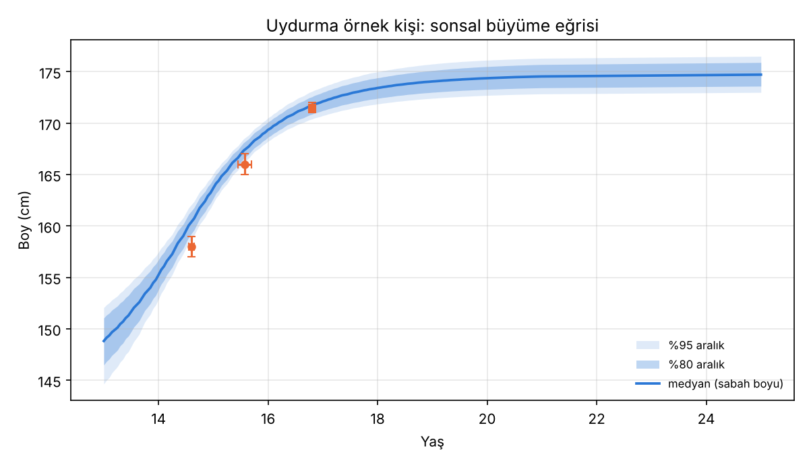

# Kişisel Büyüme Analizi · Sürüm 1: Belirsiz Ölçümlerle Tahmin

> **Sürüm:** 1 · **Tarih:** 2026-10-07 · **Durum:** güncel
>
> **Acelen varsa:** en alttaki [En basit özet](#en-basit-özet) bölümüne atla.
>
> Bu doküman **tıbbi tavsiye değildir.** Kemik yaşı röntgeni ve hekim değerlendirmesinin yerini tutmaz. Büyüme beklenmedik şekilde yavaşladıysa ya da durduysa hekime gidilmeli.
>
> **Gizlilik:** Bu araç gerçek bir kişi için çalıştırıldı, ama o kişinin hiçbir verisi ve sonucu bu repoda yok. Kişisel girdi ve çıktılar `simulasyon/.kisisel/` klasöründe durur ve `.gitignore` ile dışlanır. Aşağıdaki "örnek kişi" **uydurmadır.**

**Kanıt seviyeleri:**

| Etiket | Anlamı |
|---|---|
| **A** | Meta-analiz ya da birden çok randomize kontrollü çalışma |
| **B** | Tek RCT ya da büyük, iyi tasarlanmış kohort |
| **C** | Gözlemsel çalışma, mekanizma |
| **V** | Bu çalışmanın kendi gerçek veri analizi (Berkeley, 66 erkek; Galton) |
| **D** | Model çıktısı ya da varsayım |

---

## Soru ve kapsam

Bir gencin elindeki boy verisi genelde düzgün değildir:
- okulda ölçülmüş, yuvarlanmış birkaç sayı (saati ve ayakkabı durumu bilinmiyor);
- kapıya çizilmiş bir işaret ("şimdi akşam ölçünce işaretle aynıyım");
- anne ve baba boyu.

**Soru:** Bu belirsiz verilerle şunlar ne kadar **dürüst** tahmin edilebilir?
1. Son yıllarda ne kadar uzadı?
2. Büyüme sürüyor mu?
3. Kalan boyu ne kadar?

"Dürüst" şu demek: %80 aralık dediğimizde gerçek değer gerçekten ~%80 oranında o aralıkta çıkmalı.

**Kapsam dışı:** Tahlil sonuçları modele sayısal olarak girmez. Büyümeye etkilerini sayıya çevirecek kaynak yok, yorum hekime aittir.

**Benzetme:** Bulanık birkaç fotoğraftan arabanın hızını tahmin etmek. Bulanıklığı kabul edersen dürüst bir aralık verirsin; fotoğrafları net sanırsan kendinden emin ama yanlış olursun.

## Yöntem

Ön kayıtlı plan: [simulasyon/PLAN.md](simulasyon/PLAN.md). Plan kod yazılmadan önce commit edildi; kod da çalıştırılmadan önce ayrıca commit edildi.

1. **Önsel:** Boy araştırması sürüm 3 modelinden, Türk uyarlamalı 1.2 milyon sanal büyüme eğrisi (11-25 yaş).
   - Anne-baba boyu varsa, erişkin boy dağılımı Galton verisinden ölçülen ilişkiye göre yeniden ağırlıklandırılır: eğim 0.746, artık SD 5.83 cm (V).
2. **Ölçüm modeli:** Her okuma = gerçek sabah boyu − gün içi kısalma + ayakkabı + hata.
   - Gün içi kısalma: sabahtan akşama 1.44 cm (spor araştırması); saat bilinmiyorsa gün içinde herhangi bir an.
   - Ölçüm yaşı: verilen tarih penceresi içinde düzgün dağılım.
   - Okul değerleri tam sayıya yuvarlanmış kabul edilir (hata SD 1.0 cm); ev ölçümü 0.7 cm.
   - "İşaretle aynıyım" bilgisi bir **fark gözlemi** olarak girer: iki okuma arasındaki fark ≈ 0 ± 0.5 cm.
3. **Sonsal:** Önem örneklemesi. Her sanal eğri, verilerle ne kadar uyumluysa o kadar ağırlık alır.
4. **Doğrulama:** Berkeley'deki 66 gerçek erkeğin gerçek eğrisinden aynı belirsiz bilgi yapısı **taklit edildi**:
   - 14.1 ve ~15.0 yaşta yuvarlanmış okul ölçümü;
   - ~16.3 yaşta işaret;
   - 17.2 yaşta akşam ölçümü, "175-176" gibi 1 cm aralık.

   Sonra tahmin, gerçekte olanla karşılaştırıldı. Bitiş noktası: 17.2 yaşından son ölçüme (18-21 yaş, medyan 19) kadar kalan büyüme.

`cd simulasyon && python calistir.py` (~8 dk). Sabit tohum 20261007. Çıktılar `simulasyon/ciktilar/` altında.

## Bulgular

### 1. Ön kayıtlı testler

Kaynak: [`testler.csv`](simulasyon/ciktilar/testler.csv), [`ozet.json`](simulasyon/ciktilar/ozet.json).

| Test | Ne sınıyor | Sonuç | Ölçüt | |
|---|---|---|---|---|
| T1 | Berkeley: kalan büyüme için %80 aralık gerçeği yakalıyor mu? | **0.30** | 0.68-0.92 | ❌ |
| T2 | Berkeley: son ölçümdeki boy için %80 aralık | **0.64** | 0.68-0.92 | ❌ |
| T3 | Kişisel ölçümler bilgi ekliyor mu? (kalan büyüme hatası, sonsal / yalnız önsel) | 0.49 / 0.87 cm | sonsal < önsel | ✅ |
| T4 | Etkin örneklem (örnek kişi / Berkeley medyanı) | 914 / 6001 | ≥ 200 | ✅ |
| T5 | Monte Carlo kararlılığı (iki tohum) | 0.016 cm | < 0.1 cm | ✅ |

**Ne anlama geliyor:**
- **Tahminin merkezi iyi, aralığı fazla dar.**
  - Belirsiz ölçümler bile kalan büyüme hatasını 0.87 cm'den 0.49 cm'e indiriyor (T3).
  - Sistematik sapma yok: ortalama hata +0.17 cm.
  - Ama model kendinden fazla emin. %80 dediği aralık gerçeği yalnızca %30 oranında yakaladı. Medyan aralık genişliği 0.30 cm, gerçek hatanın yayılımı (SD) ise 0.72 cm.
- **Neden:** Sürüm 3'ün büyüme eğrisi ailesi gerçek insanlardan daha "katı". Birkaç ölçümle eğri kilitleniyor; gerçek insanlar ise eğriden daha çok sapıyor. Karar kuralı K1 gereği sonsal aralıklar **"kalibre değil, fazla dar"** diye işaretlendi.
- **Sonradan eklenen düzeltme (sapma 3):** Berkeley'de ölçülen gerçek hata yüzdelikleri, sonsal medyana eklenerek ikinci bir aralık verildi. Bu bir tür uyumlu tahmin ("conformal") düzeltmesi.

  | Yüzdelik | %2.5 | %10 | %50 | %90 | %97.5 |
  |---|---|---|---|---|---|
  | Gerçek − tahmin (cm) | −0.87 | −0.53 | +0.05 | +0.92 | +1.61 |

  Bu düzeltme yalnızca kalan büyüme belirsizliğini kapsıyor; şimdiki boyun belirsizliği eklenmiyor. Bu yüzden erişkin boy için hâlâ dar sayılmalı (T2 de kaldı).

### 2. Uydurma örnek kişi

Girdi: [`ornek_girdi.json`](simulasyon/ornek_girdi.json).
- Erkek, 16.8 yaş; anne 160, baba 175 cm.
- Okulda 14.6 yaşta 158, 15.6 yaşta 166 cm.
- ~15.9 yaşta işaret çizilmiş; şimdi akşam 171-172 ve işaretle aynı.

Kaynak: [`varyantlar.csv`](simulasyon/ciktilar/varyantlar.csv), [`sonuc.json`](simulasyon/ciktilar/sonuc.json).

| Büyüklük | Sonsal medyan | Sonsal %80 | Kalibre %80 (sapma 3) |
|---|---|---|---|
| Şimdiki gerçek sabah boyu | 171.7 | 170.9-172.6 | – |
| Son 1 yılda uzama | 3.2 cm | 2.7-3.7 | – |
| Kalan büyüme (25 yaşa kadar) | 3.0 cm | 2.6-3.5 | **2.5-3.9** |
| Erişkin sabah boyu | 174.7 | 173.6-175.9 | – |
| En hızlı büyüme yaşı | 14.5 | – | – |

**Duyarlılık** (kalan büyüme medyanı; 9 varyant): 2.76-3.11 cm.
- "Ayakkabıyla ölçülmüş olabilir" varyantında ESS 141'e düştü, ölçüt olan 200'ün altında. O varyantın sayıları daha gürültülü.
- "Hatalar 2 kat" varyantında %80 aralık 2.1-3.6 cm'e genişliyor.

### 3. "İşaretle aynıyım" bilgisinin gücü

Gerçek vakada yapılan tanıda (sayılar repoda yok) ortaya çıkan genel bir sonuç:
- İşaretin **saati** bilinmiyorsa, "akşam ölçünce işaretle aynıyım" bilgisi zayıf kalıyor. Sabah çizilmiş bir işarete akşam ~1.4 cm daha kısa ölçülürsün; yani "aynı" olmak 0 cm de demek olabilir, ~1.4 cm uzama da.
- Model bu belirsizliği kendi eğri beklentisiyle kapatıyor. Önceki ölçümler hızlı bir büyüme atağı gösteriyorsa, işaretin "sabah çizilmiş" olmasını daha olası buluyor.
- Benzetme: bulanık fotoğrafta model kendi beklentisini görüyor.
- Bu yüzden son yılın uzaması için bu tür veri **ayırt edici değil.**

**Çözüm basit ve ucuz:** Aynı saatte (sabah kalkınca), çıplak ayakla, aynı duvarda, kitapla düz bir işaret koyarak ölç, tarihi yaz. 6 ay sonra tekrarla. İki iyi ölçüm, belirsiz yıllarca ölçümden daha bilgilidir.

### 4. Plandan sapmalar

Ayrıntı: PLAN, bölüm 7. Üçü de sonuç görüldükten sonra yapıldı. Hiçbir test ölçütü değişmedi.

| # | Ne | Neden |
|---|---|---|
| 1 | Doğrulama bitiş noktası 21 yaş yerine her kişinin son ölçüm yaşı (18-21) | Berkeley'de 21 yaşında ölçümü olan tek bir erkek vardı. İlk çalıştırma n = 1 ile yapılmıştı |
| 2 | Önsel örneklem 200 000 → 1 200 000 | Etkin örneklem yetersizdi (T4 kaldı). Bu, Monte Carlo çözünürlüğü değişikliği |
| 3 | Berkeley hatalarıyla kalibre edilmiş ikinci aralık | T1 kaldı: aralıklar fazla dar |

## Sonuçlar

1. **Belirsiz okul ve ev ölçümleri bile kalan büyüme tahminine gerçek bilgi ekliyor.** Ortalama hata 0.87 cm'den 0.49 cm'e iniyor, sistematik sapma yok. (V)
2. **Ama modelin kendi belirsizlik aralıkları fazla dar.** %80 dediği aralık gerçeği yalnızca %30 oranında yakalıyor. Sürüm 3 modelinden yapılan kişisel tahminlerin aralıkları güvenilir değil; Berkeley hatalarıyla genişletilmiş aralık kullanılmalı. 17 yaştan sonraki 1-4 yılda kalan büyümenin %80 aralığı yaklaşık medyan −0.5 / +0.9 cm. (V)
3. **İşaretin saati bilinmiyorsa "işaretle aynıyım" bilgisi son yılın uzamasını ayırt edemiyor.** Gün içi boy farkı (~1.4 cm), tipik yıllık uzamaya (17 yaşta ~1-2 cm) yakın. (V + D)
4. **Kalan büyümeyi belirlemenin güvenilir yolu standart ölçüm ve kemik yaşıdır.** Sabah, çıplak ayak, aynı yerde, 6 ay arayla iki ölçüm; gerekirse hekim kararıyla kemik yaşı röntgeni. (C + D)
5. **Anne-baba boyu erişkin boyu yalnızca kaba olarak sınırlar:** Galton verisinde artık SD 5.8 cm, yani ±11 cm'lik %95 aralık. Ölçümler varken etkisi küçük; örnek kişide anne-baba bilgisi çıkarılınca kalan büyüme medyanı 0.01 cm değişti. (V)

## Sınırlamalar

- **Eğri ailesi katı.** Kalibrasyon düzeltmesi Berkeley hatalarına dayanıyor: 1930'lar ABD kohortu, 66 kişi, ufuk ~2 yıl. Daha uzun ufuk ya da farklı bir toplum için hata daha büyük olabilir.
- **Sızıntı.** Önselin parametreleri Berkeley'e fit edilmişti, doğrulanan kişiler de bunların içinde. Gerçek kapsama, ölçülenden de düşük olabilir.
- **Doğrulamada anne-baba bilgisi yok.** Berkeley'de anne-baba boyu bulunmuyor; anne-baba kısmı ayrıca Galton'da doğrulandı.
- **Erişkin boy aralığı dar.** Kalibre aralık yalnızca kalan büyümenin hatasını içeriyor; şimdiki boyun belirsizliği eklenmedi.
- **Ölçüm modelinin değerleri varsayım.** Gün içi saat, ayakkabı ve hata büyüklükleri varsayım; duyarlılıkta sınandı.
- **Tahliller modelde yok.** Büyümeyle ilgili en bilgilendirici testler (ALP, IGF-1) ve kemik yaşı da yok.

## Kaynaklar

- [Boy uzaması, sürüm 3: büyüme plağı dijital ikizi, Berkeley ve Galton analizleri](../../boy-uzamasi-16-18-yas/3-mekanistik-simulasyon-ve-on-kayit/README.md)
- [Spor ve boy, sürüm 1: gün içi boy değişimi (disk modeli, 14.4 mm)](../../spor-egzersiz-ve-boy/1-fizik-tabanli-simulasyon/README.md)
- [sitar (CRAN), Berkeley Child Guidance Study verisi](https://cran.r-project.org/web/packages/sitar/index.html)
- [HistData (CRAN), Galton aileleri](https://cran.r-project.org/web/packages/HistData/index.html)

## En basit özet

- **Bu araç, belirsiz okul ve ev ölçümlerinden "ne kadar uzadım, daha uzar mıyım" tahmini yapıyor.** Kişisel veriler repoya hiç girmiyor.
- **Tahminin ortası iyi:** gerçek 66 gençte ortalama hata ~0.5 cm, sistematik sapma yok.
- **Ama model kendinden fazla emin:** "%80 eminim" dediği aralık gerçeği sadece %30 oranında yakaladı. Bunu dürüstçe düzelttik. Gerçekçi hata payı, 17 yaştan sonraki kalan büyüme için yaklaşık **−0.5 / +1 cm**.
- **Kapıdaki işaret, ne zaman çizildiğini bilmiyorsan pek bir şey söylemez.** Sabah ile akşam arasında ~1.4 cm kısalırsın; 17 yaşında bir yıllık uzama da zaten bu kadar.
- **En iyi ölçüm:** sabah kalkınca, çıplak ayak, aynı duvar, kafaya düz bir kitap, tarih yaz. 6 ay sonra aynı şekilde tekrar. Bu iki ölçüm, yıllarca gelişigüzel ölçümden daha değerli.
- **Kesin cevabı kemik yaşı röntgeni verir.** Plakların açık olup olmadığını gösterir; hekim istemeli.
