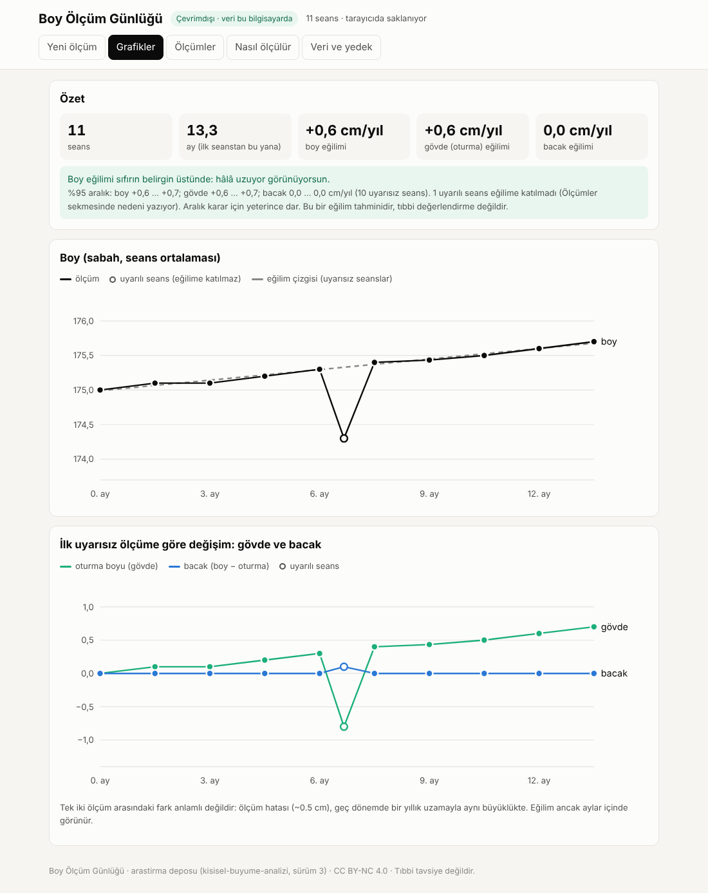
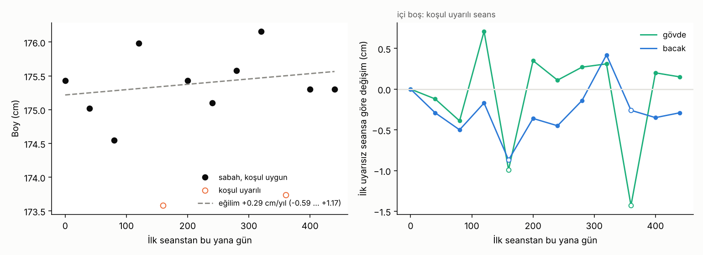

# Kişisel Büyüme Analizi · Sürüm 3: Ölçüm Günlüğü (çevrimdışı uygulama ve ön kayıtlı analiz)

> **Sürüm:** 3 · **Tarih:** 2026-10-08 · **Durum:** güncel
>
> **Acelen varsa:** en alttaki [En basit özet](#en-basit-özet) bölümüne atla.
>
> Bu doküman **tıbbi tavsiye değildir.** Evde ölçülen eğilim bir tahmindir; hekim değerlendirmesinin ve görüntülemenin (kemik yaşı röntgeni) yerini tutmaz.
>
> **Gizlilik:** Bu sürümdeki bütün veriler **uydurmadır** (test ve örnek). Gerçek ölçümler kullanıcının bilgisayarında kalır; analiz çıktıları `.kisisel/` klasörüne yazılır ve repoya girmez.

**Kanıt seviyeleri:**

| Etiket | Anlamı |
|---|---|
| **A** | Meta-analiz ya da birden çok randomize kontrollü çalışma |
| **B** | Tek RCT ya da büyük, iyi tasarlanmış kohort |
| **C** | Gözlemsel çalışma, mekanizma, uzlaşı/kılavuz eşiği |
| **V** | Bu çalışmanın kendi gerçek veri analizi ya da yazılım testi |
| **D** | Model çıktısı ya da varsayım |

---

## Soru ve kapsam

Sürüm 1 eski, belirsiz ölçümlerle "hâlâ uzuyor muyum?" sorusunu cevaplayamadı: aralıklar fazla genişti. Doğru cevap ancak **bundan sonra, aynı koşulda, düzenli** alınan ölçümlerle verilebilir. Bu sürümün soruları:

1. Bu ölçümleri **verileri hiçbir yere göndermeden**, iki tıkla açılan bir araçla nasıl toplarız?
2. Veri aylar sonra geldiğinde hangi analiz yapılacak? Bunu **veri gelmeden önce** sabitlemek.
3. Karar verebilmek için **ne kadar süre** ölçmek gerekir?

**Kapsam dışı:** Tanı, tedavi, büyüme plağının açık olup olmadığını belirlemek. Evde ölçüm bu son soruyu güvenilir biçimde cevaplayamaz (bkz. Sonuç 4).

## Önceki sürümden değişenler

| Konu | Sürüm 2 | Sürüm 3 |
|---|---|---|
| Veri | Geçmiş okul/ev ölçümleri ve tahliller | **Yeni, ileriye dönük** sabah ölçümleri: boy ve oturma boyu, seans başına 3'er okuma |
| Araç | Python betikleri | Ek olarak tek dosyalık **çevrimdışı uygulama** ([`uygulama/boy-olcum-gunlugu.html`](uygulama/boy-olcum-gunlugu.html)) |
| Analiz | Sürüm 1'in Bayesçi tahmini | Ek olarak **ön kayıtlı eğilim analizi** ([`analiz/calistir.py`](analiz/calistir.py)); yeni ölçümler sürüm 1'in sonsalına da eklenebilir |
| Sürüm 1 ve 2'nin sonuçları | – | Değişmedi |

## Yöntem

### 1. Uygulama: nasıl kurulur

1. [`boy-olcum-gunlugu.html`](uygulama/boy-olcum-gunlugu.html) dosyasını indir ve masaüstüne koy.
2. Çift tıkla; tarayıcıda açılır. Kurulum, internet ve hesap gerekmez.
3. İlk açılışta "Veri ve yedek" sekmesinden tabure yüksekliğini gir. İstersen doğum ayını da gir (yalnız yaşı hesaplamak için).
4. Her seansta "Yeni ölçüm" sekmesine boyu ve oturma boyunu 3'er kez gir.

**Veri nerede durur:** Tarayıcının o dosyaya özel deposunda (localStorage), yalnız o bilgisayarda. İsteğe bağlı olarak bir kayıt dosyası bağlanabilir (Chrome/Edge). Böylece her kayıt diske de yazılır.

**Veri güvenliği nasıl sağlanıyor:**
- Sayfanın içinde bir **İçerik Güvenlik Politikası** (CSP) var: `connect-src 'none'`, `default-src 'none'`. Tarayıcı, sayfanın herhangi bir sunucuya istek atmasını **kendisi** engeller. Bu yalnız bir söz değil, U1 testiyle doğrulandı.
- Dış kütüphane, yazı tipi ya da analitik yok; bütün kod tek dosyada ve okunabilir.

**Yedek uyarısı:** Tarayıcı geçmişi "site verileriyle birlikte" silinirse ölçümler de silinir. Bu yüzden uygulama ayda bir yedek dosyası indirmeyi hatırlatır. Yedeği başka bir yere (USB, bulut klasörü) kopyalamak kullanıcıya kalmış.

**Ölçüm protokolü** ([omurga büyümesi, sürüm 1](../../omurga-buyumesi/1-kaldiraclar-protokol-ve-animasyon/README.md)):
- Sabah, kalktıktan sonraki ilk saat içinde.
- Çıplak ayak, aynı duvar, kafada gönye ya da kitap.
- Boy ve oturma boyu 3'er kez. Bacak = boy − oturma boyu.

**Kendiliğinden uyarılar.** Bir seans aşağıdaki durumlardan birinde "uyarılı" sayılır:
- okumalar arasında 0.8 cm'den fazla fark var,
- saat 05:00'ten önce ya da 11:00'den sonra,
- kalkıştan 60 dakikadan fazla geçmiş,
- öncesinde egzersiz yapılmış.

**Araştırma dosyası** (yeterli veri biriktiğinde paylaşmak için) **kimliksizdir:**
- tarih yerine ilk seanstan bu yana geçen gün,
- doğum tarihi yerine bir ondalıklı yaş,
- ad ve not yok. Notlar yalnız seçilirse eklenir.

### 2. Ön kayıtlı analiz planı (veri gelmeden önce sabit)

[`analiz/calistir.py`](analiz/calistir.py) dosyası araştırma dosyasını şu adımlarla işler. Kural, gerçek veri görülmeden **önce** bu sürümle birlikte commit edildi; sonradan değiştirilirse sapma olarak bu klasörde kaydedilir.

| Adım | Ne yapılır |
|---|---|
| 1 Kalite | **Ana analiz** yalnız uyarısız seanslarla yapılır. Bütün seanslarla yapılan analiz duyarlılık analizidir |
| 2 Eğilim | Boy, oturma boyu (gövde) ve bacak için seans ortalamalarına doğrusal regresyon. Eğim cm/yıl, %95 aralık t dağılımıyla |
| 3 Karar (K1: boy, K2: gövde ve bacak ayrı ayrı) | Aralığın alt sınırı > 0 → **"hâlâ uzuyor"**. Üst sınırı < 0.3 cm/yıl → **"durmuş ya da çok yavaş"**. İkisi de değilse → **"belirsiz"** |
| 4 Sonsal (isteğe bağlı) | Yaş varsa ve `--girdi` verilirse yeni sabah ölçümleri sürüm 1'in Bayesçi modeline eklenir. Kalan büyüme önce ve sonra raporlanır. Etkin örneklem < 100 ise sonsal "güvenilir değil" diye işaretlenir |
| 5 Süre tablosu | Seanslar arası oynaklık ve ölçüm sıklığına göre karar için kaç ay gerektiği hesaplanır (veriden bağımsız) |

0.3 cm/yıl eşiği, omurga sürüm 1'deki geç dönem bacak uzama hızıdır. Uygulamanın "Grafikler" sekmesi aynı kuralı (uyarısız seanslar, aynı regresyon) kullanır. Uyarılı seanslar grafikte içi boş gösterilir.

**Çalıştırma:**
```
cd analiz
pip install -r requirements.txt
python calistir.py                                     # uydurma örnek → ciktilar/ornek/
python calistir.py boy-olcum-arastirma.json            # gerçek dosya → ../.kisisel/ (repoya girmez)
```

### 3. Testler

- **Uygulama:** [`uygulama/test_uygulama.py`](uygulama/test_uygulama.py) uygulamayı gerçek bir Chromium'da açar ve uydurma 10 seansla dokuz testi (U1-U9) çalıştırır.
- **Analiz:** uydurma bir dosyayla (12 seans, 2'si akşam) uçtan uca çalıştırıldı.

## Bulgular

### Uygulama testleri: 9/9 geçti

Kaynak: [`uygulama/ciktilar/testler.json`](uygulama/ciktilar/testler.json).

| Test | Ne sınandı | Sonuç |
|---|---|---|
| U1 | Sayfadan dış adrese istek (fetch ve resim) | İkisi de **engellendi** |
| U2 | 10 seans girişi; oturma boyundan tabure çıkarılıyor mu | 10 seans; ilk oturma boyu 92.00 cm (beklenen 92.0) |
| U3 | Eğilim: uydurma veride gövde +0.6, bacak 0 cm/yıl | Gövde +0.62, bacak 0.00 |
| U4 | Sayfa kapanıp açılınca veri duruyor mu | 10 seans duruyor |
| U5 | Yedek indirme ve geri yükleme | Yedekte 10 seans; geri yüklemede tekrar yok |
| U6 | Araştırma dosyası kimliksiz mi | Tarih, doğum ayı ve not **yok**; gün 0…405, yaş 1 ondalık |
| U7 | Açık tema, koyu tema ve telefon genişliği | Ekran görüntüleri alındı |
| U8 | Akşam ölçülmüş (−1 cm) bir seans eğilimi bozuyor mu | Eğilime katılmadı, gövde eğimi değişmedi (+0.62); grafikte içi boş |
| U9 | Uygulamanın süre hesabı analiz koduyla aynı mı | Aynı (SD 0.3 cm: haftada bir 12 ay, ayda bir 19 ay) |



### Akşam ölçümleri sonucu nasıl bozuyor (uydurma örnek)

Örnek dosya 12 seanstan oluşuyor, yaklaşık 40 günde bir. Gerçekte gövde yılda +0.5 cm uzuyor, bacak uzamıyor. 2 seans akşam alınmış (−1 cm). Kaynak: [`analiz/ciktilar/ornek/analiz.json`](analiz/ciktilar/ornek/analiz.json).

| Analiz | Boy eğimi (cm/yıl) | %95 aralık | Seanslar arası SD | Karar |
|---|---|---|---|---|
| Ana: yalnız uyarısız 10 seans | +0.29 | −0.59 … +1.17 | 0.47 cm | belirsiz |
| Duyarlılık: bütün 12 seans | +0.06 | −1.35 … +1.48 | 0.83 cm | belirsiz |

İki akşam ölçümü aralığı **yaklaşık 1.6 kat** genişletti ve eğimi sıfıra çekti. yaklaşık 14.5 ay ölçüm yapılmış olsa bile, bu oynaklık düzeyinde karar "belirsiz" çıkıyor.



### Karar için ne kadar süre gerekir

Aşağıdaki süreler, eğimin %95 aralığının ±0.3 cm/yıl'a inmesi için gereken süredir. Bu genişlikte aralık, "durmuş" ile "yılda 0.6 cm uzuyor" arasında ayrım yapabilir. Kaynak: [`analiz/ciktilar/ornek/sure.json`](analiz/ciktilar/ornek/sure.json).

| Seanslar arası oynaklık (SD) | Haftada bir | 2 haftada bir | Ayda bir |
|---|---|---|---|
| 0.2 cm (çok tutarlı) | 9 ay (40 seans) | 12 ay | 15 ay |
| 0.3 cm | **12 ay (53 seans)** | 15 ay | 19 ay |
| 0.4 cm | 15 ay | 18 ay | 23 ay |
| 0.5 cm (tutarsız) | 17 ay | 21 ay | 27 ay |

**Omurga sürüm 1'deki "ayda bir, 18 ay → %86" sonucuyla fark:** O sonuç, gövdenin gerçekten 0.6 cm/yıl uzadığı durumda bunun **fark edilme olasılığıydı**. Buradaki tablo daha katı bir hedefi gösteriyor: hangi yönde olursa olsun **karar verebilecek** kadar dar bir aralık. Bu hedef, "durmuş" sonucunu da kapsıyor.

**Seanslar arası SD gerçekte ne kadar?** Bilinmiyor; kişiye ve ölçüm disiplinine bağlı. Bu yüzden uygulama, 6 uyarısız seanstan sonra kişinin kendi SD'sini hesaplar ve kalan süreyi ona göre söyler.

### Sonsal güncelleme: çalışma testi (uydurma)

Aşağıdaki girdiler kullanıldı:
- sürüm 1'in uydurma `ornek_girdi.json` dosyası,
- yukarıdaki uydurma araştırma dosyası (sabah seansları 0.4 cm hatayla, akşam seansları "saat bilinmiyor" diye eklendi).

| | Kalan büyüme (25 yaşa), cm: P10 / P50 / P90 |
|---|---|
| Önce (yalnız eski ölçümler) | 2.6 / 3.0 / 3.5 |
| Sonra (+12 seans) | 0.9 / 1.0 / 1.2 |
| Etkin örneklem (sonra) | **15** → "güvenilir değil" uyarısı |

Bu test yalnız kodun çalıştığını gösteriyor; sayıların bir anlamı yok. Önemli bulgu etkin örneklem: Yeni ve sık ölçümler eklendiğinde 1.2 milyon önsel eğrinin yalnız ~15'i ağırlık taşıyor. Bu durumda sonsal aralık yapay olarak dar çıkar. Gerçek veride de aynı şey olursa, ağırlıklı yeniden örnekleme yerine daha büyük bir önsel ya da MCMC gerekir.

## Sonuçlar

1. **Ölçümler bilgisayardan çıkmadan toplanabiliyor.** Tarayıcı, uygulamanın dış adrese her türlü isteğini engelliyor; araştırma dosyasında tarih, doğum tarihi ve not yok. (V)
2. **Analiz kuralı veriden önce sabitlendi.** Ana analiz uyarısız seanslarla yapılıyor. Karar eşikleri: alt sınır > 0 ise "uzuyor", üst sınır < 0.3 cm/yıl ise "durmuş". (D)
3. **Gerçekçi süre: haftada bir ölçümle yaklaşık 1 yıl, ayda bir ölçümle yaklaşık 1.5 yıl.** Bu süre, seanslar arası oynaklığın 0.3 cm civarında tutulabildiği varsayımına dayanıyor. Oynaklık 0.5 cm'ye çıkarsa süre 1.4-2.3 yıla uzar. (D)
4. **Ölçüm disiplini, ölçüm sıklığından daha önemli.** Örnekte iki akşam ölçümü aralığı 1.6 kat genişletti. Gün içindeki kısalma (~1.4 cm), geç dönemdeki yıllık uzamadan büyük. Yılda ~0.3 cm'lik bacak uzaması evde ölçümle güvenilir biçimde ayırt edilemiyor. "Büyüme plağım açık mı?" sorusunun cevabı kemik yaşı röntgenindedir. (C + D)
5. **Sürüm 1'in sonsalı yeni ölçümlerle güncellenebiliyor, ama yöntem sınırda.** Sık ölçümler etkin örneklemi düşürüyor (uydurma testte 15). Kod bunu tespit edip uyarı veriyor. (D)

## Sınırlamalar

- **Tek kişi, ileriye dönük, henüz veri yok.** Bütün bulgular uydurma veriyle yapılan testler ve hesaplardan geliyor.
- **Seanslar arası SD varsayım.** Süre tablosu 0.2-0.5 cm aralığını tarıyor. Gerçek değer ilk 6 aydan sonra belli olur.
- **Doğrusal eğilim varsayımı.** Geç ergenlikte büyüme yavaşlayarak durur. 1-2 yıllık pencerede doğrusal model ortalama hızı verir, yavaşlamayı ayrıca yakalamaz.
- **Ev ölçümünde sistematik hata.** Duvar, tabure ya da gönye değişirse bu, eğilimde sahte bir sıçrama yaratır. Uygulama bunu tespit edemez; not alanına yazılması önerilir.
- **Tarayıcı deposu kalıcı değil.** Site verileri silinirse kayıtlar gider. Yedek sorumluluğu kullanıcıda.
- **Kayıt dosyasına otomatik yazma** yalnız Chromium tabanlı tarayıcılarda (Chrome, Edge) çalışıyor. Firefox'ta yalnız indirilen yedek var.
- **Sonsal güncelleme** sürüm 1'in kalibrasyon sorununu (aralıklar fazla dar) devralıyor ve düşük etkin örneklemle daha da kötüleşebiliyor.

## Kaynaklar

- [Omurga büyümesi, sürüm 1: evde ölçüm protokolü ve güç simülasyonu; gün içi disk değişimi](../../omurga-buyumesi/1-kaldiraclar-protokol-ve-animasyon/README.md)
- [Spor ve boy, sürüm 1: gün içi boy değişimi ve duruş](../../spor-egzersiz-ve-boy/1-fizik-tabanli-simulasyon/README.md)
- [Kişisel büyüme analizi, sürüm 1: Bayesçi tahmin ve Berkeley doğrulaması](../1-belirsiz-olcumlerle-tahmin/README.md)
- [MDN: Content-Security-Policy, `connect-src`](https://developer.mozilla.org/en-US/docs/Web/HTTP/Reference/Headers/Content-Security-Policy/connect-src)
- [MDN: Window.showSaveFilePicker (File System Access API)](https://developer.mozilla.org/en-US/docs/Web/API/Window/showSaveFilePicker)

## En basit özet

- **Bir uygulama yapıldı:** Masaüstüne koy, çift tıkla, ölçümü gir. İnternete hiçbir şey göndermiyor; bu, testle doğrulandı.
- **Haftada bir, sabah kalkınca ölç.** Boy ve oturma boyu 3'er kez, yaklaşık 5 dakika.
- **Sabır gerekiyor:** Net bir cevap için haftada bir ölçümle yaklaşık 1 yıl, ayda bir ölçümle yaklaşık 1.5 yıl gerekiyor. Uygulama, senin ölçümlerinin ne kadar tutarlı olduğuna bakıp kalan süreyi kendisi söylüyor.
- **Akşam ölçümü sonucu bozar.** Örnekte iki akşam ölçümü belirsizliği 1.6 kat artırdı. Uygulama bu seansları ayırıyor.
- **Bitince "Araştırma dosyası"nı oluştur ve paylaş.** Dosyada ad ve tarih yok. Analiz kuralı şimdiden sabitlendi, sonradan değiştirilmeyecek.
- **Ayda bir yedek al.** Tarayıcı verisi silinirse ölçümler gider.
- **Benzetme:** Bir bitkinin büyüyüp büyümediğini anlamak için her gün aynı saatte, aynı cetvelle ölçersin. Bir gün sabah, bir gün akşam ölçersen, yaprakların sarkması büyüme gibi görünür. Bu uygulama o cetvel ve defter.
