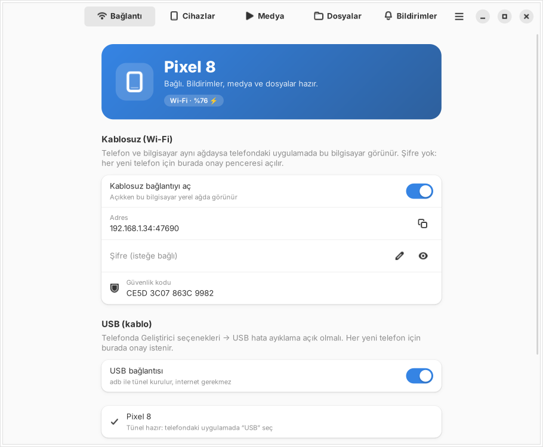
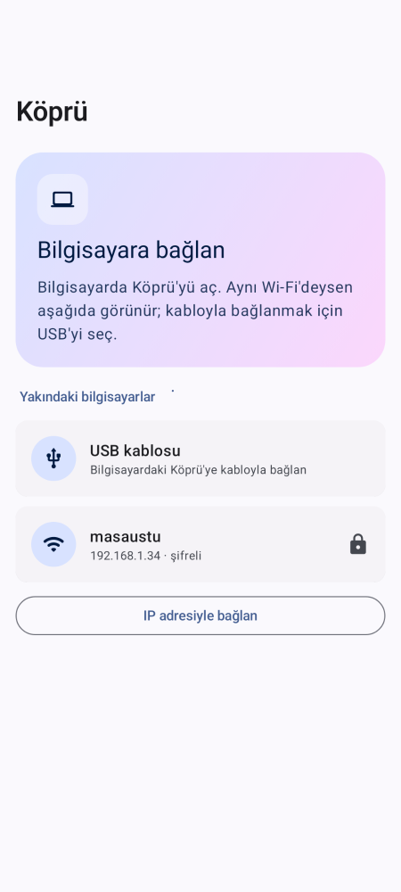
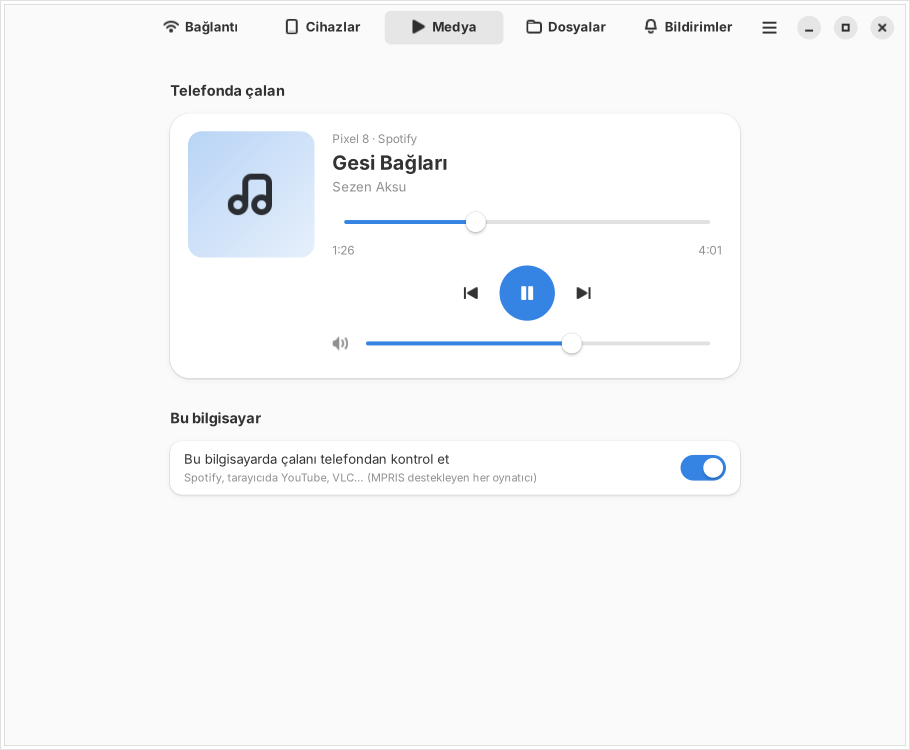
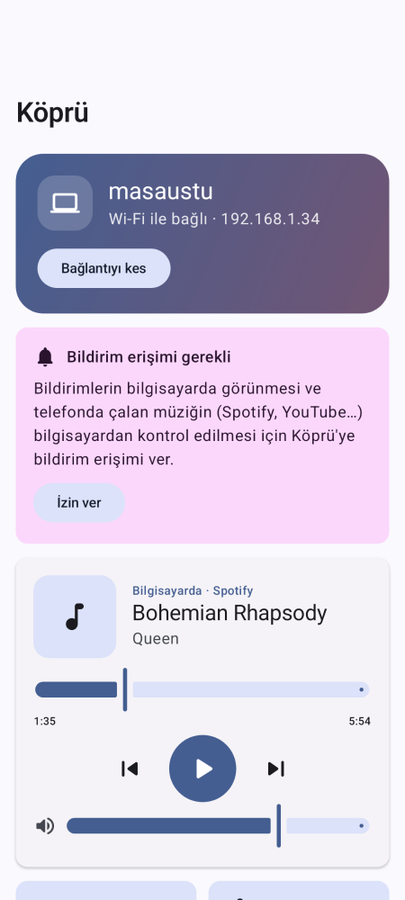
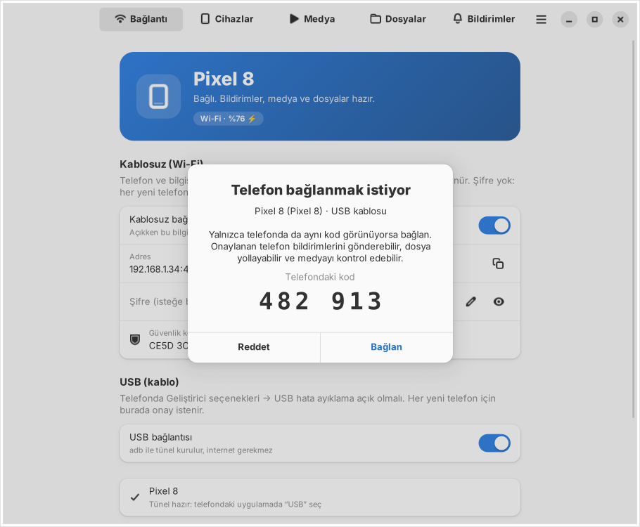
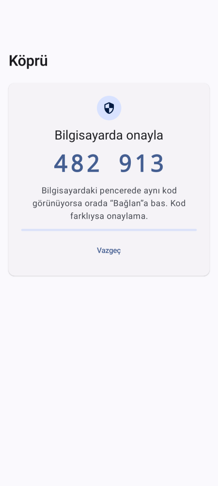

# Köprü

Linux bilgisayar ile Android telefonu **USB kablosuyla** ya da **Wi-Fi üzerinden** bağlayan uygulama.
İki parçası var: Linux masaüstü uygulaması (Python + GTK4/libadwaita) ve Android uygulaması (Kotlin + Jetpack Compose, Material 3).

**Durum:** ilk sürüm (0.1.0). Gerçek bir telefonda henüz denenmedi; neyin nasıl test edildiği aşağıda, [Ne test edildi](#ne-test-edildi) bölümünde.

| Linux | Android |
|---|---|
|  |  |
|  |  |
|  |  |

## Ne yapar

| Özellik | Yön | Not |
|---|---|---|
| Bildirimler | telefon → bilgisayar | Telefon bildirimi masaüstünde uygulama simgesiyle çıkar; telefonda silinince masaüstünden de kalkar. Müzik/indirme gibi süren bildirimler gönderilmez. |
| Telefonda çalan medya | telefon → bilgisayar | Spotify, YouTube, YouTube Music… Kapak, şarkı, ilerleme; bilgisayardan oynat/duraklat/atla/sar/ses. |
| Bilgisayarda çalan medya | bilgisayar → telefon | Spotify masaüstü, tarayıcıda YouTube, VLC (MPRIS destekleyen her oynatıcı); telefondan kontrol. |
| Dosya gönderme | iki yön | Telefondan: "Paylaş → Köprü" ya da uygulamadaki "Dosya gönder". Bilgisayardan: pencereye sürükle-bırak ya da "Dosya seç". SHA-256 ile doğrulanır. |
| Gelen dosyalar klasörü | | Bilgisayarda varsayılan `~/İndirilenler/Kopru` (ayarlardan değişir, "Klasörü aç" düğmesi var). Telefonda `İndirilenler/Kopru`. |
| Pano | iki yön | Düğmeyle gönderilir (Android arka planda panoyu okumaya izin vermez). |
| Bağlantı açma | telefon → bilgisayar | Telefonda bir YouTube bağlantısını "Paylaş → Köprü" yapınca bilgisayarın tarayıcısında açılır. |
| Telefonu bul | bilgisayar → telefon | Telefon sessizdeyken de 30 sn çalar. |
| Pil | telefon → bilgisayar | Bilgisayardaki pencerede görünür. |

## Nasıl bağlanır

**USB (onaylı):** Telefonda *Geliştirici seçenekleri → USB hata ayıklama* açık olmalı. Kablo takılınca bilgisayardaki Köprü `adb` ile tünel kurar.
Telefonda "USB kablosu"na basınca bilgisayarda **onay penceresi** açılır; iki ekranda da aynı 6 haneli kod görünür, aynıysa "Bağlan". İnternet ya da Wi-Fi gerekmez.

**Wi-Fi:** Bilgisayarda "Kablosuz bağlantıyı aç". Aynı ağdaki telefonda bilgisayar listede görünür (görünmezse "IP adresiyle bağlan").
- **Şifre koyduysan** telefon şifreyi sorar.
- **Şifre koymadıysan** USB'deki gibi bilgisayarda onay penceresi açılır.

Bir kez eşleşen telefon sonra şifre/onay sormadan bağlanır (bilgisayarda *Cihazlar → Güvenilen cihazlar*'dan unutulabilir) ve bağlantı koparsa 2 dakika boyunca kendiliğinden yeniden dener.

## Kurulum

### Linux

**Ubuntu / Debian / Linux Mint / Pop!_OS: terminal gerekmez.**
`kopru_0.1.0_all.deb` dosyasına çift tıkla, açılan Uygulama Merkezi'nde (ya da "Yazılım Kur" penceresinde) **Kur**'a bas.
GTK, libadwaita ve adb gibi gereken her şeyi paket yöneticisi kendisi kurar. Sonra Köprü uygulama menüsünde durur.
Çift tıklayınca arşiv yöneticisi açılırsa: sağ tık → "Birlikte aç" → Uygulama Merkezi.
Kaldırmak için: Uygulama Merkezi → Yüklü → Köprü → Kaldır.

Uygulamanın içinden, terminal açmadan:
- **adb eksikse** *Bağlantı → USB* bölümünde **Kur** düğmesi çıkar. Bilgisayarın kendi şifre penceresi açılır ve adb, dağıtımın paket yöneticisiyle (apt, dnf, pacman, zypper) kurulur.
- **Oturum açılınca başlat** (*Bağlantı → Genel*): bilgisayar açılınca Köprü pencere açmadan arka planda başlar, telefon kendiliğinden bağlanır.

`.deb` dosyasını üretmek (geliştirici için, bir kez): `sh kopru/linux/paket/deb-olustur.sh`

**Fedora, Arch ve diğerleri:** henüz paket yok; bir kez terminalde bağımlılıkları kurup betiği çalıştırmak gerekiyor.
Sonrası yine menüden açılan uygulama:

```bash
# Fedora:  sudo dnf install python3-gobject gtk4 libadwaita python3-cryptography android-tools
# Arch:    sudo pacman -S python-gobject gtk4 libadwaita python-cryptography android-tools
cd kopru/linux
sh kur.sh            # yalnızca bu kullanıcıya kurar, sudo gerekmez
sh kur.sh --kaldir   # kaldır
```

Gerekenler: Python 3.10+, GTK 4, libadwaita 1.4+ (Ubuntu 24.04, Debian 13, Fedora 39+, güncel Arch).
Kurmadan denemek için: `cd kopru/linux && python3 -m kopru`.
Güvenlik duvarı (ufw) açıksa Wi-Fi için şu izin bir kez verilmeli: `sudo ufw allow 47600/tcp && sudo ufw allow 47601/udp`.

### Android (APK)

Android 10 ve üstü. APK'yı kendin derlemek için JDK 17+ ve Android SDK gerekir:

```bash
cd kopru/android
echo "sdk.dir=$HOME/Android/Sdk" > local.properties   # SDK nerede kuruluysa
./gradlew assembleRelease
adb install app/build/outputs/apk/release/app-release.apk
```

Derlenen APK hata ayıklama anahtarıyla imzalanır (doğrudan yüklemek için yeterli, Play Store için değil).
Başka bir bilgisayarda derlenmiş APK'nın üzerine yüklerken imza farkı yüzünden önce eskisini kaldırman gerekebilir.

İlk açılışta telefonda:
1. **Bildirim izni** (Android 13+): bağlantı ve gelen dosya bildirimleri için.
2. **Bildirim erişimi** ("İzin ver" kartı): bildirimlerin bilgisayara gitmesi ve telefonda çalan müziğin kontrolü için. Vermezsen dosya, pano ve bilgisayardaki medya kontrolü yine çalışır.
3. **Pil kısıtlamasını kaldır** (ayarlarda): ekran kapalıyken bağlantı kopmasın diye. Bazı üreticiler (Xiaomi, Samsung, Huawei) arka plandaki uygulamaları yine de kapatabilir.

## Güvenlik: nasıl çalışıyor, nerede sınırı var

- Bütün trafik **TLS** ile şifreli. Bilgisayarın sertifikası kendinden imzalı; telefon ilk eşleşmede sertifikanın parmak izini kaydeder ve sonra değişirse bağlanmayı reddeder ("güvenlik kodu değişmiş").
- **İlk eşleşme** en zayıf an: onay yönteminde iki ekrandaki kodu karşılaştırman, şifre yönteminde ise şifre penceresindeki güvenlik kodunun bilgisayardakiyle aynı olduğuna bakman araya girme saldırısına karşı korur. Kodlara bakmadan onaylarsan bu koruma yok.
- **Şifre seçimi:** aynı ağda araya giren biri, şifreyle eşleşme sırasında yakaladığı kanıt üzerinden zayıf bir şifreyi çevrimdışı deneyerek bulabilir. Kısa/tahmin edilir şifre koyma; ya da şifresiz bırakıp onay penceresini kullan.
- Bilgisayar aynı IP'den 10 dakikada 5 hatalı denemede o IP'yi geçici olarak engeller.
- Eşleşmiş bir telefon: bildirim gösterebilir, gelen dosyalar klasörüne dosya yazabilir (başka klasöre yazamaz, var olan dosyanın üzerine yazamaz), panonu değiştirebilir, tarayıcında http/https bağlantısı açabilir ve medyayı kontrol edebilir. **Komut çalıştıramaz, dosya okuyamaz.**
- USB'de onay penceresi şart: bilgisayardaki herhangi bir yerel program da `127.0.0.1:47600`'e bağlanabileceği için USB bağlantısı otomatik güvenilir sayılmaz.
- Ayarlar ve belirteç özetleri `~/.config/kopru/` altında, yalnızca senin okuyabileceğin izinlerle (600) durur. Şifre orada düz metin olarak saklanır (doğrulama için gerekli).

## Bilinen sınırlamalar

- **Linux ↔ Linux** bağlantısı yok. Protokol buna uygun ama Linux tarafında istemci yazılmadı; şimdilik yalnızca Linux ↔ Android.
- iPhone yok.
- Bildirime bilgisayardan **cevap yazma** yok.
- GTK4'te sistem tepsisi simgesi olmadığı için pencere kapanınca uygulama arka planda sürer; tekrar açmak için uygulama menüsünden Köprü'ye tıkla. Tamamen kapatmak: menü → "Tamamen kapat" (Ctrl+Q).
- Birden fazla telefon aynı anda bağlanabilir, ama sürükle-bırak dosyalar **en son bağlanan** telefona gider (diğerine *Cihazlar* sayfasındaki düğmeyle gönderilir).
- Keşif UDP yayınıyla çalışır: misafir ağları ve "istemci yalıtımı" açık modemler yayını engeller; o durumda IP adresiyle bağlan.
- Yalnızca Ubuntu/Debian ailesi için paket (.deb) var; Fedora (rpm), Flatpak ve Snap paketi yok.

## Ne test edildi

| Ne | Nasıl | Sonuç |
|---|---|---|
| Linux çekirdeği | 14 birim/uçtan uca test: gerçek TLS sunucusu + Python ile yazılmış sahte telefon (USB onayı, reddetme, belirteçle yeniden bağlanma, Wi-Fi şifresi, deneme sınırı, iki yönlü dosya, bozuk dosyanın atılması, `../` içeren dosya adları, bildirim/pano/bağlantı, medya komutu) | geçti |
| Android ↔ Linux protokol uyumu | Android'in ağ kodu (Android'e bağımlı olmadığı için) JVM'de **gerçek Linux sunucusuna** bağlandı: şifre istenmesi → şifreyle eşleşme → 900 KB telefondan, 700 KB bilgisayardan dosya (SHA-256) → belirteçle şifresiz bağlanma | geçti |
| Şifre kanıtı, onay kodu, çerçeve | Python ve Kotlin aynı test vektörlerini üretiyor | geçti |
| `.deb` paketi | Ubuntu 24.04'te `apt install ./kopru_0.1.0_all.deb`: bağımlılıklar ve adb otomatik geldi, menü kısayolu ve `kopru` komutu çalıştı. Çift tıklayıp Uygulama Merkezi'nden kurma burada denenemedi (masaüstü yok). | geçti |
| adb "Kur" düğmesi, otomatik başlatma | Komutun başarılı ve iptal edilmiş hâli sahte komutla denendi; otomatik başlatma dosyası yazılıp silindi. Gerçek `pkexec` şifre penceresi denenmedi. | geçti |
| Linux arayüzü | Sanal ekranda örnek veriyle çalıştırılıp ekran görüntüsü alındı (geniş ve 400 px dar pencere) | yukarıdaki görüntüler |
| Android arayüzü | Paparazzi (layoutlib) ile ekran görüntüsü | yukarıdaki görüntüler |
| Android derlemesi | `assembleRelease` + Android lint | 0 hata |
| **Gerçek telefon** | — | **denenmedi.** Bildirim dinleyici, medya oturumları, MediaStore'a dosya yazma, ön plan servisi, USB tüneli ve Wi-Fi keşfi ancak gerçek cihazda doğrulanabilir. İlk denemede sorun çıkarsa beklenen yer burası. |

Testleri çalıştırmak:

```bash
cd kopru/linux && python3 -m unittest discover -s tests -v       # Linux çekirdeği
sh kopru/linux/tests/android_canli_test.sh                        # Android ağ kodu ↔ gerçek Linux sunucusu
cd kopru/android && ./gradlew testReleaseUnitTest lintRelease      # Android birim testleri + lint
```

Gerçek telefon olmadan bilgisayar tarafını denemek için sahte telefon:
`python3 kopru/linux/tests/sahte_telefon.py 127.0.0.1 --dosya resim.jpg` (bilgisayarda onay penceresi açılır).

## Klasörler

```
kopru/
  PROTOKOL.md                    tel protokolü
  protokol-test-vektorleri.json  iki dilin ortak test vektörleri
  ekran/                         ekran görüntüleri
  linux/
    kopru/                       Python paketi
      hub.py                     sunucu, kimlik doğrulama, oturumlar, dosya aktarımı
      protocol.py auth.py        çerçeve ve eşleştirme hesapları
      discovery.py usb.py        Wi-Fi keşfi, adb tüneli
      media.py                   MPRIS (bilgisayardaki oynatıcılar)
      ui/                        GTK4 + libadwaita arayüzü
    tests/                       testler, sahte telefon, ekran görüntüsü betiği
    kur.sh                       kullanıcıya kurulum (paketi olmayan dağıtımlar)
    paket/deb-olustur.sh         Ubuntu/Debian için .deb paketi
    data/                        masaüstü kısayolu, simge, uygulama mağazası bilgisi
  android/                       Gradle projesi (Kotlin + Compose)
    app/src/main/java/lab/crucible/kopru/
      net/                       protokol istemcisi (Android'den bağımsız)
      core/                      uygulama durumu, medya, dosyalar, bildirimler
      service/                   ön plan servisi, bildirim dinleyici
      ui/                        Compose ekranları
```
