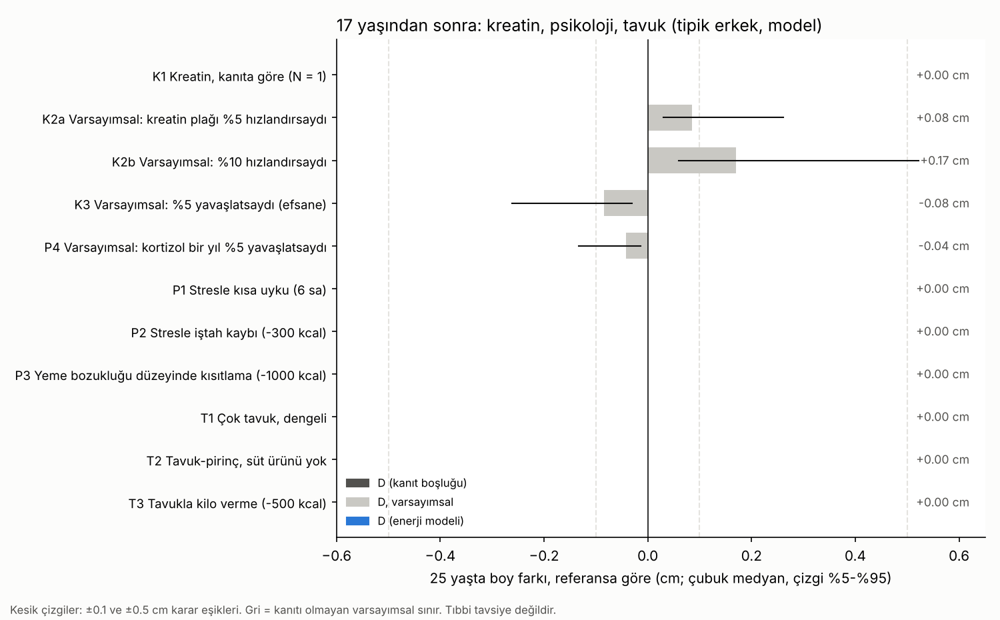

# Kreatin, Psikoloji ve Çok Tavuk · Sürüm 1: Literatür ve Simülasyon

> **Sürüm:** 1 · **Tarih:** 2026-10-08 · **Durum:** güncel
>
> **Acelen varsa:** en alttaki [En basit özet](#en-basit-özet) bölümüne atla.
>
> Bu doküman **tıbbi tavsiye değildir** ve bir takviye ya da doz önermez. Takviye kullanmayı düşünüyorsan ya da yemeyle, stresle veya ruh halinle ilgili zorlanıyorsan bir hekimle konuş.

**Kanıt seviyeleri:**

| Etiket | Anlamı |
|---|---|
| **A** | Meta-analiz ya da birden çok randomize kontrollü çalışma |
| **B** | Tek RCT ya da büyük, iyi tasarlanmış kohort |
| **C** | Gözlemsel çalışma, olgu serisi, derleme, mevzuat |
| **V** | Bu depodaki gerçek veri analizi |
| **D** | Model çıktısı, simülasyon ya da varsayım |

---

## Soru ve kapsam

17 yaşındaki bir erkek için üç soru:

1. **Kreatin:** Günde 3 g takviye kreatin almak, genetik boy potansiyeline ulaşmayı destekler mi, engeller mi?
2. **Psikoloji:** Stres, kaygı ya da "bilinçaltı" boyu etkiler mi?
3. **Çok tavuk:** Çok tavuk yemek büyümeye zarar verir mi, potansiyele ulaşmayı engeller mi?

**Önemli ayrım: kreatin ve kreatinin farklı şeylerdir.**
- *Kreatin*, kaslarda enerji deposu olarak kullanılan bir maddedir. Etten gelir, vücut da üretir; takviye olarak satılan budur.
- *Kreatinin*, kreatinin yıkım ürünüdür. Kan tahlilinde böbrek göstergesi olarak ölçülür.

Tahlilde "kreatin" değil kreatinin ölçülür; yüksek çıkması iyi bir şey değil, böbrek açısından değerlendirilen bir bulgudur. Bu araştırma soruyu "günde 3 g takviye kreatin almak" olarak ele alıyor.

**Kapsam dışı:** Takviye ya da doz önerisi. Kızlar. Yeme bozukluğu ve depresyonun tedavisi.

**Benzetme:** 17 yaşında büyüme plakları, kapanmak üzere olan bir fabrika gibidir; önünde yalnızca birkaç günlük iş kalmıştır. Hammaddeyi artırmak (kreatin, tavuk) ya da ustaların moralini düzeltmek veya bozmak (psikoloji), kalan işi en fazla o kalan iş kadar değiştirebilir. Bu araştırma önce o kalan işin ne kadar olduğunu ölçüyor, sonra her etkenin ondan ne kadar pay alabileceğine bakıyor.

## Yöntem

**1. Literatür taraması.**
- Kaynaklar: PubMed (NCBI E-utilities ile özet ve tam metin), resmi mevzuat sayfaları, USDA besin veritabanı.
- Her kaynak açılıp okundu. Açılamayanlar `[doğrulanmadı]` diye işaretlendi ve sonuçlarda kullanılmadı.
- Kreatin ve boy için dört PubMed sorgusuyla 426 başlık elle tarandı.
- Kritik dört kaynak (Korovljev 2021, Modan-Moses 2003, Metzger 2023, ISSN 2017) ikinci kez açılıp sayıları kontrol edildi.

**2. Simülasyon** ([PLAN.md](simulasyon/PLAN.md), kod ve sonuçlardan önce commit edildi).
- **Yeni model kurulmadı.** Depodaki üç model olduğu gibi kullanıldı:
  - büyüme plağı modeli ([boy uzaması sürüm 3](../../boy-uzamasi-16-18-yas/3-mekanistik-simulasyon-ve-on-kayit/));
  - sanal kohort ([spor araştırması](../../spor-egzersiz-ve-boy/1-fizik-tabanli-simulasyon/));
  - enerji, iştah ve vücut bileşimi modeli ([beslenme-uyku araştırması](../../beslenme-uyku-ve-boy/1-fizyoloji-simulasyonu/)).
- **Kohort:** 2000 erkek, Türk uyarlamalı. Müdahale 17.0 yaşında başlıyor. Kreatin ve tavuk senaryoları 25 yaşa kadar alışkanlık olarak sürüyor; stres senaryoları bir sınav yılı sürüyor (17-18). Etki, aynı kişinin referans boyuyla eşleştirilerek 25 yaşta ölçülüyor.
- **Kanıtsız etkiye sayı uydurulmadı.** Kreatin ve sıradan stres için plağa giden ölçülmüş bir yol yok. Bu yüzden bunlar yalnızca **varsayımsal sınır** olarak hesaplandı: "Kreatin plağı %5 ya da %10 hızlandırsaydı en fazla ne olurdu?"
- **Tavuk senaryoları** gerçek USDA besin değerleriyle kuruldu. Sepet, aynı enerjiyi tavuktan alacak biçimde ölçeklendi.
- **Komut:** `cd simulasyon && python calistir.py` (~1 dk).

## Bulgular

### 1. Önce zemin: 17 yaşından sonra ne kadar büyüme kalıyor?

Modelde tipik bir erkeğin 17 → 25 yaş arası kalan boyu **medyan 1.71 cm** (kişilerin %90'ı 0.60-5.32 cm arasında). (D)

Her şey bu payla sınırlı. Hiçbir etken plağın zaten yapmayacağı işi yaptıramaz.

### 2. Kreatin

**Literatür:**

| Soru | Bulgu | Kanıt |
|---|---|---|
| Boy, büyüme plağı ya da kemik yaşı ölçen çalışma var mı? | **Yok.** 4 sorgu, 426 başlık. Bu bir kanıt boşluğu, "etkisiz olduğu kanıtlandı" değil. | – |
| "Kreatin plağı kapatır" iddiası | Destekleyen insan ya da hayvan çalışması **yok**. Kurumların ergenlerde çekinme nedeni plak değil: kanıt azlığı, ürün kirlenmesi, ileride steroide geçiş riski. | C |
| Gözlemsel boy ilişkisi | NHANES, 2-19 yaş, n = 4291: diyetle alınan her 0.1 g/gün kreatin, düzeltilmiş modelde +0.30 cm boyla ilişkili (Korovljev 2021). Kesitsel; çok et yiyen çocuk daha çok protein ve enerji de alıyor. Son yazarın kreatin üreticisiyle çıkar ilişkisi var. | C |
| Hormonlar | Erişkinde tek seferde 20 g → GH ortalama +%83 (n = 6). Egzersize GH yanıtı değişmiyor. Kas içi IGF-I artışı anlamlı değil (p = 0.06). Ergen verisi yok. | C |
| Vücuda etkisi | Direnç antrenmanıyla yağsız kütle +1.1 kg (35 RCT); antrenmansız etki yok. İlk haftalarda 1-3 kg kilo artışı, çoğu su. | A |
| Güvenlik, ergen | Çalışmalar kısa (7-49 gün) ve küçük; 13 çalışma, 268 kişi, kalite düşük, "güvenliği incelemek için tasarlanmış çalışma yok" (Metzger 2023). Kısa sürede böbrek ve karaciğer sinyali yok. | C |
| Kurumlar | ISSN (2017): denetimli antrenman, dengeli beslenme ve doğru kullanım koşuluyla gençlerde kabul edilebilir. AAP: 18 yaş altında önermiyor (ikincil kaynaktan; AAP metninin kreatin bölümü açılamadı, `[doğrulanmadı]`). ISSN ve bazı derlemelerin yazarlarının kreatin üreticisiyle mali ilişkisi var. | C |
| Tahlil tuzağı | Kreatin kullanan birinde kan kreatinini yükselir ama ölçülen böbrek süzme hızı değişmez (vaka: 1.03 → 1.27 mg/dL, ölçülen GFR 81.6 → 82.0). Kreatinine dayalı tahlil yanlışlıkla "böbrek sorunu" gibi okunabilir. Takviye kullanılıyorsa tahlilden önce hekime söylenmeli. | C |

**Simülasyon (25 yaşta boy farkı, medyan; %5-%95):**

| # | Senaryo | Fark | Sınıf |
|---|---|---|---|
| K1 | Kreatin, kanıta göre (plağa etki yok) | 0 cm | etki yok (D) |
| K2a | Varsayımsal: plağı %5 hızlandırsaydı | +0.08 cm (0.03 … 0.26) | etki yok (D, varsayımsal) |
| K2b | Varsayımsal: %10 hızlandırsaydı | +0.17 cm (0.06 … 0.52) | ölçülemeyecek kadar küçük (D, varsayımsal) |
| K3 | Varsayımsal: %5 yavaşlatsaydı (efsane) | −0.08 cm (−0.26 … −0.03) | etki yok (D, varsayımsal) |

- **Kanıtı olmayan %10'luk iyimser varsayımda bile** medyan kazanç 1.7 mm. Bu, boy ölçümünün kendi hatasından (3-5 mm) küçük.
- Aynı %10 varsayımıyla takviyeye 16 yaşında başlansaydı bile kazanç +0.34 cm olurdu.
- Plakları geç kapanan bir kişide (en geniş kalan pay) varsayımsal kazanç 1.5 cm'ye kadar çıkabiliyor. Ama bu da kanıt değil, varsayımsal üst sınır.
- **Gözlemsel katsayının sağduyu kontrolü (R5):** Korovljev katsayısı nedensel okunsaydı günde 3 g → +9 cm demek olurdu. Kohortun %98.9'unda 17 yaşından sonra kalan büyüme bundan küçük. Yani o katsayı "kreatin boy uzatır" diye okunamaz; et yiyen, iyi beslenen çocukların daha uzun olduğunu gösteriyor.

### 3. Psikoloji ve "bilinçaltı"

**Literatür:**

| Durum | Bulgu | Kanıt |
|---|---|---|
| Ağır ihmal ve istismar (psikososyal kısa boy) | GH baskılanıyor; çocuk ortamdan alınınca geri dönüyor. Serilerde %41 istismar, çoğu ergenlik öncesi çocuk. Yakalama çoğu zaman tam değil (son boy −2.4 SDS, hedef −1.5). | C |
| Erkek ergen anoreksiyası | Boy SDS'si hastalık öncesi −0.21'den başvuruda −0.81'e düştü. 12 hastanın 9'unda tam yakalama olmadı (n = 12, Modan-Moses 2003). | C |
| Kronik glukokortikoid fazlası | Büyüme plağında kondrositleri baskılıyor (mekanizma derlemesi). Psikolojik stresin bu yolu ne kadar kullandığı belirsiz. | C |
| Sıradan stres (sınav, günlük kaygı) | Sağlıklı ergende boya etkisini ölçen çalışma **bulunamadı**. | – |
| Kaygı ve depresyon | Çocuklukta kaygı bozukluğu, kızlarda daha kısa erişkin boyla ilişkili; erkeklerde ilişki yok (Pine 1996, özet). | C |
| Uyku | GH derin uykuda salgılanıyor. Ama uyku süresi ile boy arasındaki ilişki zayıf, kanıt yetersiz. | C |
| Görselleştirme, olumlama, subliminal ses | Boy için kontrollü çalışma **yok**. Kilo vermek için satılan subliminal kasetler plasebodan farksız (Merikle 1992). | C |
| Boy kaygısı | Kısa boylu gençlerin psikolojik uyumu büyük ölçüde normal. Boy memnuniyetsizliği yalnızlıkla ilişkili; gerçek boy değil. | C |

**Simülasyon (25 yaşta boy farkı, medyan):**

| # | Senaryo (17-18 yaş, bir yıl) | Fark | Not |
|---|---|---|---|
| P1 | Stresle kısa uyku (6 sa) | 0 cm | Kilo +3.1 kg (kısa uykuyla gelen ek yeme). Uykunun büyümeye doğrudan etkisi %5 varsayılırsa −0.04 cm. (D) |
| P2 | Stresle iştah kaybı (−300 kcal/gün) | 0 cm | Kilo −2.4 kg. Enerji, büyümeyi frenleyecek eşiğe inmiyor. (D) |
| P3 | Sert kısıtlama (−1000 kcal/gün)* | 0 cm | Kilo −8 kg. En düşük enerji uygunluğu 34; eşik 30. (D) |
| P4 | Varsayımsal: kortizol plağı bir yıl %5 yavaşlatsaydı | −0.04 cm (−0.13 … −0.01) | (D, varsayımsal) |
| P5 | "Bilinçaltı", olumlama | simüle edilmedi | Plağa giden mekanizma yok. Psikolojinin ölçülen boya gerçek bir etkisi var ama kemikle ilgisi yok: dik ve kambur duruş arası ~3 mm ([omurga büyümesi](../../omurga-buyumesi/1-kaldiraclar-protokol-ve-animasyon/)). |

\* Planda bu senaryoya "yeme bozukluğu düzeyinde" adı verilmişti. Bu bir planlama hatasıydı: hareketsiz bir erkekte −1000 kcal, büyümeyi frenleyen eşiğe inmiyor. Gerçek anoreksiya çok daha ağır. Ad, ön kayıt bozulmasın diye değiştirilmedi ([Plandan sapmalar](simulasyon/PLAN.md), bölüm 7).

**Keşifsel (ön kayıtlı değil): ağır durumların tavanı.**
- Enerji modeliyle anoreksiya düzeyi (−1500 ve −2000 kcal, iştah sinyali kapalı) denendi. Model metabolik uyumu içermediği için geçersiz sonuç verdi: yağ kütlesi sıfırın altına indi. Model bu durumu temsil edemiyor.
- Yerine "modelin izin verdiği en kötü durum" hesaplandı: büyüme bir yıl boyunca yarı hızda.

| # | Senaryo | 25 yaşta fark (medyan; %5-%95) |
|---|---|---|
| X1 | Bir yıl yarı hız, **17-18 yaşta** | −0.41 cm (−1.34 … −0.14) |
| X2 | Aynı darbe, **14-15 yaşta** | −2.92 cm (−4.19 … −1.13) |

Aynı darbe 14 yaşında 17 yaşındakinin yedi katı zarar veriyor, çünkü 14'te önde çok daha fazla büyüme var. Bu, anoreksiyalı erkek gençlerdeki gerçek kayıplarla (hedef boydan yaklaşık 0.3 SDS, yani 2 cm civarı) aynı büyüklükte. Model yakalama büyümesini zayıf gösterdiği için bu sayılar üst sınırdır. (D)

### 4. Çok tavuk

**Literatür:**

| Soru | Bulgu | Kanıt |
|---|---|---|
| Tavukta hormon var mı? | Kanatlılara hormon verilmesi AB'de (Direktif 96/22/EC), ABD'de (FSIS: "Hormones are not allowed in raising hogs or poultry") ve Türkiye'de (2003/18 sayılı Tebliğ; Tarım ve Orman Bakanlığı: "hormon kullanılmaz… yasal değil, ekonomik değil, uygulanabilir değil") yasak. | C |
| Piliçler neden bu kadar hızlı büyüyor? | Genetik seçilim: aynı yemle 1957 soyuna göre 2005 soyu %400'ün üzerinde daha hızlı büyüyor (Zuidhof 2014). | B |
| Etteki östrojen | Et ve sütte benzer düzeyde (10-100 ng/kg). Günlük östradiolün asıl kaynağı süt ve yumurta. | C |
| Antibiyotik kalıntısı | Ankara'da tavuk örneklerinin %45.7'sinde kinolon kalıntısı bulundu (2013; özet, yasal sınırın aşılıp aşılmadığını söylemiyor). Polonya'da 2023-24'te 178 örnekte sınır aşımı yok. Büyümeyle bağlantı gösteren çalışma yok. | C |
| Çok protein | 14-18 yaş için protein üst sınırı (UL) belirlenmemiş. Bu, sınırsız güvenli demek değil, yeterli veri yok demek. Sağlıklı yetişkinde yüksek protein böbrek süzmesini değiştirmiyor (28 RCT). Fazla proteinin 16-18 yaşta büyümeyi hızlandırdığına kanıt yok. | A / C |
| Erken ergenlik | Kızlarda zayıf, gözlemsel ilişkiler var (tüm et türleri için benzer). 17 yaşındaki erkek için konu dışı; ergenlik büyük ölçüde tamamlanmış. | C |
| Boyu kısaltır mı? | Bunu gösteren çalışma yok. | – |

**Simülasyon: sepetler (aynı enerji, 2782 kcal/gün, 64.6 kg)**

| Sepet | Protein (g/kg) | Enerjinin protein payı | Kalsiyum (RDA'nın %'si) | D vitamini (%) | Demir (%) | Çinko (%) |
|---|---|---|---|---|---|---|
| B1 Dengeli (referans) | 1.9 | %17.6 | 108 | 33* | 236 | 133 |
| T1 Çok tavuk, dengeli | 3.1 | %28.6 | 94 | 33* | 212 | 140 |
| T2 Tavuk-pirinç, süt ürünü yok | 3.7 | **%34.4** | **34** | **4** | 194 | 107 |

\* B1 ve T1'deki D vitamini, USDA'daki D katkılı ABD sütünden geliyor. Türkiye'de süt çoğunlukla katkısız; gerçek değer daha düşük olabilir.

**Boy farkı (25 yaş):** T1, T2 ve T3 (tavukla kilo verme, −500 kcal) üçü de **0 cm**. Bütün varyantlarda aynı sonuç (sağlam). T3'te kilo −4 kg, ama enerji eşiğin altına inmiyor. (D)

**Asıl risk tavuk değil, tek tip beslenme.** T2'de kalsiyum ihtiyacın yalnızca %34'ü, D vitamini %4'ü. Protein enerjinin %34'ü; bu, önerilen %10-30 aralığının üstünde. Model mikro besinleri boya bağlamıyor (17 yaşından sonrası için mm'ye çevirecek kaynak yok). Ama kalsiyum ve D vitamini kemik yoğunluğu için önemli. Süt ürünlerinin boy etkisi ise ergenlerde tartışmalı (bir meta-analizde yılda +0.4 cm, son derlemede sonuçsuz).

### Testler

[ciktilar/testler.csv](simulasyon/ciktilar/testler.csv). Altı ön kayıtlı testin altısı geçti.

| Test | Ne sınıyor | Sonuç | |
|---|---|---|---|
| R1 | Sıfır kontrolü: etkisiz senaryo = model | fark 0 cm | ✅ |
| R2 | Enerji korunumu | göreli hata 3·10⁻¹³ | ✅ |
| R3 | Tavan: çarpanı ≤ 1 olan hiçbir senaryoda kimse uzamıyor | en büyük fark 0 cm | ✅ |
| R4 | Yön: K3 < referans < K2a < K2b | −0.085 < 0 < +0.085 < +0.170 | ✅ |
| R5 | Korovljev katsayısı nedensel okunursa (+9 cm), kalan paydan büyük mü | kişilerin %98.9'unda evet | ✅ |
| R6 | Sayısal yakınsama | 0.0005 cm | ✅ |

**Duyarlılık** ([duyarlilik.csv](simulasyon/ciktilar/duyarlilik.csv), [karar_K3.csv](simulasyon/ciktilar/karar_K3.csv)): Enerji eşiğinin biçimi, en düşük çarpan, iştah geri beslemesi ve başlangıç kilosu değiştirildi. Hiçbir senaryonun sınıfı değişmedi; hepsi "sağlam".

## Sonuçlar

1. **Günde 3 g kreatinin boy potansiyeline ulaşmayı desteklediğine dair kanıt yok; engellediğine dair de yok.** Boy ya da büyüme plağı ölçen tek bir kreatin çalışması bulunamadı. (C)
2. **Kreatin plağı hızlandırsaydı bile 17 yaşından sonra kazanç ölçülemeyecek kadar küçük kalırdı:** %10'luk iyimser varsayımda medyan +1.7 mm. Çünkü kalan büyüme payı zaten medyan 1.7 cm. (D)
3. **Kreatinin bilinen etkisi kas ve kuvvet üzerinde, antrenmanla birlikte;** boy üzerinde değil. Ergenlerde uzun süreli güvenlik verisi yok; AAP 18 yaş altında önermiyor. Kullanılıyorsa kan kreatinini yükseltir ve tahlili yanıltabilir. (A + C)
4. **Sıradan stresin, kaygının ya da "bilinçaltı"nın boyu değiştirdiğine dair kanıt yok.** Modelde sınav yılı stresi (kısa uyku, iştah kaybı) 0 cm. Görselleştirme ve olumlama için hiç çalışma yok. (C + D)
5. **Psikolojinin gerçekten boyu düşürdüğü durumlar ağırdır:** ağır ihmal ve istismar, anoreksiya, uzun süreli ciddi enerji açığı. Bunlar da 17 yaşında 14 yaşına göre çok daha az zarar verir (en kötü durumda bir yılda −0.4 cm'ye karşı −2.9 cm). (C + D)
6. **Çok tavuk yemek boya zarar vermez; tavukta hormon kullanımı Türkiye'de yasak.** Fazla protein büyümeyi hızlandırmaz, sağlıklı böbreğe zarar verdiğine de kanıt yok. (C + D)
7. **Asıl risk tek tip beslenme:** tavuk süt ürünlerinin yerini alırsa kalsiyum ihtiyacın yaklaşık üçte biri, D vitamini neredeyse sıfır kalır. (D)

## Sınırlamalar

- **Kanıt boşluğu sayıyla kapatılmadı.** Kreatin ve stres için verilen mm değerleri varsayımsal sınırlardır, kanıt değildir.
- **Model 17 yaşındaki tipik bir erkeği temsil ediyor.** Plakları geç kapanan biri için kalan pay (ve varsayımsal etkiler) daha büyük olabilir: kohortta en geniş kalan pay 15 cm'yi buluyor. Kişisel durumu ancak kemik yaşı grafisi ya da düzenli ölçüm gösterir.
- **Enerji modeli ağır kısıtlamayı temsil edemiyor** (metabolik uyum yok). Anoreksiya düzeyi için yalnızca tavan hesabı yapıldı.
- **Mikro besinler (kalsiyum, D vitamini) boya bağlanmadı.** Eksiklik raporlandı ama mm'ye çevrilmedi.
- **Literatürdeki çıkar ilişkileri:** Kreatin derlemelerinin önemli bir kısmının yazarları kreatin üreticisiyle bağlantılı. Bağımsız uzun süreli ergen çalışması yok.
- **Bazı kaynaklar tam metin açılamadı:** AAP 2016 raporunun kreatin bölümü, Pine 1996'nın tam metni. Bunlar sonuçlarda yalnızca özet düzeyinde kullanıldı.
- Kullanılan modellerin (boy uzaması sürüm 3, beslenme-uyku sürüm 1) bütün sınırlamaları geçerli; özellikle model yakalama büyümesini zayıf gösteriyor.

## Kaynaklar

**Kreatin**
- [Korovljev D ve ark. Nutrients 2021;13:1027](https://pubmed.ncbi.nlm.nih.gov/33806719/): NHANES, diyet kreatini ve boy (kesitsel)
- [Metzger GA ve ark. J Orthop 2023;38:73](https://pubmed.ncbi.nlm.nih.gov/37008451/): çocuk ve ergen sporcularda kreatin, sistematik derleme
- [Kreider RB ve ark. JISSN 2017;14:18](https://pubmed.ncbi.nlm.nih.gov/28615996/): ISSN pozisyon bildirisi
- [Jagim AR, Kerksick CM. Nutrients 2021;13:664](https://pubmed.ncbi.nlm.nih.gov/33670822/): çocuk ve ergenlerde kreatin
- [LaBotz M, Griesemer BA. Pediatrics 2016;138:e20161300](https://pubmed.ncbi.nlm.nih.gov/27354458/): AAP, performans artırıcı maddeler (yalnız özet)
- [Herriman M ve ark. Pediatrics 2017;139:e20161257](https://pubmed.ncbi.nlm.nih.gov/28044048/): AAP'nin kreatin tutumu ve mağaza önerileri
- [Schedel JM ve ark. J Sports Med Phys Fitness 2000;40:336](https://pubmed.ncbi.nlm.nih.gov/11297004/): akut GH
- [Op 't Eijnde B, Hespel P. Med Sci Sports Exerc 2001;33:449](https://pubmed.ncbi.nlm.nih.gov/11252073/): egzersize hormon yanıtı
- [Burke DG ve ark. IJSNEM 2008;18:389](https://pubmed.ncbi.nlm.nih.gov/18708688/): kas içi IGF-I
- [Delpino FM ve ark. Nutrition 2022;103-104:111791](https://pubmed.ncbi.nlm.nih.gov/35986981/): yağsız kütle meta-analizi
- [Antonio J ve ark. JISSN 2021;18:13](https://pubmed.ncbi.nlm.nih.gov/33557850/): kreatin hakkında yaygın sorular
- [Gualano B ve ark. Am J Kidney Dis 2010;55:e7](https://pubmed.ncbi.nlm.nih.gov/20060630/): kreatinin yükselir, ölçülen GFR değişmez
- [Gualano B ve ark. Eur J Appl Physiol 2008;103:33](https://pubmed.ncbi.nlm.nih.gov/18188581/): sistatin C
- [Brosnan JT ve ark. Amino Acids 2011;40:1325](https://pubmed.ncbi.nlm.nih.gov/21387089/): günlük kreatin döngüsü

**Psikoloji**
- [Gohlke BC ve ark. J Pediatr Endocrinol Metab 1998;11:509](https://pubmed.ncbi.nlm.nih.gov/9777571/) · [2004;17:637](https://pubmed.ncbi.nlm.nih.gov/15198295/) · [Acta Paediatr 2002;91:961](https://pubmed.ncbi.nlm.nih.gov/12412873/): psikososyal kısa boy
- [Albanese A ve ark. Clin Endocrinol 1994;40:687](https://pubmed.ncbi.nlm.nih.gov/8013149/) · [Skuse D ve ark. Lancet 1996;348:353](https://pubmed.ncbi.nlm.nih.gov/8709732/)
- [Hochberg Z. Horm Res 2002;58 Suppl 1:33](https://pubmed.ncbi.nlm.nih.gov/12373012/): glukokortikoid ve büyüme plağı
- [Pine DS ve ark. Pediatrics 1996;97:856](https://pubmed.ncbi.nlm.nih.gov/8657527/): kaygı, depresyon ve boy (yalnız özet)
- [Modan-Moses D ve ark. Pediatrics 2003;111:270](https://pubmed.ncbi.nlm.nih.gov/12563050/): erkek ergen anoreksiyası · [JCEM 2021](https://pubmed.ncbi.nlm.nih.gov/32816013/): kızlar
- [Denholm R ve ark. Int J Epidemiol 2013;42:1399](https://pubmed.ncbi.nlm.nih.gov/24019423/): ihmal ve erişkin boy
- [Van Cauter E ve ark. JAMA 2000;284:861](https://pubmed.ncbi.nlm.nih.gov/10938176/): derin uyku ve GH
- [El Halal CDS, Nunes ML. J Pediatr (Rio J) 2019;95 Suppl 1:2](https://pubmed.ncbi.nlm.nih.gov/30528567/): uyku ve büyüme
- [Merikle PM, Skanes HE. J Appl Psychol 1992;77:772](https://pubmed.ncbi.nlm.nih.gov/1429349/): subliminal kasetler
- [Sandberg DE, Voss LD. Best Pract Res Clin Endocrinol Metab 2002;16:449](https://pubmed.ncbi.nlm.nih.gov/12464228/): kısa boy ve psikolojik uyum

**Tavuk ve protein**
- [Directive 96/22/EC (legislation.gov.uk kopyası)](https://www.legislation.gov.uk/eudr/1996/22/article/3)
- [USDA FSIS, Meat and Poultry Labeling Terms](https://www.govinfo.gov/content/pkg/GOVPUB-A110-PURL-gpo112408/pdf/GOVPUB-A110-PURL-gpo112408.pdf)
- [Resmî Gazete, 19.06.2003, Tebliğ 2003/18](https://www.resmigazete.gov.tr/eskiler/2003/06/20030619.htm) (bugünkü yürürlüğü doğrulanmadı)
- [Tarım ve Orman Bakanlığı, Piliç Eti Hakkında Doğru Bilinen Yanlışlar](https://www.tarimorman.gov.tr/GKGM/Belgeler/Tuketici_Bilgi_Kosesi/Dogru_Bilinen_Yanlislar/Pilic_Eti,_Hakkinda_Dogru_Bilinen_Yanlislar.pdf)
- [Zuidhof MJ ve ark. Poult Sci 2014;93:2970](https://pubmed.ncbi.nlm.nih.gov/25260522/): 1957-2005 piliç büyümesi
- [Courant F ve ark. J Agric Food Chem 2008;56:3176](https://pubmed.ncbi.nlm.nih.gov/18412364/): gıdalarda östrojen
- [Er B ve ark. Poult Sci 2013;92:2212](https://pubmed.ncbi.nlm.nih.gov/23873571/) · [Buczkowska M ve ark. 2025](https://pubmed.ncbi.nlm.nih.gov/40504870/): antibiyotik kalıntısı
- [Devries MC ve ark. J Nutr 2018;148:1760](https://pubmed.ncbi.nlm.nih.gov/30383278/): yüksek protein ve böbrek
- [IOM DRI makrobesin tablosu (Health Canada)](https://www.canada.ca/en/health-canada/services/food-nutrition/healthy-eating/dietary-reference-intakes/tables/reference-values-macronutrients-dietary-reference-intakes-tables-2005.html)
- [de Beer H. Econ Hum Biol 2012;10:299](https://pubmed.ncbi.nlm.nih.gov/21890437/) · [de Lamas C ve ark. Adv Nutr 2019;10:S88](https://pubmed.ncbi.nlm.nih.gov/31089738/): süt ürünleri ve büyüme
- [USDA FoodData Central](https://fdc.nal.usda.gov/): besin değerleri (SR Legacy 2018-04)

**Bu depodan:** [beslenme-uyku sürüm 1](../../beslenme-uyku-ve-boy/1-fizyoloji-simulasyonu/README.md) · [boy uzaması sürüm 3](../../boy-uzamasi-16-18-yas/3-mekanistik-simulasyon-ve-on-kayit/README.md) · [omurga büyümesi sürüm 1](../../omurga-buyumesi/1-kaldiraclar-protokol-ve-animasyon/README.md)

## En basit özet

- **Kreatin boyunu uzatmaz, kısaltmaz da;** bunu ölçen çalışma yok. Kasa ve kuvvete etkisi var, antrenmanla. 17 yaşında kalan büyüme zaten ~1.7 cm; en iyimser hayalde bile kazanç 2 mm'nin altında. 18 yaş altında kullanmadan önce hekime sor; kullanırsan tahlilde kreatinin yükselebilir, söylemeyi unutma.
- **"Bilinçaltı", olumlama, görselleştirme kemiğe etki etmez.** Sınav stresi de boyu değiştirmiyor. Psikoloji ancak ağır durumlarda zarar verir: istismar, yeme bozukluğu, uzun süre aç kalmak. Bunlar varsa yardım almak boydan çok daha önemli.
- **Çok tavuk yemek zarar vermez; tavukta hormon yasak ve kullanılmıyor.** Fazla protein de boy uzatmaz.
- **Tek tuzak: yalnızca tavuk-pirinç yemek.** Süt, yoğurt, peynir kesilirse kalsiyum ve D vitamini eksik kalır. Tavuk ye ama süt ürünlerini bırakma.
- **Formül aynı:** yeterli enerji, yeterli protein, çeşitli besin, düzenli uyku. Plaklar açıksa gerisini genetik yapar.
