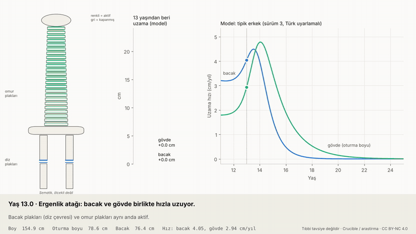
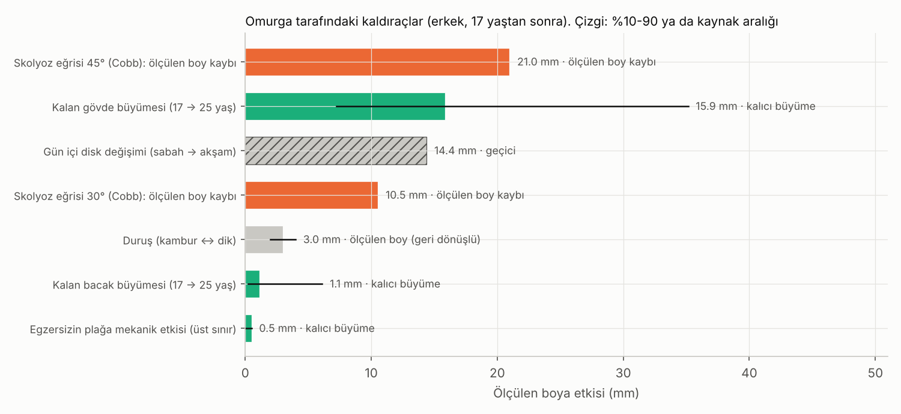
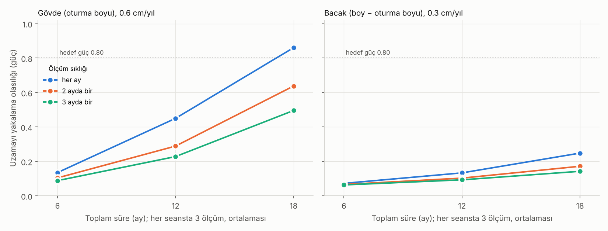

> **Güncel sürüm:** [2-bilgilendirme-videosu](../2-bilgilendirme-videosu/). Bu sürüm dondurulmuştur.

# Omurga Büyümesi · Sürüm 1: Kaldıraçlar, Ölçüm Protokolü ve Animasyon

> **Sürüm:** 1 · **Tarih:** 2026-10-08 · **Durum:** güncel
>
> **Acelen varsa:** en alttaki [En basit özet](#en-basit-özet) bölümüne atla.
>
> Bu doküman **tıbbi tavsiye değildir.** Skolyoz, kifoz ya da sırt ağrısı şüphesinde hekime git. Tedavi (korse, ameliyat, ilaç) yalnızca **hekim kararıyla** yapılır.

**Kanıt seviyeleri:**

| Etiket | Anlamı |
|---|---|
| **A** | Meta-analiz ya da birden çok randomize kontrollü çalışma |
| **B** | Tek RCT ya da büyük, iyi tasarlanmış kohort |
| **C** | Gözlemsel çalışma, ölçüm çalışması, derleme |
| **V** | Bu depodaki gerçek veri analizi (Berkeley) |
| **D** | Model çıktısı, simülasyon ya da varsayım |

*Animasyon (14 saniye; [MP4](simulasyon/ciktilar/omurga_animasyon.mp4)):*
- *Sahne 1, yaş 13 → 22:* Tipik bir erkekte bacak ve omur plaklarının aktivitesi, uzama hızları ve 13 yaşından beri uzama.
- *Sahne 2:* Gece-gündüz disk değişimi.
- *Sahne 3:* 30° skolyozun ölçülen boya etkisi.

*Çizim şematiktir (ölçekli değil); ekrandaki sayılar modelden gelir ve testle doğrulandı (T1).*

---

## Soru ve kapsam

16 yaştan sonraki boy artışının ~%90'ı gövdeden geliyor (plak kapanma sırası araştırması). Bu yüzden şu sorular önemli:
1. **Omurga uzamasını ne destekler, ne engeller?** Her etkenin boya etkisi kaç milimetre? Hangisi kalıcı, hangisi geçici, hangisi yalnızca "ölçülen" boyu değiştirir?
2. **Evde ölçülebilir mi?** Oturma boyu ve boy ölçerek omurganın ya da bacağın hâlâ uzayıp uzamadığı anlaşılabilir mi? Kaç ölçüm gerekir? Bu araştırmayı herkesin uygulayabileceği bir **çalışma protokolüne** dönüştürmek.
3. **Süreç nasıl görünür?** Notlu bir animasyon.

**Kapsam dışı:** Tedavi önerisi. Skolyoz ve Scheuermann kifozu tanı ve tedavisi.

**Benzetme:** Omurga, araya yastıklar konmuş bir kitap yığını.
- Kitaplar (omurlar) yavaşça kalınlaşır: **kalıcı büyüme**.
- Yastıklar (diskler) gündüz ezilir, gece kabarır: **geçici**.
- Yığın eğilirse boyu kısa ölçülür, kitaplar kısalmasa bile: **eğrilik**.

## Yöntem

Ön kayıt: [simulasyon/PLAN.md](simulasyon/PLAN.md). Plan kod yazılmadan, kod çalıştırılmadan önce ayrı ayrı commit edildi.

- **A. Kaldıraç tablosu:** Her etkenin ölçülen boya etkisi (mm).
  - Kalan büyüme: sürüm 3 modeli, cinsiyet başına 5000 sanal kişi.
  - Skolyozun boy kaybı: Stokes 2008, 407 röntgen: kayıp (mm) = 1.0 + 0.066·Cobb + 0.0084·Cobb².
  - Duruş, mekanik yük ve gün içi değişim: spor ve boy araştırması sürüm 1.
- **B. Ölçüm protokolü simülasyonu:**
  - Seans başına k tekrarın ortalaması alınır.
  - Seans hatası = gün koşulu (σ_s = 0.3 cm) + okuma hatası (σ_o = 0.5 cm, ortalamayla küçülür).
  - Bacak = boy − oturma boyu olduğu için iki ölçümün hatasını taşır.
  - Doğru oturtup tek yönlü test (α = 0.05), 20 000 Monte Carlo tekrarı.
  - Gerçek hızlar Berkeley'den: gövde 0.6, bacak 0.3 cm/yıl (V).
  - Tasarımlar: aralık 1-6 ay, süre 6-18 ay, k = 1, 3, 5. Karar kuralı: güç ≥ 0.80 sağlayan en az ölçümlü tasarım.
- **C. Animasyon:**
  - Sürüm 3 modelinde bireysel parametrelerin medyanıyla "tipik erkek".
  - Plak rengi, uzama hızıyla orantılı.
  - Notlar, modelden hesaplanan olay yaşlarına göre değişir: en hızlı büyüme 13.8; bacak yılda < 0.3 cm 16.4; gövde yılda < 1 cm 17.1; gövde yılda < 0.1 cm 20.7.
- `cd simulasyon && python calistir.py` (~30 sn, ffmpeg gerekir). Tohum 20261008.

## Bulgular

### 1. Ön kayıtlı testler

Kaynak: [`testler.csv`](simulasyon/ciktilar/testler.csv).

| Test | Ne sınıyor | Sonuç | Ölçüt | |
|---|---|---|---|---|
| T1 | Animasyondaki sayılar = sürüm 3 modeli | fark 0 cm | < 1e-6 | ✅ |
| T2 | Stokes formülü kaynağın örneğini üretiyor mu (Cobb 30 → 40°) | 6.54 mm (kaynak ~6.7) | ±0.3 mm | ✅ |
| T3 | Protokol testi, büyüme yokken yanlış alarm oranı | 0.048 | 0.04-0.06 | ✅ |
| T4 | Monte Carlo kararlılığı | 0.002 | < 0.02 | ✅ |
| T5 | Animasyon dosyası | GIF 1.04 MB, 139 kare | < 5 MB, ≥ 60 | ✅ |

### 2. Omurga tarafındaki kaldıraçlar

Kaynak: [`kaldiraclar.csv`](simulasyon/ciktilar/kaldiraclar.csv).

| Kaldıraç | Ölçülen boya etkisi | Türü | Kanıt |
|---|---|---|---|
| **Kalan gövde büyümesi, 17 → 25 yaş (erkek)** | medyan **15.9 mm** (%10-90: 7.2-35.2) | kalıcı, biyolojik | D (Berkeley ile uyumlu, V) |
| Kalan gövde büyümesi, 16 → 25 yaş (erkek) | medyan 30.0 mm (13.6-65.5) | kalıcı | D |
| Kalan bacak büyümesi, 17 → 25 yaş (erkek) | medyan 1.1 mm (0.2-6.1) | kalıcı | D |
| Kalan gövde büyümesi, 17 → 25 yaş (kız) | medyan 2.3 mm (1.0-5.2) | kalıcı | D |
| **Skolyoz eğrisi 30° / 45°** | **10.5 / 21.0 mm** ölçülen boy kaybı | eğrilik (omurga kısalmaz) | C |
| Skolyoz eğrisi 10° / 20° | 2.5 / 5.7 mm | eğrilik | C |
| **Gün içi disk değişimi** | **14.4 mm** | **geçici**, her gün geri gelir | C |
| Duruş (kambur ↔ dik) | 2-4 mm | geri dönüşlü | D |
| Egzersizin plağa mekanik etkisi | < 0.5 mm (üst sınır) | kalıcı | D |
| Beslenme ve uyku (yeterliyse) | +0; ciddi eksiklikte birkaç mm'ye kadar kayıp | kalıcı | D |

**Ne anlama geliyor:**
- Omurga tarafında boyu **artıran** tek gerçek şey, kalan biyolojik büyümedir. O da genetik ve yaşla belirlenir; dışarıdan hızlandırılamaz, ancak **eksiklikle azaltılabilir**.
- Ölçülen boyu en çok değiştiren diğer iki şey omurganın uzunluğu değil, **şeklidir**:
  - eğrilik (skolyozda 30°'de ~1 cm);
  - günün saati (14 mm).
- Skolyoz ya da Scheuermann kifozu (omurların kama şeklini aldığı bir büyüme bozukluğu) gerçek bir sağlık konusudur. Scheuermann sıklığı çalışmalar arasında %0.4-10 bildiriliyor. Erken fark etmek "boy" için değil, sağlık için önemlidir; tedavi kararı hekimindir.
- Doğru teknikle yapılan ağırlık antrenmanının çocuk ve ergenlerde güvenli olduğu derlemelerde belirtiliyor. Spor araştırmamız da plağa mekanik etkisinin < 0.5 mm olduğunu bulmuştu. Yani ağırlık çalışmak omurganın büyümesini ne artırır ne kısar.

### 3. Evde ölçüm protokolü: ne kadar ölçüm gerekir?

Kaynak: [`protokol_tasarimlar.csv`](simulasyon/ciktilar/protokol_tasarimlar.csv), [`protokol_duyarlilik.csv`](simulasyon/ciktilar/protokol_duyarlilik.csv).

| Tasarım (seans başına 3 ölçüm) | Gövde uzamasını yakalama (0.6 cm/yıl) | Bacak uzamasını yakalama (0.3 cm/yıl) |
|---|---|---|
| 3 ayda bir, 12 ay | %23 | %9 |
| 3 ayda bir, 18 ay | %50 | %14 |
| 2 ayda bir, 18 ay | %64 | %17 |
| **Her ay, 18 ay (önerilen; 57 ölçüm)** | **%86** | **%25** |
| Her ay, 18 ay, seansta 5 ölçüm | %92 | %28 |

**Duyarlılık** (önerilen tasarımda gövde için güç):
- **Seans koşulunu sabitlemek en etkili adım:** koşul farkı 0 cm'de güç **%99**, 0.5 cm'de %64.
- Okuma hatası: 0.3 cm'de %95, 0.8 cm'de %67.
- Gövde hızı: yılda 1.0 cm'de %100, 0.3 cm'de %39.
- Bacak hızı yılda 0.5 cm olsa bile 18 ayda yakalama olasılığı %49.

**Pratik protokol:** [olcum-protokolu.md](olcum-protokolu.md) (yazdırılabilir, kayıt tablolu).

## Sonuçlar

1. **Omurganın genetik potansiyelinin üstüne uzamasını sağlayan bilinen bir yöntem yok.** Omurga tarafında boyu artıran tek şey kalan biyolojik büyüme. Tipik bir erkekte 17 yaştan sonra ~1.6 cm (medyan, geniş aralıklı); kızlarda ~0.2 cm. Model, Berkeley verisiyle uyumlu. (D + V)
2. **Omurga büyümesini "desteklemek" pratikte eksik bırakmamak demek:** yeterli enerji ve protein, D vitamini, uyku, tedavi edilmemiş hastalık olmaması. Fazlası ek uzama getirmez. Bu, beslenme araştırmasının sonucudur. (D)
3. **Skolyoz eğriliği ölçülen boyu omurgayı kısaltmadan azaltır:** 30°'de ~1 cm, 45°'de ~2 cm. Bu, kalan büyümeyle aynı büyüklükte bir etki. Eğrilik şüphesi hekime gösterilmeli; amaç boy değil sağlık. (C)
4. **Gün içi disk değişimi (14 mm) geç dönemdeki bir-iki yıllık büyümeden büyük.** Sabah ve akşam ölçümlerini karşılaştırmak yanlış "uzadım ya da kısaldım" sonucu verir. (C)
5. **Duruş (2-4 mm) ve egzersizin mekanik etkisi (< 0.5 mm) küçük.** Ağırlık antrenmanı doğru teknikle güvenli; omurgayı ne uzatır ne kısaltır. (C + D)
6. **Evde ölçümle geç dönem omurga uzamasını yakalamak mümkün, ama disiplin ister:** 18 ay boyunca ayda bir, seansta 3 ölçüm (%86). En büyük kazanç seans koşulunu (saat, yer, duruş) sabitlemekten gelir. (D)
7. **Evde ölçümle "bacaklarım (diz plaklarım) hâlâ uzuyor mu?" sorusu güvenilir şekilde cevaplanamaz** (önerilen düzende %25). Bunun için hekimin isteyeceği görüntüleme gerekir. (D)

## Sınırlamalar

- **Kalan büyüme aralıkları model aralığıdır.** Kişisel analiz araştırmasında sürüm 3'ün aralıklarının gerçek bireylerde fazla dar olabildiği gösterilmişti.
- **Stokes formülü skolyozlu hastalardan türetildi** (frontal düzlem). Cobb = 0'da 1 mm veriyor (regresyon sabiti), bu yüzden 10°'nin altı yorumlanmadı. Sagital kifoz için ayrı bir formül kullanılmadı; duruş etkisi spor araştırmasından alındı.
- **Protokol simülasyonunun hata büyüklükleri varsayım.** Gerçek ev ölçümlerinde ölçülmedi; duyarlılık analizi bu yüzden önemli. Uzama doğrusal kabul edildi; 18 aylık pencerede gerçek uzama yavaşlar, bu da gücü biraz düşürür.
- **Oturma boyu yalnız omurga değildir:** leğen ve kafa tabanını da içerir.
- **Animasyon şematiktir.** Omur ve disk oranları, eğriliğin şekli ve kafa gerçek anatomiyi temsil etmez. Yalnızca ekrandaki sayılar ve hız eğrileri modeldir. "Tipik erkek" medyan parametrelerden kurulmuş tek bir eğridir; gerçek bireyler ondan sapar.
- **Ağırlık antrenmanının güvenliği** için tek bir sistematik derlemenin ifadesine dayanıldı (C). Bu derleme ağırlıklı olarak çocukları kapsıyor.

## Kaynaklar

- [Stokes 2008, Stature and growth compensation for spinal curvature, Stud Health Technol Inform](https://pubmed.ncbi.nlm.nih.gov/18809998/): boy kaybı (mm) = 1.0 + 0.066·Cobb + 0.0084·Cobb².
- [Insights into the Pathophysiology of Scheuermann's Kyphosis, Biomolecules 2025 (PMC12839117)](https://pmc.ncbi.nlm.nih.gov/articles/PMC12839117/): sıklık %0.4-10.
- [Effects of Supervised Strength Training on Physical Fitness in Children and Adolescents: A Systematic Review, JFMK 2025 (PMC12101325)](https://pmc.ncbi.nlm.nih.gov/articles/PMC12101325/): doğru uygulanan kuvvet antrenmanı güvenli ve etkili.
- [Büyüme plaklarının kapanma sırası, sürüm 1: Berkeley bacak/gövde analizi](../../buyume-plaklari-kapanma-sirasi/1-literatur-ve-berkeley-analizi/README.md)
- [Spor ve boy, sürüm 1: gün içi disk değişimi, duruş, mekanik etki](../../spor-egzersiz-ve-boy/1-fizik-tabanli-simulasyon/README.md)
- [Beslenme, uyku ve boy, sürüm 1](../../beslenme-uyku-ve-boy/1-fizyoloji-simulasyonu/README.md)
- [Boy uzaması, sürüm 3: büyüme plağı modeli](../../boy-uzamasi-16-18-yas/3-mekanistik-simulasyon-ve-on-kayit/README.md)

## En basit özet

- **Omurgayı genetiğinin üstüne uzatan bilinen bir yöntem yok.** 17 yaşından sonra tipik bir erkekte omurga ~1-2 cm daha uzar; bu kendiliğinden olur.
- **"Desteklemek" = eksik bırakmamak:** yeterince ye, D vitamini ve uykuyu ihmal etme, hastalık varsa tedavi ettir. Fazlası işe yaramaz.
- **Omurganın şekli, uzunluğundan çok fark ettirebilir.** 30°'lik bir skolyoz eğrisi ~1 cm boy götürür. Sırtında eğrilik ya da kamburluk fark edersen hekime git; konu boy değil, sağlık.
- **Akşam 1.4 cm kısa ölçülürsün,** ertesi sabah geri gelir. Hep sabah ölç.
- **Asılma, esneme ya da ağırlık omurgayı kalıcı uzatmaz ya da kısaltmaz.** Doğru teknikle ağırlık çalışmak güvenli.
- **Evde omurga büyümeni izlemek istiyorsan:** 18 ay boyunca ayda bir, sabah, aynı yerde, 3'er kez boy ve oturma boyu ölç. Ayrıntılar: [ölçüm protokolü](olcum-protokolu.md).
- **"Dizlerim hâlâ uzuyor mu?" sorusunu evde ölçümle anlayamazsın.** Bunu ancak hekimin istediği görüntüleme gösterir.
- **Benzetme:** Kitap yığını (omurga). Kitaplar yavaşça kalınlaşır (büyüme), yastıklar gündüz ezilir (disk), yığın eğilirse kısa görünür (skolyoz). Sadece ilki gerçek uzamadır.
