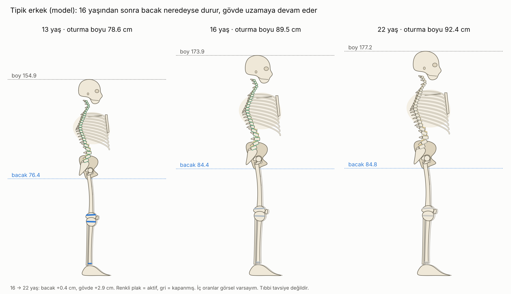

# Omurga Büyümesi · Sürüm 3: Anatomik İskelet

> **Sürüm:** 3 · **Tarih:** 2026-10-08 · **Durum:** güncel
>
> **Acelen varsa:** en alttaki [En basit özet](#en-basit-özet) bölümüne atla.
>
> Bu doküman ve video **tıbbi tavsiye değildir.** İskelet bir bilgilendirme görselidir, anatomik ölçüm aracı değildir. Eğrilik, sırt ağrısı ya da yavaşlayan büyüme için hekime git.

**Kanıt seviyeleri:**

| Etiket | Anlamı |
|---|---|
| **A** | Meta-analiz ya da birden çok randomize kontrollü çalışma |
| **B** | Tek RCT ya da büyük, iyi tasarlanmış kohort |
| **C** | Gözlemsel çalışma, ölçüm çalışması, derleme |
| **V** | Bu depodaki gerçek veri analizi (Berkeley) |
| **D** | Model çıktısı, simülasyon ya da varsayım |

**Video:** [omurga_bilgilendirme_anatomik.mp4](video/ciktilar/omurga_bilgilendirme_anatomik.mp4) (~3 dk, 1280×720, sessiz) · Altyazı: [.srt](video/ciktilar/omurga_bilgilendirme_anatomik.srt)

---

## Soru ve kapsam

**İstek:** Sürüm 1 ve 2'deki şematik omurga (dikdörtgen omurlar) çok basitti. Daha insansı bir anatomi gerekiyordu.

Bu sürüm, simülasyonun parçası olan **parametrik bir anatomik iskelet** ekler. İskelet şunları içerir:
- kafatası;
- 7 boyun, 12 sırt ve 5 bel omuru (eğrileriyle);
- diskler;
- kaburgalar ve göğüs kemiği;
- leğen ve sakrum;
- uyluk kemiği, diz kapağı, kaval ve kamış kemiği, ayak;
- büyüme plakları anatomik yerlerinde.

İskelet, her yaşta modelin hesapladığı **bacak uzunluğu ve oturma boyuyla** çizilir.

**Kapsam dışı:** Yeni bir bulgu. Sayılar sürüm 1 ve plak kapanma sırası araştırmasından gelir.

## Önceki sürümden değişenler

| Konu | Sürüm 2 | Sürüm 3 |
|---|---|---|
| Kemik çizimi | Şematik: 24 dikdörtgen omur, düz bacak çubukları | Anatomik yan ve ön görünüm (yukarıdaki liste) |
| Simülasyon bağlantısı | Omurga sabit boyda, yalnız plak rengi değişiyordu | İskeletin bacak ve gövde uzunluğu her karede modelden. Bacak 16 civarında durur, gövde uzar; testle doğrulandı |
| Skolyoz sahnesi | Yan görünümde eğik bir sütun | Ön görünüm: omurga yanal S eğrisi, göğüs kafesi, leğen |
| Yeni | – | Etiketli "iskeletin neresi büyür?" sahnesi ve statik anatomi kartı, yaş karşılaştırma görseli |
| Bulgular | – | Değişmedi |

## Yöntem

- **Kütüphaneler:** matplotlib (vektörel şekiller: spline ile yumuşatılmış kemik konturları, Bézier kaburgalar, döndürülmüş omur gövdeleri), scipy (`splprep` kapalı spline), numpy; video için ffmpeg (libx264). Ek bağımlılık gerekmedi.
- **Skill:** Grafiklerde depo paleti ve dataviz rehberi kullanıldı. Anatomi çizimi için hazır bir skill yok; çizim kodla yapıldı.
- **Oranlar** ([iskelet/oranlar.md](iskelet/oranlar.md)):
  - Modelden: boy H, oturma boyu S, bacak B = H − S, plakların aktifliği (o yaştaki uzama hızı).
  - Görsel varsayım: iskelet içi oranlar (omur göreli boyları, eğrilikler, kafatası şekli, diz yüksekliği oranı). Bunlar kaynakla doğrulanmadı ve hiçbir sonuç bunlara dayanmaz.
- **Neden gerçek 3D model kullanılmadı:** Açık anatomi modellerinden BodyParts3D'nin CC BY-SA lisanslı olduğu doğrulandı. "Aynı lisansla paylaş" şartı deponun CC BY-NC lisansıyla çakışır. Z-Anatomy'nin de benzer lisansta olduğu biliniyor, ama lisans sayfası bu sürümde açılamadı: [doğrulanmadı].
- **Komutlar:**
  - `cd iskelet && python calistir.py` (statik görseller, ~10 sn).
  - `cd video && python calistir.py` (video, ~13 dk).

## Bulgular

**Testler** ([iskelet](iskelet/ciktilar/testler.csv) · [video](video/ciktilar/testler.csv)):

| Test | Ne sınıyor | Sonuç | |
|---|---|---|---|
| I1 | Anatomi kartındaki iskeletin tepesi = model boyu | 177.21 / 177.21 cm | ✅ |
| I2 | Omur sayıları | boyun 7, sırt 12, bel 5 | ✅ |
| I3 | 16 → 22 yaş: gövde artışı > bacak artışı | gövde +2.91, bacak +0.39 cm | ✅ |
| A1 | Videoda her karede iskeletin tepesi = model boyu, taban = 0 | göreli fark 5·10⁻⁶; taban 0.07 cm | ✅ |
| A2 | Videodaki her iskelette omur sayıları | 7 / 12 / 5 | ✅ |
| A3 | Simülasyon sahnesinde bacak ve gövde hiç kısalmıyor | evet | ✅ |
| V1-V4 | Biçim, süre/boyut, model uyumu, sayıların kaynağa uyumu (sürüm 2 ile aynı) | geçti | ✅ |

**Görseller:**
- [Anatomi kartı](iskelet/ciktilar/anatomi_karti.png): etiketli yan görünüm. Kafatası, omur grupları, sonlanma plakları, diskler, kaburgalar, leğen, uyluk kemiği, diz plakları, diz kapağı, kaval kemiği, ayak.
- [İskelet büyümesi](iskelet/ciktilar/iskelet_buyume.png): 13, 16 ve 22 yaş yan yana. 16'dan 22'ye bacak +0.4 cm, gövde +2.9 cm.
- [Ön görünüm](iskelet/ciktilar/on_gorunum_skolyoz.png): 0° ve 30° Cobb.

**Kalite kontrolü:** İlk sürümde dört sorun vardı ve düzeltildi:
- kaburgalar tarak gibi düzdü;
- kol gövdeyi kesen bir çubuk gibi görünüyordu;
- kafatası küçüktü;
- videoda iskelet panelde küçük kalıyordu.

## Sonuçlar

1. **Bilgilendirme görselleri artık anatomik bir iskeletle çiziliyor,** ve iskeletin boyu, bacağı ve gövdesi her karede büyüme modelinden geliyor. Tepe noktası modelin boyuyla aynı (fark %0.0005). (D)
2. **İskelet, araştırmanın ana bulgusunu doğrudan gösteriyor:** 16 yaşından sonra bacak neredeyse durur (+0.4 cm), gövde uzar (+2.9 cm, tipik erkek, model). Bu, Berkeley verisindeki bulguyla aynı yönde. (D + V)
3. **İskelet içi oranlar görsel varsayımdır.** Hiçbir sayısal sonuç bunlara dayanmaz; ayrımı [oranlar.md](iskelet/oranlar.md) belgeliyor. (D)

## Sınırlamalar

- **İç oranlar kaynakla doğrulanmadı:** [doğrulanmadı]. İskelet "insansı" görünsün diye seçildi; ölçüm için kullanılmamalı.
- **Tek tip iskelet.** Kız iskeleti (leğen, göğüs) ayrıca çizilmedi. Çocuktan erişkine bölge içi oranlar sabit tutuldu; yalnız bacak ve gövde uzunluğu değişiyor.
- **El, ayak ve yüz sadeleştirildi.** Kol, gövdenin arkasında soluk çizildi; yan görünümde büyük ölçüde örtülüyor.
- **Video sessiz.** Altyazı dosyası mevcut.
- Sürüm 1'in bütün sınırlamaları (model aralıkları, protokol varsayımları, Stokes formülünün kapsamı) aynen geçerli.

## Kaynaklar

- [Sürüm 1: kaldıraçlar, protokol ve animasyon](../1-kaldiraclar-protokol-ve-animasyon/README.md) · [Sürüm 2: bilgilendirme videosu](../2-bilgilendirme-videosu/README.md)
- [Büyüme plaklarının kapanma sırası, sürüm 1](../../buyume-plaklari-kapanma-sirasi/1-literatur-ve-berkeley-analizi/README.md)
- [Boy uzaması, sürüm 3: büyüme plağı modeli](../../boy-uzamasi-16-18-yas/3-mekanistik-simulasyon-ve-on-kayit/README.md)
- [Stokes 2008, Stature and growth compensation for spinal curvature](https://pubmed.ncbi.nlm.nih.gov/18809998/)
- Lisans uyumu için incelenen ama kullanılmayan 3D modeller:
  - [BodyParts3D (Wikipedia; CC BY-SA)](https://en.wikipedia.org/wiki/BodyParts3D)
  - Z-Anatomy: [doğrulanmadı] (lisans sayfası bu sürümde açılamadı)

## En basit özet

- **Videodaki ve görsellerdeki kemikler artık gerçek bir iskelete benziyor:** kafatası, omurlar, kaburgalar, leğen, uyluk ve kaval kemikleri, diz kapağı, ayak.
- **İskelet simülasyonla birlikte büyüyor.** 13'ten 22 yaşa bacakları 16 civarında durur, omurgası uzamaya devam eder. Bu, araştırmanın ana bulgusu.
- **Büyüme plakları rengiyle gösteriliyor:** renkli = aktif, gri = kapanmış. Dizdekiler omurgadakilerden önce griye döner.
- **Boy, bacak ve gövde uzunlukları modelden;** iskeletin iç oranları ise görsel. Ölçüm aracı değil, anlatım aracı.
