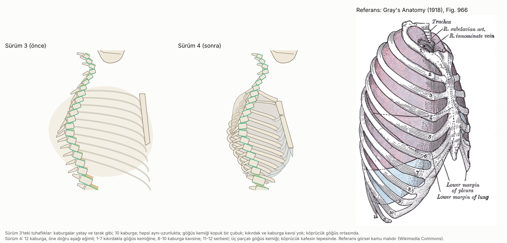

# Omurga Büyümesi · Sürüm 4: Referansla Düzeltilmiş Anatomi

> **Sürüm:** 4 · **Tarih:** 2026-10-08 · **Durum:** güncel
>
> **Acelen varsa:** en alttaki [En basit özet](#en-basit-özet) bölümüne atla.
>
> Bu doküman ve video **tıbbi tavsiye değildir.** İskelet bir bilgilendirme görselidir, anatomik ölçüm aracı değildir. Eğrilik, sırt ağrısı ya da yavaşlayan büyüme için hekime git.

**Kanıt seviyeleri:**

| Etiket | Anlamı |
|---|---|
| **A** | Meta-analiz ya da birden çok randomize kontrollü çalışma |
| **B** | Tek RCT ya da büyük, iyi tasarlanmış kohort |
| **C** | Gözlemsel çalışma, ölçüm çalışması, derleme |
| **V** | Bu depodaki gerçek veri analizi (Berkeley) |
| **D** | Model çıktısı, simülasyon ya da varsayım |

**Video:** [omurga_bilgilendirme_anatomik.mp4](video/ciktilar/omurga_bilgilendirme_anatomik.mp4) (~3 dk, 1280×720, sessiz) · Altyazı: [.srt](video/ciktilar/omurga_bilgilendirme_anatomik.srt)

---

## Soru ve kapsam

**İstek:** Sürüm 3'teki iskelet "tuhaf" duruyordu, en çok da göğüs kafesi. Hazır anatomi çizimleri referans alınacak, iskelet onlarla karşılaştırılacak ve tuhaflıklar tespit edilip düzeltilecekti.

Bu sürüm üç şey yapar:
1. Sürüm 3 iskeletini bir anatomi atlasının çizimleriyle karşılaştırır ve farkları tek tek listeler.
2. Bu farkları kodda düzeltir.
3. Görselleri ve videoyu yeniden üretir.

**Kapsam dışı:** Yeni bir bulgu. Boy, bacak ve gövde sayıları sürüm 3'teki ile aynıdır, çünkü aynı modelden gelir.

## Önceki sürümden değişenler

| Konu | Sürüm 3 | Sürüm 4 |
|---|---|---|
| Kaburgalar | 10 tane, yatay ve paralel (tarak gibi), hepsi aynı uzunlukta | 12 tane, öne doğru 1.6-4.0 omur seviyesi aşağı eğimli; 1. kısa, 6-7 en çok inen, 11-12 kısa |
| Kıkırdaklar | Yok | 1-7 kıkırdakla göğüs kemiğine, 8-10 üstteki kıkırdağa bağlı (kaburga kavsi), 11-12 serbest |
| Göğüs kemiği | Kafesten kopuk tek çubuk | Üç parça: sap, gövde, hançer çıkıntısı (T2-T3'ten T10 civarına, öne-aşağı eğik) |
| Göğüs hacmi | Omurganın çok arkasına taşan oval balon, kemikle aynı renk | Kaburga zarfından türetilen dolgu, kemikten koyu: kaburga araları görünür |
| Köprücük ve kürek kemiği | Köprücük göğüs ortasında yatay bir çizgi; kürek kemiği yok | Köprücük kafesin tepesinde (sap → omuz); kürek kemiği arkada, soluk |
| Bel eğrisi | Keskin; komşu bel omurları zikzak gibi | Daha yayvan (genlik 0.040 → 0.028 × S) |
| Diskler | Her omrun üstünde dikdörtgen; eğrilikte omurlar arasında boşluk | Bir omrun üst yüzünden üsttekinin alt yüzüne uzanan dörtgen (kama biçimli diskler) |
| Diz | İki büyük top | Önde dar, arkada yuvarlak uyluk kondili; üstü düz kaval kemiği başı |
| Sakrum | Küçük üçgen | Daha büyük, ön yüzü içbükey, kuyruk sokumu öne kıvrık |
| Kol | Gövdenin arkasında soluk; yeni göğüs dolgusunun altında kalıp yalnız eli görünüyordu | Omurgayı örtmeyen ince kontur |
| Yeni görseller | – | Önce/sonra/referans göğüs karşılaştırması; tüm iskeletin önce/sonrası |
| Yeni testler | – | I4-I7 (göğüs kafesi) ve A4 (videoda kaburgalar) |
| Bulgular | – | Değişmedi |

## Yöntem

**Referans seçimi.** Lisansı deponun CC BY-NC lisansıyla çakışmayan, **kamu malı** bir atlas seçildi: Henry Gray, *Anatomy of the Human Body* (20. baskı, 1918), Wikimedia Commons üzerinden.

| Çizim | Ne için kullanıldı |
|---|---|
| Fig. 966 (göğüs kafesi, önden-yandan) | Kaburga eğimi, uzunluk farkları, kıkırdaklar, kaburga kavsi, 11-12'nin serbest ucu |
| Fig. 115 (göğüs kemiği ve kıkırdaklar, önden) | Göğüs kemiğinin üç parçası, kıkırdakların bağlandığı seviyeler |
| Fig. 111 (omurga, yandan) | Eğrilikler ve disklerin kama biçimi (yalnız göz karşılaştırması) |

Referans dosyalar repoya konmaz. [iskelet/referans.py](iskelet/referans.py) Fig. 966 ve 115'i tanımlar; karşılaştırma görselinde kullanılan Fig. 966'yı ilk çalıştırmada özgün boyutuyla indirir, SHA-256 ile doğrular ve `.veri/` önbelleğine yazar. Özet uyuşmazsa dosyayı siler ve durur. Fig. 115 ve 111 yalnız göz karşılaştırması için açıldı.

**Karşılaştırma yöntemi.** Sürüm 3'ün göğüs bölgesi ile referans yan yana kondu, farklar gözle tek tek listelendi (aşağıdaki tablo). Bu sayısal bir ölçüm değil, **görsel denetim**dir. Düzeltmeden sonra aynı karşılaştırma tekrarlandı.

**Göğüs kafesinin çizimi** ([iskelet/anatomi.py](iskelet/anatomi.py), `gogus_kafesi`):
- Her kaburga yan izdüşümde dört noktalı bir spline: omur → boyun → kaburga açısı (en arka nokta) → ön kemik ucu.
- Ön ucun yüksekliği, kendi omurundan kaç omur seviyesi aşağıda olduğuyla tanımlanır ([oranlar.md](iskelet/oranlar.md)). Böylece iskelet büyüdükçe eğim orantılı kalır.
- Kıkırdaklar: kaburga ucundan önce öne, sonra yukarı kıvrılan Bézier eğrileri.
- Kaburgalar kalınlığı değişen bant olarak çizilir: arkada ince, ortada kalın.

**Çizim tercihi.** Gerçekte yan görünümde yakın taraftaki kaburgalar omurgayı örter. Konu omurga olduğu için **kaburgalar omurganın arkasına** çizildi; kol da yalnız kontur olarak. Bu bilinçli bir sapmadır.

**Kütüphaneler:** matplotlib, scipy (`splprep`), numpy; video için ffmpeg (libx264). Yeni bağımlılık yok.

**Komutlar:**
- `cd iskelet && python calistir.py`: statik görseller ve I1-I7 (ilk çalıştırmada referansları indirir).
- `cd video && python calistir.py`: video ve A1-A4, V1-V4 (~13 dk).

## Bulgular

### Tuhaflık kontrol tablosu

| # | Sürüm 3'te görülen | Referansta (Gray's 1918) | Sürüm 4 | Test |
|---|---|---|---|---|
| 1 | Kaburgalar yatay ve paralel, tarak gibi | Öne doğru belirgin aşağı iner; ön uç birkaç omur seviyesi aşağıda | Ön uç 1.6-4.4 seviye aşağıda | I5 ✅ |
| 2 | 10 kaburga | 12 çift | 12 | I4, A4 ✅ |
| 3 | Hepsi aynı uzunlukta | 1. kısa ve kıvrık; orta kaburgalar en uzun; 11-12 kısa | Uzunluk ve düşüş seviyeye göre değişiyor | I5 ✅ |
| 4 | Göğüs kemiği kopuk bir çubuk; kıkırdak yok | 1-7 kıkırdakla göğüs kemiğine; 8-10 kaburga kavsini oluşturur; göğüs kemiği üç parça | Aynı yapı | I4, I6 ✅ |
| 5 | Göğüs hacmi omurganın çok arkasına taşan bir balon | Yumurta biçimli; arkada kaburga açılarında biter | Kaburga zarfından türetilen dolgu | Görsel |
| 6 | Köprücük göğüs ortasında yatay çizgi | Kafesin tepesinde, göğüs kemiği sapından omuza | Kafesin tepesinde | I7 ✅ |
| 7 | Bel omurları zikzak; omurlar arasında boşluk | Yumuşak eğri; diskler kama biçimli ve boşluksuz | Yayvan eğri, birleştiren diskler | Görsel |
| 8 | Diz iki top gibi | Kaval kemiğinin başı düz üstlü | Düz üstlü kaval başı, profilli kondil | Görsel |
| 9 | Sakrum küçük | Büyük, öne içbükey, kuyruk sokumu öne kıvrık | Düzeltildi | Görsel |

**Testler** ([iskelet](iskelet/ciktilar/testler.csv) · [video](video/ciktilar/testler.csv)):

| Test | Ne sınıyor | Sonuç | |
|---|---|---|---|
| I1 | Anatomi kartındaki iskeletin tepesi = model boyu | 177.21 / 177.21 cm | ✅ |
| I2 | Omur sayıları | boyun 7, sırt 12, bel 5 | ✅ |
| I3 | 16 → 22 yaş: gövde artışı > bacak artışı | gövde +2.91, bacak +0.39 cm | ✅ |
| I4 | 12 kaburga; 7'si göğüs kemiğine, 3'ü kavse bağlı, 2'si serbest | 12; 7 / 3 / 2 | ✅ |
| I5 | Her kaburganın ön ucu omurundan aşağıda; en çok orta kaburgalar iner | 1: 1.6 · 4: 3.9 · 7: 4.4 · 10: 3.2 · 12: 1.8 seviye | ✅ |
| I6 | Göğüs kemiği T2-T3'ten başlar, T9'un altında biter | üst 141.6 cm (T2 142.4, T3 140.3); alt 123.3 (T9 126.5) | ✅ |
| I7 | Köprücük kafesin tepesinde | en alçak noktası 142.1, sap üstü 141.6 cm | ✅ |
| A1-A3 | Videoda her karede tepe = model boyu; omur sayıları; büyüme yalnız artar | tepe farkı en çok 5·10⁻⁶ (göreli), taban 0.07 cm; 7 / 12 / 5; evet | ✅ |
| A4 | Videodaki her iskelette 12 kaburga, 7 sternal, 3 kavis | (12, 7, 3) | ✅ |
| V1-V4 | Biçim, süre/boyut, model uyumu, sayıların kaynağa uyumu (sürüm 2 ile aynı) | H.264 1280×720; 175.9 sn, 2.4 MB; model farkı 1·10⁻¹⁴ cm; sayılar aynı | ✅ |

**Testler hakkında dürüst not:** I4-I7 ve A4, kodla birlikte yazıldı; ön kayıtlı değil. Çizimin referanstaki özelliklere (sayı, bağlantı, sıralama, seviye) uyduğunu sabitlerler ve sonradan bozulursa yakalarlar. Ama "referansla ölçülmüş doğruluk" göstermezler: eşikler referanstan **göz karşılaştırmasıyla** seçildi.

**Görseller:**
- [Önce / sonra / referans: göğüs kafesi](iskelet/ciktilar/karsilastirma_gogus.png)
- [Önce / sonra: tüm iskelet](iskelet/ciktilar/once_sonra.png)
- [Anatomi kartı](iskelet/ciktilar/anatomi_karti.png) (göğüs kemiği, kaburgalar ve kıkırdaklar artık ayrı etiketli)
- [İskelet büyümesi](iskelet/ciktilar/iskelet_buyume.png): 13, 16, 22 yaş
- [Ön görünüm, skolyoz](iskelet/ciktilar/on_gorunum_skolyoz.png): ön görünüm bu sürümde değişmedi

## Sonuçlar

1. **Sürüm 3 iskeletindeki dokuz tuhaflık,** kamu malı bir anatomi atlasıyla (Gray's 1918) karşılaştırılarak tespit edildi ve düzeltildi. En büyük farklar göğüs kafesindeydi: kaburga sayısı, eğimi, kıkırdaklar ve göğüs kemiği. (D)
2. **Düzeltmeler hiçbir sayısal sonucu değiştirmedi.** Boy, bacak ve gövde uzunlukları sürüm 3 ile aynı modelden geliyor; 16'dan 22 yaşa bacak +0.4 cm, gövde +2.9 cm (tipik erkek, model). (D + V)
3. **İskelet içi oranlar hâlâ görsel varsayımdır.** Referansa göz karşılaştırmasıyla benzetildi, ölçülmedi; ölçüm için kullanılmamalı. (D)

## Sınırlamalar

- **Karşılaştırma görseldir, ölçüm değildir.** Referans çizimden koordinat çıkarılmadı. Kaburga düşüşleri, göğüs derinliği gibi değerler "referansa benzer" düzeydedir: [doğrulanmadı].
- **Referans tek bir atlas ve bir erişkin.** Göğüs biçimi kişiden kişiye, yaşa ve cinsiyete göre değişir. Gray's 1918 çizimleri erişkin bedenidir; ergen göğsü biraz farklı orantılıdır.
- **Yan görünüm, üç boyutlu bir yapının sadeleştirilmesidir.** Uzak taraftaki kaburgalar çizilmedi. Kaburgalar ve kol, omurgayı göstermek için bilinçli olarak arkada ya da kontur olarak çizildi.
- **Ön görünüm (skolyoz sahnesi) bu sürümde yeniden çizilmedi.** Oradaki göğüs kafesi hâlâ şematik.
- **Tek tip iskelet.** Kız iskeleti ayrıca çizilmedi.
- Sürüm 3'ün ve sürüm 1'in bütün sınırlamaları aynen geçerli.

## Kaynaklar

- Gray H. *Anatomy of the Human Body*, 20. baskı, 1918. Kamu malı. Kullanılan çizimler (Wikimedia Commons):
  - [Fig. 966: göğüs kafesi](https://commons.wikimedia.org/wiki/File:Gray966.png) (SHA-256 `327fcfe5…`)
  - [Fig. 115: göğüs kemiği ve kıkırdaklar](https://commons.wikimedia.org/wiki/File:Gray115.png) (SHA-256 `58c26a85…`)
  - [Fig. 111: omurga](https://commons.wikimedia.org/wiki/File:Gray_111_-_Vertebral_column-coloured.png) (yalnız göz karşılaştırması; indirilmez)
- [Sürüm 3: anatomik iskelet](../3-anatomik-iskelet/README.md) · [Sürüm 2](../2-bilgilendirme-videosu/README.md) · [Sürüm 1](../1-kaldiraclar-protokol-ve-animasyon/README.md)
- [Büyüme plaklarının kapanma sırası, sürüm 1](../../buyume-plaklari-kapanma-sirasi/1-literatur-ve-berkeley-analizi/README.md)
- [Boy uzaması, sürüm 3: büyüme plağı modeli](../../boy-uzamasi-16-18-yas/3-mekanistik-simulasyon-ve-on-kayit/README.md)
- [Stokes 2008, Stature and growth compensation for spinal curvature](https://pubmed.ncbi.nlm.nih.gov/18809998/)

## En basit özet

- **Eski iskeletin göğsü tuhaftı,** çünkü kaburgalar tarak gibi düz ve yataydı, sayısı da eksikti (10).
- **Gerçek bir anatomi atlasıyla (Gray's, 1918) yan yana koyup farkları tek tek bulduk:** dokuz tuhaflık.
- **Düzelttik:** 12 kaburga, öne doğru aşağı eğimli, kıkırdakla göğüs kemiğine bağlı; köprücük doğru yerde. Bel eğrisi, diz ve sakrum da düzeldi.
- **Sayılar değişmedi.** İskelet hâlâ bir anlatım aracı, ölçüm aracı değil.
