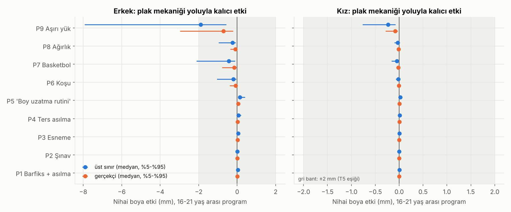
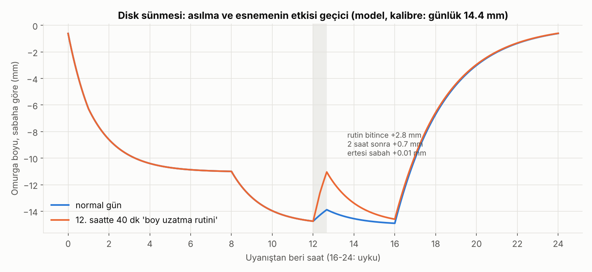
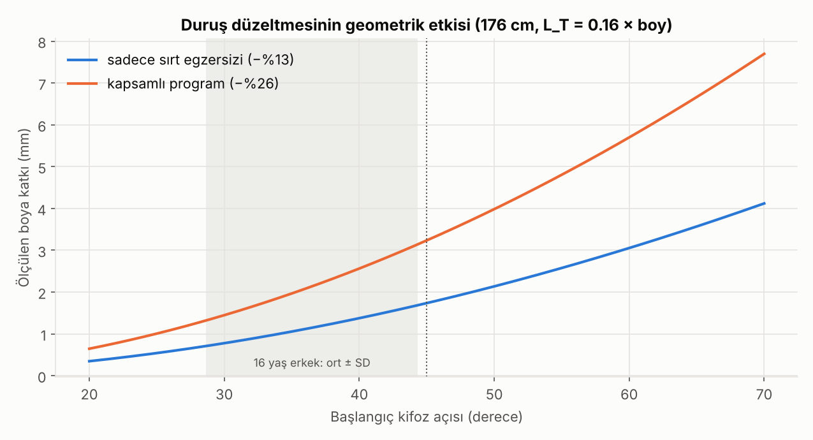

# Egzersiz ve Boy · Sürüm 1: Fizik Tabanlı Simülasyon

> **Sürüm:** 1 · **Tarih:** 2026-10-07 · **Durum:** güncel
>
> **Acelen varsa:** en alttaki [En basit özet](#en-basit-özet) bölümüne atla.
>
> Bu doküman tıbbi tavsiye değildir. Sırt ağrısı, omurga eğriliği ya da sakatlık varsa egzersiz programı hekim/fizyoterapistle planlanmalı.

**Kanıt seviyeleri:**

| Etiket | Anlamı |
|---|---|
| **A** | Meta-analiz ya da birden çok randomize kontrollü çalışma |
| **B** | Tek RCT ya da büyük, iyi tasarlanmış kohort |
| **C** | Gözlemsel çalışma, hayvan deneyi, uzlaşı raporu, mekanizma |
| **V** | Bu çalışmanın kendi gerçek veri analizi (ilgili araştırmadan: Berkeley, n=136) |
| **D** | Model çıktısı ya da varsayım. Yön ve büyüklük sırası gösterir |

---

## Soru ve kapsam

**Soru:** Barfiks, şınav, esneme, asılma, ters asılma, koşu, basketbol ve ağırlık antrenmanı **16 yaş ve sonrasında** gerçek boyu değiştirir mi?

"Boy değişti" üç farklı anlama gelebilir; bunlar ayrı ayrı incelendi:

| | Ne değişiyor | Benzetme | Kalıcı mı? |
|---|---|---|---|
| **A. Kemik uzunluğu** | Büyüme plağına binen yük büyüme hızını değiştirir mi? | Binanın kat sayısı | Evet |
| **B. Omurga diskleri** | Yük altında diskler incelir, yük kalkınca şişer | Yatak yaylarının akşam çökmesi, sabah düzelmesi | Hayır, saatler içinde |
| **C. Duruş** | Sırt eğriliği ölçülen boyu ne kadar etkiler? | Binanın dik mi eğik mi durduğu | Duruş korundukça |

Ek olarak:
- **D. Seçilim:** basketbolcular antrenmandan mı uzun, yoksa uzunlar mı basketbola seçiliyor?

**Kapsam:** Sağlıklı gençler. Bacak uzatma cerrahisi, ilaç ve hormon kapsam dışı. Bunlar için bkz. [boy-uzamasi-16-18-yas](../../boy-uzamasi-16-18-yas/).

---

## Yöntem

Simülasyonun kuralları, denklemleri ve her parametrenin kaynağı [simulasyon/PLAN.md](simulasyon/PLAN.md) dosyasında. Plan ve 7 test, **kod çalışmadan önce** commit edildi:

| Ne | Saat (UTC) |
|---|---|
| Plan | 11:16 |
| Uygulama ayrıntıları | 11:17 |
| Kod | 11:19 |
| Sonuçlar | 11:23 |

**Süreç notu:** Sonuçlardan sonraki kaynak kontrolünde iki düzeltme yapıldı: bir bağlantı kırıktı, bir diz yükü değeri yanlış makaleye atfedilmişti. İkisi de sonuçları değiştirmiyor; ayrıntılar PLAN.md, "Plandan sapmalar".

### A. Plak mekaniği (Hueter-Volkmann yasası)

- **Mekanizma:** Plağa sürekli bası binerse büyüme yavaşlar, çekme olursa hızlanır. Hayvan deneylerinde ilişki doğrusal. Vücut ağırlığı kadar **sürekli** ek yük büyümeyi %20-40 yavaşlatıyor; yük kalkınca büyüme normale dönüyor. Yük günün yarısında uygulanınca etki de kabaca yarıya iniyor (Stokes 2002, 2005, 2006).
- **İnsan yükleri:**
  - Omurga: bel diski basıncı ölçümleri. Uzanma 0.10, rahat ayakta 0.50, koşu 0.35-0.95, 20 kg kaldırma 1.1-2.3 MPa (Wilke 1999).
  - Diz: yürürken tepe yük vücut ağırlığının %226-267'si, merdiven çıkarken %305-311'i; bir adım boyunca ortalama yük tepenin ~%58'i (implant ölçümü).
  - Barfiks, asılma, şınav ve esneme için ölçülmüş veri yok. Bunlar **varsayım** olarak işaretlendi.
- **Model:** Her programın günlük ortalama yük farkı (oturmanın yerine geçen süre için) hesaplandı. Bu fark, sürüm 3'ün büyüme plağı modelinde bacak ve gövde için ayrı bir büyüme çarpanına çevrildi. 5.000 sanal Türk genci, 16-21 yaş arası 5 yıl boyunca bu programları uyguladı.
- **Üç ayar:**
  - Üst sınır: hayvan deneyindeki en güçlü etki, egzersiz yükü sürekli yük gibi sayıldı.
  - Gerçekçi.
  - Alt.
- **Üst sınır ilkesi:** Etki en cömert varsayımla bile küçükse sonuç sağlamdır.

### B. Disk sünmesi

Birinci dereceden viskoelastik model. Disk basıncına göre bir denge boyu var ve omurga ona belli bir zaman sabitiyle yaklaşıyor. Tek kalibrasyon: gün içi boy farkı **14.4 mm** (ölçülmüş). Sonra bağımsız ölçümlerle karşılaştırıldı: 20 dk dinlenme, traksiyon, koşu.

### C. Duruş geometrisi

Göğüs omurgası bir çember yayı olarak modellendi: yay boyu sabit, eğrilik azalınca dikey yüksekliği artıyor.
- **Kifoz dağılımı:** 16 yaş erkeklerde 36.5° ± 7.85°.
- **Egzersizin etkisi:** 12 haftalık RCT. Yalnızca sırt egzersizi eğriliği %13, kapsamlı program %26 azalttı.

### D. Seçilim

Türk 18 yaş erkek boyu dağılımından (176.0 ± 6.24 cm) en uzunların seçildiği bir takım; antrenman etkisi sıfır.

---

## Bulgular

### 4.1 Neden etkiler küçük olmak zorunda: 16 sonrası ne kadar büyüme kaldı? (V + D)

| Sanal Türk kohortu, 16 yaşından sonra kalan (medyan) | Toplam | Bacak | Gövde (omurga) |
|---|---|---|---|
| Erkek | 3.40 cm | **0.40 cm** | **2.99 cm** |
| Kız | 0.47 cm | 0.02 cm | 0.45 cm |

16 yaşından sonra bacak plakları neredeyse bitmiş durumda. Gerçek Berkeley verisinde de erkeklerde 16→18 arası büyümenin %79'u gövdeden geliyor. Koşu ve zıplama bacak plaklarını en çok yükleyen egzersizler, ama etki edebilecekleri büyüme neredeyse kalmamış.

### 4.2 Plak mekaniği: kalıcı etki (D)



| Program (16-21 yaş, 5 yıl) | Erkek, üst sınır | Erkek, gerçekçi | En uç %5 (üst sınır) | Kız, üst sınır |
|---|---|---|---|---|
| P1 Barfiks + asılma (10 dk/gün) | +0.03 mm | +0.01 mm | +0.09 mm | +0.005 mm |
| P2 Şınav (10 dk/gün) | +0.01 mm | +0.004 mm | +0.02 mm | +0.002 mm |
| P3 Esneme (20 dk/gün) | +0.05 mm | +0.02 mm | +0.11 mm | +0.008 mm |
| P4 Ters asılma (10 dk/gün) | +0.07 mm | +0.02 mm | +0.19 mm | +0.01 mm |
| **P5 "Boy uzatma rutini" (40 dk/gün)** | **+0.15 mm** | +0.06 mm | +0.40 mm | +0.02 mm |
| P6 Koşu (45 dk, 5 gün/hafta) | −0.20 mm | −0.08 mm | −1.05 mm | −0.02 mm |
| **P7 Basketbol (90 dk, 4 gün/hafta)** | **−0.43 mm** | −0.16 mm | −2.1 mm | −0.05 mm |
| P8 Ağırlık (60 dk, 4 gün/hafta) | −0.25 mm | −0.09 mm | −0.96 mm | −0.03 mm |
| P9 Aşırı yük (3 saat/gün, 6 gün) | −1.9 mm | −0.7 mm | −7.9 mm | −0.23 mm |

"En uç %5", geç gelişen ve en çok büyümesi kalmış kişilerdeki etki.

**T5 (karar kuralı) ✅ GEÇTİ:**
- 16 hücrenin (2 cinsiyet × P1-P8) hepsinde, **en cömert varsayımla bile** medyan etki 2 mm'nin altında. En büyüğü basketbolda −0.43 mm.
- **Karar:** 16 yaş sonrası egzersiz, plak mekaniği yoluyla gerçek boyu anlamlı değiştirmiyor.

**Duyarlılık:** Belirsiz parametreler uçlara çekildiğinde en büyük etki 0.11 ile 0.51 mm arasında kalıyor. Sonuç değişmiyor.

**T4 (jimnastik tutarlılığı) ❌ KALDI:**
- Aynı model, 9-16 yaş arası günde 3 saat yüksek etkili antrenman (elit jimnastik benzeri) için gerçekçi ayarda erkekte **−1.30**, kızda −0.94 cm kayıp öngörüyor.
- Literatüre göre elit jimnastik erişkin boyu düşürmüyor (Malina ve ark. 2013).
- Yani model, uzun süreli yoğun antrenmanın etkisini **abartıyor.** İki olası sebep: insanda dinamik yükün etkisi hayvan deneyindeki statik yükten zayıf, ya da model yakalama büyümesini zayıf üretiyor (sürüm 3'te bilinen eksiklik).
- **Pratik anlamı:** Simülasyon egzersiz etkilerini olduğundan **büyük** gösteriyor. 16+ için bulduğumuz milimetrenin altındaki etkiler gerçekte muhtemelen daha da küçük. Alt ayar (−0.43 cm) literatürle uyumlu.

### 4.3 Disk sünmesi: asılma ve esnemenin etkisi geçici (C + D)



| Test | Model | Literatür | Sonuç |
|---|---|---|---|
| **T1:** 1 saat ayakta sonrası 20 dk uzanma, geri kazanım | Kaybın %14'ü | "20 dk dinlenmede anlamlı toparlanma yok" | ✅ GEÇTİ |
| **T2:** 15 dk traksiyon kazancı | 1.19 mm | 3.2-5.4 mm | ✅ GEÇTİ (aralık 1-8). Model alt tarafta, traksiyon etkisini biraz küçümsüyor olabilir |
| **T3:** 33 dk koşuda kısalma | 2.54 mm | 3.25 mm (6 km) | ✅ GEÇTİ |

**"Boy uzatma rutini" günü** (12. saatte 10 dk asılma + 10 dk ters asılma + 20 dk yerde esneme):

| Ne zaman | Omurga boyu farkı (normal güne göre) |
|---|---|
| Rutin biter bitmez | **+2.8 mm** |
| 1 saat sonra | +1.5 mm |
| 2 saat sonra | +0.7 mm |
| **Ertesi sabah** | **+0.01 mm** |

Zaman sabitleri uçlara çekildiğinde ertesi sabaha kalan 0.00-0.04 mm.

**Not:** Asıldıktan hemen sonra ölçülen boy birkaç milimetre fazla çıkar. "Asıldım, uzadım" hissinin kaynağı bu. Gerçek bir değişiklik değil, ölçüm zamanlaması.

Uzayda astronotlar %3'e (~5 cm) kadar uzuyor ve Dünya'ya dönünce bu kayboluyor. Sebep aynı: disklerin yükten kurtulması.

### 4.4 Duruş: ölçülen boya katkısı milimetre düzeyinde (B + D)



| | Herkes (medyan) | Kifotik gençler, θ ≥ 45° (medyan) | Kifotik, en iyi %5 |
|---|---|---|---|
| Yalnızca sırt egzersizi (eğrilik −%13) | 0.11 cm | 0.20 cm | 0.26 cm |
| Kapsamlı program (eğrilik −%26) | 0.21 cm | **0.37 cm** | 0.49 cm |
| Günlük hayatta kambur durmak (+10° / +20°) | −0.29 / −0.65 cm | | |

Kifotik oranı: 16 yaş erkeklerin ~%14'ü.

**T6 (karar kuralı) ✅ GEÇTİ, yani bir düzeltme gerekiyor:**
- Kifotik gençlerde bile kapsamlı bir programın ölçülen boya katkısı medyan **0.37 cm.**
- Sürüm 1 ve 2'de "duruşla 1-2 cm görünür boy" yazmıştık; o sayıyı doğrulamamıştık. Bu sonuç ölçülen boy için o ifadeyi **desteklemiyor.**
- Ölçüm yönteminin kendisi de bunu gösteriyor: boy ölçülürken zaten dik durulur. Hafif yukarı germe ile ölçülen boy yalnızca 0.28 cm fazla çıkıyor.
- Günlük hayatta kambur ile dik durmak arasındaki fark yalnızca göğüs omurgası hesabıyla 0.3-0.65 cm. Baş öne eğikliği ve bel duruşu modellenmedi; gerçek görünür fark bundan biraz fazla olabilir.

L_T varsayımı uçlara çekildiğinde kifotik medyan 0.32-0.42 cm. Sonuç değişmiyor.

### 4.5 Seçilim: basketbolcular neden uzun? (D)

| Takıma alınanlar | Eşik | Takımın boy ortalaması | Toplum ortalamasından fark |
|---|---|---|---|
| En uzun %10 | 184.0 cm | 187.0 cm | **+11.0 cm** |
| En uzun %5 | 186.3 cm | 188.9 cm | +12.9 cm |
| En uzun %1 | 190.5 cm | 192.6 cm | **+16.6 cm** |

Antrenmanın boya etkisi **sıfır** varsayıldı. Basketbolcuların uzunluğu tamamen seçilimle açıklanabiliyor.

### 4.6 Literatür

| Konu | Bulgu | Seviye |
|---|---|---|
| Elit jimnastik | Erişkin boy etkilenmiyor. Kısa boy ve geç olgunlaşma seçilimden ve aileden geliyor | C (derleme) |
| Gençlerde ağırlık antrenmanı | Denetimli antrenman büyümeye zarar vermiyor. Plak yaralanmaları kötü teknik, yanlış yük ve denetimsizlikten. Ergenlik kemik kütlesi için fırsat dönemi | C (uluslararası uzlaşı 2014; AAP 2020) |
| Egzersizle büyüme hormonu | Yoğun egzersiz GH'yi anlık yükseltiyor, ama 4 yıllık takipte iskelet büyümesine yansımıyor | C |
| Tenis oynayan kızlar | Raket kolunda kemik mineral içeriği %11-14, kortikal alan %7-11 fazla. Yani yük kemiği **kalınlaştırıyor**; uzunluk farkı bildirilmiyor | C |
| Traksiyon ve asılma | Birkaç mm geçici uzama (traksiyon 3.2 mm, yerçekimi traksiyonu 5.4 mm) | C |
| Astronotlar | %3'e kadar uzama, Dünya'ya dönünce kayboluyor | C |
| Duruş egzersizi | 12 haftada kifoz açısı −%13 ile −%26 | B (RCT) |

---

## Sonuçlar

1. **16 yaş ve sonrasında hiçbir egzersiz programı gerçek (kemik) boyu anlamlı değiştirmiyor.** En cömert varsayımla bile en büyük etki 0.43 mm (basketbol, eksi yönde). Barfiks + asılma + ters asılma + esneme rutini 5 yılda +0.15 mm. (C + D)
2. **Sebep basit: 16 sonrası kalan büyüme az ve çoğu omurgada.** Erkekte 3.4 cm'nin yaklaşık 3.0 cm'si gövdeden geliyor. Bacak plakları neredeyse bitmiş. (V + D)
3. **Asılma, ters asılma ve esneme omurgayı birkaç milimetre uzatıyor, ama bu birkaç saat içinde geri dönüyor.** Ertesi sabaha kalan etki yaklaşık 0.01 mm. Asıldıktan hemen sonra ölçmek yanıltıcı bir "uzama" gösterir. (C + D)
4. **Duruş düzeltme egzersizleri ölçülen boyu milimetrelerle artırabiliyor:** kifotik gençlerde ~0.4 cm, ortalama gençte ~0.2 cm. Önceki raporlarımızdaki "duruşla 1-2 cm" ifadesi ölçülen boy için desteklenmiyor ve düzeltildi. (B + D)
5. **Basketbolcuların uzunluğu antrenmandan değil seçilimden geliyor.** Antrenman etkisi sıfır olsa bile en uzun %10'dan kurulan bir takım ortalamadan ~11 cm uzun. (C + D)
6. **Denetimli ağırlık antrenmanı ve yoğun spor büyümeye zarar vermiyor.** Riskler sakatlık (kötü teknik, aşırı yük) ve az yemek. Simülasyon, çocukluktan itibaren yoğun antrenmanın etkisini bile muhtemelen abartıyor (T4). (C + D)
7. **Egzersizin gerçek faydaları boy değil:** daha güçlü ve kalın kemikler, duruş, kas, kondisyon, uyku. Bunlar boy için değil, kendileri için değerli. (C)

---

## Sınırlamalar

- **Plak duyarlılığı hayvan deneylerinden** (sıçan, tavşan, statik yük). İnsanda aralıklı egzersiz yükünün plağa etkisi doğrudan ölçülmemiş. Bu yüzden üst sınır hesabı yapıldı. Jimnastik testi (T4) modelin etkiyi abarttığını gösterdi; bu, ana sonucu güçlendiren yönde bir hata.
- **Bazı yükler varsayım:** barfiks, asılma, şınav ve esnemede omurga ve diz yükü için ölçülmüş veri yok. Duyarlılık analizinde sonuç değişmedi.
- **Disk modeli basit:** birinci dereceden, tek omurga bölgesi. Traksiyon etkisini literatürün alt sınırında tahmin ediyor (1.2 mm'ye karşı 3.2-5.4 mm). Kalıcı etki sonucunu etkilemez: model yapısı gereği ve tüm ölçümlerde etki geri dönüyor.
- **Duruş modeli yalnızca göğüs omurgası:** bel lordozu, baş-boyun duruşu ve diz/kalça modellenmedi. Kifoz ölçüm yöntemleri arası fark var.
- **Enerji dengesi modellenmedi:** yoğun antrenman ve az yemek (REDs) büyümeyi gerçekten bozabilir. Bu, ilgili araştırmanın sürüm 2-3'ünde literatürle ele alındı.
- **Büyüme modeli sürüm 3'ten:** onun sınırlamaları (Türk erkek uyarlamasının kabul ölçütünü geçmemesi, kızlarda geç büyümenin eksik tahmini) burada da geçerli.

---

## Nasıl çalıştırılır

```bash
cd simulasyon
pip install -r requirements.txt
python calistir.py     # ~2 dk; sürüm 3'ün yayınlanmış parametrelerini okur, veri indirmez
```

Tüm sayılar `simulasyon/ciktilar/` altında. Test sonuçları: `on_kayitli_testler.csv`.

---

## Kaynaklar

**Plak mekaniği**
- [Stokes IAF ve ark. Endochondral growth in growth plates of three species at two anatomical locations modulated by mechanical compression and tension. J Orthop Res 2006](https://www.uvm.edu/~istokes/pdfs/growth.pdf)
- [Stokes IAF ve ark. Modulation of vertebral and tibial growth by compression loading: diurnal versus full-time loading. J Orthop Res 2005](https://www.uvm.edu/~istokes/pdfs/diurnal.pdf)
- [Stokes IAF. Mechanical effects on skeletal growth. J Musculoskel Neuron Interact 2002](https://www.uvm.edu/~istokes/pdfs/sun_valley.pdf)

**Vücut yükleri**
- [Wilke HJ ve ark. New in vivo measurements of pressures in the intervertebral disc in daily life. Spine 1999](https://www.fonar.com/pdf/spine_vol_24.No.8.pdf)
- [Bergmann G ve ark. Standardized loads acting in knee implants. PLoS One 2014](https://pmc.ncbi.nlm.nih.gov/articles/PMC3900456)

**Disk ve omurga**
- [Gün içi boy değişimi ve egzersizle kısalma, BJSM 1986](https://bjsm.bmj.com/content/20/3/119)
- [Traksiyon ve omurga boyu ölçümleri](https://www.backfitpro.com/medical-scientific-articles/2016-2017/%5B8%5D-Cannon,J.-%282016%29-Evidence-on-the-ability-of-a-pneumatic-decompression-belt-to-restore-spinal-height-%5BJ.Mani.-and-Physio-Therapeutics%5D.pdf)
- [Astronotlar uzayda uzuyor (Scientific American)](https://scientificamerican.com/article/astronauts-get-taller-in-space) · [NASA: uzay boyu](https://www.nasa.gov/wp-content/uploads/2018/05/whatisyourspaceheight.pdf)

**Duruş**
- [Kifotik ergenlerde düzeltici egzersiz RCT'si (Healthcare 2022)](https://www.ncbi.nlm.nih.gov/pmc/articles/PMC9778671/)
- [13-18 yaş erkeklerde normal kifoz aralığı](https://www.ncbi.nlm.nih.gov/pmc/articles/PMC4045366/)
- [Boy ölçüm teknikleri: gerilmiş ve rahat boy farkı](https://measurement-toolkit.org/anthropometry/objective-methods/simple-measures-height)

**Spor ve büyüme**
- [Malina RM ve ark. Role of intensive training in the growth and maturation of artistic gymnasts (2013)](https://dro.deakin.edu.au/articles/journal_contribution/Role_of_intensive_training_in_the_growth_and_maturation_of_artistic_gymnasts/20948449)
- [AAP: Gençlerde direnç antrenmanı, mit ve gerçek](https://www.aap.org/en/patient-care/physical-activity/resistance-training-in-youth-myth-vs.-fact)
- [Egzersiz ve büyüme hormonu yanıtı, ergenler](https://jspac.etb.iau.ir/Article/41061/FullText)
- [Bass SL ve ark. Tenis oynayan kızlarda mekanik yük ve kemik boyutu. JBMR 2002](https://findanexpert.unimelb.edu.au/scholarlywork/253206-the-effect-of-mechanical-loading-on-the-size-and-shape-of-bone-in-pre---peri---and-postpubertal-girls--a-study-in-tennis-players)

**Türk verisi ve büyüme modeli**
- [Günöz H ve ark. Türk boy referansı, JCRPE 2014](https://jcrpe.org/pdf/cf9d60d6-523c-458a-a2e6-78728d3ffbb0/articles/Jcrpe.1260/JCRPE-6-28-En.pdf)
- Büyüme plağı modeli: [boy-uzamasi-16-18-yas, sürüm 3](../../boy-uzamasi-16-18-yas/3-mekanistik-simulasyon-ve-on-kayit/)

---

## En basit özet

**Önce üç benzetme:**
- **Kemik boyu** bir binanın kat sayısı gibi: inşaat bitmeden değişebilir, bitince değişmez.
- **Omurga diskleri** yatak yayları gibi: gün içinde çöker, gece düzelir.
- **Duruş** binanın dik mi eğik mi durduğu gibi: kat sayısını değiştirmez.

**Sonuçlar:**

- **16 yaşından sonra barfiks, şınav, esneme, asılma, ters asılma, koşu, basketbol, ağırlık: hiçbiri gerçek boyunu değiştirmez.** Bilgisayarda 5.000 sanal genç, 5 yıl boyunca bu egzersizleri yaptı. En cömert hesapla bile fark **yarım milimetreden az** çıktı.
- **Neden?** 16 yaşında bacaklarının büyümesi neredeyse bitmiştir. Kalan birkaç santimetrenin çoğu omurgadan gelir ve egzersiz bunu değiştirmez.
- **Asılınca neden uzamış gibi hissediyorsun?** Omurga diskleri yükten kurtulunca biraz şişer. Asıldıktan hemen sonra ~3 mm uzun ölçülürsün. 2 saat sonra çoğu gider, ertesi sabah hiçbir şey kalmaz. Astronotlar uzayda 5 cm uzayıp Dünya'ya dönünce kaybediyor; aynı şey.
- **Dik durmak işe yarar mı?** Ölçülen boyunu sadece **2-4 milimetre** değiştirir. Daha önce "1-2 cm" yazmıştık, hesaplayınca bunun abartı olduğunu gördük ve düzelttik. Ama kambur durmak seni günlük hayatta yarım santimetre kadar kısa gösterebilir. Dik dur, ama boy için değil, sağlığın ve görünüşün için.
- **Basketbolcular neden uzun?** Basketbol uzatmıyor; uzunlar basketbolcu oluyor. Hiç uzatmasa bile en uzun %10'dan kurulan bir takım ortalamadan 11 cm uzun olur.
- **Ağırlık kaldırmak boyu kısaltır mı?** Hayır. Doğru teknikle ve denetimli yapılırsa zararı yok. Tehlike kötü teknikle sakatlanmak ve antrenman yapıp az yemek.
- **"Boy uzatma egzersizleri" satan videolar, programlar, aletler:** 16 yaşından sonra gerçek boya etkileri yok. Paranı ve zamanını boşa harcama.
- **Peki spor yapmalı mıyım?** **Kesinlikle evet**, ama doğru sebeple: güçlü kemikler, kaslar, duruş, kondisyon, iyi uyku. Boy için değil, kendin için.
- **Tek cümleyle:** 16 yaşından sonra egzersiz seni uzatmaz, kısaltmaz da. Spor yap, iyi ye, iyi uyu, dik dur. Boyunu genlerin ve kalan büyüme plakların belirler.
