# Talk To Linux · Talk To Android

Linux bilgisayar ile Android telefonu **USB kablosu**, **Wi-Fi** ya da **Bluetooth** üzerinden birbirine bağlayan iki uygulama:

| Uygulama | Nerede | Ne ile yazıldı |
|---|---|---|
| **Talk To Linux** | Android telefon (APK) | Kotlin + Jetpack Compose, Material 3 |
| **Talk To Android** | Linux bilgisayar | Python + GTK4/libadwaita; terminal komutu `talk-to-android` |

İki uygulama birbirini tanır: ilk bağlantıda bir kez onaylanır (ya da şifre girilir), sonra telefon bağlandığı anda bilgisayar onu tanır ve **profilini** uygular.

**Durum:** 0.4.0. Ubuntu 22.04 + gerçek bir telefonda USB bağlantısı kuruldu; 0.2.x'te bildirim ve müziğin gelmediği bildirildi, 0.4.0 bunun sebebini iki tarafta da gösteriyor ve en olası sebebi (Android'in bildirim dinleyicisini bağlamaması) düzeltmeye çalışıyor — gerçek telefonda henüz doğrulanmadı. Bluetooth gerçek donanımda denenmedi; neyin nasıl test edildiği [aşağıda](#ne-test-edildi).

| Telefon | Bilgisayar |
|---|---|
| 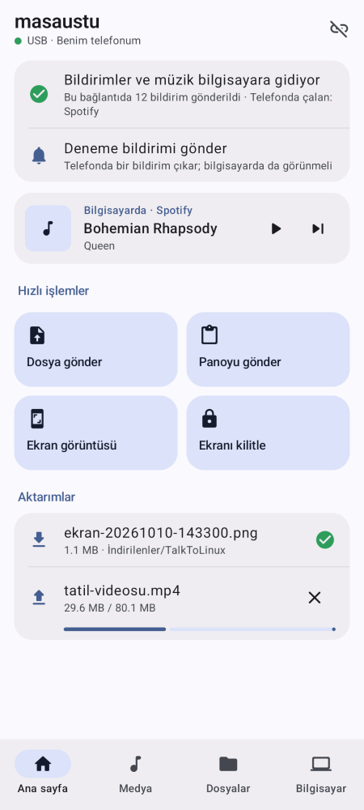 | 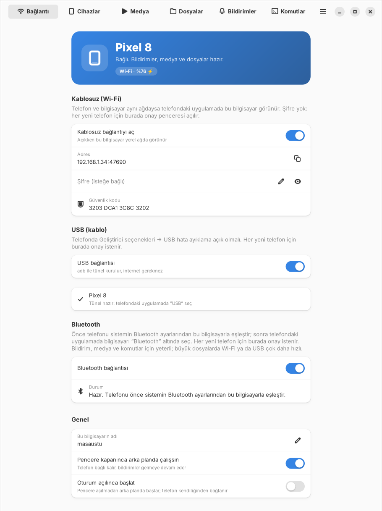 |
| 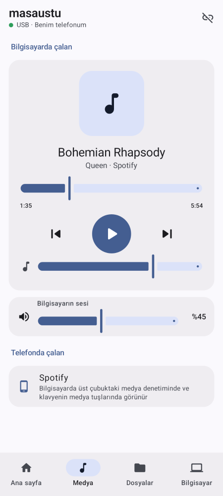 | 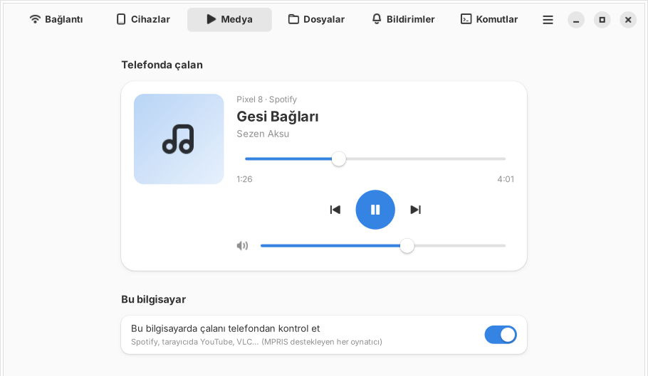 |
| 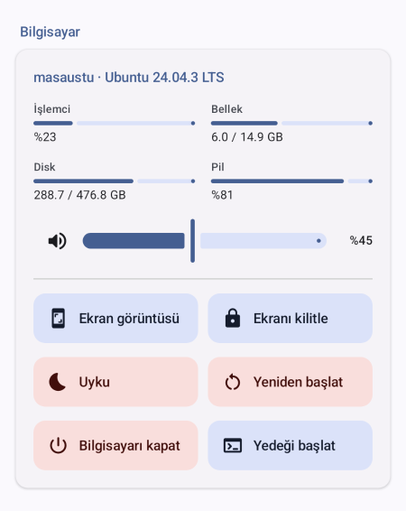 | 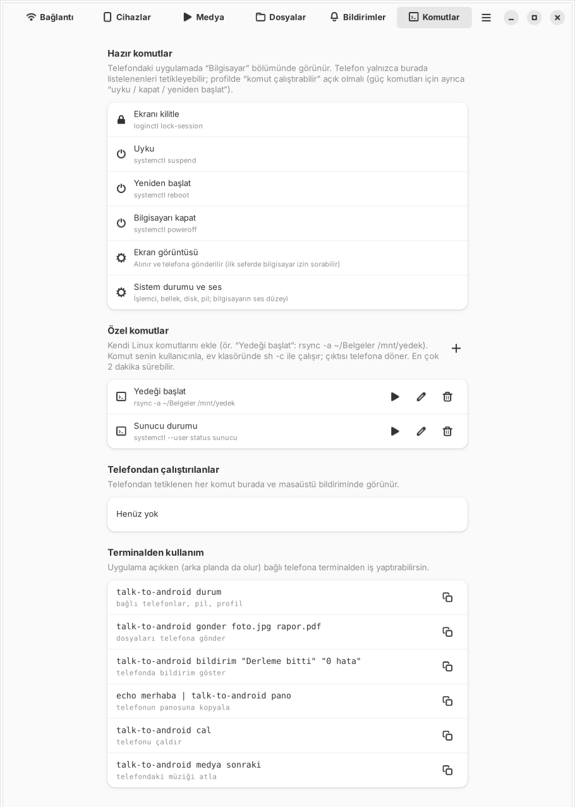 |
| 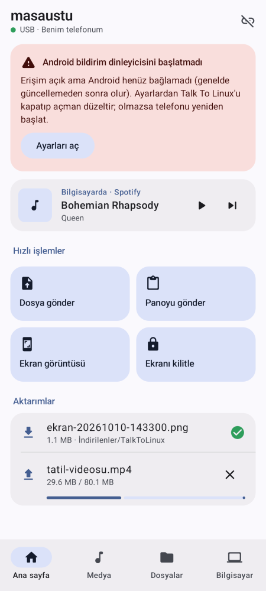 | 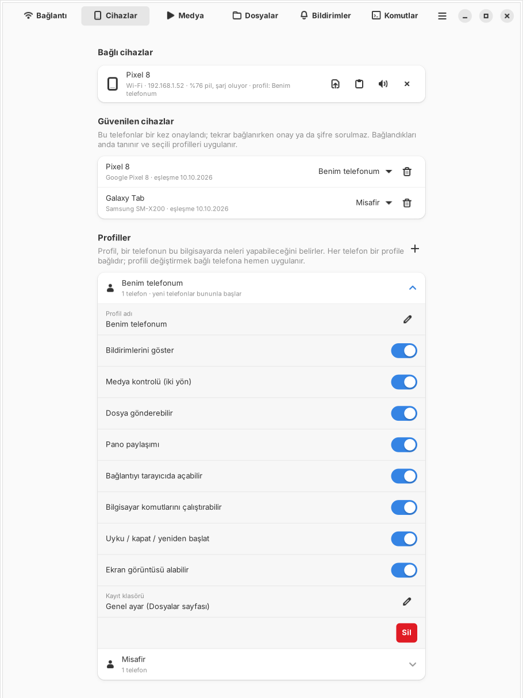 |
|  | 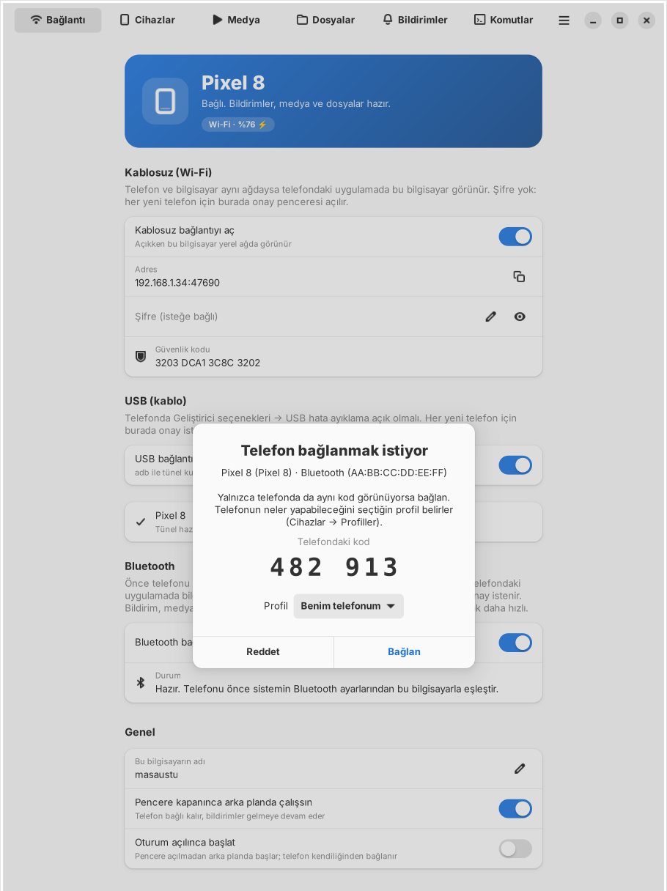 |
| 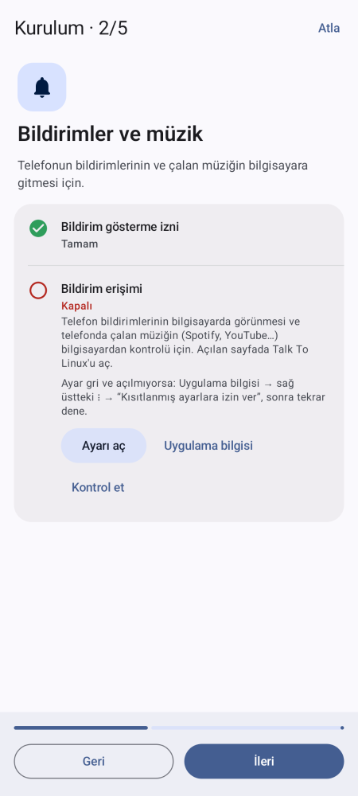 | 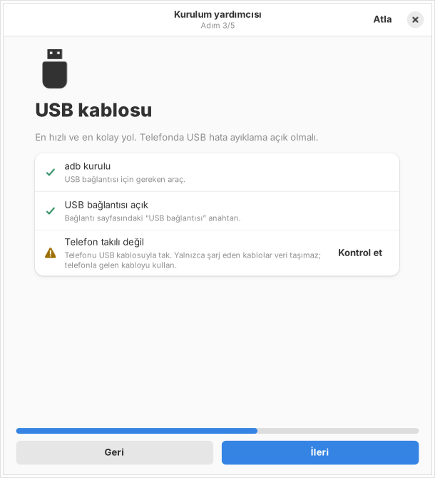 |
| 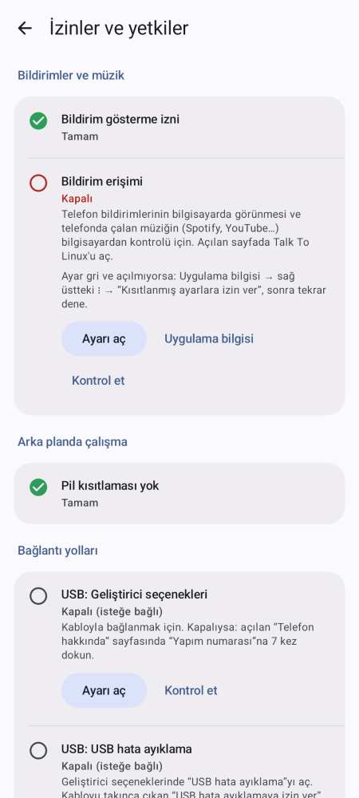 | |

## Ne yapar

| Özellik | Yön | Not |
|---|---|---|
| Bildirimler | telefon → bilgisayar | Masaüstünde uygulama simgesiyle çıkar; telefonda silinince masaüstünden de kalkar. |
| Telefonda çalan medya | telefon → bilgisayar | Spotify, YouTube, YouTube Music… Bilgisayarda gerçek bir oynatıcı gibi görünür: GNOME üst çubuğundaki medya denetimi, klavyenin medya tuşları, `playerctl`. Kapak, ilerleme; oynat/duraklat/atla/sar/ses. |
| **İlk kurulum** | iki taraf | İlk açılışta adım adım yardımcı: telefonda bildirim izni, bildirim erişimi (Android 13+'ta “Kısıtlanmış ayar” açıklamasıyla), pil, USB hata ayıklama / Wi-Fi / Bluetooth; bilgisayarda adb, telefon uygulaması, USB'de telefonun durumu, Wi-Fi, güvenlik duvarı (ufw), Bluetooth, scrcpy, oturumla başlat. Her satırda durum, ayarı açan ya da yapan düğme ve **Kontrol et**. Sonradan: telefonda ⚙ “İzinler ve yetkiler”, bilgisayarda menü → “Kurulum yardımcısı”. |
| **İzinler ve yetkiler** | telefon | Telefonun Android izinleri tek ekranda (durum + aç) ve bağlı bilgisayarın bu telefona verdiği yetkiler (profil; değiştirmek bilgisayardan). |
| **Neden çalışmıyor?** | iki yön | Telefon bildirim erişimini, Android'in bildirim dinleyicisini bağlayıp bağlamadığını ve sürümünü bilgisayara bildirir; bir şey gelmeyecekse iki tarafta da sebebi ve çözümü yazar. Telefonda "Deneme bildirimi gönder" ile yol baştan sona denenir. |
| Bilgisayarda çalan medya | bilgisayar → telefon | Spotify masaüstü, tarayıcıda YouTube, VLC (MPRIS destekleyen her oynatıcı). |
| Dosya gönderme | iki yön | Telefonda "Paylaş → Talk To Linux"; bilgisayarda sürükle-bırak, "Dosya seç" ya da terminalde `talk-to-android gonder`. SHA-256 ile doğrulanır. |
| Gelen dosyalar klasörü | | Bilgisayarda `~/İndirilenler/TalkToAndroid` (genel ya da profil başına değiştirilebilir). Telefonda `İndirilenler/TalkToLinux`. |
| Pano, bağlantı açma | iki yön / telefon → bilgisayar | Paylaşılan YouTube bağlantısı bilgisayarın tarayıcısında açılır. |
| **Bilgisayar komutları** | telefon → bilgisayar | Ekranı kilitle, uyku, yeniden başlat, kapat ve **senin eklediğin Linux komutları** (çıktısı telefona döner). |
| **Telefonun ekranı bilgisayarda** | bilgisayar → telefon | Telefonun ekranı bir pencerede açılır, fare ve klavyeyle kullanılır (scrcpy; yoksa tek tıkla kurulur). USB'de doğrudan; Wi-Fi için telefon bir kez USB'deyken “Kablosuz ekranı hazırla” (telefon yeniden başlayınca tekrar). USB hata ayıklama açık olmalı. |
| **Ekran görüntüsü** | telefon → bilgisayar → telefon | Bilgisayarın ekranı alınır, telefona dosya olarak gelir. |
| **Sistem durumu ve ses** | bilgisayar → telefon | İşlemci, bellek, disk, pil, açık kalma süresi; bilgisayarın ses düzeyi ve sessize alma. |
| **Terminalden telefona** | bilgisayar → telefon | `talk-to-android bildirim "Derleme bitti"`, `gonder`, `pano`, `cal`, `medya` (aşağıda). |
| Telefonu bul, pil | | Telefon sessizdeyken de 30 sn çalar; telefonun pili bilgisayarda görünür. |

## Bağlantı yolları

| Yol | Ne gerekir | İlk bağlantı | Hız |
|---|---|---|---|
| **USB** | Telefonda *Geliştirici seçenekleri → USB hata ayıklama*, bilgisayarda `adb` (uygulama içinden "Kur" düğmesiyle kurulur) | Bilgisayarda onay penceresi, iki ekranda aynı 6 haneli kod | En hızlı |
| **Wi-Fi** | Aynı ağ; bilgisayarda "Kablosuz bağlantıyı aç" | Şifre koyduysan şifre, koymadıysan onay penceresi | Hızlı |
| **Bluetooth** | Telefonla bilgisayarı **önce sistemin Bluetooth ayarlarından eşleştir** | Onay penceresi | Yavaş (bildirim, medya, komut için yeterli; büyük dosyada Wi-Fi/USB tercih et) |

**USB hata ayıklama neden gerekiyor?** Android, kabloyla takılan bilgisayarın bir uygulamayla konuşmasına kendiliğinden izin vermez; kablo varsayılan olarak yalnızca şarj ve dosya aktarımı (MTP) içindir. USB'de bu iş için iki yol var: `adb` (USB hata ayıklama; şu an kullanılan) ve Android'in "USB aksesuar" modu (hata ayıklama gerektirmez, telefon takılınca "Talk To Linux açılsın mı?" diye sorar; henüz yapılmadı). Hata ayıklamayı açmak istemezsen Wi-Fi ya da Bluetooth aynı özellikleri verir. Telefon takılıp hata ayıklama kapalıysa bilgisayardaki uygulama *Bağlantı → USB* altında bunu gösterir ve adımları yazar.

Bağlantı koparsa telefon 2 dakika boyunca kendiliğinden yeniden dener (bilgisayara özel ayarlardan kapatılabilir).

## Profiller: birbirini tanıma

Bilgisayarda *Cihazlar → Profiller*: her profil bir telefonun bu bilgisayarda neleri yapabileceğini söyler.

| İzin | "Benim telefonum" | "Misafir" |
|---|---|---|
| Bildirimlerini göster, medya kontrolü, dosya gönderebilir | ✓ | ✓ |
| Pano, tarayıcıda bağlantı açma | ✓ | — |
| Bilgisayar komutları, ekran görüntüsü | ✓ | — |
| Uyku / kapat / yeniden başlat | ✓ | — |

- Onay penceresinde telefonun profilini seçersin; şifreyle eşleşen telefon "yeni telefonlar bununla başlar" profilini alır.
- Profil oluşturma, yeniden adlandırma, silme, profil başına ayrı kayıt klasörü: *Cihazlar → Profiller* (+).
- Bir telefonun profilini *Güvenilen cihazlar*'dan değiştirebilirsin; bağlıysa **hemen** uygulanır.
- Telefon bağlanınca "Bilgisayar seni “Benim telefonum” profiliyle tanıyor" yazar ve yalnızca izin verilen düğmeleri gösterir.
- Telefonda da her bilgisayarın kendi ayarları var: bildirim gönder, medya paylaş, kendiliğinden bağlan.

## Bilgisayar komutları

Telefon **yalnızca bilgisayarda tanımlı komutları adıyla** tetikleyebilir; telefondan komut metni gelmez, gelse de çalıştırılmaz.

- **Hazır:** `loginctl lock-session` (kilitle), `systemctl suspend|reboot|poweroff` (uyku, yeniden başlat, kapat; telefonda "emin misin?" sorulur).
- **Özel:** *Komutlar → Özel komutlar → +* ile ad ve komut gir (ör. "Yedeği başlat" → `rsync -a ~/Belgeler /mnt/yedek`). Senin kullanıcınla, ev klasöründe `sh -c` ile çalışır, en çok 2 dakika; çıktısı telefonda gösterilir. "Burada dene" düğmesiyle önce bilgisayarda deneyebilirsin.
- Telefondan çalıştırılan her komut bilgisayarda **masaüstü bildirimi** ve *Komutlar → Telefondan çalıştırılanlar* listesinde görünür.

## Terminalden kullanım

Uygulama açıkken (pencere kapalı, arka planda da olur):

```bash
talk-to-android durum                                  # bağlı telefonlar, pil, profil
talk-to-android gonder foto.jpg rapor.pdf              # telefona dosya (bitince ✓/✗ yazar)
talk-to-android bildirim "Derleme bitti" "0 hata"      # telefonda bildirim
echo "merhaba" | talk-to-android pano                  # telefonun panosuna
talk-to-android cal              # telefonu çaldır;  --durdur ile sustur
talk-to-android medya sonraki    # oynat | duraklat | oynat-duraklat | sonraki | onceki
talk-to-android ekran            # telefonun ekranını bilgisayarda aç (scrcpy)
talk-to-android gonder x.zip -c Pixel                  # birden fazla telefon bağlıysa adla seç
```

Örnek: uzun bir işin bitince telefona haber vermesi: `make && talk-to-android bildirim "Derleme bitti" || talk-to-android bildirim "Derleme HATALI"`.

Komut satırı, çalışan uygulamayla `$XDG_RUNTIME_DIR/talk-to-android.sock` üzerinden konuşur; soketin izni 600 ve bağlanan sürecin kullanıcısı denetlenir, yani yalnızca sen kullanabilirsin.

## Kurulum

### Linux (Talk To Android)

**Ubuntu / Debian / Mint / Pop!_OS: terminal gerekmez.** `talk-to-android_0.4.0_all.deb` dosyasına çift tıkla, Uygulama Merkezi'nde **Kur**, sonra uygulama menüsünden "Talk To Android"ı aç. (Çift tıklayınca arşiv yöneticisi açılırsa: sağ tık → "Birlikte aç" → Uygulama Merkezi.)

- Uygulama Merkezi yerel `.deb` kurarken eksik bağımlılıkları kendisi indirmiyor (0.2.0'da "unmet dependencies" hatası bundandı). Bu yüzden paketin zorunlu bağımlılığı yalnızca `python3`. GTK4/libadwaita eksikse uygulama **ilk açılışta** "kurulsun mu?" diye sorar ve bilgisayarın şifre penceresiyle kurar.
- Terminal kullanmak istersen tek komut her şeyi birlikte kurar: `sudo apt install ./talk-to-android_0.4.0_all.deb`.

`.deb` dosyasını üretmek (bir kez): `sh talk-to/linux/paket/deb-olustur.sh`

Uygulamanın içinden, terminalsiz:
- **adb eksikse** *Bağlantı → USB*'de **Kur** düğmesi: bilgisayarın kendi şifre penceresi açılır, dağıtımın paket yöneticisiyle (apt, dnf, pacman, zypper) kurulur.
- **Oturum açılınca başlat** (*Bağlantı → Genel*).

**Fedora, Arch ve diğerleri:** henüz paket yok; bir kez terminalde:

```bash
# Fedora:  sudo dnf install python3-gobject gtk4 libadwaita python3-cryptography android-tools
# Arch:    sudo pacman -S python-gobject gtk4 libadwaita python-cryptography android-tools
cd talk-to/linux && sh kur.sh          # yalnızca bu kullanıcıya, sudo gerekmez (kaldırmak: sh kur.sh --kaldir)
```

Gerekenler: Python 3.10+, GTK 4.6+, libadwaita 1.1+ (Ubuntu 22.04 ve üstü, Debian 12+, Fedora 36+, güncel Arch). Eski kütüphanelerde (Ubuntu 22.04) yeni libadwaita parçalarının yerine `ui/compat.py`'deki yedekler kullanılır; görünüm biraz sadeleşir, özellikler aynıdır. Bluetooth için BlueZ (masaüstü dağıtımlarında hazır gelir).
Kurmadan denemek: `cd talk-to/linux && python3 -m talkto`.
Güvenlik duvarı (ufw) açıksa Wi-Fi için bir kez: `sudo ufw allow 47600/tcp && sudo ufw allow 47601/udp`.

### Android (Talk To Linux)

Android 10 ve üstü. İki sürüm var; aynı uygulama oldukları için biri diğerinin üzerine kurulabilir:

| Sürüm | Dosya | Nasıl kurulur | Eksik olan |
|---|---|---|---|
| **Hafif** | `talk-to-linux-0.2.2-hafif.apk` | Telefonda dosya yöneticisinden açıp doğrudan | Telefon bildirimlerinin bilgisayara gelmesi, telefonda çalan müziğin bilgisayardan kontrolü |
| **Tam** | `talk-to-linux-0.2.2.apk` (ayrıca `.deb`'in içinde) | Bilgisayardan USB ile (aşağıda) | — |

**Tam sürüm için önerilen yol: bilgisayardan USB ile kur.** Telefonda *Geliştirici seçenekleri → USB hata ayıklama*'yı aç, kabloyu tak, telefonda çıkan "USB hata ayıklamaya izin ver" sorusunu onayla. Bilgisayardaki Talk To Android'de *Bağlantı → USB* altında telefonun yanında **"Talk To Linux'u kur"** düğmesi çıkar; basınca APK telefona kurulur ve açılır (APK `.deb` paketinin içinde gelir).

**Neden APK'yı telefona indirip açmak yerine bu yol?** Google Play Protect, bazı ülkelerde internetten (tarayıcı, mesajlaşma, dosya yöneticisi) yüklenen ve **bildirim erişimi** isteyen uygulamaları "Yine de yükle" seçeneği vermeden engelliyor; dolandırıcıların tek kullanımlık şifreleri okumak için kullandığı izinlerden biri bu. Talk To Linux bildirimleri bilgisayara iletmek için bu izni istediğinden engele takılabiliyor. Bu engel USB (adb) ile kuruluma uygulanmıyor. Uygulama bilgileri eksik diye engellenmiyor; sebep bu izin. Hafif sürüm bu izni hiç istemediği için dosya yöneticisinden kurulabilir.

APK'yı kendin derlemek (JDK 17+, Android SDK) ya da [GitHub'daki derlemeden](#otomatik-derleme) indirmek de mümkün:

```bash
cd talk-to/android
echo "sdk.dir=$HOME/Android/Sdk" > local.properties
./gradlew assembleTamRelease assembleHafifRelease
adb install app/build/outputs/apk/tam/release/app-tam-release.apk      # ya da hafif/release/app-hafif-release.apk
```

İmza: `TALKTO_KEYSTORE` ve `TALKTO_KEYSTORE_PASSWORD` ortam değişkenleri tanımlıysa APK o anahtarla, değilse bilgisayarın hata ayıklama anahtarıyla imzalanır. Yeni sürümün eskisinin **üzerine** kurulabilmesi için hep aynı anahtar gerekir; farklı anahtarla imzalanmış sürümü kurmadan önce eskisini kaldırman gerekir. Uygulama kimliği değiştiği için eski "Köprü" sürümü ayrı bir uygulama olarak kalır; onu kaldırabilirsin.

Telefonda verilecek izinler: **bildirim izni** (Android 13+), **bildirim erişimi** (bildirimler ve telefondaki müzik için, uygulamadaki "İzin ver" kartı), **Bluetooth izni** (yalnızca Bluetooth kullanacaksan), **pil kısıtlamasını kaldır** (ekran kapalıyken kopmasın diye; bazı üreticiler yine de kapatabilir).

## Otomatik derleme

GitHub'a her push'ta [`.github/workflows/talk-to.yml`](../.github/workflows/talk-to.yml) çalışır:

| İş | Ne yapar | Çıktı |
|---|---|---|
| Linux | testler, arayüzün sanal ekranda açılması, `.deb` üretip kurma | `talk-to-android-deb`, `linux-ekran-goruntuleri` |
| Android | derleme, birim testleri, lint, gerçek Linux sunucusuna karşı canlı test | `talk-to-linux-apk`, `android-raporlar` |
| Sürüm | `v0.2.0` gibi bir etiket push edilince GitHub Release açar | APK + `.deb` sürüm sayfasında |

Dosyalar: GitHub → **Actions** → son çalışma → sayfanın altındaki **Artifacts**.

APK'nın her derlemede aynı anahtarla imzalanması için depoya iki sır eklenmeli (bir kez, tarayıcıdan):
**Settings → Secrets and variables → Actions → New repository secret**
- `TALKTO_KEYSTORE_BASE64`: imza anahtarının base64 metni
- `TALKTO_KEYSTORE_PASSWORD`: parolası

Sırlar yoksa derleme yine çalışır ama APK her seferinde farklı geçici anahtarla imzalanır (uyarı verir). **Anahtarı depoya koyma:** depo herkese açık; anahtarı ele geçiren, telefonuna "güncelleme" diye başka uygulama kurdurabilir.

## Güvenlik

- Bütün trafik **TLS** ile şifreli (Bluetooth dahil). Telefon ilk eşleşmede bilgisayarın sertifika parmak izini kaydeder; değişirse bağlanmaz ("güvenlik kodu değişmiş").
- İlk eşleşmede iki ekrandaki 6 haneli kodu karşılaştır: araya giren biri varsa kodlar farklı çıkar. Kodlara bakmadan onaylarsan bu koruma yok.
- Wi-Fi şifresi kısa olmasın: aynı ağda araya giren biri, eşleşme sırasında yakaladığı kanıttan zayıf şifreyi çevrimdışı deneyerek bulabilir. Emin değilsen şifresiz bırak, onay penceresini kullan.
- Aynı adresten 10 dakikada 5 hatalı denemede o adres geçici olarak engellenir.
- **Komutlar en güçlü izin:** "komut çalıştırabilir" açık bir profildeki telefon, bilgisayarda tanımladığın her komutu çalıştırabilir. Kaybolan telefonu *Güvenilen cihazlar*'dan hemen **unut**. Güç komutları ayrı izindir.
- Bir telefon dosyayı yalnızca kayıt klasörüne yazabilir; başka klasöre çıkamaz, var olan dosyanın üzerine yazamaz. Bilgisayardaki dosyaları okuyamaz.
- USB ve Bluetooth bağlantısı otomatik güvenilir sayılmaz, her yeni telefon için onay ister.
- Ayarlar `~/.config/talk-to-android/` altında, yalnızca senin okuyabileceğin izinlerle (600). Wi-Fi şifresi orada düz metin durur (doğrulama için gerekli).

## Bilinen sınırlamalar

- **Linux ↔ Linux** bağlantısı yok (protokol uygun, Linux tarafında istemci yazılmadı). iPhone yok.
- Bluetooth **yalnızca sistemde önceden eşleştirilmiş** cihazlarla çalışır; uygulama kendi başına Bluetooth taraması/eşleştirmesi yapmaz. Büyük dosyalarda yavaştır (gerçek hız denenmedi; Bluetooth Classic'te tipik olarak saniyede birkaç yüz KB).
- Ekran görüntüsü GNOME/KDE'de ilk seferde bilgisayarda izin sorar; görüntü bilgisayarın Resimler klasöründe de kalabilir. Portal yoksa `gnome-screenshot`, `spectacle`, `grim`, `scrot` denenir.
- "Ekranı kilitle" `loginctl lock-session` ile çalışır; bazı hafif masaüstlerinde (kilit ekranı olmayan) etkisiz olabilir. Uyku/kapat, oturumu açık kullanıcıya polkit izin veriyorsa şifresiz çalışır (çoğu masaüstünde öyle).
- Bilgisayar sesi `wpctl` (PipeWire) ya da `pactl` (PulseAudio) ister.
- Bildirime bilgisayardan cevap yazma yok. GTK4'te sistem tepsisi simgesi yok (pencere kapanınca arka planda sürer; tamamen kapatmak: menü → "Tamamen kapat").
- Birden fazla telefon bağlanabilir; sürükle-bırak dosyalar en son bağlanana gider (diğerine *Cihazlar*'daki düğme ya da `-c AD`).
- Keşif UDP yayınıyla çalışır: misafir ağları ve "istemci yalıtımı" açık modemler engeller; o zaman "IP adresiyle bağlan".
- Paket yalnızca Ubuntu/Debian ailesi için (.deb); rpm, Flatpak, Snap yok.

## Ne test edildi

| Ne | Nasıl | Sonuç |
|---|---|---|
| Linux çekirdeği | 28 test: gerçek TLS sunucusu + Python sahte telefon. USB onayı, reddetme, belirteçle yeniden bağlanma, Wi-Fi şifresi, deneme sınırı, iki yönlü dosya, bozuk dosya, `../` adları, bildirim/pano/bağlantı, medya; **profil tanıma, onayda profil seçimi, misafir kısıtları, profil değişikliğinin anında uygulanması, özel komut ve çıktısı, güç komutu izni, sistem bilgisi, terminal aracı (durum/bildirim/pano/gonder), Bluetooth yolu** (BlueZ'in verdiği soket yerine kabul edilmiş soket: aynı TLS + onay) | geçti |
| Android ↔ Linux | Android ağ kodu JVM'de **gerçek Linux sunucusuna** bağlandı: (1) TCP/TLS: şifre → eşleşme → iki yönlü dosya → belirteçle yeniden bağlanma; (2) **Bluetooth'ta kullanılan TLS katmanı** (SSLEngine) TCP akışı üzerinden: eşleşme, profil, özel komut ve çıktısı, sistem bilgisi, 1,5 MB dosya | geçti |
| Telefon müziği masaüstünde | Oturum D-Bus'ında MPRIS oynatıcısı açıldı; `gdbus` ile şarkı adı/sanatçı/süre okundu, İleri/Oynat-Duraklat/Konuma git komutları telefona gitti; bilgisayar medyası listesinde kendi oynatıcımız görünmüyor (geri yansıma yok). 22.04 kütüphaneleriyle de geçti | geçti |
| Telefonun ekranı (scrcpy) | Sahte adb/scrcpy ile: USB'deki oturumun adb seri numarasının bulunması ve doğru argümanlarla scrcpy açılması, ikinci pencere açılmaması, scrcpy/adb yokken açıklama, Wi-Fi için `adb tcpip`/`adb connect`, terminal komutu. Gerçek scrcpy + telefon denenmedi | geçti |
| Kurulum yardımcısı (bilgisayar) | Denetimlerin hangi durumda ne söylediği ve hangi düğmeyi gösterdiği (adb yok, telefon takılı değil / hata ayıklama kapalı / onay bekliyor / uygulama yok, ufw açık, ekler); pencere 24.04 ve 22.04 (libadwaita 1.1) kütüphaneleriyle açıldı | geçti |
| Kurulum sihirbazı (telefon) | Emülatörde ilk açılışta sihirbazın bütün adımlarından geçiliyor (ekran görüntüleri), sonra bağlantı testleri | CI |
| "Neden gelmiyor" uyarıları | Telefonun `phone_status` iletisinden bilgisayardaki uyarılar (hafif sürüm, erişim kapalı, dinleyici bağlı değil, profil izni) | geçti |
| **Gerçek Android (emülatör, her push'ta)** | Android 14 emülatöründe tam sürüm APK: USB yolu (adb reverse) ile gerçek Linux sunucusuna bağlanma, bilgisayarda onay, telefonun bildirdiği durum (erişim + dinleyici), telefondaki bildirimin bilgisayara ulaşması, "Deneme bildirimi gönder", uygulama adlarının paket adı yerine çıkması, başlıksız medya oturumunun müzik sayılmaması, USB'den yeniden kurulum sonrası onaysız yeniden bağlanma ve bildirimlerin sürmesi. Ekran görüntüleri `emulator-sonuc` içinde | geçti |
| Şifre kanıtı, onay kodu, çerçeve | Python ve Kotlin aynı test vektörlerini üretiyor | geçti |
| Ubuntu 22.04 uyumu | Ubuntu 22.04'ün gerçek GTK 4.6.9 / libadwaita 1.1.7 kütüphaneleriyle arayüz açıldı ve uyumluluk testleri geçti; çekirdek testleri 22.04'ün Python 3.10'uyla geçti. GitHub'daki derleme her push'ta ubuntu-22.04 ve ubuntu-24.04 makinelerinde çalışır | geçti |
| Arayüzler | Linux: sanal ekranda ekran görüntüsü (geniş ve dar). Android: Paparazzi ekran görüntüsü | yukarıdaki görüntüler |
| Android derlemesi | tam ve hafif sürüm + lint; hafif sürümün manifestinde bildirim erişimi olmadığı aapt ile denetlendi | 0 hata |
| `.deb` | Ubuntu 24.04'te `apt install ./talk-to-android_0.4.0_all.deb`; `talk-to-android` komutu, menü kısayolu ve pakete gömülü APK | geçti |
| Gerçek telefonda | Ubuntu 22.04 + USB hata ayıklama açık telefon: USB tüneli ve bağlantı çalıştı (kullanıcı denemesi). 0.2.x'te bildirim ve müzik gelmedi; 0.4.0'ın düzeltmesi gerçek telefonda henüz doğrulanmadı | kısmen |
| **Denenmeyenler** | Gerçek telefonda 0.4.0 (bildirim dinleyici, medya oturumları, MediaStore, ön plan servisi, USB tüneli, Wi-Fi keşfi), **gerçek Bluetooth** (BlueZ'e profil kaydı ve RFCOMM bağlantısı), gerçek `pkexec` şifre penceresi, Uygulama Merkezi'nden çift tıkla kurulum, ekran görüntüsü portalı, `systemctl`/`loginctl` komutları | **denenmedi** — ilk denemede sorun çıkarsa beklenen yerler bunlar |

Testleri çalıştırmak:

```bash
cd talk-to/linux && dbus-run-session -- python3 -m unittest discover -s tests -v     # Linux (D-Bus'sız masaüstü medya testleri atlanır)
sh talk-to/linux/tests/android_canli_test.sh                     # Android ağ kodu ↔ gerçek Linux sunucusu
cd talk-to/android && ./gradlew testTamReleaseUnitTest lintTamRelease lintHafifRelease   # Android birim testleri + lint
```

## Klasörler

```
talk-to/
  PROTOKOL.md                    tel protokolü
  protokol-test-vektorleri.json  iki dilin ortak test vektörleri
  ekran/                         ekran görüntüleri
  linux/                         Talk To Android
    talkto/
      hub.py                     sunucu, kimlik doğrulama, oturumlar, profil izinleri, dosya aktarımı
      config.py                  ayarlar, güvenilen cihazlar, profiller, özel komutlar
      pc.py                      bilgisayar komutları, sistem bilgisi, ses, ekran görüntüsü araçları
      ipc.py cli.py              terminal komutu (talk-to-android ...)
      bluetooth.py               BlueZ RFCOMM profili
      protocol.py auth.py        çerçeve ve eşleştirme hesapları
      discovery.py usb.py        Wi-Fi keşfi, adb tüneli
      media.py                   MPRIS (bilgisayardaki oynatıcılar)
      ui/                        GTK4 + libadwaita arayüzü (+ ekran görüntüsü portalı)
    tests/                       testler, sahte telefon, canlı sunucu, ekran görüntüsü betiği
    kur.sh  paket/deb-olustur.sh  data/
  android/                       Talk To Linux (Gradle projesi)
    app/src/main/java/lab/crucible/talktolinux/
      net/                       protokol istemcisi, SSLEngine TLS katmanı (Android'den bağımsız)
      core/                      uygulama durumu, Bluetooth, medya, dosyalar, bildirimler
      service/                   ön plan servisi, bildirim dinleyici
      ui/                        Compose ekranları
```
